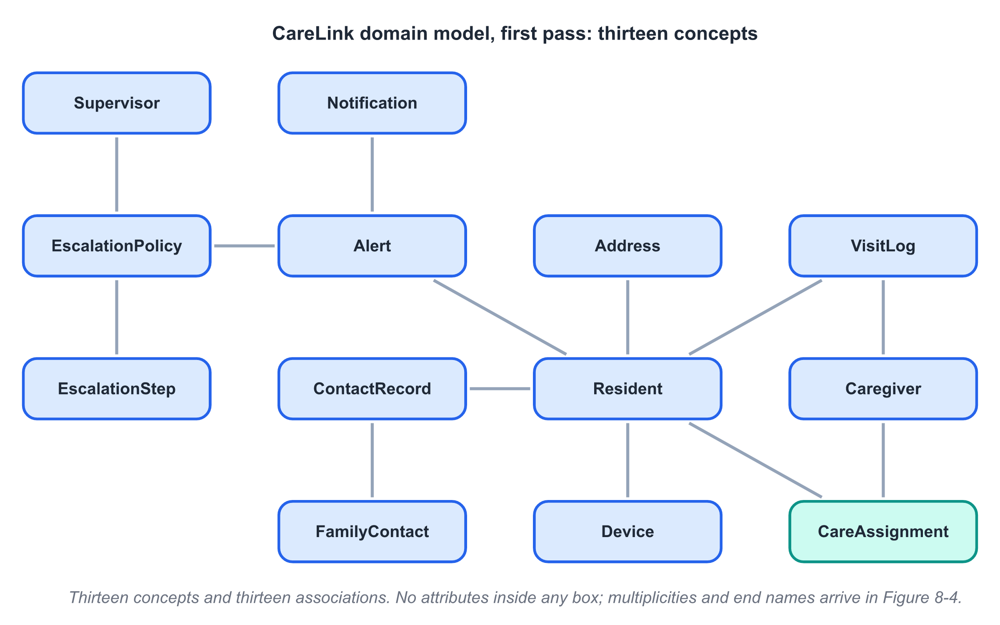
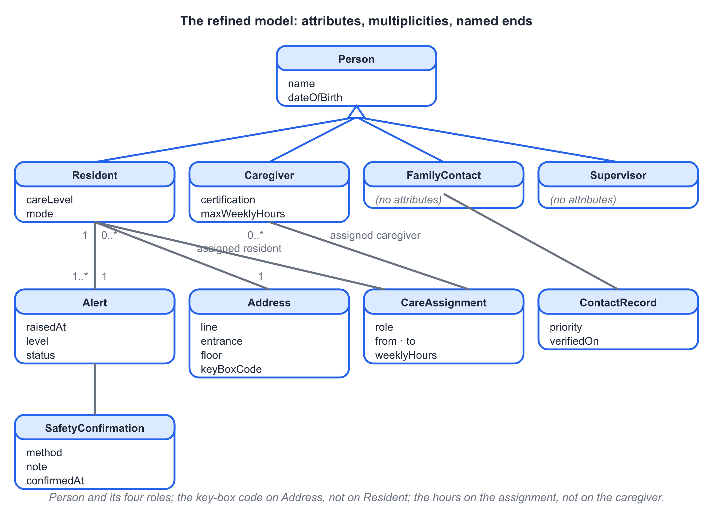
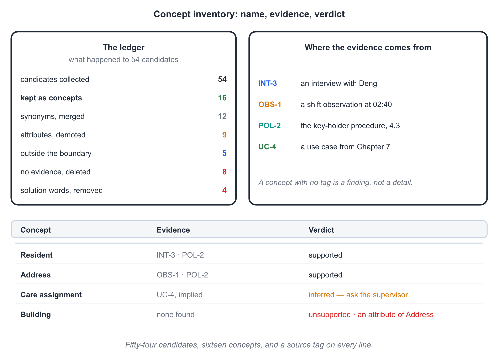
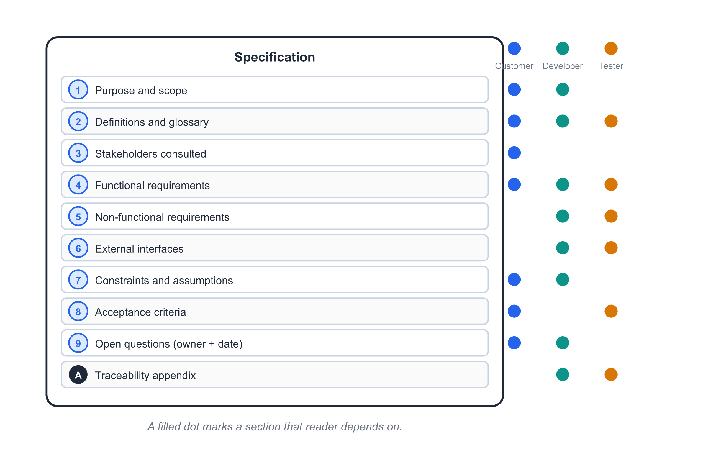

# Appendix A — The CareLink Artefact Set

> The case-setting document for this book promises that "Appendix A collects
> the final artifacts" and that Part II ends with a CareLink SRS. This is that
> appendix. It exists so that a reader who has just finished a chapter can see
> the whole case in one place, and so that a teacher can hand a team a worked
> reference for every technique the book teaches.

## A.1 What this appendix is, and what it is not

Part II of this book works one project from end to end: the care platform
CareLink. Seven chapters each produce something — an interview record, a
process model, a use case list, a domain model, a set of behavioural models,
a specification. The chapters show the artefacts in the middle of being made,
which is where the teaching is, but it means the reader never sees them side
by side.

This appendix is the side by side. It holds the **canonical** version of each
artefact: the one the chapters converged on, with the teaching figures left
where they belong. The distinction matters. A figure whose job is to show a
mistake before correcting it — the missing alternative flow of Chapter 9, the
over-specified requirement of Chapter 5, the AI workflow diagrams — is a
teaching figure, and it stays in its chapter. What is here is what a team
would actually hand over.

Two conventions.

- **Every artefact is dated by the chapter that produced it.** CareLink in
  Chapter 4 is not CareLink in Chapter 9; it has more in it. Where later
  chapters changed an earlier artefact, the change is shown rather than
  smoothed away, because the change is the interesting part.
- **Nothing here is invented for the appendix.** Every diagram, every
  identifier and every number is taken from a chapter. Where Part II did not
  settle something, this appendix says so — see A.10 — rather than filling
  the space with a plausible answer. An appendix that quietly completes the
  project teaches the reader that projects complete themselves.

The artefacts are ordered the way a team would build them, which is also the
order the chapters introduced them.

---

## A.2 The system and its setting

Everything that follows assumes one paragraph of context. CareLink is a
community home-care platform: a wristband and a few room sensors watch over an
elderly person living alone, and when something looks wrong the system alerts
the family and the community care centre in escalating levels of urgency.

{width=15cm}

*Fig. A-1. The system in its setting, as Chapter 1 draws it. The people and
systems outside the boundary are the source of every actor in A.6 and every
obligation the use cases refuse to own.*

## A.3 Stakeholders, and who was actually consulted

Chapter 4 requires stakeholders to be sorted by influence and interest before
anyone books their time, and requires the elicitation record to name a source
for every statement.

{width=15cm}

*Fig. A-2. The stakeholder map, Chapter 4. The quiet bottom-right quadrant —
the people who do the work and are not consulted — is where the requirements
that break releases come from.*

The three people who appear most often in the chapters are not the three most
senior. Grandma Lin is the elder; Wei is her son and the family-app user;
Deng is the care-centre supervisor who owns the escalation policy, the
caregiver roster and the care assignment. Chapter 4's rule — **interview the
person who does the work, not the person who manages it** — is why the
observation of Lin produced the alert-cancellation requirement that the
interviews did not.

## A.4 The process as it runs today

Part II's first model is not of the software. It is of the process the
software will join, modelled as it actually runs rather than as the manual
describes it.

{width=15cm}

*Fig. A-3. The as-is alarm call. Every element carries an evidence label —
`[O]` observed, `[S]` stated, `[D]` documented, `[A]` assumed — so a reader
can tell which parts of the model were watched and which were guessed.*

The model is evidence, and it is deliberately unflattering. Two of its
findings survive into the specification as requirements the team had not
planned: the scripted landline check that exists to satisfy a procedure
nobody can name, and the escalation step that has no owner at all.

## A.5 The process as it should run

The to-be model is a design, not evidence, and it is drawn second.

{width=15cm}

*Fig. A-4. The to-be alarm call. The gap between this model and Fig. A-3 is
what gets funded; everything outside that gap is out of scope, and saying so
is part of the deliverable.*

## A.6 Where the time goes, and what no software can reach

A process model that cannot be measured is an opinion. Chapter 6 puts four
numbers on the alarm call and marks every step.

{width=15cm}

*Fig. A-5. The alarm call in swimlanes. Each lane is an actor, and every
crossing between lanes is a handoff — the point where the case queues, loses
context, and acquires a new owner who must be convinced.*

{width=15cm}

*Fig. A-6. The measurement. Cycle time is 112 minutes; touch time is 21;
waiting is 46; transport is 45.*

The measurement is the most quoted artefact in Part II, and the reason is the
last line of it. Of the 112 minutes, **42 are a car** — the journey across the
river to a resident's home. No change to the software touches those 42
minutes, and the team's claim about the other 70 is credible precisely
because they said so. Chapter 6's rule follows directly: **report the residual
you cannot move, because the honest boundary is what makes the rest of the
estimate believable.**

The four improvement moves are applied in a fixed order — eliminate,
simplify, parallelise, and only then automate — and the ordering is what
stops the team from building a fast version of a step that should not exist.
One finding from this table reached outside the software entirely: the
residual row led to a staffing decision that no requirement had asked for.

## A.7 The use case model

Thirty-four feature names went in. Eleven goals came out, across four actors.
The reduction is the deliverable.

{width=15cm}

*Fig. A-7. The CareLink use case diagram: eleven goals and four actors. The
rectangle is a decision about what the project is responsible for, and
everything outside it became a named human's obligation.*

| Goal | Primary actor | How it arrived | Release 1 |
|---|---|---|---|
| Request help | Elder | first pass | Must |
| Request a routine check-in | Elder | first pass | Could |
| Report a device fault | Elder, caregiver | first pass | Could |
| Acknowledge an alert | Family contact, caregiver | first pass | Must |
| Confirm the resident is safe | Caregiver | **regrouping — previously buried in alternative flow A6** | Must |
| Log a visit | Caregiver | first pass | Should |
| Review the alert history | Family contact | first pass | Should |
| Maintain contact records | Family contact | **regrouping — previously absent entirely** | Must |
| Register a resident | Care-centre supervisor | first pass | Should |
| Configure the escalation policy | Care-centre supervisor | first pass | Must |
| Update the caregiver roster | Care-centre supervisor | first pass | Could |

Two of the eleven arrived from the second pass, and both are findings rather
than additions. **Confirm the resident is safe** was already in the model,
buried as the sixth alternative flow of *Acknowledge an alert*, where nobody
scheduling work would see it. **Maintain contact records** was not in the
model at all: with no goal that corrects a wrong phone number, the family
would telephone the care centre and a supervisor would edit a spreadsheet —
the manual work the project exists to delete. A feature list could not have
shown that hole, because there was no missing feature to show. This is the
argument for sorting by goal, and it is the strongest one in Part II.

One goal was considered and rejected. **Escalate an unacknowledged alert**
has no primary actor at user-goal level — nobody wants escalation to happen —
so it is not a use case. It became alternative flow A4 of *Acknowledge an
alert*, and the requirement it produced is R-055.

## A.8 The domain model

The domain model is a model of the **problem**. It is not a design class
diagram and it is not a database schema, which is the confusion the opening
of Chapter 8 exists to kill: the developer who asks for a schema before the
team has agreed what the words mean will get a schema that stores the wrong
things precisely.

{width=15cm}

*Fig. A-8. The first pass: thirteen concepts and nine associations, drawn
before any attributes were added.*

{width=15cm}

*Fig. A-9. The refined model. `Address` now owns the key-box code, `Person` is
generalised over the roles that share an identity, and the care assignment is
promoted to an association class.*

Fifty-four candidate noun phrases went in. Sixteen concepts came out, and the
discard list is a deliverable in five families: synonyms, attributes, things
outside the boundary, things with no evidence, and things that are really
solution. Eight of the discards had no evidence at all — they were the team's
inventions, and they took an afternoon to remove.

{width=15cm}

*Fig. A-10. The concept inventory. Every concept carries its source, and
supported, inferred and unsupported are three different verdicts.*

Three decisions in the refined model are worth a teacher's attention, because
each one is a rule in disguise.

- **The key-box code belongs to `Address`, not to `Resident`.** The three
  tests — identity, independent life, sharing — decide whether a fact is a
  concept or an attribute, and they also name *which* concept owns it. The
  code was in a spreadsheet in the office; a better question than "where do we
  put it" turned out to be "what else has one".
- **`Person` earns its place; `OpenAlert` does not.** Generalise when concepts
  share identity and differ by role. A resident, a caregiver and a supervisor
  are all people. An alert is open and then acknowledged — the same identity,
  a different condition — and generalising over states doubles the machine for
  nothing.
- **The care assignment is an association class.** When a relationship starts
  carrying its own data — who is assigned to whom, from when — the data
  belongs to the link and not to either end.

## A.9 The behavioural models

Three models, three questions. Chapter 9 draws all three for CareLink, and
the three disagree in places — which is the point.

{width=15cm}

*Fig. A-11. The sequence diagram for alarm escalation: who talks to whom, in
what order, for one scenario. Nine messages and one branch.*

The sequence diagram is a claim about **ordering**, and its whole content is
which message precedes which. Reading it against the written scenario found
the finding the chapter is built on: the acknowledgement message had no
counterpart on the delivery side. A notification's *arrival* was not recorded
anywhere, so the escalation clock had nothing to start from. That is R-058 —
and note how it was found. Not by asking a better question, but by comparing
two artefacts and noticing that one of them was missing a sentence.

{width=15cm}

*Fig. A-12. The state machine for the alert object: six states, and the
refusals drawn as transitions rather than left to the notation's default.*

Six states, and the finding is a **trap state**: before R-056, an alert could
be closed without anyone confirming the resident was safe, and once closed it
had no route out. A trap state is a missing requirement, not a missing arrow.
The two refusals — acknowledging twice, and closing without confirmation —
are drawn, because the notation's default is to ignore and a refusal is
something a developer has to write.

{width=15cm}

*Fig. A-13. The shift hand-over in three lanes. The step that is easy to
leave out — recording who handed over to whom — is the step R-059 exists to
require.*

The activity diagram answers a third question: what is the workflow, and who
does each step. The hand-over is one of the few places in CareLink where the
system and two people all act on the same case in the same hour, and it
produced R-059 with a consequence that reached backwards: recording the
hand-over is only worth doing if the remaining escalation clock survives it,
which promoted *Update the caregiver roster* from Could to Must in Chapter 5's
MoSCoW list. **A diagram changed a priority**, and the chapter makes the
reader notice.

The three models together make the chapter's closing claim concrete: where
they disagree, the disagreement is a finding rather than an error. And the
state-event table that checks the machine is thirty-six cells — seven move the
object, two refuse, one changes the owner, twenty-six ignore — which is
thirty-six tests waiting to be written. That hand-off is to Part IV.

## A.10 The requirement register

Part II ends with **thirty-three numbered requirements**: fifteen Must, six
Should, five Could, and seven explicitly out of scope for release 1. The
chapters quote a subset of them, and this is that subset — every identifier
that appears anywhere in Part II, with where it came from.

| ID | What it says, in one line | Introduced |
|---|---|---|
| CR-001 | Notify the nominated family contact within 60 s of an unacknowledged alert | Ch 4 |
| CR-002 | The elder can cancel an alert within 20 s without leaving the room | Ch 4 |
| CR-003 | A local alert still works when the home internet link is down | Ch 4 |
| CR-004 | Health data is stored on servers within the province | Ch 4 |
| R-014 | Family notification within 60 s | Ch 5 |
| R-021 | Escalation to the on-call nurse after 3 minutes | Ch 5 |
| R-033 | Weekly report to the family | Ch 5 |
| R-045 | Export the last 30 days as CSV | Ch 5 |
| R-050 | Video call with the care centre *(out of scope, release 1)* | Ch 5 |
| R-051 | Hospital EHR integration *(out of scope, release 1)* | Ch 5 |
| R-052 | Medication reminders *(out of scope, release 1)* | Ch 5 |
| R-053 | No coverage at the tap: queue locally and retry, with a visible unconfirmed state | Ch 7 |
| R-054 | An already-acknowledged alert shows who acknowledged it and when, and suppresses the action | Ch 7 |
| R-055 | Record "attended, no response" and offer the next escalation step | Ch 7 |
| R-056 | Closing an alert requires a recorded safety confirmation | Ch 7 |
| R-057 | A visit log may only be created against an active care assignment | Ch 8 |
| R-058 | A notification's delivery is recorded, and the escalation clock starts on confirmed delivery | Ch 9 |
| R-059 | A hand-over transfers ownership with the clock intact, and records who handed over to whom | Ch 9 |
| R-060 | When confirmation and a timer expiry fall in the same interval, the recorded event time decides | Ch 9 |

Two things about this table are worth stating plainly. First, the identifiers
are not contiguous, and that is normal: the register numbers requirements as
they are agreed, and the gaps are entries this appendix does not quote.
Second, `CR-` numbers are **candidate** requirements from elicitation, before
analysis; `R-` numbers are the analysed set. A team that never uses two series
cannot tell, three weeks later, whether a number refers to something somebody
said or something somebody decided.

The register is the one artefact in this appendix that a reader cannot
reconstruct from the figures, and it is deliberately incomplete here. A
public book cannot print a team's working register and pretend it is the
whole project; a *course* can, which is what the teaching note in A.12 is for.

## A.11 What Part II does not settle

This appendix would be misleading if it looked finished, so here is what is
open at the end of Chapter 9.

- **The models supply no numbers.** The process model hands over triggers,
  actors, conditions and data — four of the five parts of a bounded
  requirement — and no metrics. The behavioural models are the same: Chapter 9
  is explicit that they answer questions about order and state and cannot
  answer "how fast". Every number in the specification comes from a
  stakeholder, a measurement or an estimate, and none of them comes from a
  diagram.
- **The specification is assembled, not written.** Part II produces the parts:
  the requirement set from Chapters 4 and 5, the use case list from Chapter 7,
  the models from Chapters 6, 8 and 9. Turning them into one validated
  document is the work of the next chapter, and this appendix is its input
  rather than its output.
- **Some alternative flows became decisions, not requirements.** Of the six
  flows of *Acknowledge an alert*, four became requirements, one confirmed a
  requirement that already existed, one became a decision **not to build**, and
  one triggered a redesign. The decision not to build is recorded as a
  decision, which is the point: an alternative flow that produces nothing is
  not a hole in the document, it is a choice with a reason.
- **One open question is still open.** Chapter 9 closes with one decision, one
  open question and one priority change. The open question carries an owner
  and a date, which is the only thing that distinguishes a live specification
  from a monument.
- **Security and privacy are stated as constraints and not yet designed.**
  CR-004 fixes where health data may be stored, and the case has more of this
  in it — permissioned family access, local-by-default sensor data, video off.
  Part II records the constraints; how the system meets them is a design
  question, and it is answered in Part III, not here.

## A.12 Using this appendix

**For a reader.** Read it after Chapter 9, not before. It is a digest of things
you have already done, and its value is in seeing them in one place — the same
eleven goals that Chapter 7 arrived at one at a time, the same sixteen
concepts that Chapter 8 arrived at by deletion.

**For a team.** This is the worked reference. The book's own advice is that
you should not build CareLink; build a parallel case with the same shape in a
different domain, and put your artefacts beside these. The comparison is the
teaching, and it works in both directions: where your model is bigger, ask
which of your concepts have no evidence; where it is smaller, ask which of
these sixteen concepts your domain also has and you have not drawn.

{width=15cm}

*Fig. A-14. The specification outline of Section 5.7. This appendix is
organised along it, and the right-hand column of the table below says how far
Part II has got.*

| Specification section (§5.7) | Where it stands at the end of Part II |
|---|---|
| 1 Purpose and scope | A.2; scope is fixed by the boundary in A.7 |
| 2 Definitions and glossary | The **Glossary** at the back of this book |
| 3 Stakeholders | A.3 |
| 4 Functional requirements | A.10, with the goals of A.7 and the flows behind them |
| 5 Non-functional requirements | **Not yet.** One requirement with a bounded metric is quoted (R-014 at p95); the rest are Chapter 10's work |
| 6 External interfaces | A.2, and the boundary discussion in A.7 |
| 7 Constraints and assumptions | CR-004 and the evidence labels of A.4 |
| 8 Acceptance criteria | A.10; the criteria for release 1 are attached to the Must requirements |
| 9 Open questions | A.11 |
| A Traceability appendix | Chapter 5, Section 5.8 establishes it; Part IV fills in the test column |

The last row is worth a sentence. Traceability is the cheapest discipline in
the book and the first one dropped under pressure, and the reason it is worth
keeping is visible in this appendix: every requirement in A.10 has a chapter
beside it, and that chapter is the artefact it came from. A register with that
column filled in can answer "why is this here" and "what breaks if it
changes". A register without it cannot answer either, and no amount of
formatting fixes that.

