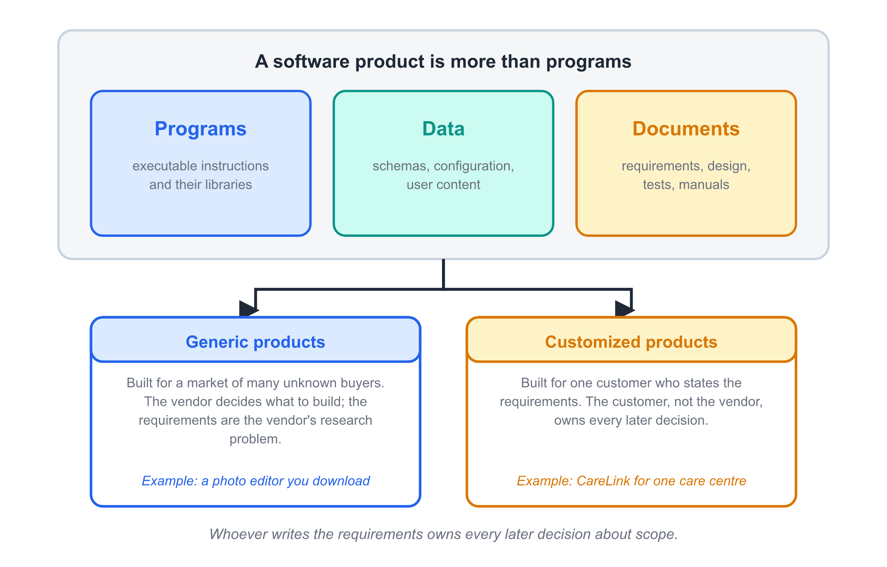
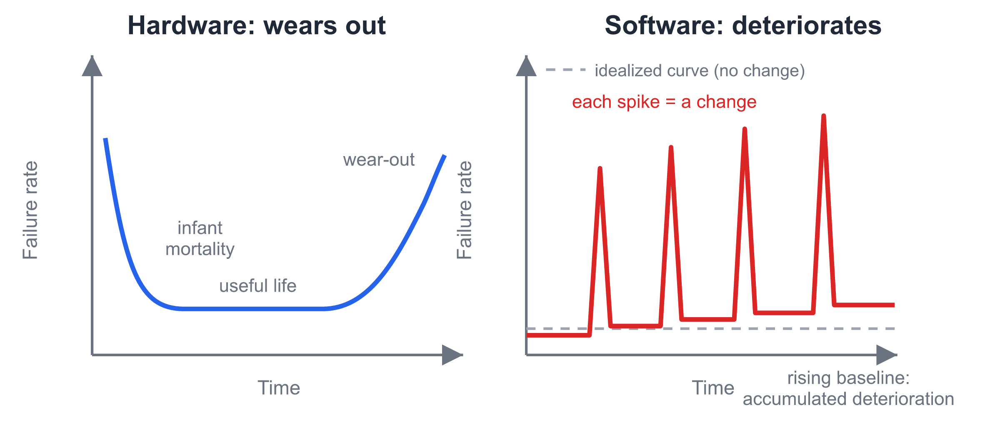
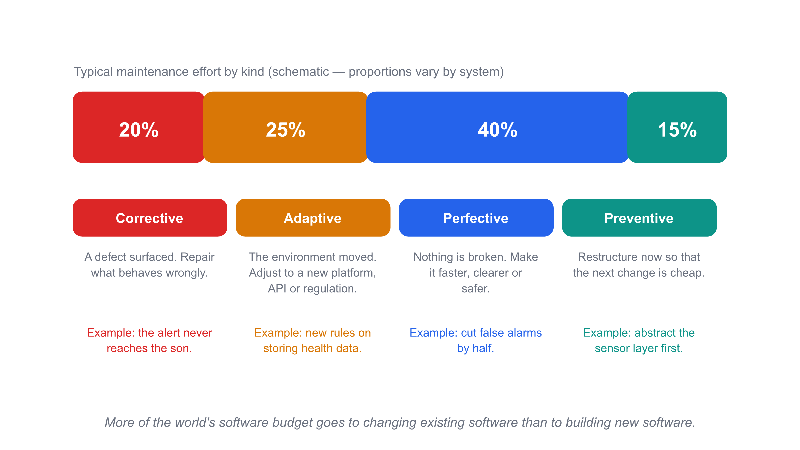
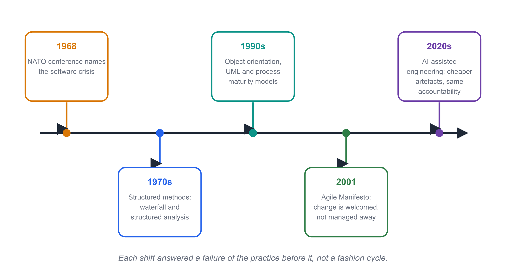
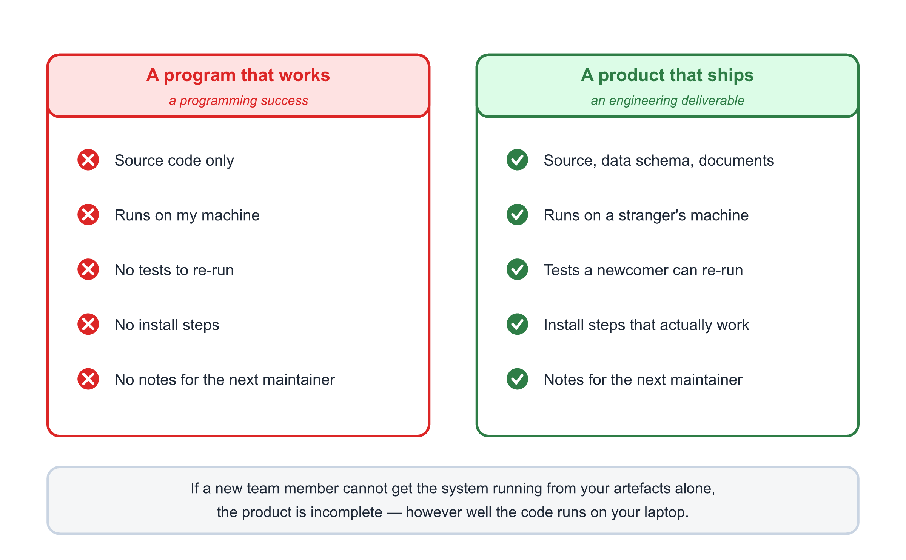
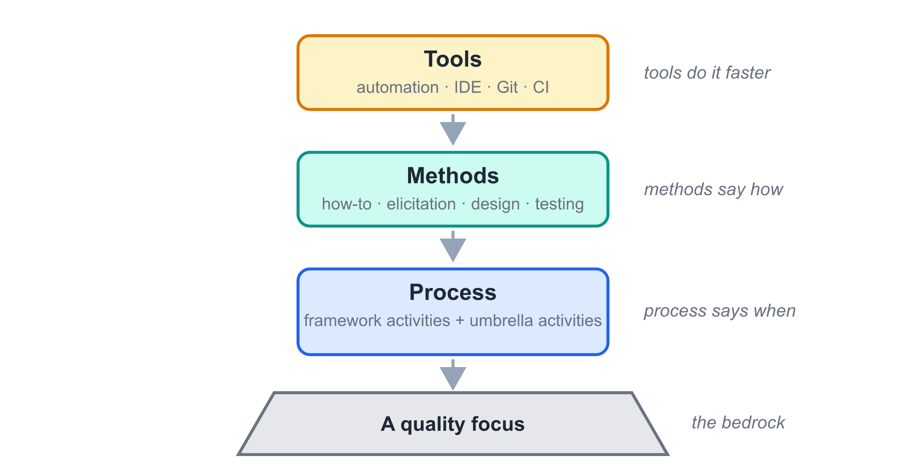
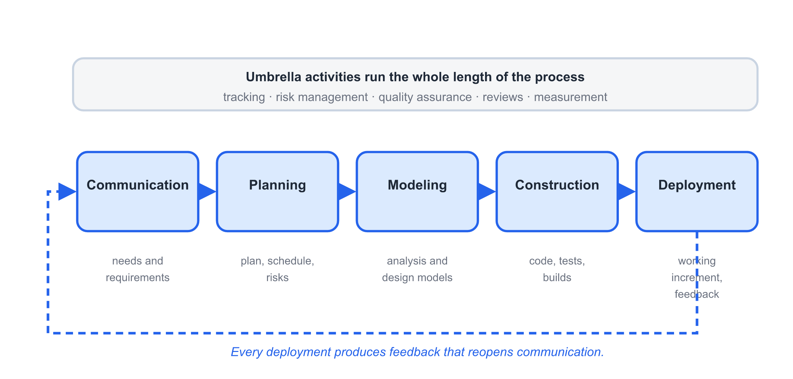
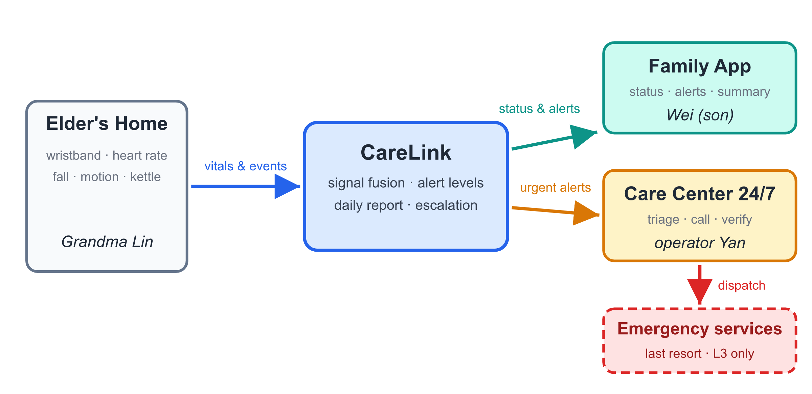
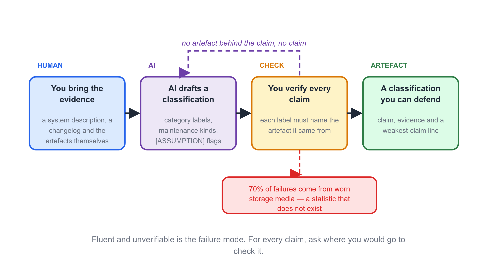

# Chapter 1 — Software and Software Engineering

> **In this chapter:** What software really is, why it refuses to behave like
> hardware, what "engineering" adds to programming, and how one small
> elder-care project — CareLink — will carry us through an entire software
> lifecycle.

## Learning Objectives

After reading this chapter, you will be able to:

1. **Define** software as more than programs: instructions, data, and documentation.
2. **Explain** why software is developed rather than manufactured, and why it deteriorates without wearing out.
3. **Classify** software into major categories and recognize legacy software.
4. **State** the IEEE definition of software engineering and explain each keyword.
5. **Distinguish** software engineering from programming in scope, discipline, and outcome.
6. **Apply** the three essentials — process, methods, tools — to a concrete project.

## Before You Read

Ten terms, ten lines. Read them once now; they carry the whole chapter.

- **software 软件** — instructions, data structures, and documents together.
- **instruction 指令** — a step the computer executes when the program runs.
- **data structure 数据结构** — the organised information the program works on.
- **documentation 文档** — everything written for humans, not for the machine.
- **software crisis 软件危机** — demand for software outrunning our ability to build it.
- **legacy software 遗留软件** — an old system that still does real work.
- **maintenance 维护** — all change after delivery; four kinds, see §1.5.
- **deterioration 退化** — loss of structure caused by uncontrolled change.
- **process / method / tool 过程 / 方法 / 工具** — the three essentials, see §1.8.
- **stakeholder 利益相关者** — anyone affected by the system or able to affect it.

## Opening Scenario

Grandma Lin is 78. She lives alone in a third-floor apartment, and she wants
to keep it that way. Her son Wei worries. He works in another city. A phone
call every evening helps, but a phone call cannot notice that she has stopped
boiling her morning kettle — which, for Grandma Lin, would be a signal that
something is wrong.

A small company decides to build a system that *does* notice: wristbands,
room sensors, a family app, a 24-hour care center, and an escalation chain
that ends, in the worst case, with an ambulance. They call it **CareLink**.

The team is six people. None of them is uncertain how to write code. All of
them are uncertain about something else: *What should we build first? Who
decides what "urgent" means? How will we know it is safe? What happens when
the requirements change — and they will?*

Writing programs was the skill they learned first. Building software is the
discipline this book teaches. The distance between the two is software
engineering, and it begins with a deceptively simple question: *what,
exactly, is software?*

## Core Concepts

### 1.1 Software Is More Than Programs

When students hear "software," most picture lines of code. A professional
definition is broader. **Software** is [1]:

1. **Instructions** — programs that, when executed, provide the desired
   features, functions, and performance;
2. **Data structures** — the information the programs manipulate, organized
   so that it can be used efficiently;
3. **Documentation** — the descriptions of operation and use that make the
   programs understandable, installable, and maintainable.

The third item surprises beginners, yet it is often the one that decides a
project's fate. A system whose only artifact is source code is not software
in any deliverable sense; it is an accident that happens to run. When a
hospital cannot install a monitoring system because the setup steps live in
one engineer's memory, the failure is not in the code — it is in the missing
documentation.

> **Key point.** If it is not written down, it does not exist. Code, data,
> and documents are one product.

{width=15cm}

*Fig. 1-4. A product is programs, data and documents together — and whether it is generic or customized decides who owns the requirements.*


### 1.2 Software Is Engineered, Not Manufactured

Almost every property of software follows from one fact: **software is a
logical system, not a physical one.** Compare it with a car.

A car is *manufactured*. Its cost is dominated by materials and assembly.
Its quality is dominated by the consistency of the production line. Build
the thousandth car, and it costs roughly what the first one cost.

Software is *developed*. The cost is almost entirely design effort — human
thought, captured in instructions. Copying software is free; **the entire
cost of software is in creating the first copy.** This is why software
estimates are so hard: you are not predicting a production run, you are
predicting the duration of an act of design.

The manufacturing metaphor fails in a second way. Quality in manufacturing
means *conformance to the spec of the line*. Quality in software means
*fitness of the design itself* — and the design lives in human minds, which
is why reviews, pair work, and clear models matter more in this discipline
than in any other engineering field.

### 1.3 Software Does Not Wear Out — It Deteriorates

Hardware fails on the classic "bathtub curve": high failure rate early
(manufacturing defects), low through its useful life, rising again as parts
wear out. Software has no parts. It does not wear out.

Instead, software **deteriorates**. Every change — a new feature, a platform
upgrade, a bug fix — has a chance of making the structure slightly worse:
dependencies tangle, duplicate logic accumulates, and the design that was
once clean becomes hard to reason about. The failure rate of an aging system
rises not because the code decayed physically, but because *change after
change was made under time pressure to a design that no longer fits.*

{width=15cm}

*Fig. 1-1. Hardware follows the bathtub curve; software never wears out, but every change risks a failure-rate spike and a permanently higher baseline.*

The practical consequence is uncomfortable and liberating at once: **the
quality of a software system in its fifth year is determined by the
discipline of the changes in years one through four.** Deterioration is not
fate; it is negligence, accumulated.

### 1.4 Categories of Software

Software is usually classified by the job it does. The boundaries blur, but
the categories are useful vocabulary:

| Category | Examples | Characteristic concern |
|---|---|---|
| System software | Operating systems, compilers, drivers | Efficiency, correctness at scale |
| Application software | Office suites, business apps | Usability, domain fit |
| Engineering/scientific | CAD, simulation | Numerical accuracy |
| Embedded software | Appliance, automotive control | Resource limits, real-time |
| Web/mobile apps | CareLink's family app | Rapid change, reach |
| AI/data systems | Recommendation, vision pipelines | Data quality, model behavior |

CareLink, like most real systems, spans categories at once: an embedded
component in the wristband, a mobile app for the family, a web console for
the care center, and data analysis for the daily report. Most interesting
software does.

### 1.5 Legacy Software and the Four Kinds of Change

**Legacy software** is old software that an organization still depends on.
It is frequently unloved — built on dead platforms, undocumented, understood
by few — and yet impossible to simply replace, because it encodes years of
business knowledge. More of the world's software budget is spent *maintaining*
existing systems than building new ones.

Why does software refuse to stand still? Four forces drive change, and they
map to the four classic maintenance activities:

1. **Corrective maintenance** — fixing defects. Something behaved wrongly.
2. **Adaptive maintenance** — adjusting to a new environment: a new OS, a
   new regulation, a new API version.
3. **Perfective maintenance** — improving what exists: faster, clearer,
   safer.
4. **Preventive maintenance** — restructuring so future change is easier.

Grandma Lin's kettle is a small example of the fourth force in disguise: the
team will one day refactor the sensor-abstraction layer *before* adding a
new sensor type, precisely so that the addition is cheap.

{width=15cm}

*Fig. 1-7. Four forces drive change in existing software. The proportions vary by system, but corrective work is rarely the largest share.*


### 1.6 From Crisis to Discipline: What Is Software Engineering?

By the 1960s, software projects were failing at a rate that could no longer
be joked about. Systems ran years late, swallowed budgets, and — worse —
were delivered and then *abandoned* because they did not do what users
needed. The 1968 NATO conference in Garmisch, Germany, gave the problem a
name and the answer a name at the same time: the **software crisis**, and
**software engineering**.

The IEEE definition remains the standard [2]:

> The application of a **systematic**, **disciplined**, **quantifiable**
> approach to the development, operation, and maintenance of software; that
> is, the application of engineering to software.

Unpack the three keywords:

- **Systematic** — the work follows a *process*: an ordered set of activities
  that can be planned, repeated, and improved. Heroic improvisation does not
  scale past one person.
- **Disciplined** — the team follows agreed *methods and standards* even when
  deadlines scream. Discipline is what you keep when it is inconvenient.
- **Quantifiable** — progress and quality are *measured*, not assumed.
  "Almost done" is not a measurement.

{width=15cm}

*Fig. 1-5. Five shifts in half a century. Each answered a specific failure of the practice before it — not a fashion cycle.*


### 1.7 Software Engineering Is Not Programming

Every software engineer programs; very few programs are software engineering.
The difference is not talent but *scope*:

| | Programming | Software engineering |
|---|---|---|
| Goal | Make a correct program | Deliver a working *product* that solves a user's problem |
| Time horizon | Until the program runs | For the product's whole life, including change |
| Team | Usually one person | Roles, coordination, communication |
| Requirements | Given to you | Elicited, negotiated, validated — by you |
| Success | It works | It is used, on time, within budget, and can evolve |

A program that meets its specification but misses its users is a programming
success and an engineering failure. CareLink's team could build a flawless
fall-detection algorithm and still fail, if elders find the wristband
uncomfortable or operators drown in false alarms. Engineering owns the
*whole* outcome.

{width=15cm}

*Fig. 1-6. "It works" is where programming ends and engineering begins. The right-hand column is what outlives its author.*


### 1.8 The Three Essentials: Process, Methods, Tools

Software engineering is often described as three layers resting on a base of
**quality focus** (Fig. 1-2):

1. **Process** — the framework that holds everything together: which
   activities happen, in what order, with what feedback loops. A generic
   process contains five framework activities:
   *communication* (understand the problem), *planning* (map the road),
   *modeling* (analyze and design), *construction* (code and test), and
   *deployment* (deliver and gather feedback). Around them run *umbrella
   activities* — tracking, risk management, quality assurance, change
   control — continuously, not at the end.
2. **Methods** — the "how-to" for each activity: how to elicit requirements
   (interviews, use cases), how to design (architecture, UML, patterns),
   how to test (unit, integration, system). This book is, mostly, a tour of
   methods.
3. **Tools** — automation for process and methods: IDEs, Git, modeling
   tools, test frameworks, issue trackers. Tools multiply discipline; they
   do not substitute for it.

A useful memory device: *process says when, methods say how, tools do it
faster.* {width=15cm}

*Fig. 1-2. The three essentials rest on a base of quality focus. Tools multiply the other layers; they cannot replace them.*

{width=15cm}

*Fig. 1-8. The five framework activities, with the umbrella activities running their whole length and deployment feeding back into communication.*


A team with tools but no process is just accelerating in circles.

### 1.9 Goals — and Three Myths

The goals of software engineering are plain to state: deliver software that
satisfies its users, within budget and schedule, that remains *maintainable*
after release. Three beliefs sabotage newcomers repeatedly, so let us
retire them now:

- **Myth 1: "We have standards/documents/processes — that's enough."**
  Reality: a standard nobody follows is a PDF, not a practice. What counts
  is what the team actually does under pressure.
- **Myth 2: "If we fall behind, we can add more programmers."**
  Reality: adding people to a late project makes it later — newcomers must
  be trained by the very people who are already overloaded.
- **Myth 3: "Requirements changes are trivial — software is soft."**
  Reality: a one-line change late in a project can ripple through design,
  code, tests, and documents. Flexibility is real but never free; the cost
  of change grows steeply with time (a fact Chapter 4 returns to with
  evidence).

The CareLink team believes all three myths in week one. The rest of this
book is the story of how they stop.

## CareLink in Action

{width=15cm}

*Fig. 1-3. CareLink at a glance: sensors in the elder's home feed a platform that notifies family and care-center operators, escalating only when necessary.*

Let us watch the three essentials appear in one ordinary week of the
CareLink project — before the team has learned any formal method.

**Process.** Monday, the team lists what it must understand first: who the
elders are, what "urgent" means to a care center, what sensors can actually
detect. They have invented, without knowing its name, the *communication*
activity. Tuesday they sketch a 16-week plan on a whiteboard: four weeks to
requirements, five to design, five to build, two to test. That is
*planning*. They do not yet know that the plan is wrong in a productive way
— which is what Chapter 3 (agile) is about.

**Methods.** In the first customer interview, Wei says: "I want to know Mom
is okay." What does *okay* mean? The team argues: kettle used by 9 a.m.?
Movement in the kitchen? Heart rate in range? They have hit the classic
requirement problem — a real need hiding inside a vague word — and they
will need elicitation techniques (Chapter 4) and modeling techniques
(Chapters 5–9) to pin it down.

**Tools.** By Friday the team has a Git repository, an issue tracker, and a
shared document folder. Nothing glamorous — and, correctly used, enough
tooling to keep six people synchronized for the next four months.

One week, three essentials, no code written. That is what software
engineering looks like on Day 5.

## AI Companion

**1. What AI is good at here.** Chapter 1 is about *classification and
judgement*, so use AI for the mechanical half: turning examples into
structured tables, restating a definition in simpler English, and playing
devil's advocate on your own reasoning. It is weak at the things this
chapter actually grades: deciding which category a system *really* belongs
to, and saying what a change will cost.

{width=15cm}

*Fig. 1-9. AI-assisted classification. The verification step is what turns fluent output into an artefact you can defend.*


**2. Prompt pattern.**

```
Role: you are a software engineering teaching assistant.
Context: {{system description, 5 lines}}.
Task: classify the system using the categories of §1.4 and list
      evidence of the four maintenance kinds of §1.5.
Constraints: quote the chapter's terms only; mark every guess [ASSUMPTION];
      do not cite standards, papers, or statistics.
Output: a table with columns claim / evidence / [ASSUMPTION]?
Verify: add a final line — "the weakest claim above is …".
```

**3. Verify before you trust.** (a) Every category claim must name the artefact
it came from. (b) Every maintenance kind must cite a changelog entry or an
observation — not a guess. (c) Reject any sentence containing a citation you
cannot open. (d) If the output says "corrective" for a *new* feature, it is
wrong: new features are perfective or adaptive. (e) Ask yourself what the
output *left out* — usually the documentation and deployment artefacts.

**4. Typical AI failure in this chapter.** A student asked an assistant to
explain why software does not wear out. The answer was fluent, and it
invented a statistic: *"studies show 70% of system failures are caused by
physical wear of storage media."* Nothing of the sort exists. The failure is
not the number — it is that the paragraph **sounds authoritative while being
unverifiable**. The repair is one habit: for every claim, ask *where would I
go to check this?* If the answer is nowhere, delete it.

> 🤖 **AI note**: AI lowers the cost of producing artefacts. It does not
> lower your responsibility for their correctness — and correctness is
> exactly what software engineering is about.

## Common Pitfalls

1. **"Software = code."** Students ship zip files of source and call it a
   release. *Correction:* a release includes data schemas, installation
   steps, user guidance, and maintenance notes. If a new team member cannot
   get the system running from your artifacts alone, the product is
   incomplete.
2. **"It works, so it is done."** A program that runs is at the halfway
   mark of an engineering deliverable. The remaining half — readable
   structure, tests, documents, and deployability — is what gets
   maintained.
3. **"We will add requirements later; they are easy."** Every later
   chapter of this book will cost more because of this sentence. Late
   change is possible — agile methods exist to make it survivable — but it
   is never free.
4. **Confusing the three essentials.** Teams that adopt tools (a Kanban
   board!) without a process get a prettier mess. Ask of any tool: *which
   activity does this automate, and what is our manual version of that
   activity?*
5. **Accepting fluent output as verified output.** An AI assistant will
   happily explain software engineering in confident paragraphs — including
   the ones it invented. *Correction:* treat every generated statement as a
   hypothesis. A claim you cannot trace to an artefact or an observation is
   not knowledge, it is decoration.

## Guided Lab: Classify and Diagnose (45 minutes)

Pick a system your team uses daily — a messaging app, a food-delivery app,
the university's course system.

1. **Classify** (10 min): Which software categories, from §1.4, does it
   belong to? Most interesting systems span several; name at least two.
2. **Decompose** (15 min): The software-is-more-than-programs definition
   has three parts. For your system, find a concrete example of each —
   e.g., for a messaging app: the send-message instruction set; the
   contact/conversation data structures; the privacy policy and help pages.
3. **Diagnose** (15 min): Find evidence of deterioration or the four
   maintenance kinds. Look at the changelog of any app: which entries are
   corrective (fixes), adaptive (new OS support), perfective
   (improvements), preventive ("stability and performance")?
4. **Share** (5 min): One minute per team.

**Two tracks, one rubric.**

- **Track A (manual)** — do the three steps from your own observation.
- **Track B (AI-assisted)** — use the *AI Companion* prompt to produce a
  first draft, then run the five verification checks and repair the draft.

Both tracks submit the same one-page table, with identical acceptance
criteria: every row needs an artefact, a category, and **evidence you can
point to**. Track B additionally attaches a four-line note: *tool used ·
prompt summary · what you accepted · what you rejected and why*.

*Expected output:* a one-page table with columns *artifact / category /
evidence*, signed by the team. Keep it — the same system becomes the
guinea pig for your course project's first deliverable.

## Language Focus

This week you must **define**, **classify**, and **contrast** — the three
moves of every Chapter 1 assignment.

| Move | Pattern | Example |
|---|---|---|
| Define | Term **refers to** X, Y and Z **taken together**. | *Software refers to instructions, data structures and documents taken together.* |
| Classify | A **falls under** category B **because** evidence C. | *CareLink falls under safety-critical software because a missed alert can endanger a person.* |
| Contrast | Unlike A, B **does not** …; **instead**, it … | *Unlike hardware, software does not wear out; instead, it deteriorates under change.* |

Three short exercises (answers in the instructor's manual):

1. Define *legacy software* using the "refers to … taken together" pattern.
2. Classify your course project system; give the evidence clause.
3. Contrast *corrective* and *perfective* maintenance in one "Unlike …"
   sentence.

## Summary and Key Terms

- Software = **instructions + data structures + documentation**. All three
  are the product.
- Software is **developed, not manufactured**; its entire cost is design.
- Software **does not wear out but deteriorates** under undisciplined change.
- Change is permanent: corrective, adaptive, perfective, preventive.
- Software engineering = a **systematic, disciplined, quantifiable**
  approach to software — process, methods, tools, on a base of quality
  focus.
- Software engineering differs from programming by owning scope, lifetime,
  team, requirements, and success — not just correctness.

**Key terms:** software 软件 · documentation 文档 · legacy software 遗留软件 ·
corrective/adaptive/perfective/preventive maintenance 修正性/适应性/完善性/预防性维护 ·
software crisis 软件危机 · software engineering 软件工程 · process 过程 ·
method 方法 · tool 工具 · umbrella activities 贯穿性活动

## Exercises

**(a) Concept checks**

1. In your own words — two sentences maximum — why does copying software
   cost nothing while creating it costs everything?
2. A payroll system from 2003 still runs a company's salary payments. The
   tax authority changes the deduction rules; the team updates the system.
   Which kind of maintenance is this? Justify.
3. Which of the three essentials answers the question *"what do we do
   first?"* — and which answers *"how do we draw the design?"*

**(b) Analysis problems**

4. The textbook claims late requirement changes are expensive. Sketch an
   argument for *why*, using the maintenance kinds of §1.5: what other
   artifacts must change when a requirement changes in month 8 of a project?
5. Grandma Lin's wristband team announces: "Sensors are hardware, so sensor
   quality is not a software engineering concern." Argue against this in
   one paragraph, using at least two ideas from this chapter.

**(c) AI-augmented tasks** — *graded on your critique, not on your prompt*

6. Ask an assistant: *"Is a university course-selection system system
   software or application software? Answer in one paragraph."* Then:
   (i) mark each sentence **[SUPPORTED]** if it uses a definition from this
   chapter, **[UNSUPPORTED]** if it introduces a definition the chapter does
   not have; (ii) rewrite the answer in ≤60 words using only chapter terms;
   (iii) state one task this output is genuinely useful for, and one task
   where trusting it would be dangerous.
7. An assistant advised a student team: *"Your dormitory-safety app will
   need corrective maintenance twice a year, so budget for it."* Using §1.5,
   identify the error, state the correct classification rule, and write the
   question the team should have asked instead.

**(d) Running Project Task 1 — due Week 2**

Form your team (5–6 members) and choose a **parallel case**: a domain with
users to protect, sensors or devices to integrate, and an alerting chain
(pet-home monitoring, dormitory safety, clinic queueing, or propose your
own). Deliver a one-page **project charter**: team name and roles, the
problem in 3–4 sentences, the main stakeholders, and the single most
uncertain thing about the project. (Compare it against CareLink's §3
snapshot in the case-study appendix — same shape, your domain.)

---

### References

[1] R. S. Pressman and B. R. Maxim, *Software Engineering: A Practitioner's
Approach*, 9th ed. McGraw-Hill, 2020.

[2] IEEE Standards Board, "IEEE Standard Glossary of Software Engineering
Terminology," IEEE Std 610.12-1990.
