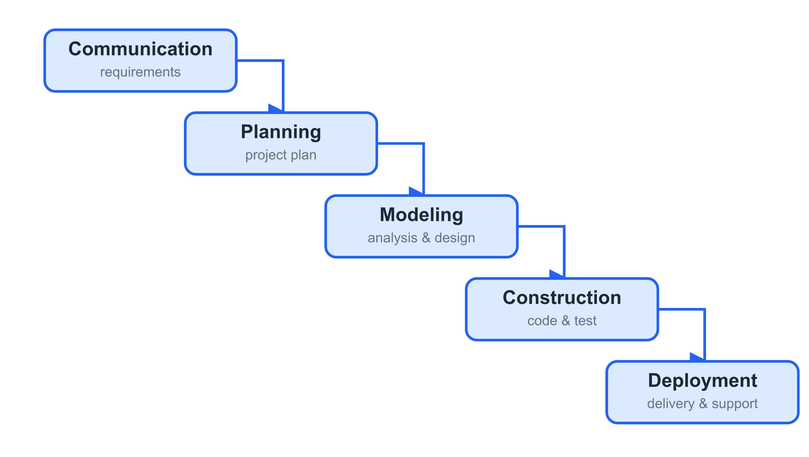
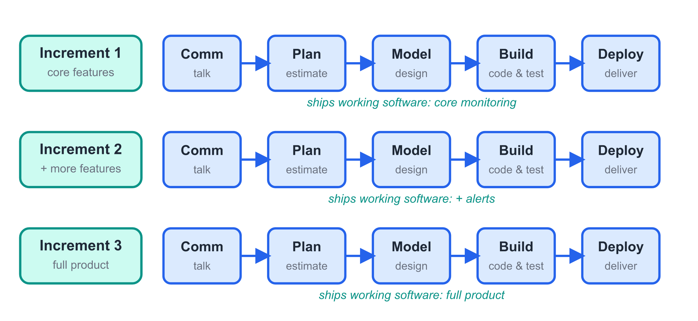
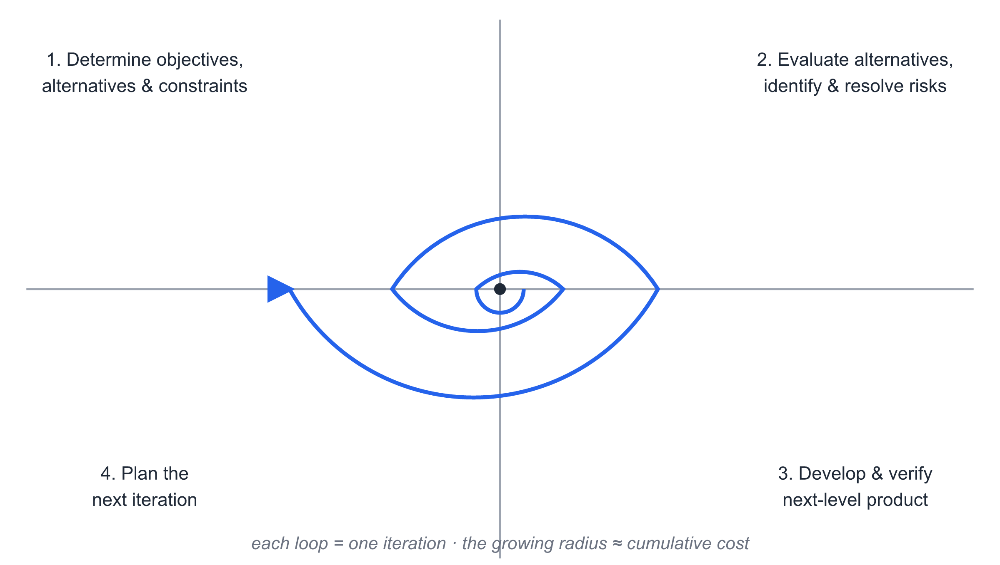

# Chapter 2 — Software Process Models

> **In this chapter:** What a software process is, the five framework
> activities every process shares, and a field guide to the classic models —
> waterfall, V, incremental, prototyping, spiral, concurrent, and RUP — with
> honest advice on choosing among them.

## Learning Objectives

After reading this chapter, you will be able to:

1. **Define** a software process and name the five framework activities and
   the umbrella activities that surround them.
2. **Distinguish** a *process* from a *process model*, and read a process
   frame (entry criteria, task set, milestones, exit criteria).
3. **Describe** the classic process models and the reasoning behind each.
4. **Analyze** the strengths and weaknesses of each model in terms of
   feedback timing, risk, and documentation.
5. **Justify** a process-model choice for a given project context.

## Opening Scenario

The CareLink team holds its first planning meeting, and it collapses within
twenty minutes.

Wei, the son of Grandma Lin and the project's sponsor, wants "something to
show the care center by June." Yan, the developer who will build the family
app, wants to start coding the wristband link today. The team lead, Mei,
spreads a calendar on the table and discovers that nobody can answer the
simplest question: *what do we do first, and what do we do after that?*

They are not short of talent. They are short of a **process** — an agreed
answer to "who does what, in what order, with what result." Without one,
their project will be *ad hoc*: driven by luck, mood, and whoever talks
loudest. This chapter gives them — and you — the vocabulary and the catalog
of answers that the industry has refined over fifty years.

## Core Concepts

### 2.1 Why Process Matters

A defined process turns effort into progress you can track. Its absence has
recognizable symptoms, and most students have lived them in team projects:

- No clear milestones — nobody can tell whether the project is 30% done or
  70% in trouble.
- Work piles up at the end — all integration, all testing, all documentation
  squeezed into the final week.
- The same defect is rediscovered by three people because nobody reviews
  anything.
- Rework is routine — decisions are silently revisited, and re-made, and
  re-made again.

> **Key point.** A process does not guarantee success. It makes success
> *inspectable*: you can see where you are, and where you are drifting.

### 2.2 What Is a Software Process?

A **software process** is a framework for the tasks required to build
high-quality software [1]. Two words in that sentence carry the weight.
*Framework* means the process defines the workflow — what must happen and in
what order — not the fine detail of every step. *High-quality* means the
process exists to serve quality, not paperwork: a process whose only output
is forms is a process that will be abandoned.

### 2.3 The Five Framework Activities

Every software process, from the most bureaucratic to the most agile, is
built from the same five framework activities. What differs between models
is the *order*, *frequency*, and *intensity* with which they are performed.

| # | Activity | Question it answers | Typical work products |
|---|----------|--------------------|-----------------------|
| 1 | **Communication** | What does the customer need? | Requirements notes, use cases |
| 2 | **Planning** | How will we do it? | Project plan, schedule, risk list |
| 3 | **Modeling** | How is it structured? | Analysis and design models |
| 4 | **Construction** | Does it work? | Code, test cases, builds |
| 5 | **Deployment** | Can the user use it? | Delivered increment, user feedback |

In the CareLink project, *communication* means interviewing care-center
operators about what "urgent" means; *modeling* means drawing how an alert
travels from wristband to ambulance; *deployment* even in week one means
handing a mock-up of the family app to Wei and watching him use it.

### 2.4 Umbrella Activities

Framework activities are the spine; **umbrella activities** run along the
entire spine, regardless of model:

- **Project tracking and control** — measuring progress against the plan.
- **Risk management** — finding what could kill the project before it does.
- **Software quality assurance (SQA)** — audits and standards that keep
  work products consistent.
- **Formal technical reviews (FTR)** — peers inspect work products to find
  defects early, when they are cheap.
- **Measurement** — collecting numbers so decisions rest on evidence.
- **Reusability management, work product preparation** — producing and
  maintaining the artifacts others depend on.

> **Key point.** Reviews and risk management are not phases in a schedule.
> They are habits that run all the time — or they run never.

### 2.5 From Process to Process Model

A **process model** is a structured description of how a process is
performed: which activities, in what order, producing which work products,
by which roles. Models are *prescriptive templates* you adapt, not laws you
obey. The industry's confidence in a model grows with its record of
successful (and honestly examined) projects.

Each activity inside a model can be described as a **process frame** with
four slots: *entry criteria* (what must be true before starting), a *task
set* (the actual work, scaled small or large to fit the project), *milestones*
(measurable checkpoints), and *exit criteria* (what must be true to declare
the activity done). When someone asks "are we done with design?", they are
really asking "have we met the exit criteria?"

### 2.6 The Waterfall Model

The oldest model, sometimes called the *classic life cycle*, arranges the
five framework activities as strict sequential phases: communication →
planning → modeling → construction → deployment, each finishing before the
next begins.

{width=14cm}

*Fig. 2-1. The waterfall model. Each phase completes — and is signed off —
before the next begins.*

Its strengths are real: it is simple to explain, documentation-driven (every
phase produces documents), and gives milestones that managers love. It suits
projects whose requirements are stable, well understood, and fixed by
contract — a government tender with fixed acceptance tests is a reasonable
waterfall candidate.

Its weaknesses are equally real. Feedback arrives only at the end, so a
misunderstood requirement is discovered during acceptance, when it is most
expensive to fix. Change is hostile to the plan: each phase's documents are
built on the previous ones. And all the risk is concentrated at the project's
end — the worst possible place.

> **Key point.** Waterfall is not "wrong"; it is *fragile to change*. Choose
> it when change is genuinely unlikely, not merely inconvenient to manage.

### 2.7 The V Model

The **V model** is a waterfall variant that makes testing a first-class
citizen. The left leg of the V descends through requirements, design, and
code; the right leg ascends through unit, integration, system, and
acceptance testing. The insight is the *horizontal pairings*: every
left-leg artifact has a matching right-leg test designed to verify it.
Acceptance testing is planned from the requirements, not improvised after
them. The V model inherits waterfall's sequential rigidity but at least
forces test design to happen early.

### 2.8 The Incremental Model

The **incremental model** plans the product as a whole but delivers it in
pieces. Each increment runs the full process — communication, planning,
modeling, construction, deployment — and delivers working software:
increment 1 the core, increment 2 more features, increment 3 the full
product. The first delivery can come early, giving users something real to
react to and giving the team the earliest possible feedback.

{width=15cm}

*Fig. 2-2. The incremental model. Each increment repeats the full process
and ships working software.*

Note the subtle contrast: incremental is *planned* chunking of a known
whole. The team knows what increment 3 will contain when it builds
increment 1. That is what distinguishes it from the evolutionary models
next, where the later versions are discovered, not scheduled.

### 2.9 Evolutionary Models: Prototyping and Spiral

For many projects — most, honestly — requirements are not fully known at
the start, or the business changes underneath the project. **Evolutionary
models** respond: build a version, learn from it, evolve the next.

**Prototyping** is the simplest. Listen to the user; build a quick mock-up;
let the user test-drive it; revise — repeat until the requirements are
clear, then build the real thing (or, in *evolutionary prototyping*, keep
hardening the prototype itself). It excels at clarifying vague requirements
and letting users see something concrete early. Its trap is famous: a
mock-up built in a week gets pressure to "just ship it," and the team
maintains forever a system that was never designed.

**The spiral model**, proposed by Boehm, wraps evolution around risk. Each
loop of the spiral passes through four quadrants: determine objectives and
constraints; evaluate alternatives and resolve risks; develop and verify
the next-level product; plan the next iteration. The spiral is
*risk-driven* — if a loop exposes serious risk, you spend the loop reducing
it before you build.

{width=15cm}

*Fig. 2-3. The spiral model. Each loop around the center passes through
objectives, risk analysis, development, and planning — and the radius grows
as cumulative cost grows.*

The spiral suits large, high-risk projects with a disciplined team — the
ceremony of a four-quadrant risk review every loop is itself a cost, and a
small team doing informal loops is not "doing spiral," it is improvising.

### 2.10 Concurrent Development and RUP

The **concurrent model** abandons sequence altogether: activities exist in
parallel, each in a state — awaiting changes, under development, under
review, done — like a network of state machines. Events (a new requirement,
a failed review) move an activity between states. It matches how large
systems with many parallel work streams actually behave, but it is hard to
draw on one page and harder to manage without tool support.

**The Rational Unified Process (RUP)** is an iterative framework with four
phases — *inception* (scope and business case), *elaboration* (requirements
and architecture), *construction* (build in iterations), *transition*
(deliver to users) — overlaid with nine disciplines that run across phases.
RUP's honest lesson for you is the shape: effort per discipline *shifts*
across phases rather than switching on and off.

### 2.11 Choosing a Model

No model fits all projects. The choice is an engineering decision driven by
context:

| Factor | Points toward |
|--------|---------------|
| Requirements clear and contractual | Waterfall / V |
| Requirements vague or changing | Prototyping / evolutionary / agile |
| High technical or safety risk | Spiral |
| Early value delivery needed | Incremental |
| Large team, many parallel work streams | Concurrent / RUP |
| Small co-located team, product can be sliced | Agile (next chapter) |

For a one-semester course project with a real client and uncertain
requirements — precisely the CareLink situation — the industry's default
answer today is an agile process. That is the subject of Chapter 3.

## CareLink in Action

Back in the collapsed planning meeting. Mei stops the argument with one
sentence: "We are not choosing tasks. We are choosing a *process*."

The team lists its constraints: sixteen weeks, one client who cannot yet say
precisely what the care center needs, and a hard demo at the end. Waterfall
is eliminated in ten minutes — a single delivery in week 16 means the first
user feedback arrives after the course ends. A pure prototype is too small:
the course requires a working system, not a mock-up.

They sketch a hybrid: an incremental backbone (three increments: *monitor*,
*alert*, *escalate*) with a short prototyping loop inside increment 1,
because nobody — including the client — knows what the family app's main
screen should show. Each increment ends with a demo to Wei and a care-center
representative; feedback from demo *n* reshapes increment *n+1*.

The meeting ends with every objection on the whiteboard answered by the
same framework. That is what a process model buys you: arguments become
decisions, and decisions become visible.

## Common Pitfalls

1. **"We follow waterfall" — while iterating secretly.** Teams that
   "restart" design three times are evolutionary, not sequential. Admit the
   model you actually need.
2. **Shipping the prototype.** A mock-up that survives contact with users
   will be asked to survive production. Prototype to learn; then design.
3. **Milestones without exit criteria.** "Design done" means nothing until
   you define what "done" evidences. Name the artifact; name the review.
4. **Choosing a model by fashion.** Spiral for a six-person course project
   is ceremony without risk to justify it. Match the model to the risk
   profile, not the textbook's longest chapter.

## Guided Lab: Choose and Defend (45 minutes)

Work in your project team.

1. **(10 min)** Write your project's context profile: requirement clarity
   (1–5), expected volatility, deadline pressure, team size, technical risk.
2. **(15 min)** Score three candidate models against the profile. For each,
   write one sentence of *evidence* per factor — no adjectives without a
   reason attached.
3. **(10 min)** Choose one model (a hybrid is allowed if you can name both
   parents). Write the choice as: "We choose X because our clarity is
   low, deadline is hard, and risk is concentrated in Y."
4. **(10 min)** Cross-review with another team: their job is to name one
   scenario in which your model fails. Your job is to decide whether that
   scenario is plausible for you.

**Deliverable:** a one-page process justification, which you will need again
as the front page of your project plan.

## Summary and Key Terms

A software process is a framework of tasks for building quality software:
five framework activities — communication, planning, modeling, construction,
deployment — surrounded by umbrella activities such as reviews, risk
management, and SQA. A process model describes how those activities are
ordered. The classics: waterfall and V (sequential, document-driven,
feedback-late), incremental (planned slices, early delivery), prototyping
and spiral (evolutionary, feedback- and risk-driven), concurrent and RUP
(parallel and phase-based at scale). Model choice is an engineering
decision — made from requirement clarity, volatility, risk, and deadline —
and should be written down and defended.

**Key terms:** software process · framework activity · umbrella activity ·
process model · process frame · entry/exit criteria · waterfall · V model ·
incremental model · prototyping · spiral model · concurrent model · RUP

## Exercises

**(a) Recall** — State the five framework activities and give a CareLink
example of each. Then name three umbrella activities and explain why they
cannot be scheduled as phases.

**(b) Apply** — For each scenario, choose the most fitting model and defend
it in two sentences: (1) a government contract with fully specified
requirements and fixed acceptance tests; (2) a startup building a diet app
whose target users keep changing what they want; (3) a medical-device
firmware update where a failure could harm patients; (4) a university team
of five with twelve weeks and a client who says "build me something like
the campus safety app, but better."

**(c) Running Project Task 2 — due Week 3**

Write your team's one-page process justification: the chosen model (or
hybrid), three evidence-based reasons, and a table of what you will deliver
at the end of each week from now to the deadline. This page becomes the
front of your project plan and will be reviewed in Week 4.

### References

[1] R. S. Pressman and B. R. Maxim, *Software Engineering: A Practitioner's
Approach*, 9th ed., McGraw-Hill, 2020, Ch. 2–3.

[2] B. W. Boehm, "A spiral model of software development and enhancement,"
*ACM SIGSOFT Software Engineering Notes*, vol. 11, no. 4, 1986.
