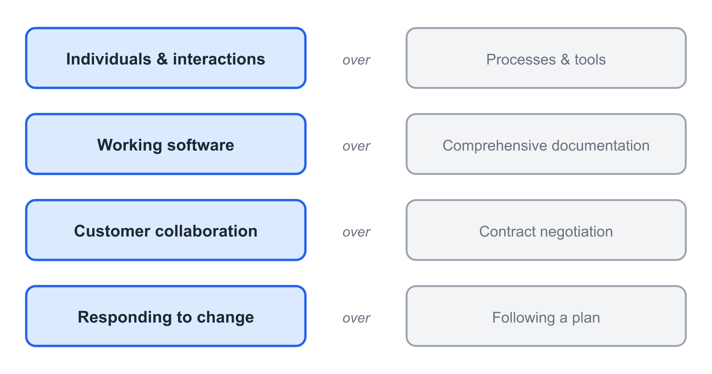
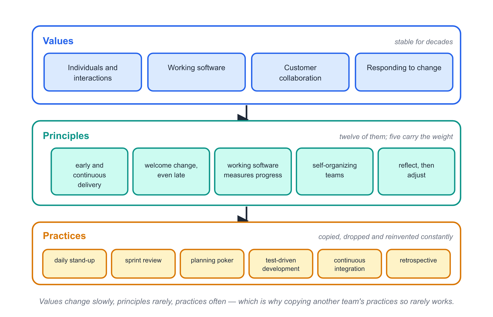
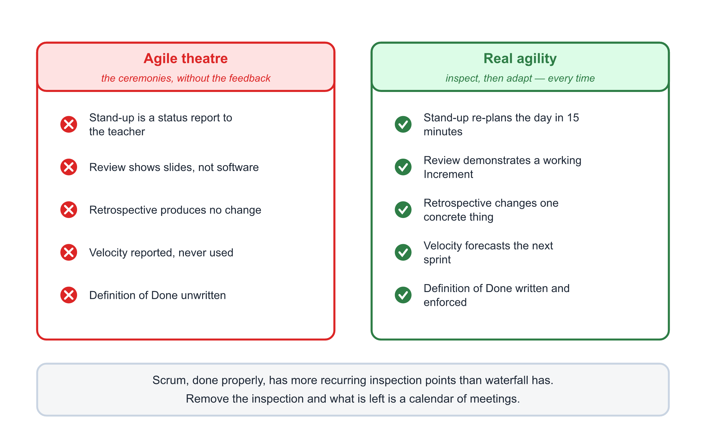
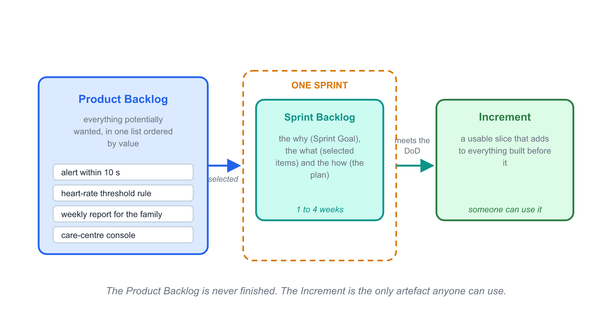
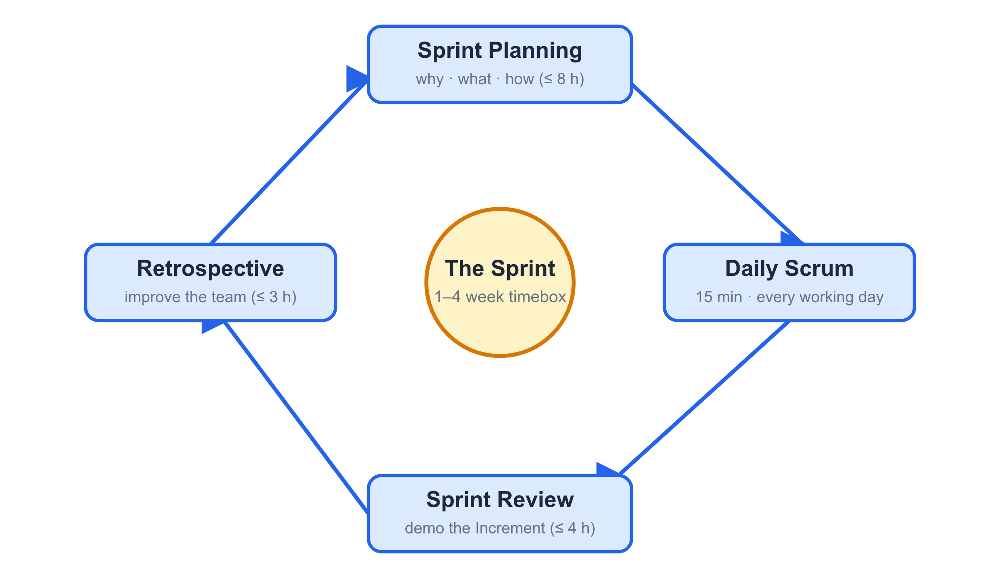
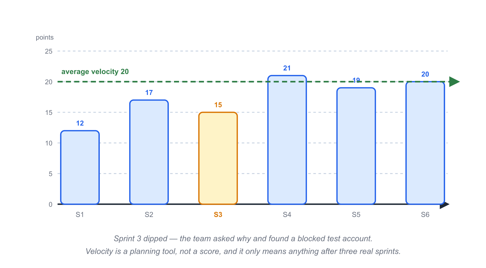
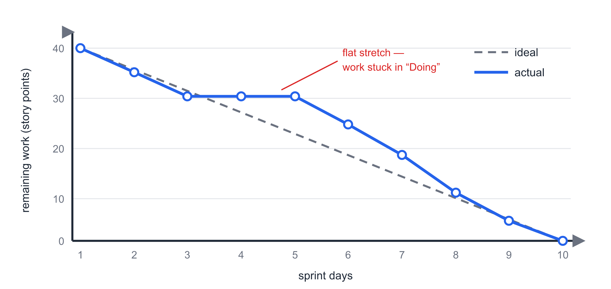
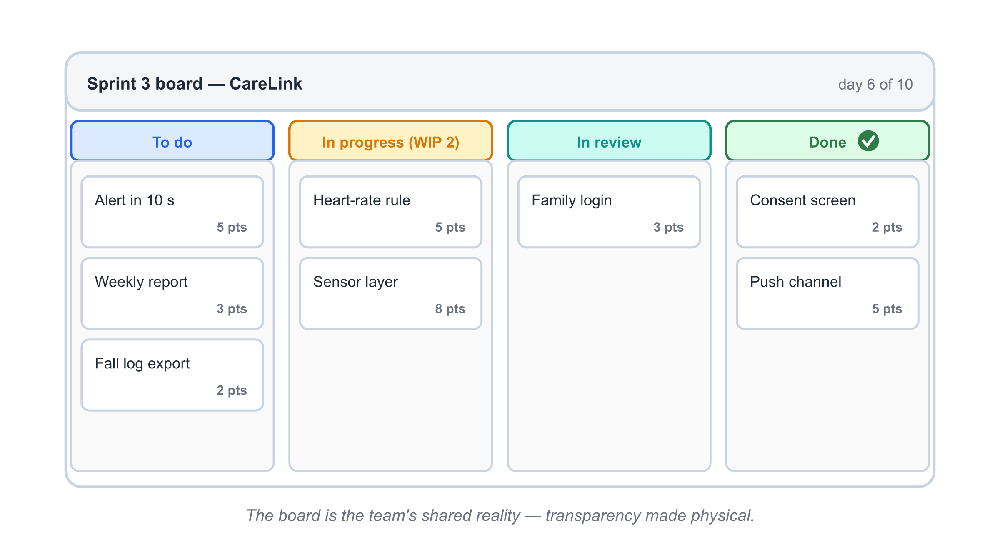
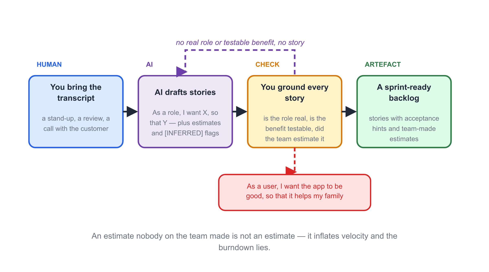

# Chapter 3 — Agile Development and Scrum

> **In this chapter:** Why the industry moved from big up-front plans to
> short feedback loops, the four values and twelve principles of the Agile
> Manifesto, and a working tour of Scrum — roles, artifacts, events, and
> the metrics that keep a sprint honest.

## Learning Objectives

After reading this chapter, you will be able to:

1. **State** the four values of the Agile Manifesto and the essence of its
   twelve principles.
2. **Explain** what agility means, when it works best, and what it is
   *not* (no docs, no plan, no discipline).
3. **Describe** the Scrum framework: three roles, three artifacts, five
   events.
4. **Write** user stories and estimate them with story points and Planning
   Poker.
5. **Track** a sprint with a burndown chart and a Definition of Done.
6. **Argue** — with evidence — for or against agile in a given context, and
   **verify** AI-generated backlog items before trusting them.

## Before You Read  (~0.5 page)

Ten terms this chapter repeats; pre-teach them so the Scrum tour reads smoothly.

- **agile** / 敏捷 — able to respond rapidly and flexibly to change.
- **manifesto** / 宣言 — a public statement of shared values (here, from Snowbird, 2001).
- **empirical** / 经验主义的 — deciding from observed experience, not theory.
- **timebox** / 时间盒 — a fixed maximum duration for an event; it ends on the clock.
- **backlog** / 待办列表 — an ordered list of everything potentially wanted.
- **increment** / 增量 — a usable, Done slice of product added to all previous ones.
- **sprint** / 冲刺 — a 1–4 week timebox that turns backlog items into a Done increment.
- **velocity** / 速率 — story points a team completes per sprint; used to forecast.
- **burndown** / 燃尽图 — a daily chart of work remaining versus the sprint timeline.
- **Definition of Done (DoD)** / 完成的定义 — the team's written standard for "done."

## Opening Scenario

Week 6 of the CareLink project. The team chose an incremental process in
Chapter 2 and it is working — mostly.

But two things keep happening. First, Wei keeps calling. The care center
changed its night-shift protocol, so the escalation rules he approved three
weeks ago are already wrong. Second, the team's increments are planned in
four-week blocks, which means a changed mind costs up to four weeks of
built-on-sand work. The plan is honest; the world is not cooperating.

Mei asks the question this chapter answers: "What if the plan were designed
*for* change, instead of being surprised by it?"

## Core Concepts

### 3.1 Why Agile Exists

Software projects fail most often for three reasons: requirements change,
feedback arrives too late, and plans are too large to correct. The
plan-driven models of Chapter 2 assume the world holds still while we
build. Customers cannot state all needs up front; business priorities shift
mid-project; the cost of discovering a wrong requirement at acceptance is
brutal. Agile processes are engineered around these facts rather than
denying them: short cycles, early and continuous delivery, and change
treated as information rather than betrayal.

### 3.2 The Agile Manifesto: Four Values

In February 2001, seventeen practitioners of "lightweight methods" met at
the Snowbird ski lodge in Utah. Their methods differed — XP, Scrum, Crystal,
FDD — but their disagreements with heavyweight document-driven processes
were shared, and they wrote them down in four lines [1]:

{width=15cm}

*Fig. 3-1. The four values of the Agile Manifesto. The right side is not
valueless — the left side is simply valued more when they conflict.*

Read the fine print that everyone forgets: the manifesto says "we have come
to value X **over** Y" — not "X **instead of** Y." Working software over
comprehensive documentation does not mean zero documentation; it means when
the two compete for the same hour, ship the working software and write only
the documents with lasting value.

### 3.3 The Twelve Principles — the Essentials

The manifesto's twelve principles operationalize the values. Five carry most
of the weight:

- **Early and continuous delivery** satisfies the customer — weeks, not
  quarters, between releases.
- **Welcome changing requirements, even late** — change is information, and
  agile processes harness it for the customer's competitive advantage.
- **Working software is the primary measure of progress** — not phase
  documents, not hours logged.
- **The best architectures and designs emerge from self-organizing teams** —
  and such teams need motivated, trusted, supported people.
- **Regular reflection and adjustment** — at tuned intervals, the team
  improves *its own way of working*.

{width=15cm}

*Fig. 3-4. Values, principles and practices — three levels with very different rates of change, which is why copying practices so rarely transfers agility.*

### 3.4 What Agility Is — and When It Fits

Pressman defines agility as a combination of **rapid and flexible response
to change** and **effective communication among all stakeholders** [2]. An
agile process is then one that is *incremental* (small releases), *cooperative*
(customer and developer working together daily), *straightforward* (the
method itself is light), and *adaptive* (last-minute change is neither
panic nor crisis).

Agile vs plan-driven is not good vs evil; it is a trade:

| Dimension | Plan-driven | Agile |
|-----------|------------|-------|
| Requirements | Fixed early, frozen by contract | Evolve; change welcomed |
| Delivery | One big release at the end | Small releases every 1–4 weeks |
| Documentation | Comprehensive | "Just enough," value-driven |
| Customer role | Signs off, then waits | Participates continuously |
| Team | Larger, role-specialized | Small, cross-functional, self-organizing |
| Best when | Stable domain, contractual acceptance, safety-critical | Uncertain product, available customer, deliverable in slices |

When the customer is unavailable, the contract fixes scope, or a single
release is legally mandated (avionics, medical devices), plan-driven
discipline earns its keep. Pretending to be agile in those settings is
cargo-culting.

### 3.5 Myths About Agile

Four misconceptions account for most failed "agile adoptions":

1. **"Agile means no documentation."** Reality: document just enough — the
   stuff with lasting value (architecture decisions, APIs, test evidence).
2. **"Agile means no planning."** Reality: planning is continuous. You plan
   every sprint, and re-plan every time reality speaks.
3. **"Agile is an excuse for chaos."** Reality: agile is *disciplined
   adaptability*. Scrum, done properly, has more recurring inspection points
   than waterfall.
4. **"Agile always costs less."** Reality: agile changes *where* money goes —
   from up-front specification to continuous re-planning — and its savings
   come from avoiding wrong products, not from skipping work.

{width=15cm}

*Fig. 3-8. Agile theatre and real agility run the same calendar of meetings. Only one of them changes anything.*

### 3.6 The Agile Landscape

Scrum is the most widely used agile framework, but it has family: **Extreme
Programming (XP)** contributes the engineering practices — test-driven
development, pair programming, continuous integration, refactoring;
**Kanban** contributes flow visualization and work-in-progress limits;
**Crystal, FDD, Lean Software Development** round out the tree. Mature teams
commonly run Scrum's management loop *with* XP's engineering practices
underneath.

### 3.7 Scrum: An Empirical Framework

Scrum — named after rugby's whole-team-forward formation — is a *lightweight
framework*, not a process or a technique. Its foundation is **empiricism**:
make decisions on observed experience, not theory. Empiricism needs three
pillars:

- **Transparency** — the real state of the work is visible to everyone.
- **Inspection** — you look at that state frequently.
- **Adaptation** — when inspection shows drift, you change something now.

Scrum adds five values that make the pillars workable: **commitment, focus,
openness, respect, and courage**. A team that hides a slipped task breaks
transparency, and everything downstream of the lie becomes unfounded.

### 3.8 Three Roles

A Scrum team is small (ten or fewer) and cross-functional, with three
accountabilities:

| Role | Accountable for | Signature behaviors |
|------|----------------|---------------------|
| **Product Owner** | Maximizing product value | Solely owns and orders the Product Backlog; says yes/no/later to features; one voice of the customer |
| **Scrum Master** | The process working, and being improved | Servant leader; removes impediments; coaches team and organization; protects the team from interruption |
| **Developers** | The Increment | Cross-functional; self-organize *how* to turn Backlog into Increment; estimate and plan their own work |

Two failure patterns recur in student teams: a Product Owner who delegates
prioritization ("you guys decide what's important") — value has no owner;
and a Scrum Master who becomes a project manager assigning tasks — which
destroys self-organization, the engine of the whole design.

### 3.9 Three Artifacts

- **Product Backlog** — everything potentially wanted in the product, in one
  ordered list. Ordering is by value, decided by the Product Owner alone.
- **Sprint Backlog** — the *why* (Sprint Goal), the *what* (selected items),
  and the *how* (the Developers' plan) for one sprint.
- **Increment** — a usable slice of product that meets the Definition of
  Done. Each increment adds to all previous ones.

Backlog items are commonly written as **user stories**:

> *As a* 〈role〉*, I want* 〈feature〉*, so that* 〈benefit〉.

For example: *As a family member, I want an alert within 10 seconds when my
parent's heart rate crosses the emergency threshold, so that I can call for
help in time.* The format is not the point; the discipline is: every item
names a *user*, a *want*, and a *reason* — and carries acceptance hints
that let a stranger decide whether it is done.

{width=15cm}

*Fig. 3-5. The three Scrum artefacts and how work moves between them inside a single sprint.*

### 3.10 The Sprint and Its Events

The **Sprint** is the container: a fixed 1–4 week timebox in which the team
turns selected Backlog items into a Done Increment. Inside it, four events
form an inspect-and-adapt loop:

{width=15cm}

*Fig. 3-2. The sprint cycle. Planning opens the sprint; the Daily Scrum
steers daily; Review demos the Increment; Retrospective improves the team.*

- **Sprint Planning** (≤ 8 h for a one-month sprint): why is this sprint
  valuable (the Sprint Goal)? What can be Done? How will the work be done?
- **Daily Scrum** (15 min, every working day): each Developer answers —
  what did I do toward the goal? what next? what is blocking me? It is a
  *planning* event, not a status report to a boss.
- **Sprint Review** (≤ 4 h): demo the working Increment to stakeholders.
  Working software, not slides. Feedback feeds the Backlog.
- **Sprint Retrospective** (≤ 3 h): the team inspects *itself* — what went
  well, what didn't, what will we change next sprint? One concrete
  improvement, actually adopted, beats five aspirations.

If a sprint's scope proves fatally wrong, the Sprint can be cancelled —
but only by the Product Owner, and rarely. Cancelling sprints is a symptom,
not a tool.

### 3.11 Keeping Score: Velocity, Burndown, Story Points, DoD

**Story points** measure relative size, not hours: "this story is about
twice that one." Teams use a Fibonacci-like scale (1, 2, 3, 5, 8, 13, 20…)
so that bigger estimates are honestly fuzzier. **Planning Poker** makes
estimating a team event: everyone reveals a number simultaneously; the
highest and lowest explain, then the team re-votes. Divergent numbers are
information — usually someone knows something the others don't.

**Velocity** is story points completed per sprint. Over three or four
sprints it stabilizes, and the team can forecast honestly: a 40-point
backlog at velocity 20 is two sprints — without anyone pretending to know
hours.

{width=15cm}

*Fig. 3-7. Velocity over six sprints. Sprint 3 is not a failure — it is the first honest number the team produced.*

The **burndown chart** plots remaining work per day against the sprint
timeline: the ideal line declines steadily; the actual line tells you —
daily — whether you are above or below the waterline.

{width=15cm}

*Fig. 3-3. A burndown chart. The dashed line is the ideal; the solid line
is reality. The flat stretch mid-sprint is a conversation waiting to
happen.*

None of these numbers work without a **Definition of Done (DoD)** — the
team's shared, written standard for "done": code peer-reviewed, unit tests
written and passing, integrated into the main build, documented where
needed. "It runs on my machine" is not Done. Without a DoD, velocity
measures wishes.

### 3.12 Scrum vs XP — and the Honest Limits

Scrum manages the *work* (roles, events, artifacts) but prescribes no
engineering practices; XP prescribes the practices (TDD, pairing, CI,
refactoring) but is thinner on product management. In industry the common
answer is Scrum *on top of* XP practices.

And the limits, stated plainly: agile fits when requirements are unclear or
fast-changing, teams are small and skilled, the customer is available, and
the product can be delivered in increments. It fits poorly when scope is
contractually frozen, the team is large and distributed, or a certification
authority requires exhaustive up-front specification. Choosing agile for
those contexts anyway is not agility; it is a process decision made by
fashion — the mirror image of the waterfall mistake.

## CareLink in Action

Mei's team reorganizes around two-week sprints.

**Sprint 1** opens with Planning: Wei (Product Owner — he owns value and
the ordering; he is the only one who may reorder the Backlog) presents the
top stories. The Developers estimate with Planning Poker. "Alert within 10
seconds" draws a 2 from Yan and an 8 from the junior developer — the spread
forces a conversation, and out falls a hidden risk: nobody has tested how
fast the wristband can push a reading. The story keeps its 8, and a spike
("measure wristband→gateway latency") joins the sprint.

The Daily Scrum stands up at 9:40 every morning, fifteen minutes, in front
of a board whose columns read *To do / Doing / Done*. On day 6 the burndown
line goes flat — two stories stuck "Doing" — and the Scrum Master's entire
intervention is to ask what is blocking and spend the afternoon removing
it: a borrowed test account.

{width=15cm}

*Fig. 3-6. The board on day 6. The flat burndown in this chapter's story is visible here as two cards stuck in progress.*

At the Review, Mei demos the *working* heartbeat alert to Wei and a care
center nurse. Wei reorders the Backlog on the spot — watching the demo, he
realizes the family app matters more than he thought, and the escalation
rules less. Nobody mourns the two weeks of plan. That reordering *is* the
system working. In the Retrospective the team adopts exactly one change:
estimates over 5 must name their biggest unknown.

The project does not become calm. It becomes *steerable*.

## AI Companion  (~1.5 pages) ★

> **This chapter's AI angle:** AI can turn meeting transcripts into backlog
> items and draft estimates in seconds — but it writes stories with no real
> user, and it inflates velocity because it has never missed a deadline.

**1. What AI is good at here**
- Summarizing a stand-up or review transcript into candidate user stories.
- Drafting a first-cut Definition of Done from a team's stated quality bar.
- Proposing retro "improvements" from a list of what went wrong.

{width=15cm}

*Fig. 3-9. AI-assisted backlog refinement. A story with no real role and no testable benefit cannot enter a sprint.*

**2. Prompt pattern** (copy-paste)

> From this meeting transcript: {{transcript}}, extract user stories in the
> format "As a <role>, I want <feature>, so that <benefit>". Each story must
> name a real role and a real benefit from the text. Output as a numbered
> list. Mark any story whose role or benefit is inferred, not stated, as
> [INFERRED]. Do not invent features.

**3. Verify before you trust**
- [ ] Every story names a *role* and a *benefit* — not "As a user, I want the app to be good."
- [ ] The role and benefit are grounded in the transcript, not fabricated to fill the template.
- [ ] Any AI-suggested estimate is cross-checked with a Planning Poker result, not adopted because it "sounds right."
- [ ] Velocity derived from AI estimates is treated as a guess until three real sprints confirm it.

**4. Typical AI failure in this chapter**

*AI output:* "As a *user*, I want the CareLink app to be *good*, so that it
*helps my family*." — three stories like this.

*What is wrong:* no concrete role (who in the family?), no concrete benefit
(the "good" is undefined, so "done" is undefinable). Such stories pass a
prompt but fail a sprint: nobody can build or test them. Worse, an AI that
estimates them at "3 points each" quietly inflates velocity, because it has
no memory of the team's actual speed.

*The repair:* reject the three; rewrite as "As a *family member*, I want an
alert within 10 seconds when Grandma Lin's heart rate crosses threshold X,
so that I can call for help in time." Estimate with the team, not the model.

## Common Pitfalls

1. **No Product Owner.** A backlog ordered by committee is a wishlist; value
   has no single owner, and priority disputes never end.
2. **Scrum Master as task manager.** Assigning tasks replaces
   self-organization with a bottleneck wearing a new title.
3. **Zombie sprints.** Sprint events happen, but the Review shows slides
   and the Retrospective changes nothing. The ceremonies without the
   feedback is theater.
4. **Done means demoed.** Without a written DoD, "done" inflates until the
   final sprint, where it collapses into integration hell — the waterfall
   ending agile teams thought they had escaped.
5. **AI backlog inflation.** Adopting AI-generated stories and estimates
   uncritically makes the burndown lie. Every AI item enters the sprint only
   after a human rewrites the role and benefit and the team estimates it.

## Guided Lab: Run the Loop (45 minutes)

Work in your project team.

1. **(10 min)** Write three user stories for your project in the standard
   format, each with two acceptance hints (a checkable "given/when/then" is
   ideal).
2. **(10 min)** Planning Poker on all three stories. Record every round of
   numbers; when the spread is wide, let the high and the low explain
   before re-voting.
3. **(10 min)** Draft your team's Definition of Done — at least five
   checkable criteria, including review, tests, and integration.
4. **(15 min)** Run a mini Daily Scrum: stand up, timer visible, each member
   answers the three questions in under a minute. Then a 5-minute
   retrospective with the classic three columns, and pick one improvement
   to adopt in the next real meeting.

**Deliverable:** the three stories, the estimation record with spreads
explained, and your team's DoD — signed by every member.

## Language Focus  (~1 page)

Three sentence patterns this chapter relies on — use them in your lab write-up and backlog rationale.

**Pattern 1 — Correction of a myth** (*X does not mean Y; it means Z*)
> *Agile does not mean "no documentation"; it means document just enough.*
Use it to correct a misconception while keeping the valid core.

**Pattern 2 — Earned-fit condition** (*When …, … earns its keep*)
> *When the customer is unavailable or a single release is legally mandated, plan-driven discipline earns its keep.*
State the exact condition under which a practice is justified.

**Pattern 3 — Honest limit** (*Choosing X for Y is not Z; it is W*)
> *Choosing agile for a frozen-scope contract is not agility; it is a process decision made by fashion.*

**Practice** (write one sentence for each, about your own project):
1. "Pair programming does not mean ______; it means ______."
2. "When our client is unreachable for weeks, ______ earns its keep."
3. "Choosing spiral for our course project is not rigor; it is ______."

## Summary and Key Terms

Agility is rapid, flexible response to change plus effective communication,
built on short cycles and continuous delivery. The Agile Manifesto's four
values favor individuals and interactions, working software, customer
collaboration, and response to change — *over*, not *instead of*, their
counterparts. Scrum implements the mindset as one small empirical loop:
three roles (Product Owner, Scrum Master, Developers), three artifacts
(Product Backlog, Sprint Backlog, Increment), and five events (Sprint,
Planning, Daily Scrum, Review, Retrospective). Progress is tracked with
story points, velocity, and burndown — but only meaningfully when a
Definition of Done defines what "done" evidences. Agile is a context
decision, not a religion.

**Key terms:** Agile Manifesto · agility · timebox · empirical process
control · transparency / inspection / adaptation · Product Owner · Scrum
Master · Product Backlog · Sprint Backlog · Increment · user story ·
Sprint Goal · Daily Scrum · Sprint Review · Retrospective · story point ·
Planning Poker · velocity · burndown chart · Definition of Done

## Exercises

**(a) Concept checks**
1. State the four Manifesto values, then for each explain what "over" means using a trade-off you have personally faced.
2. Name the three pillars of empiricism and map each to one Scrum event.
3. Describe the three Scrum roles in one line each, and name the failure pattern that most often breaks student teams.
4. Why is a written Definition of Done the precondition for velocity to mean anything?

**(b) Analysis problems** — For each situation, decide whether it aligns with or violates the Manifesto, and say which value decides: (1) a team skips all documentation because "working software is the primary measure"; (2) a Product Owner reorders the backlog mid-sprint after a customer call; (3) a team's Review is a slide deck because the increment "isn't presentable"; (4) a Scrum Master assigns each day's tasks at the Daily Scrum.

**(c) AI-augmented tasks**
1. Paste a 5-minute team meeting transcript into the Ch-3 prompt pattern and let AI extract user stories. Verify each against the checklist: cross out any with no real role or benefit and rewrite two of them properly. Hand in the AI output with your strikethroughs.
2. Ask AI to estimate your three stories in story points. Run a real Planning Poker with your team, then compare: where did the AI over- or under-estimate, and why? Write one paragraph on whether you would trust AI estimates for your sprint plan.

**(d) Running Project Task 3 — due Week 4**

Draft your team's initial Product Backlog: 8–10 user stories in standard
format, ordered by value, top three estimated in story points with
Planning Poker, plus your team's signed Definition of Done. This backlog
is a living artifact — expect to reorder it every week of the project.

### References

[1] K. Beck et al., *Manifesto for Agile Software Development*, 2001.
https://agilemanifesto.org

[2] R. S. Pressman and B. R. Maxim, *Software Engineering: A Practitioner's
Approach*, 9th ed., McGraw-Hill, 2020, Ch. 3.

[3] K. Schwaber and J. Sutherland, *The Scrum Guide*, 2020.
https://scrumguides.org
