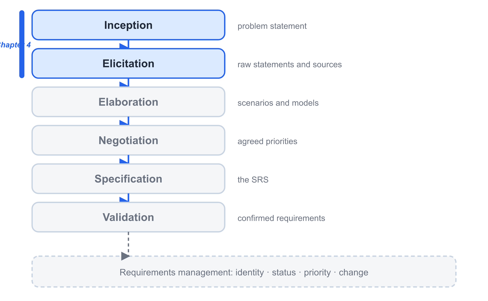
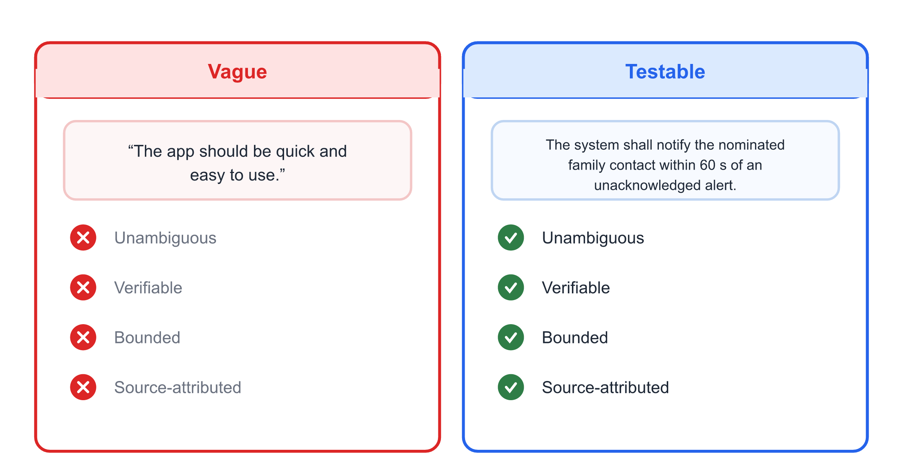
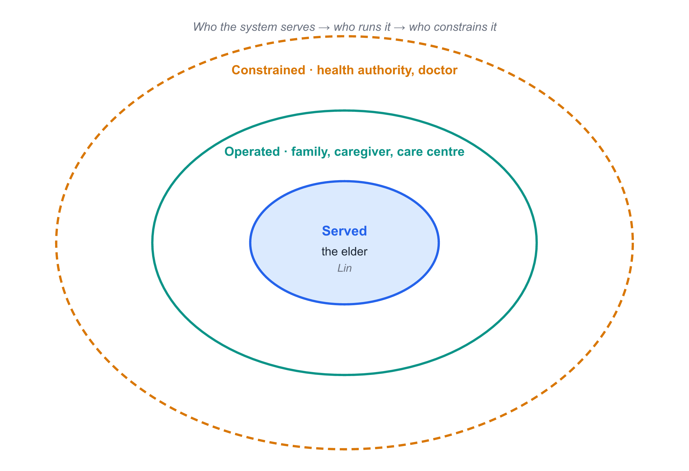
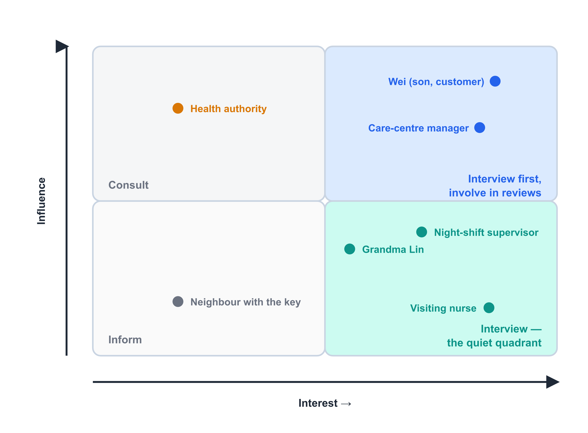
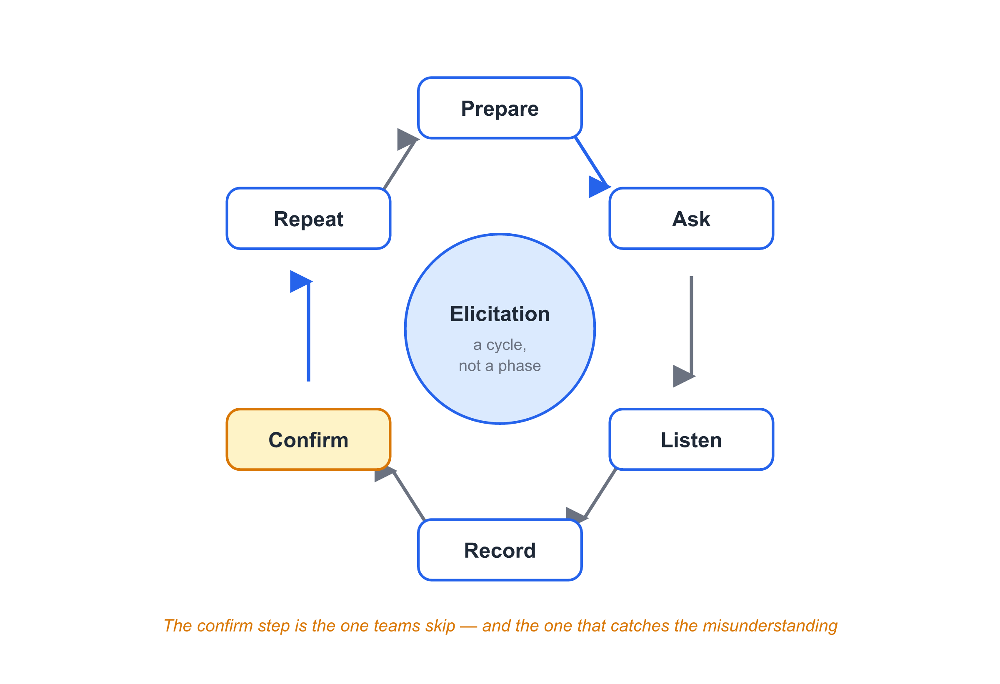
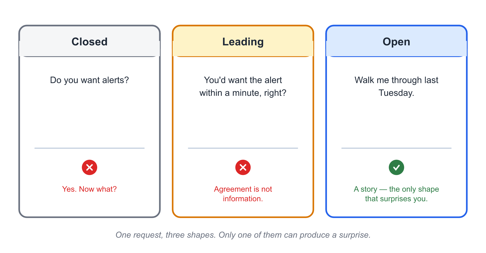
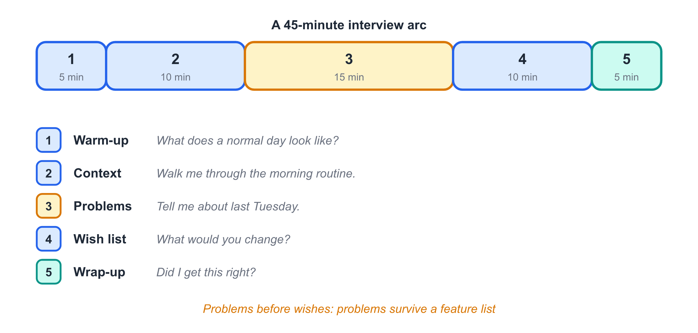
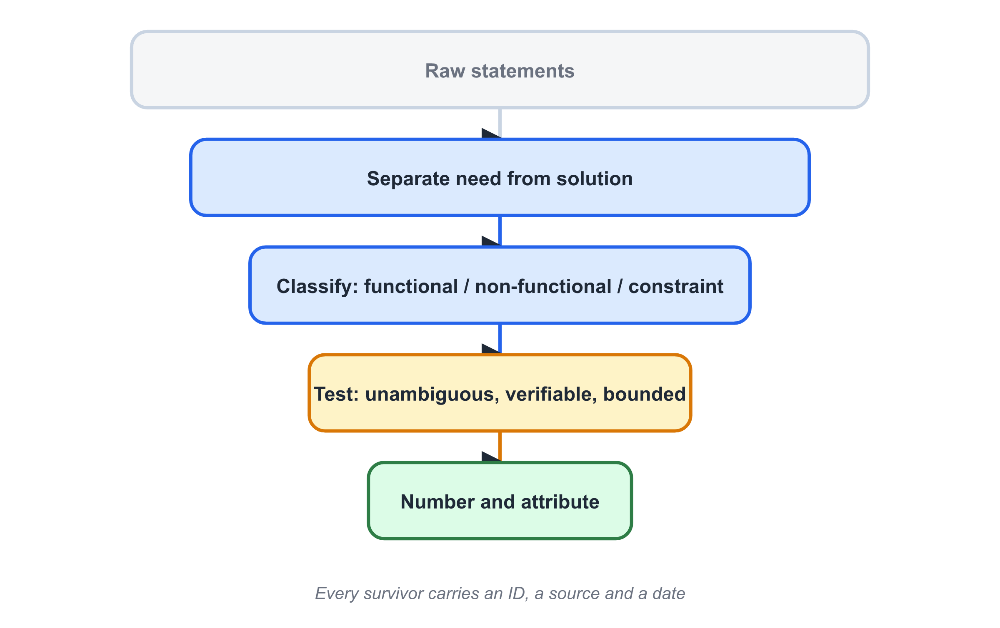
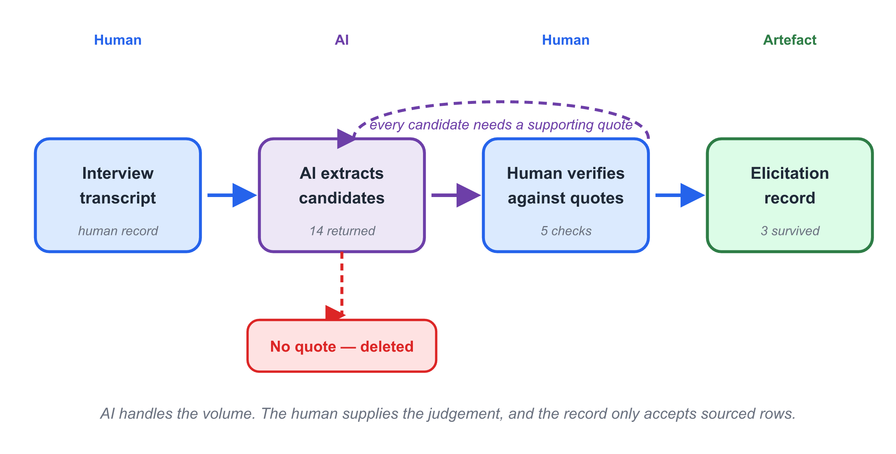

# Chapter 4 — Requirements Inception and Elicitation

> **In this chapter:** Why requirements work starts before anyone writes a
> requirement, who must be asked, how to ask so that people actually answer,
> and how to turn a pile of interview notes into numbered statements you can
> defend six months from now.

## Learning Objectives

After reading this chapter, you will be able to:

1. **Distinguish** a need, a requirement, and a solution — and say why
   confusing them is the most expensive mistake in the first month.
2. **Identify** the stakeholders of a system, including the ones who will
   never attend a meeting.
3. **Compare** the main elicitation techniques and **select** one for a
   given situation.
4. **Write** open questions, and **recognise** leading and closed questions
   when you see them.
5. **Convert** raw stakeholder statements into numbered requirement
   candidates, each carrying its source.
6. **Evaluate** an AI-drafted requirement list against the interview record,
   and **reject** every candidate the record does not support.

Objectives 1–5 are the manual skill. Objective 6 is the same skill, applied
to output you did not write.

## Before You Read

Ten terms, ten lines. Read them once now; the chapter assumes all ten.

- **requirement 需求** — a capability the system must have, stated so it can be checked.
- **inception 起始** — the first, deliberately rough look at what the system is for.
- **elicitation 需求获取** — drawing requirements out of people, not waiting to be told.
- **stakeholder 利益相关者** — anyone affected by the system or able to affect it.
- **functional requirement 功能需求** — something the system must *do*.
- **non-functional requirement 非功能需求** — a quality it must *have*, such as speed or safety.
- **domain constraint 领域约束** — a rule from the business or the law the system must obey.
- **tacit knowledge 隐性知识** — what people know so well they forget to mention it.
- **open question 开放式问题** — a question that cannot be answered yes or no.
- **volatility 易变性** — how much a requirement is expected to change.

## Opening Scenario

The CareLink team has thirty minutes with Wei, and they waste the first ten.

"Tell us what you want the app to do," the project lead begins. Wei is
polite and cooperative, so he does what he is asked. He lists features:
a login screen, a map, a chat function, push notifications, a monthly
report, and something to show heart rate. The team writes all of it down.
Nobody learns anything.

Then the lead changes one word. "Forget the app for a minute. Tell me
about last Tuesday."

Wei pauses. Then: "Tuesday was bad. I called at seven and she did not
answer. I called three more times in twenty minutes. Then I called the
care centre, and *they* called a neighbour, and the neighbour knocked on
her door. She had been asleep in the chair with the phone on silent.
Nothing was wrong. But I sat at my desk for twenty minutes and I could
not work."

Now the team has something. Not a feature list — a *situation*. The
twenty minutes of not knowing is the real product. "Kettle used by nine"
and "wristband heart rate" are things the team might build; *"Wei should
not sit at his desk not knowing"* is what he actually needs.

This chapter is about the change from the first version of that
conversation to the second. It is the most valuable fifteen minutes in
the whole project.

## Core Concepts

### 4.1 Need, requirement, solution — three different things

Words carry weight here, so start with three definitions you will use for
the rest of the book.

A **need** is a problem a person has. *Wei needs to know his mother is
safe without calling her every hour.* A need never mentions technology.

A **requirement** is a statement of what the system must do, or what
property it must have, written so that someone can check it. *The system
shall notify the nominated family contact within 60 seconds of an
unacknowledged alert.* A requirement is testable.

A **solution** is one way to satisfy a requirement. *Send a push
notification to the family app.* A solution is an engineering decision,
and it is not the stakeholder's to make.

Table 4-1 shows the same idea moving through the three levels.

| Level | Statement | Who owns it |
|---|---|---|
| Need | Wei must be able to stop worrying. | Wei |
| Requirement | The system shall notify the family contact within 60 s of an unacknowledged alert. | Wei and the team, together |
| Solution | Push notification via the family app, with SMS fallback. | The team |

If you remember one rule from this chapter, remember this one: **stakeholders
state needs, engineers propose solutions, and the two must never be
collected in the same column of the same document.**

The reason is not tidiness. A captured solution hides the requirement
underneath it. If the notes say "the app needs a map", the team will build
a map. They will not ask *what was the map for?* — and they will never
learn that Wei wanted to see, at a glance, whether today looks like
yesterday.

> 🤖 **AI note**: AI is fluent at producing requirement-looking sentences.
> Fluency is not evidence. A requirement is only as good as the person who
> said it, so every requirement must carry a source. §4.10 shows how to
> keep that discipline when AI helps you write.

### 4.2 The six requirements activities

Requirements work is not one activity, and it is certainly not a phase
that ends. Figure 4-1 shows the six activities and where this chapter
sits among them.

{width=15cm}

*Fig. 4-1. The six requirements activities. This chapter covers the first two; Chapter 5 covers elaboration, negotiation and specification; Chapter 10 covers validation and management.*

**Inception.** A rough, deliberately incomplete answer to three questions:
What is the system for? Who are the winners and losers? Is it worth
building at all? Inception produces a shared *problem statement*, not a
requirement list. It should take days, not weeks.

**Elicitation.** Drawing the real requirements out of real people.
This is the subject of the rest of this chapter.

**Elaboration.** Turning raw statements into models — scenarios, use
cases, class models — that expose gaps and contradictions. See Chapters
6 to 9.

**Negotiation.** Resolving the conflicts that elaboration always
uncovers. Two stakeholders want opposite things; somebody must decide,
and the decision must be recorded.

**Specification.** Writing the agreed requirements down in a form a
developer, a tester, and a customer can all read the same way. See
Chapter 5.

**Validation.** Checking that what you wrote is what they meant. See
Chapter 10.

Running underneath all six is **requirements management**: keeping track
of identity, status, priority, and every change. That is also Chapter 10.

### 4.3 What makes a statement usable

A statement you hear in an interview becomes a requirement candidate only
after it passes four tests. All four, or it goes back to the source.

**Test 1 — Unambiguous.** It has one reading, not two. *"The alert should
be quick"* fails: quick for whom, measured how?

**Test 2 — Verifiable.** Someone can design a check that returns pass or
fail. *"The app must be user-friendly"* cannot be verified, so it cannot
be built to.

**Test 3 — Bounded.** It says when it applies and when it does not. *"The
system shall alert on missed activity"* — every hour? Only at night?
Only if the elder is alone?

**Test 4 — Source-attributed.** It names the person, document, or
observation it came from, and the date. A requirement with no source
cannot be re-checked, and cannot be defended when someone disputes it.

Figure 4-6 contrasts a statement that fails all four tests with the same
intent written to pass them.

{width=15cm}

*Fig. 4-6. The same intention, written twice. Only the right-hand version can be designed, tested, and argued about.*

Notice what the repair did *not* do. It did not add detail for its own
sake. It added exactly the detail needed for a test to exist: a number,
a condition, and an exception.

There is a trap here, and it catches careful students. Over-specifying is
also a defect: *"The system shall notify within 60 s using FCM push
version 1 with 3 retries at 20 s intervals"* has moved from requirement to
design. Chapter 5 treats this in detail. For now, hold the line: a
requirement says what must be true, not how you will make it true.

### 4.4 Who must be asked

The single most common failure in requirements work is asking the wrong
people. Specifically: asking only the people who are easy to reach.

For CareLink, here is the incomplete list the team began with, and the
list they ended with.

| They started with | They had to add |
|---|---|
| Wei (son, paying customer) | Grandma Lin herself |
| The care-centre manager | The night-shift supervisor |
| Themselves | The visiting nurse |
| | The neighbour who holds a spare key |
| | The local health authority's data rules |
| | The elder's own doctor |

Three of those additions changed the product. Grandma Lin rejected the
wristband — she found it humiliating to wear in front of guests. That one
observation, from the person nobody had planned to interview, removed the
project's central sensor. The night-shift supervisor explained that
between 2 a.m. and 6 a.m. there is exactly one person on duty for
ninety residents. That number, not a manager's opinion, set the real
timeout for escalation.

{width=14cm}

*Fig. 4-3. CareLink's stakeholders in three rings: the people the system serves, the people who operate it, and the people who constrain it. The team's first list contained only the middle ring.*

**The rule: interview the person who does the work, not the person who
manages the work.** Managers know the system's purpose. Operators know
its edge cases, and edge cases are where systems fail.

### 4.5 Mapping stakeholders before you call them

Interviewing is expensive in other people's time. Spend ten minutes
sorting stakeholders first, so that the expensive hours go to the right
people.

Figure 4-7 plots CareLink's stakeholder groups on the classic
influence–interest grid.

{width=14cm}

*Fig. 4-7. CareLink stakeholders by influence over the project and interest in its outcome. The upper right quadrant gets interviewed; the upper left gets consulted; the lower right gets informed.*

The grid does not decide priorities for you. It decides **effort**:

- **High influence, high interest** (Wei, the care centre): interview
  first, involve in every review.
- **High influence, low interest** (the health authority): consult on
  constraints, do not expect engagement.
- **Low influence, high interest** (Grandma Lin, the visiting nurse): the
  most commonly skipped quadrant, and the source of the best requirements.
- **Low influence, low interest** (the neighbour with the key): inform.

> 🤖 **AI note**: You can ask an assistant to *propose* stakeholder groups
> from a one-paragraph system description. Treat the result as a checklist
> of who you might have forgotten — never as the stakeholder list itself.

### 4.6 Elicitation is a cycle, not a phase

Teams often picture elicitation as a stage: meet the customer, collect
requirements, move on. That picture is wrong, and Figure 4-2 shows the
accurate one.

{width=14cm}

*Fig. 4-2. The elicitation cycle. The confirm step is the one teams skip, and it is the one that catches the misunderstandings before they become code.*

**Prepare** — read what exists, write your questions, decide who to ask.
**Ask** — run the session. **Listen** — the hard part; let silence work.
**Record** — write it down *during* the session, not after.
**Confirm** — send back what you understood and ask "did I get this
right?" **Repeat** — because the first answer is rarely the last.

The **confirm** step is what transforms an interview into evidence. A
record that has been confirmed by its source is defensible. A record that
has not been confirmed is a rumour with good formatting.

### 4.7 Techniques, and what each one is for

Six techniques cover most situations. None is best; each sees a different
part of the problem.

| Technique | Sees | Blind to | Cost |
|---|---|---|---|
| **Interview** | opinions, goals, history | what people actually do | medium |
| **Workshop** | conflicts, and their resolution | quiet participants' views | high |
| **Observation** | workarounds, tacit knowledge | the reasons behind them | high |
| **Document analysis** | rules, constraints, legacy decisions | whether the rules are followed | low |
| **Questionnaire** | breadth across many users | depth and follow-up | low |
| **Prototype walkthrough** | reactions to a concrete proposal | requirements you did not draw | medium |

Two of these deserve a warning.

**Interview blind spot.** People describe the process they are supposed
to follow, not the one they follow. This is not dishonesty. It is that
habitual work is invisible to the person doing it. Only observation
finds it.

**Prototype blind spot.** A prototype shows what you thought of. If you
did not draw it, nobody will mention it. Prototypes confirm; they do not
discover. Use them last, not first.

The team's own case shows the split. Wei's interview produced goals.
Nobody could have learned from Wei that Grandma Lin would refuse the
wristband — that came from observation, and only from observation.

### 4.8 Asking well

A session is only as good as its questions, and questions come in three
shapes.

A **closed question** can be answered yes or no: *"Do you want alerts?"*
Cheap, and almost useless early on. Its place is confirmation at the end.

A **leading question** contains its own answer: *"You'd want the alert
within a minute, right?"* This is the most damaging shape, because it
feels productive. You get agreement, and agreement is not information.

An **open question** invites a story: *"Walk me through last Tuesday."*
Longer, slower, and the only shape that finds what you did not know to
ask for.

Figure 4-5 shows the same underlying request in all three shapes.

{width=15cm}

*Fig. 4-5. Three ways to ask one thing. Only the open version can produce a surprise.*

A workable session has an arc, shown in Figure 4-4.

{width=15cm}

*Fig. 4-4. A 45-minute interview arc. Problems are explored before wishes are collected, because problems survive feature lists.*

**Warm-up** (5 min) — who they are, what their day looks like.
**Context** (10 min) — the work, in their words, with no system in it.
**Problems** (15 min) — the last time something went wrong. Concrete,
recent, specific.
**Wish list** (10 min) — now ask what they want. It will be better than
it would have been at minute one.
**Wrap-up** (5 min) — read back the three most important things.

Five habits make the difference inside that arc:

1. **Ask for the last time, not the usual time.** *"When did this last
   happen?"* answers better than *"How often does this happen?"*
2. **Follow the emotion.** Where someone becomes annoyed, there is a
   requirement.
3. **Ask what they do instead.** Workarounds are requirements that your
   system has to beat.
4. **Ask what would make them stop using it.** Adoption risk, discovered
   early and cheaply.
5. **Write during, not after.** Memories normalise. Twenty minutes after
   the meeting, everything sounds reasonable.

### 4.9 Recording what you heard

Raw notes are not requirements. They are the ore. Figure 4-9 shows the
refinery.

{width=15cm}

*Fig. 4-9. Four steps from what someone said to a numbered requirement candidate: separate, classify, test, number.*

**Separate** need from solution. Move every proposed technology into a
separate column.

**Classify** as functional, non-functional, or constraint. *"Notify the
family within 60 seconds"* is functional. *"The alert must reach the
family when the internet is down"* is non-functional — it is about how
reliable the system is, not what it does. *"Health data may not leave the
province"* is a constraint.

**Test** against the four tests of §4.3. Fail any one, and you owe the
source a follow-up question. That follow-up is not a failure of the
interview; it is the interview working.

**Number and attribute** the survivors: an identifier, the statement, the
source, the date.

The result is an **elicitation record**, and it is the artefact you hand
in. A fragment looks like this.

| ID | Statement | Type | Source | Date |
|---|---|---|---|---|
| CR-001 | The system shall notify the nominated family contact within 60 s of an unacknowledged alert. | Functional | Wei, interview 1 | 2026-09-14 |
| CR-002 | The elder shall be able to cancel an alert within 20 s without leaving the room. | Functional | Lin, observation 2 | 2026-09-16 |
| CR-003 | The system shall remain able to raise a local alert when the home internet link is down. | Non-functional | Deng, interview 2 | 2026-09-15 |
| CR-004 | Health data shall be stored on servers within the province. | Constraint | Health authority notice 2026-08 | 2026-09-15 |

Four rows, four sources, one date each. Anyone can re-check any of them.

### 4.10 Why elicitation is hard

Five difficulties explain most failed requirements efforts. All five are
normal. None is a reason to skip the work.

**Tacit knowledge.** People cannot report what they do automatically.
The night supervisor did not say "I check the east corridor first"
because she does not know she does it. Observation found it in ten
minutes.

**The say–do gap.** Stated process and actual process differ. Both are
real; they are just different inputs. Interviews give you the stated
process. Observation gives you the actual one.

**Unknown unknowns.** Stakeholders cannot request what they have never
seen. Nobody asked for a map *until* a prototype showed one, and then
several people wanted it. Prototypes create requirements as well as
confirming them.

**Volatility.** Some requirements change on their own, because the
business changed. *The care centre moves to a 24-hour model.* You cannot
elicit your way out of volatility; you plan for it, which is why this
book keeps returning to change management.

**The loudest voice.** The stakeholder who talks most is not the
stakeholder who matters most. Section 4.5's grid exists to protect the
quiet quadrants from the noisy ones.

> 🤖 **AI note**: AI is genuinely useful for the *mechanical* half of this
> chapter: turning an hour of transcript into a structured table, grouping
> similar statements, and flagging statements that fail a testability
> check. It is not useful for deciding what a stakeholder meant. The AI
> Companion below shows where the line falls.

## CareLink in Action

The team ran four elicitation sessions in one week. Here is what each
produced, and how it changed the project.

**Session 1 — Wei, 45 minutes (interview).** He described last Tuesday.
He described the twenty minutes. He mentioned, almost in passing, that he
calls his mother *less* than he used to, because calling feels like
checking up on her, and she has said as much. That one sentence created a
non-functional requirement nobody would have thought to ask for: the
system must let the elder feel independent, not monitored. It is why the
wristband eventually died.

**Session 2 — Deng, night-shift supervisor, 30 minutes (interview).**
Deng's contribution was arithmetic. Ninety residents, one person on duty,
five minutes per check, so a full round takes almost eight hours. From
that, the team derived a real constraint: any alert must be actionable
within the time a single caregiver can spare, or it will be ignored.
Escalation, not notification, became the design problem.

**Session 3 — Lin, 2 hours (observation).** The team sat in the
apartment. They watched the morning. They saw the kettle, the chair by
the window, and the door she leaves unlocked for the neighbour. They also
saw the wristband come off at 10 a.m. and stay off. Observation produced
two requirements the interviews had missed, and killed one the interviews
had created.

**Session 4 — care centre documents (document analysis).** The health
authority's data notice (CR-004), the centre's escalation policy, and an
existing paper hand-over sheet. Cheap, fast, and it produced three of the
four constraints in the record.

Then the team used AI on the transcripts of sessions 1 and 2. It is worth
looking at exactly what happened.

{width=15cm}

*Fig. 4-8. The AI-assisted path through this chapter's task. The model handles volume; the human supplies judgement. Every arrow back into the record passes through verification against a quote.*

### What AI produced, and what survived

The team fed both interview transcripts to an assistant with the prompt
shown in the AI Companion section, and asked for candidate requirements.
It returned fourteen candidates in forty seconds.

The table below shows the three that mattered.

| AI candidate | Source check | Outcome |
|---|---|---|
| "The system shall allow family members to send messages to the elder through the app." | Not in either transcript. Wei never asked for messaging. | **Rejected** — invented requirement |
| "The system shall notify the family contact within 60 seconds of an unacknowledged alert." | Supported: Wei's account of the twenty minutes. | **Accepted** as CR-001 |
| "The care centre shall have a dashboard showing all residents' real-time status." | Partly supported. Deng did describe the round. But "real-time dashboard" is the AI's solution, not Deng's need. | **Rewritten** to a need statement, then split into CR-003 plus a design question |

Three out of fourteen. That ratio is normal, and it is not a reason to
stop using AI. Reading fourteen candidates takes four minutes. Writing
fourteen from scratch takes an hour. The saving is real; it just is not
the saving the team hoped for.

### The reviewer checklist the team used

Before any AI candidate entered the record, it had to pass all five checks.

- [ ] **Locatable.** I can point to the sentence in the transcript that
      supports this candidate.
- [ ] **Attributed.** I know which stakeholder said the supporting
      sentence.
- [ ] **Not a solution.** The candidate does not name a technology,
      screen, or API.
- [ ] **Testable.** I can describe a check that returns pass or fail.
- [ ] **Not a duplicate.** It is not a rewording of a candidate already
      in the record.

Grandma Lin, incidentally, would have failed candidate one in a second.
She does not want to be messaged. She wants to be left alone, safely.

## AI Companion

**1. What AI is good at here.** Elicitation produces volume: long
transcripts, messy notes, repeated statements. AI handles the volume
well. It is good at transcribing, grouping similar statements,
normalising wording, flagging statements that look untestable, and
producing a first draft of a record that you then edit. It is *not* good
at deciding what a stakeholder meant, noticing what nobody said, or
judging whether a requirement is worth having.

**2. Prompt pattern.**

```
Role: you assist a requirements analyst. You do not invent requirements.
Context: <system one-paragraph description>.
Input: <interview transcript>.
Task: extract candidate requirements. For each, quote the supporting
      sentence from the transcript.
Constraints: no requirement without a supporting quote; mark anything
      inferred as [INFERRED]; do not propose screens, apps or APIs.
Output: table — candidate | supporting quote | type (functional /
      non-functional / constraint) | [INFERRED]?
Verify: end with a list of statements you could not classify.
```

The `[INFERRED]` marker and the closing "could not classify" list are the
two load-bearing lines. They separate what the transcript supports from
what the model produced on its own.

**3. Verify before you trust.**
(a) Every candidate must have a quote you can find in the transcript. No
quote, no candidate.
(b) Check the speaker. A requirement invented in a group session and
attributed to one person is worse than no requirement.
(c) Kill every technology noun. Screens, apps, APIs and databases are
solutions, and solutions belong to the team.
(d) Look for what the output *left out*. If Wei spoke for ten minutes
about not wanting to feel like a spy, and the list contains nine
features, the model optimised for the wrong thing.
(e) Count. If the model returns twenty requirements from a thirty-minute
interview, it is padding. Real sessions produce a handful of good ones.

**4. Typical AI failure in this chapter.** A student team asked an
assistant to "list the requirements for an elder-care monitoring app
based on these notes". The output was clean, numbered, and formatted like
a specification. Item 4 read: *"The system shall support video calls
between the elder and family members."* It is a sensible feature. Wei
never mentioned it. The team did not notice for two weeks, because the
item was in a numbered list, and numbered lists look like decisions.

This is the characteristic failure of AI in requirements work. The model
does not produce *wrong* requirements — a video call is a reasonable
thing for such a system to have. It produces **unsourced** ones, and
unsourced requirements are indistinguishable from sourced ones once they
are in the document. The repair is structural, not editorial: if the
prompt does not require a supporting quote, the output cannot be checked.
So require the quote.

> 🤖 **AI note**: a requirement without a name attached to it is an
> opinion with a number. The number is what makes it dangerous.

## Common Pitfalls

**1. Asking for features in the first ten minutes.** The team's opening
question — *"Tell us what you want the app to do"* — produces a feature
list and closes the conversation. The repair: ask about a specific recent
instance (*"Tell me about last Tuesday"*) before asking for anything.

**2. Writing down solutions as requirements.** "The app needs a map" is a
design decision. The repair: keep a separate *solution ideas* column, and
never let it into the requirement record.

**3. Interviewing only the easy people.** Wei is reachable and
articulate. Grandma Lin is neither, and she changed the product more.
The repair: build the stakeholder grid of §4.5 before booking any
session, and deliberately book the quiet quadrants.

**4. Recording the answer but not the source.** A requirement with no
name and no date cannot be re-checked. The repair: if you cannot write
the source column, you did not finish the interview.

**5. Skipping the confirm step.** The record goes out to nobody, and the
misunderstanding surfaces in week 9 as a rebuild. The repair: send the
record back within 24 hours, in plain language, and ask for corrections.

**6. The AI-induced pitfall: trusting an unsourced list because it is
well formatted.** Numbered, headed, professionally worded requirement
lists are exactly what language models are good at producing, and exactly
what human teams find hardest to distrust. The repair: make the
supporting quote a mandatory column. If that column is empty, the row is
deleted, no matter how reasonable it sounds.

## Guided Lab: Elicit, Record, Confirm (50 minutes)

Work in pairs, then in groups of four. You need one stakeholder brief
(provided) and a note-taking template.

**Input.** A one-paragraph stakeholder brief for a system you have not
seen before — a clinic appointment system. Person A plays the clinic
receptionist; person B is the analyst.

**Task.** Run a 15-minute elicitation session, produce an elicitation
record of at least six numbered candidates, and confirm it back.

**Track A — manual.** Prepare five questions before you start. Take notes
by hand during the session. Classify and number afterwards. Produce the
record alone.

**Track B — AI-assisted.** Record the session (with permission). Feed the
transcript to an assistant using the prompt pattern in the AI Companion.
Edit its output into a record, keeping only candidates with a supporting
quote.

**Same acceptance criteria for both tracks.**

- [ ] At least six candidates, each with ID, statement, type, source, date
- [ ] At least one functional, one non-functional, one constraint
- [ ] At least one candidate that came from a follow-up question
- [ ] Zero statements that name a technology
- [ ] A confirmation message, ≤120 words, in language the stakeholder
      would recognise
- [ ] (Track B only) A count of how many AI candidates you deleted, and
      the reason for each deletion

**Time.** 15 min session · 20 min producing the record · 10 min comparing
records across pairs · 5 min debrief.

**Expected output.** Two records for the same session, one human and one
AI-assisted, held to the same standard. In practice Track B has more
candidates and a lower proportion that survive. That difference is the
lesson.

## Language Focus

This week you must **report what someone said**, **hedge what is
uncertain**, and **state a requirement**. These three moves carry every
Chapter 4 assignment.

| Move | Pattern | Example |
|---|---|---|
| Report | The stakeholder **stated that** … / **described** a case in which … | *The night supervisor stated that one caregiver covers ninety residents between 2 a.m. and 6 a.m.* |
| Hedge | **It is not yet clear whether** … / This **suggests that** … but **requires confirmation**. | *This suggests that escalation, not notification, is the design problem, but requires confirmation with the care centre.* |
| Require | The system **shall** … **within** X of Y. | *The system shall notify the nominated family contact within 60 seconds of an unacknowledged alert.* |

Two notes on the Require pattern. Use **shall** for requirements and
**should** for preferences — the difference is not decoration; auditors
read it as binding. And name the condition, not the implementation.

Three short exercises (answers in the instructor's manual):

1. Report Deng's arithmetic finding using the "stated that" pattern, in
   one sentence, without adding interpretation.
2. Rewrite as a hedged statement: *CareLink needs a wristband.*
3. Turn this need into a requirement sentence: *Wei should not sit at his
   desk not knowing.*

## Summary and Key Terms

- A **need** is a problem; a **requirement** is a checkable statement of
  what the system must do; a **solution** is one way to satisfy it. Keep
  the three in separate columns.
- Six activities: inception, elicitation, elaboration, negotiation,
  specification, validation — with **management** running underneath.
- A usable statement passes four tests: **unambiguous, verifiable,
  bounded, source-attributed**.
- Interview the person who **does** the work, not the person who manages
  it. Operators know the edge cases.
- Sort stakeholders by **influence and interest** before booking time.
  The quiet quadrants produce the best requirements.
- Elicitation is a **cycle**. The **confirm** step is what turns notes
  into evidence.
- Ask **open** questions. Leading questions feel productive and produce
  nothing.
- Recording is four steps: **separate, classify, test, number and
  attribute**.
- Five reasons it is hard: tacit knowledge, the say–do gap, unknown
  unknowns, volatility, the loudest voice.
- AI is useful for the **volume** and dangerous for the **judgement**.
  Require a supporting quote in every AI candidate.

**Key terms:** requirement 需求 · need 需要 · inception 起始 · elicitation 需求获取 ·
elaboration 精化 · negotiation 协商 · specification 规格说明 · validation 验证 ·
stakeholder 利益相关者 · functional requirement 功能需求 · non-functional requirement 非功能需求 ·
domain constraint 领域约束 · tacit knowledge 隐性知识 · open / leading / closed question
开放式 / 诱导式 / 封闭式问题 · elicitation record 需求获取记录 · volatility 易变性

## Exercises

**(a) Concept checks**

1. Classify each as a need, a requirement, or a solution: (i) *Wei should
   not sit at his desk not knowing*; (ii) *The system shall notify the
   family contact within 60 seconds*; (iii) *Push notification with SMS
   fallback*. Justify each in one sentence.
2. Which of the four tests of §4.3 does each statement fail?
   (i) *The app must be responsive.* (ii) *The system shall be secure.*
   (iii) *The system shall send an alert when something is wrong.*
3. Give one sentence explaining why a requirement with no source is worse
   than no requirement at all.
4. Explain the say–do gap in two sentences. Give an example from your own
   daily life, not from the chapter.

**(b) Analysis problems**

5. A hospital wants a patient-flow system. Using §4.5, place these six
   stakeholders on the influence–interest grid and justify each
   placement: the hospital director, a ward nurse, the IT department, a
   patient's family, the health insurance office, a cleaner.
6. You have 90 minutes of stakeholder time in total. Choose two
   elicitation techniques from §4.7, allocate the minutes, and justify
   the split using what each technique can and cannot see.
7. Take the following raw note and run it through the four steps of
   §4.9. *"The manager said we really need a dashboard because the
   current reports take two days, and honestly the night shift just
   calls each other."* Produce one table row per requirement candidate,
   with type and source.
8. The chapter claims leaders' questions *feel* productive while open
   questions do not. Write three leading questions a junior analyst
   might ask about a library app, then rewrite each as an open question,
   then state what the open version could discover that the leading
   version cannot.

**(c) AI-augmented tasks** — *graded on your critique, not on your prompt*

9. Write a 150-word stakeholder description of a campus bike-share
   system from the perspective of a maintenance worker. Give it to an
   assistant and ask: *"List the requirements for this system."* Then:
   (i) mark each candidate **[QUOTED]** if the description supports it or
   **[UNSOURCED]** if it does not; (ii) delete the unsourced ones;
   (iii) rewrite one survivor to pass all four tests of §4.3;
   (iv) state the ratio of sourced to unsourced, and what that ratio
   tells you about using this technique.
10. An assistant returned this candidate: *"The system shall provide a
    mobile application with biometric login for elderly users."* The
    source was an interview with a care-centre manager. Identify the
    three separate defects in this single sentence (use §4.1 and §4.3),
    and write the follow-up question you would put to the manager.

**(d) Running Project Task 4 — due Week 5**

Take the project case your team chose in Running Project Task 1.
Deliver three artefacts, together at most three pages.

1. **Stakeholder map** — at least six stakeholders placed on the
   influence–interest grid, with a one-line note on who you will
   interview and who you will merely inform.
2. **Elicitation record** — at least twelve numbered candidates with ID,
   statement, type (functional / non-functional / constraint), source and
   date. At least two must come from a source that is not the obvious
   customer.
3. **Session log** — which techniques you used, how long each took, and
   one thing each technique found that the others did not.

Append a short note: which two candidates you are least confident about,
and what you will do to confirm them. Confidence is not the deliverable —
calibrated uncertainty is.

---

### References

- Goguen, J. and Linde, C., *Techniques for Requirements Elicitation*,
  Proceedings of the IEEE International Symposium on Requirements
  Engineering, 1993.
- Beyer, H. and Holtzblatt, K., *Contextual Design: Defining
  Customer-Centered Systems*, Morgan Kaufmann, 1998.
- Sommerville, I. and Sawyer, P., *Requirements Engineering: A Good
  Practice Guide*, Wiley, 1997.
- Institute of Electrical and Electronics Engineers, *IEEE 830-1998:
  Recommended Practice for Software Requirements Specifications*,
  superseded by ISO/IEC/IEEE 29148:2018.

---

## Figure List (authoring aid, removed before build)

| # | Type | Caption | Alt text |
|---|---|---|---|
| 4-1 | T1 | The requirements landscape | Six linked boxes: inception, elicitation, elaboration, negotiation, specification, validation, with management beneath |
| 4-2 | T2 | The elicitation cycle | Six-step circle: prepare, ask, listen, record, confirm, repeat; confirm feeds back to prepare |
| 4-3 | T1 | Stakeholder map for CareLink | Three concentric rings: elders, family and caregivers inner; care centre middle; health authority outer |
| 4-4 | T2 | The interview arc | Horizontal five-segment timeline from warm-up to wrap-up, with example questions under each segment |
| 4-5 | T4 | The same request asked three ways | Three speech bubbles labelled vague, leading, open; the open one highlighted |
| 4-6 | T4 | Vague requirement vs testable requirement | Two-column contrast; left column lacks number and condition, right column supplies both |
| 4-7 | T6 | Stakeholder influence and interest grid | 2×2 matrix placing six CareLink stakeholder groups by influence and interest |
| 4-8 | T7 | AI-assisted transcript analysis, with verification | Flow: transcript to AI extraction to human verification against quotes to accepted record |
| 4-9 | T1 | From raw statement to numbered requirement | Four-step funnel: separate, classify, test, number and attribute |
