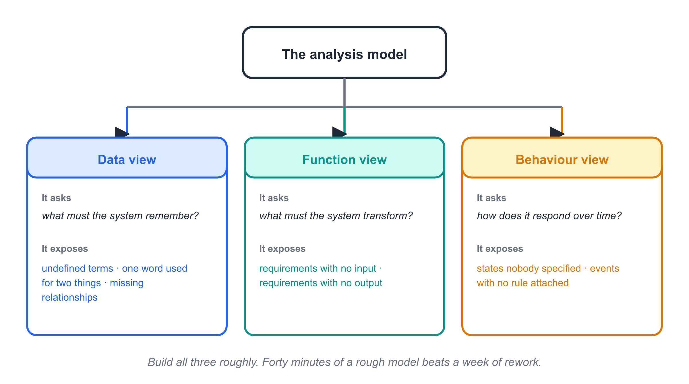
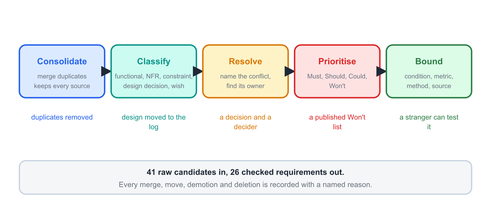
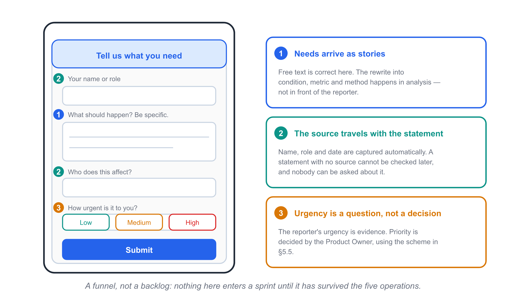
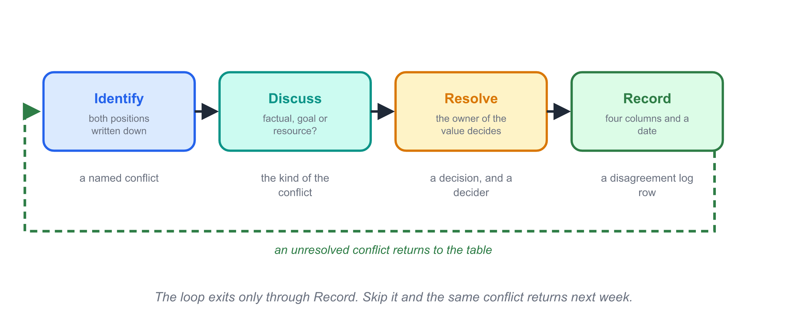
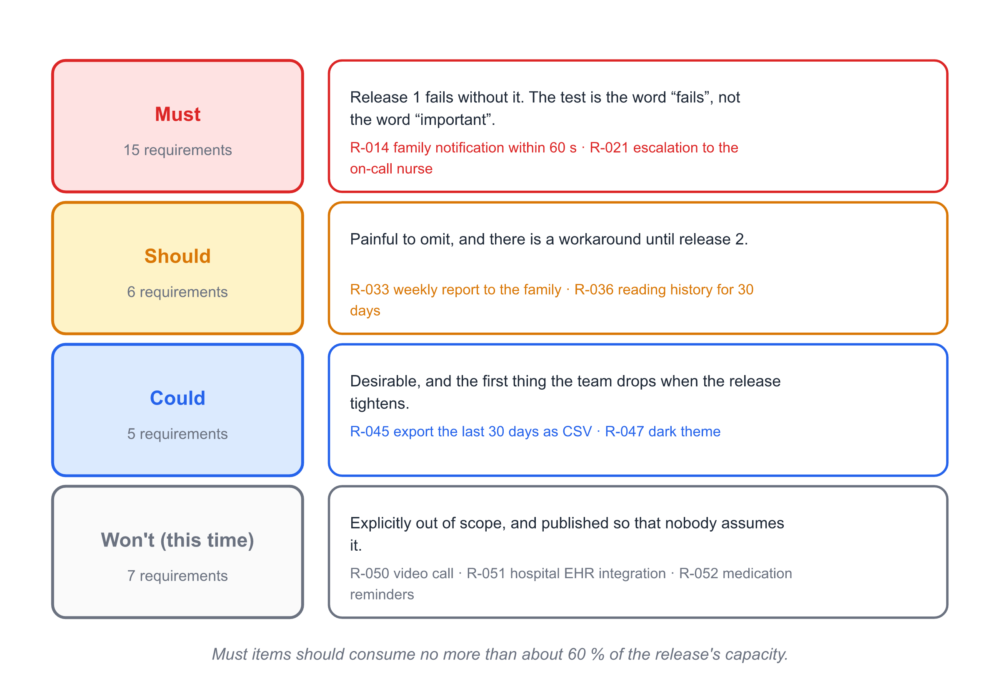
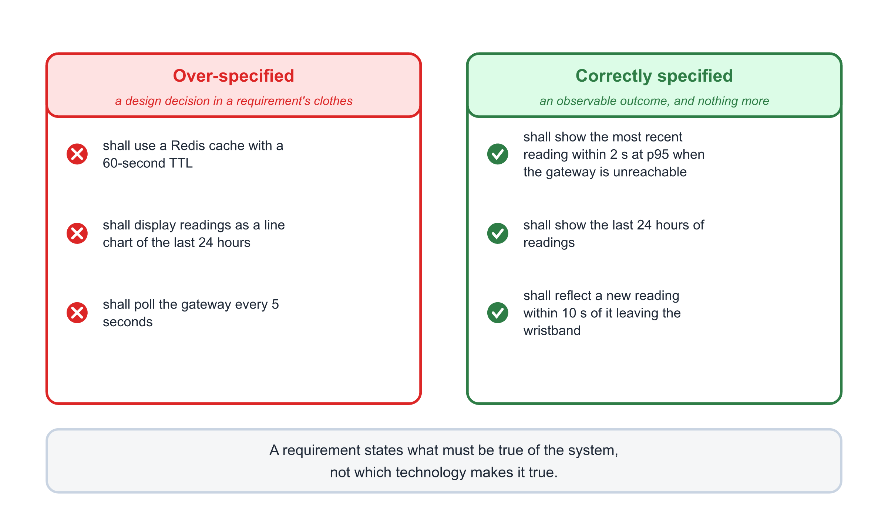
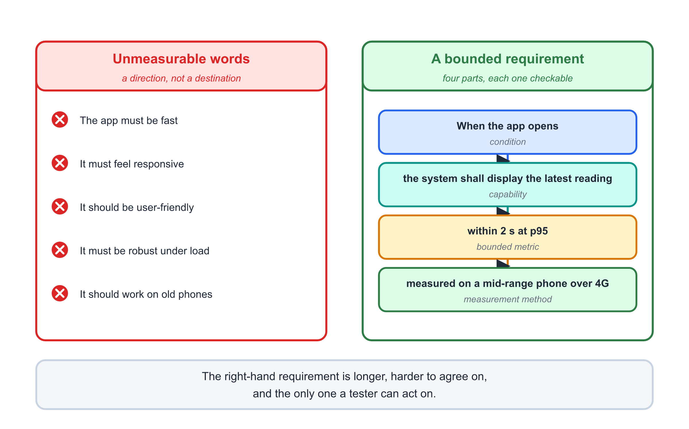
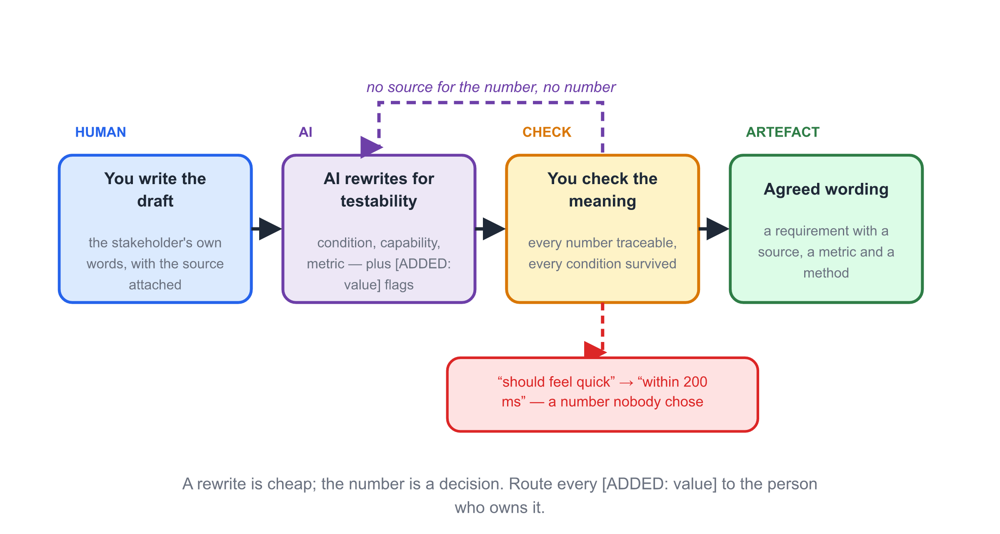

# Chapter 5 — Requirements Analysis and Specification

## Learning Objectives

By the end of this chapter you will be able to:

1. Explain why analysis and elicitation fail in different ways, and why a
   large candidate list is a *starting* condition, not a result.
2. Describe the three views of an analysis model — data, function,
   behaviour — and say what each view exposes that the others hide.
3. Apply the five operations that turn a raw candidate list into a checked
   requirement set: consolidate, classify, resolve, prioritise, bound.
4. Classify a conflict as factual, goal-based or resource-based, and choose
   the cheapest resolution path for each.
5. Prioritise a release with MoSCoW without inflating the Must list.
6. Rewrite a vague or over-specified statement into a requirement that is
   unambiguous, bounded, verifiable and source-attributed.
7. Assemble a specification whose structure makes it readable by three
   different audiences: customer, developer and tester.
8. Build a traceability link from requirement to design element to test.
9. Use an AI assistant for the *bulk* of requirement rewriting, and audit
   its output for invented metrics.

---

## Before You Read

Ten terms, ten lines. Read them once now; the chapter assumes all ten.

- **analysis 分析** — deciding what the collected statements *mean* and
  which of them the system must actually satisfy.
- **specification 规格说明** — the written, agreed description of what the
  system must do, written so that it can be checked.
- **testable 可验证的** — a statement is testable when a stranger can design
  a pass/fail check from it without asking you a question.
- **bounded 有界的** — carrying a number, a range or a named measurement
  method, instead of a qualitative word such as *fast*.
- **over-specification 过度规格化** — a requirement that dictates **how** the
  system must be built instead of **what** it must achieve.
- **conflict 冲突** — two requirements that cannot both be satisfied inside
  the project's constraints.
- **prioritisation 优先级排序** — deciding the order in which requirements
  earn their place in a release.
- **MoSCoW 必做/应做/可做/本期不做** — a four-bucket prioritisation scheme:
  Must, Should, Could, Won't (this time).
- **traceability 可追溯性** — the recorded links from each requirement to the
  design that satisfies it and the test that verifies it.
- **acceptance criterion 验收标准** — the concrete check that decides whether a
  requirement has been met.

## Opening Scenario

The whiteboard is full. Forty-one numbered candidates run down the left
side and onto the right — the harvest from three elicitation sessions with
the care centre, two with Wei, and one uncomfortable hour with the night
shift.

Four hours later the team has a problem it did not expect. Nothing on the
board is *wrong*. Almost nothing on the board is *usable*.

Two candidates say the same thing in different words: R-07 "The app should
show whether Grandma Lin is alright" and R-19 "Family members need to see
the current status". A third says the opposite of a fourth: R-11 asks for
an alert to the family the instant a reading crosses a threshold; R-24
asks for alerts to be *held back* for five minutes so that a sleeping
household is not woken by a false alarm. A fifth is not a requirement at
all but a technology: "use MQTT so the wristband battery lasts".

Mei reads the list twice and arrives at the sentence that organizes the
rest of the term: **elicitation found these; analysis decides which of
them the system must actually have.**

The team spends the session doing five boring things in order —
consolidating duplicates, classifying each candidate, resolving the
conflicts, prioritising what remains, and rewriting every survivor until a
stranger could test it. At the end, forty-one candidates become
twenty-six requirements. Twenty-six is not a disappointment. Twenty-six
is the first number anybody on the project can defend.

## Core Concepts

### 5.1 Analysis Is Not Elicitation

Chapter 4 was about *finding out*. This chapter is about *deciding*.

The two activities fail in opposite directions, and confusing them is why
teams either stop too early or never stop:

| | Elicitation | Analysis |
|---|---|---|
| Question | What do people want? | What must the system do? |
| Output | Raw, overlapping, unranked statements | A numbered, classified, prioritised, testable set |
| Failure mode | **Missing** requirement | **Wrong** requirement |
| Failure discovered | In the demo, by the user | In construction, by the team |
| Cost of the failure | A feature you did not build | Work you built and must now remove |
| Skill | Listening, asking, recording | Judging, negotiating, writing |

A missing requirement is expensive but honest: you learn about it when a
user says "where is the button?". A wrong requirement is worse, because it
is *invisible*. A requirement that contradicts another, that hides a
design decision, or that names a number nobody agreed to will be built
faithfully and will be discovered late — usually by the person who has to
maintain it.

> **Key point.** Elicitation finds. Analysis decides. A team that treats a
> long candidate list as progress has confused the two.

There is a second reason analysis cannot be skipped. Elicitation produces
**sentences about the world**, and the world contains things the team has
not yet noticed. Analysis is where you notice them — not by asking more
questions, but by arranging what you already have and looking at the
arrangement. That arrangement has a name.

### 5.2 The Analysis Model and Its Three Views

An **analysis model** is a set of small, interlocking diagrams and tables
built *before* the specification is written, for one purpose: to expose
the gaps. It is not the specification, and it is not the design.

Classical structured analysis — and its object-oriented successors — found
that three views between them catch most of what prose misses:

- **The data view** asks: *what must the system remember?* It names the
  things the system talks about — an elder, a wristband, a reading, an
  alert, a shift, a response — and the relationships between them. Draw
  it and the phrase "the system" stops being a black box.
- **The function view** asks: *what must the system transform?* It names
  the inputs, the outputs, and the transformation between them: a reading
  becomes an assessment; an unacknowledged alert becomes an escalation to
  a named person.
- **The behaviour view** asks: *how does the system respond to events over
  time?* It names states and transitions: idle → monitoring → alerting →
  acknowledged, with the events and conditions that move between them.

{width=15cm}

*Fig. 5-1. The analysis model and its three views. Each view exposes a class of gap the other two hide.*

The three views are not three deliverables. They are three ways of
squinting at the same system, and each squint reveals a specific class of
defect:

- Draw the **data view** and you discover that nobody has defined what a
  "reading" is, or whether a shift is an entity or a time interval. You
  also discover two requirements that use the same word for different
  things — the single most common cause of a "bug" that is really a
  vocabulary failure.
- Draw the **function view** and you discover requirements with no input
  and requirements with no output — both symptoms of a statement that has
  been copied from a wish rather than derived from a need.
- Draw the **behaviour view** and you discover the states nobody specified.
  In CareLink's case, the missing state was *acknowledged but unanswered*:
  the system knew an alert had been seen, and had no rule for what to do
  when seeing it changed nothing.

This book returns to each view properly in Part II's later chapters —
business processes in Chapter 6, use cases in Chapter 7, the domain model
in Chapter 8, behaviour in Chapter 9. For now, build all three roughly.
Forty minutes of a rough model is worth a week of late rework.

> **Key point.** The model's job is to produce *questions*, not diagrams.
> A model that raised no question has been drawn for the wrong audience.

### 5.3 Five Operations on a Raw Candidate List

A raw list is not a requirement set. Converting one into the other is
mechanical enough to be taught as five operations, performed in order, on
a table with one row per candidate.

**Operation 1 — Consolidate.** Find statements that describe the same
need and merge them into one row, keeping *all* their sources. Merging is
not editing: you keep the union of the evidence. R-07 and R-19 merge into
one requirement sourced from a family interview and a care-centre
observation. Consolidation typically removes 15–25 % of a raw list, and
every removal is a duplicate, never a decision.

**Operation 2 — Classify.** Every candidate is exactly one of five things:

| Class | Example | What happens to it |
|---|---|---|
| Functional requirement | The system shall notify the family contact when a threshold is crossed. | Keep; it drives behaviour |
| Non-functional requirement | The system shall deliver the notification within 60 s at p95. | Keep; it constrains *how well* |
| Domain constraint | Health data may not leave the country. | Keep; it is not negotiable |
| Design decision | Use MQTT so the wristband battery lasts a week. | Move to the design log |
| Wish or vague goal | The app should be easy for old people. | Rewrite, or return to the stakeholder |

The fourth row is the one teams get wrong. "Use MQTT" is a good decision
and a terrible requirement: it forecloses alternatives before anyone has
measured them. Move it to the design log, where it can be argued on its
merits, and write down what it was protecting — *the wristband must run
seven days on one charge* — as the requirement. Now the constraint
survives even if the technology changes.

The fifth row is subtler. A wish is not garbage. "Easy for old people" is
the *reason* several requirements exist. Keep it, flagged as a goal, and
attach requirements to it; then delete it from the numbered set.

**Operation 3 — Resolve conflicts.** Covered in §5.4. Every conflict has
exactly one owner: the person who owns the value.

**Operation 4 — Prioritise.** Covered in §5.5. Ordering is a decision
about value, made by the Product Owner, informed by the team's cost.

**Operation 5 — Bound.** Rewrite every survivor until it is unambiguous,
bounded, verifiable and source-attributed. Covered in §5.6.

{width=15cm}

*Fig. 5-2. Five operations turn a raw candidate list into a numbered, classified, prioritised, testable set.*

Where do the raw candidates come from after the interviews are over? The
best teams stop relying on memory. CareLink's team added a small *need
intake* form to the family app, so that a need arrives with a source and a
date instead of becoming a sentence in a corridor.

{width=15cm}

*Fig. 5-9. A need-intake form. It captures the source and the date with the statement — the two attributes analysis needs and memory loses.*

The form is not a backlog and must never be mistaken for one. It is a
funnel with a filter at the bottom: everything that arrives is a
*candidate*, and a candidate becomes a requirement only after the five
operations above. A wish-list screen that feeds work directly into a
sprint is a way of letting the loudest form-filler set the schedule.

> **Key point.** Every requirement you keep should be traceable to a
> source, and every candidate you discard should be discarded for a
> *named* reason. "We decided not to" is a reason. Silence is not.

### 5.4 Conflicts: Three Kinds, Three Costs

Two requirements conflict when they cannot both be satisfied inside the
project's constraints. The first analytic move is to name the kind,
because the kind determines how expensive the resolution is.

**Factual conflicts** are disagreements about the world, and they are the
cheapest to resolve: go and look. In CareLink, one interview produced
"the wristband's battery lasts about a week" and another "two days". Both
speakers were sincere. Neither had measured. Twenty minutes with a
stopwatch and a log settled it at *four days under normal use, under two
days if fall detection runs continuously* — which is not a compromise
between the two claims but a sharper fact than either, and it changed the
design.

The rule: **before negotiating a factual conflict, check it.** Teams
spend hours trading opinions about questions that have answers.

**Goal conflicts** are disagreements about outcomes. Wei wants the family
notified immediately; the care centre wants no alerts outside working
hours unless a nurse has been reached first. Both are pursuing a value
they can defend: Wei fears being uninformed, the centre fears alert
fatigue turning a real emergency into the fourth buzz of the evening.
There is no fact that resolves this. Someone must choose, and that
someone is the Product Owner, because goal conflicts are a decision about
value — which is precisely what a Product Owner owns.

The team's resolution was to stop treating it as a binary and to model the
*escalation chain* instead: notify the family at once; if unacknowledged
after three minutes, notify the on-call nurse; if still unacknowledged
after eight, notify the second contact. Nobody's value was traded away;
the design was made richer. This is the most common good outcome of a goal
conflict — not a winner, but a third option that only became visible once
both positions were written down side by side.

**Resource conflicts** are disagreements about the same limited thing:
the same week of one developer's time, the same hardware budget, the same
sensor. These are resolved by the same rule as goal conflicts — the owner
of the value decides — but they are cheaper, because the trade is usually
arithmetic rather than political. "We can do notifications *or* the weekly
report in increment 2" ends when the Product Owner picks one and the other
moves to the Won't list for that release.

Whatever the kind, record the disagreement. A **disagreement log** with
requirement IDs, positions, decision, decider and date costs four columns
and pays for itself the first time somebody asks "why is it like this?".

{width=15cm}

*Fig. 5-7. Negotiation is a loop with a written exit. The step teams skip is the last one.*

> **Key point.** Never split a difference you have not measured. Compromise
> is the right answer to a goal conflict and the wrong answer to a factual
> one.

### 5.5 Prioritisation Without Must Inflation

Prioritisation answers one question: *in what order do requirements earn
their place?* The most widely used scheme in industry, and the one this
course uses, is **MoSCoW**:

- **Must** — release 1 fails without this. Not "important"; *fails*.
- **Should** — painful to omit, but there is a workaround.
- **Could** — desirable, and the first thing dropped under pressure.
- **Won't (this time)** — explicitly out of scope for this release. The
  most useful of the four, because it is the only one that stops being
  re-litigated every week.

The scheme's weakness is built into its name: every stakeholder's
favourite requirement is a Must. Four disciplines keep the list honest:

1. **Test the sentence.** Replace "Must" with "release 1 fails without
   this". Most Musts become Shoulds the moment they are read aloud.
2. **Cap the bucket.** A common working rule is that Must items should
   consume no more than about 60 % of the release's capacity. The cap is
   not a law; it is a signal that you have room for the plan to be wrong.
3. **Never rank inside a bucket.** Ordering twenty Musts is a planning
   exercise, and a plan with no slack is a plan that converts one
   surprise into a schedule crisis.
4. **Publish the Won't list.** A private exclusion decision is a future
   argument; a published one is a fact everybody has agreed to.

Two refinements are worth knowing. Some teams separate *ranking* (an
ordered list, where position carries all the information) from *buckets*
(MoSCoW, where the bucket carries the reason). Ranking is more expressive
and harder to agree on; buckets are coarser and much easier to defend. And
the **Kano** model distinguishes *basic* requirements (their absence
angers, their presence is unnoticed), *performance* requirements (more is
better) and *delighters* (unexpected, and only valuable once the basics
work). Its practical use here is the warning it encodes: delighters
prioritised above basics produce a product that is charming and unusable.

{width=15cm}

*Fig. 5-5. MoSCoW for CareLink's first release. The Won't row does more work than the other three combined.*

> **Key point.** A Must list that contains everything is a Won't list in
> disguise: it tells the team nothing about what to build first.

### 5.6 Writing a Requirement a Stranger Can Test

Everything above produces a *set*. This section produces *sentences*, and
it is the part that determines whether the specification is useful.

The working template:

```
[Condition] the <system> shall <capability> [within <bounded metric>,
measured by <method>].
```

Three examples, in increasing order of usefulness:

- *The system shall alert the family.* — no condition, no metric.
- *The system shall alert the family when a heart-rate threshold is
  crossed.* — the condition is now visible; the metric is not.
- *When a heart-rate reading exceeds the configured threshold for two
  consecutive samples, the system shall notify the nominated family
  contact within 60 seconds, measured from the second sample.* —
  testable by a stranger.

Five defects account for almost every unusable requirement:

1. **The vague qualifier.** *Fast*, *friendly*, *robust*, *secure*,
   *intuitive*, *seamless*. Each is a direction, not a destination. They
   are not deletable — they identify what the stakeholder cares about —
   but they must be converted into a measurement (see the next figure).
2. **The missing condition.** *The system shall send an alert.* Under
   what circumstances? Conditions are where engineering lives.
3. **The prescribed implementation.** *The system shall use a Redis cache
   with a 60-second TTL.* This is a design decision wearing a
   requirement's clothes; it forecloses the alternatives before anyone
   measured them.
4. **The compound requirement.** *The system shall notify the family and
   log the event and update the dashboard.* Three requirements,
   one ID, three different fates: when one is deferred, the ID cannot tell
   you which. Split them.
5. **The unsourced statement.** No source means no way to check the
   statement and no one to ask when it turns out to be wrong.

Defect 1 and defect 3 look like opposites and are, in practice, the same
mistake: a requirement should state an **observable outcome** and stop. Say
too little and it cannot be tested; say too much and you have made a
design decision that nobody has costed.

{width=15cm}

*Fig. 5-3. Over-specification and vagueness are two ends of the same failure. A requirement states an observable outcome.*

Qualitative words are convertible, and the conversion is mechanical once
you accept one condition: **a non-functional requirement without a named
measurement method is a wish**. "Fast" becomes "≤ 2 s at the 95th
percentile, measured on a mid-range phone", and the moment you write those
words you have also decided how you will measure them — because "at p95"
is a measurement instruction, and someone has to be able to produce the
number.

{width=15cm}

*Fig. 5-6. The bounded version is longer, is harder to agree on, and is the only one a tester can act on.*

Which percentile you choose is itself a requirement, and choosing 100 %
is usually a mistake. "Every alert within 60 seconds" and "99 % of alerts
within 60 seconds" describe very different systems: the first promises
that nothing is ever late, the second names a failure budget the team can
survive. Requirements that hide their failure budget look stricter and
behave worse, because the team has no legal way to describe reality when
it arrives.

> **Key point.** A requirement earns its place when a tester who has never
> met you can design the pass/fail check without asking a question.

### 5.7 The Shape of a Specification

A specification is one document serving three readers who want different
things from it. The customer wants to confirm that the team understood.
The developer wants enough precision to build. The tester wants criteria
to verify. A structure that serves all three is a solved problem; most
organizations converge on something close to this:

```
1  Purpose and scope          what this document covers, and what it does not
2  Definitions and glossary   the vocabulary, settled once
3  Stakeholders               who was consulted, and about what
4  Functional requirements    numbered, classed, prioritised
5  Non-functional             grouped by quality attribute, each with a method
6  External interfaces        what other systems and people touch
7  Constraints and assumptions what is fixed, and what we are assuming
8  Acceptance criteria        how release 1 is judged
9  Open questions             what is still unresolved, with an owner and a date
A  Traceability appendix      requirement -> design -> test
```

{width=15cm}

*Fig. 5-4. The specification outline. Section 9 is the one that most often gets deleted and most often saves the project.*

Three notes on using this structure well.

**Section 2 is not optional, and it is not bureaucracy.** A glossary
exists to stop the same noun meaning two things in two sections. CareLink's
team, at one point, had *alert* meaning both "a notification sent to a
person" and "a condition that has been detected". Half of their apparent
schedule conflict disappeared when the word was split into *detection* and
*notification*.

**Section 9 is the honest section.** Every specification has unresolved
questions. A document that lists none of them is either finished — rare —
or hiding something. Give each open question an owner and a date, and the
document becomes a live control panel rather than a monument.

**Length is a symptom.** Twenty pages of careful requirements for a
one-semester project is over-documentation, and so is one page for a
safety-critical medical device. The test is not the page count but whether
each reader can find what they need: the customer's confirmation, the
developer's precision, the tester's criteria.

> **Key point.** A specification is a communication artefact. Its quality
> is measured by how little its readers have to ask you afterwards.

### 5.8 Traceability: The Cheap Discipline

**Traceability** is the recorded link between a requirement, the design
elements that satisfy it, and the tests that verify it. It is the least
popular requirement-engineering practice and the one that pays back
fastest.

A traceability row is three IDs:

| Requirement | Design element | Test |
|---|---|---|
| R-014 Family notification within 60 s | Alert service, notification gateway | T-031 latency, T-032 retry on a dead channel |
| R-021 Escalation to the on-call nurse after 3 min | Escalation policy engine | T-040 unacknowledged alert, T-041 holiday calendar |
| R-033 Weekly report to the family | Reporting job | T-052 report contents, T-053 empty week |

It buys three things:

1. **Change impact analysis.** When R-014 changes from 60 to 30 seconds,
   the row tells you which designs and tests you must re-open. Without it,
   you guess.
2. **Coverage you can see.** An empty "Test" cell is a requirement nobody
   plans to verify. A row with a design element and no requirement above
   it is scope the customer never asked for.
3. **Evidence.** At a review, "here is the link between what you asked
   for and what we built" ends an argument that would otherwise run on
   opinion.

Traceability costs minutes per requirement if it is maintained as the
work happens, and days if it is reconstructed at the end. The teams that
reconstruct it at the end invariably conclude that traceability is
bureaucracy. They are measuring the cost of their own delay.

> **Key point.** Traceability is not a document; it is a property of the
> work. Maintain it where the work happens, not in a file beside it.

### 5.9 When a Specification Stops Paying

A specification is a tool, and every tool has a range. Three signals say
you have left that range:

- **Nobody reads it.** If the document's only readers are its authors and
  an assessor, the money went into a monument.
- **It duplicates the code.** Requirements that restate what the source
  already makes obvious add a second place to be wrong.
- **It is the wrong container.** Agile teams often keep no separate
  specification and are still perfectly well specified — their
  requirements live as the acceptance criteria attached to backlog items.
  The *container* changed; the *content* did not. A story with no
  acceptance criteria is as under-specified as a paragraph with no
  condition.

What never leaves the range is the content: something must state, in
advance, what "done" means, with a number and a source. Teams that skip
that do not save the work; they move it to the review meeting, where it
costs more.

## CareLink in Action

Two sessions, eight person-hours, and the whiteboard list becomes a
specification of nine pages.

**Consolidation** takes 41 candidates to 33. Eight removals, all
duplicates, none of them decisions. R-07 and R-19 merge, and the merged
row keeps both sources.

**Classification** moves four items to the design log — including "use
MQTT" — and demotes five wishes to *goals*, kept in the document with the
requirements that serve them attached. The team's rule for the goal rows:
if no requirement points at a goal, the goal is a leftover.

**Conflicts**: six found, and the split is instructive. Four were
factual — battery life, wristband latency, the number of caregivers on
shift at 3 a.m., and whether the building's Wi-Fi reaches the east wing.
All four were closed by checking, in under a day, and all four changed
something in the design. Two were goal conflicts and went to Wei, who
resolved the notification disagreement by choosing the escalation chain
and who quietly reordered his own priorities after seeing the demo — the
same reordering Chapter 3 describes.

The unresolved one is worth naming. Nobody could say whether the health
authority would accept alert logs stored outside the province, and nobody
had authority to decide it. It became open question OQ-3, with a name and
a date beside it. A specification that lists what it does not know is not
weaker than one that does not; it is more accurate about the same facts.

**Prioritisation** produces the shape of release 1:

| Bucket | Count | Example |
|---|---|---|
| Must | 15 | R-014 family notification within 60 s |
| Should | 6 | R-033 weekly report to the family |
| Could | 5 | R-045 export the last 30 days as CSV |
| Won't (this time) | 7 | R-050 video call with the care centre · R-051 hospital EHR integration · R-052 medication reminders |

The Won't list is the one Mei reads aloud at the review. Two of the seven
had been assumed by somebody for weeks, and naming them cost less than an
hour of argument would have.

**Bounding** is the slow part: 33 survivors rewritten to 26 requirements,
seven of them merged again once they were precise enough to show they were
the same thing. The rewrite of R-014 alone takes four attempts:

1. *The app should tell the family quickly.* — no condition, no metric.
2. *The system shall notify the family when the heart rate is too high.*
   — "too high" is now a configuration value nobody has defined.
3. *The system shall notify the family when the heart rate exceeds the
   threshold for two consecutive samples, within 60 seconds.* — testable;
   "notify" is still undefined.
4. *When two consecutive heart-rate samples exceed the configured
   threshold, the system shall send a notification to the nominated family
   contact within 60 seconds, measured from the second sample, at p95.* —
   accepted.

Four drafts for one sentence, and the fourth is not prettier than the
first. It is *checkable*, which is the only upgrade that matters.

The session ends with a traceability table half-filled and a decision the
team had not planned: nothing enters the next increment without a row in
it. It costs them four minutes per item and saves them the argument they
would otherwise have in week twelve about whether the notification feature
was ever finished.

## AI Companion

> **This chapter's AI angle:** AI is genuinely good at rewriting a
> sentence into a testable form, and genuinely dangerous at inventing the
> numbers that make it testable. The rewrite is cheap; the number is a
> decision.

**1. What AI is good at here**

- Rewriting a vague statement into the `[condition] shall [capability]
  [metric]` form, keeping the vocabulary of your glossary.
- Finding contradictions and near-duplicates across a numbered list —
  the mechanical half of operations 1 and 3 of §5.3.
- Generating the traceability skeleton: requirement rows with empty design
  and test columns, ready to be filled.
- Translating a stakeholder's prose into the vocabulary of §5.6, so that
  the compromise is visible in the diff.

**2. Prompt pattern** (copy-paste)

> You are a requirements analyst. Rewrite each statement below using the
> template: [condition] the <system> shall <capability> [within <metric>,
> measured by <method>].
> Rules: preserve the meaning exactly; do not add, remove or change any
> condition; every number you introduce that is not already in the source
> must be written as [ADDED: value] and justified in one clause; if a
> statement cannot be made testable without a decision that has not been
> made, output it unchanged and add "DECISION NEEDED: ...".
> Output a table: ID | original | rewrite | changes made | DECISION NEEDED?

**3. Verify before you trust**

- [ ] Every number in the rewrite is either in the source or marked
      `[ADDED]`. A number that arrived silently is now an acceptance
      criterion nobody agreed to.
- [ ] Every condition in the source survived. Conditions are the first
      thing a rewrite drops, because they make the sentence longer.
- [ ] The qualifier that made the requirement hard is still there. If
      "at p95" became "normally", the rewrite is easier to read and
      harder to test.
- [ ] `DECISION NEEDED` rows were actually routed to a decision-maker,
      not resolved by picking the first suggestion.
- [ ] Read the original and the rewrite side by side and ask: *could
      somebody who saw only the rewrite still make the same call?* If not,
      the rewrite changed the meaning, whatever it says about preserving it.

**4. Typical AI failure in this chapter**

{width=15cm}

*Fig. 5-8. AI-assisted requirement rewriting. The check that matters is not whether the rewrite is grammatical but whether the meaning survived.*

*Source:* "The app should feel quick when you open it."

*AI output:* "When the user opens the app, the system shall display the
home screen within 200 ms."

*What is wrong:* nothing in the source says 200 ms, and nothing in the
source says the *home screen*. The assistant has supplied two specifics
that a reader will now treat as agreed facts. Worse, 200 ms is a number
carried over from web-application folklore; the app in question renders a
reading from a wristband over a slow link, and 200 ms is not achievable at
any amount of money. The failure is not the arithmetic — 200 ms is a real
threshold for some systems. The failure is that a *decision* has been
disguised as a *translation*.

*The repair:* rewrite as *"When the user opens the app, the system shall
display the most recent reading within [ADDED: TBD — decision needed],
measured on a mid-range phone"*, then take the number to the person who
owns it. In CareLink the decision came back as 2 seconds at p95, which is
what the network could actually deliver — and which the family accepted
the moment they saw the alternative price.

> 🤖 **AI note:** AI lowers the cost of *producing* a requirement. It does
> not lower the cost of *deciding* one. Every number in a specification is
> a promise about the future, and promises are human work.

## Common Pitfalls

1. **Writing the solution into the requirement.** *"Use MQTT so the
   battery lasts a week"* forecloses alternatives before anyone has
   measured them. *Correction:* state the outcome the technology was
   protecting — *the wristband shall run seven days on one charge* — and
   move the technology to the design log where it can be argued.
2. **Compound requirements.** *"The system shall notify the family and
   log the event and update the dashboard."* Three fates, one ID. When
   one part is deferred, nobody can tell which. *Correction:* one
   requirement, one testable statement, one fate.
3. **Must inflation.** When everything is a Must, the priority column
   carries no information and the team has no legal way to drop anything.
   *Correction:* read each Must as "release 1 fails without this", and cap
   the bucket.
4. **Resolving a conflict in the analyst's head.** The quiet decision is
   the expensive one: it removes the disagreement from the record and
   leaves the next person to rediscover it. *Correction:* four columns —
   requirement, positions, decision, decider — and a date.
5. **Letting an invented number into the baseline.** A rewrite that adds
   "within 200 ms" turns a translation into a commitment. Once it is in
   the document, it will be tested, and the team will fail a criterion
   nobody chose. *Correction:* require every number to be traceable to a
   source or marked as an open decision with an owner.

## Guided Lab: Rewrite and Negotiate (45 minutes)

*In teams of three to five. Bring your candidate list from Running Project
Task 2.*

| Minutes | Activity |
|---|---|
| 0–5 | **Sort.** Put every candidate into one of the five classes of §5.3. Move design decisions to a separate sheet. Count how many you moved. |
| 5–15 | **Consolidate.** Merge duplicates. For each merge, write the union of the sources in one line. Target: a 15–25 % reduction; anything more means you merged decisions, not duplicates. |
| 15–25 | **Conflict audit.** List every pair that cannot both be satisfied. Label each **factual**, **goal** or **resource**. For factual conflicts, write the check that would settle it and who will run it. For the others, name the decision-owner. |
| 25–40 | **Bound.** Pick the five worst-written survivors (vague qualifier, missing condition, over-specified, compound, unsourced — one of each if you can) and rewrite them against §5.6. Write the draft number of each so the class can see how many attempts it took. |
| 40–45 | **Cross-test.** Swap your five rewrites with another team. They have 90 seconds per requirement to design the pass/fail check. Every question they have to ask you is a defect; write the questions down. |

*Expected output:* a classified candidate table with the merges recorded,
a conflict list with a kind and an owner per row, five rewritten
requirements, and the questions another team could not answer without
asking you. Keep the questions; they are the agenda for your next
stakeholder session.

## Language Focus

This week you must **specify**, **quantify**, and **negotiate**. These
three moves carry every Chapter 5 assignment.

| Move | Pattern | Example |
|---|---|---|
| Specify | **When** 〈condition〉, the system **shall** 〈capability〉 **within** 〈metric〉, **measured by** 〈method〉. | *When two consecutive samples exceed the threshold, the system shall notify the nominated contact within 60 seconds, measured from the second sample.* |
| Quantify | **at p95** · **for at least 95 % of** · **in no more than** · **across a 24-hour period** | *The system shall deliver 95 % of notifications within 60 seconds, across any 24-hour period.* |
| Negotiate | **We cannot have both** X **and** Y **within** Z. **If we defer** X, Y **becomes feasible.** **Which would you rather** lose? | *We cannot deliver both the escalation chain and the weekly report inside increment 2. If we defer the report by one increment, the escalation chain ships tested.* |

Two notes on the modal verbs. **Shall** is binding, **should** is a
preference, **may** grants permission, and **will** states a fact. Auditors
and testers read the difference literally, so a document that mixes them
at random cannot be verified — not because the system is wrong, but
because the document does not say which sentences were promises.

And in the Negotiate pattern, notice that the framing is *loss*, not
*refusal*. "We cannot do both" tells the stakeholder something about
reality. "We do not have time" tells them something about you.

Three short exercises (answers in the instructor's manual):

1. Rewrite as a bounded requirement: *The app needs to be quick when the
   network is bad.*
2. Identify the two defects in: *The system shall use a 60-second cache
   and send an alert when the heart rate is abnormal.*
3. Turn this disagreement into a negotiable sentence: *Wei wants an alert
   immediately and the care centre wants it delayed.*

## Summary and Key Terms

- **Elicitation finds; analysis decides.** Missing requirements are
  discovered by users; wrong requirements are discovered by maintainers.
- The analysis model has three views — **data, function, behaviour** — and
  each exposes a class of gap the others hide. Its output is *questions*.
- Five operations turn a raw list into a requirement set: **consolidate,
  classify, resolve, prioritise, bound**.
- Classification has five outcomes: functional, non-functional, constraint,
  design decision, wish. Design decisions move to the design log; wishes
  become goals with requirements attached.
- Conflicts are **factual**, **goal** or **resource**. Check a factual
  conflict before negotiating it; never split an unmeasured difference.
- **MoSCoW** works only with a test — "release 1 fails without this" — and
  a cap. The **Won't** list does the most work.
- A testable requirement states an **observable outcome** with a
  **condition**, a **bounded metric** and a **named measurement method**.
- Five defects ruin requirements: vague qualifier, missing condition,
  prescribed implementation, compound statement, no source.
- A non-functional requirement with no measurement method is a wish.
- A specification serves three readers. Its sections include a glossary
  and an **open questions** list with owners and dates.
- **Traceability** (requirement → design → test) buys change impact
  analysis, visible coverage and evidence. Maintain it as you work.
- AI is useful for the **rewrite** and dangerous for the **number**.

**Key terms:** analysis 分析 · specification 规格说明 · analysis model 分析模型 ·
data / function / behaviour view 数据 / 功能 / 行为视图 · consolidation 归并 ·
classification 分类 · conflict 冲突 · factual / goal / resource conflict
事实性 / 目标性 / 资源性冲突 · negotiation 协商 · prioritisation 优先级排序 ·
MoSCoW 必做/应做/可做/本期不做 · Kano model 卡诺模型 · bounded metric 有界度量 ·
p95 第 95 百分位 · over-specification 过度规格化 · compound requirement 复合需求 ·
acceptance criterion 验收标准 · traceability 可追溯性 · open question 待决问题 ·
disagreement log 分歧记录

## Exercises

**(a) Concept checks**

1. Explain in two sentences why a missing requirement is *less* dangerous
   than a wrong one, and give one example of each from your own project.
2. Classify each of the following as a functional requirement, a
   non-functional requirement, a domain constraint, a design decision or a
   wish: (i) *The app must not send health data outside the province*;
   (ii) *Notifications must arrive within 60 s for 95 % of alerts*;
   (iii) *Use a message queue so the gateway survives a restart*;
   (iv) *Family members should feel informed*; (v) *The system shall
   record who acknowledged each alert, and when*.
3. Which of the five defects of §5.6 does each statement have? (i) *The
   system shall be robust under load.* (ii) *The system shall be
   user-friendly and fast.* (iii) *The system shall store readings in
   InfluxDB.* (iv) *The system shall alert the family.* (v) *The system
   shall send reminders.*
4. Name the three kinds of conflict and state which one can be closed by
   spending an hour with a stopwatch. Explain why.

**(b) Analysis problems**

5. Rewrite each of the following until a stranger could design the
   pass/fail check. State how many drafts you needed and what each draft
   was missing.
   (i) *The dashboard should load quickly.*
   (ii) *Alerts must not be missed.*
   (iii) *The app should work on old phones.*
6. Below are six candidates from a library-bookings project. Run the five
   operations of §5.3 on them and produce a final numbered set, showing
   which candidates you merged, which you moved to the design log, which
   you demoted to goals, and which you kept:
   *"Students want to see if a book is available." · "The system shall be
   accessible." · "We need a REST API with JWT authentication." · "The
   loan period must respect the faculty's rules." · "Students should be
   able to check availability from their phone." · "Nobody should have to
   walk to the library to find out."*
7. A care centre and a family disagree about alert timing (§5.4). Write
   the four rows of the disagreement log for this conflict, including the
   decision you would expect from the Product Owner and the reasoning.
8. You have a release that can absorb 100 story points. Your Must list
   totals 82 points and your Should list 40. Using §5.5, state what you
   would do, what you would tell the Product Owner, and which single piece
   of information would most change your answer.
9. Build a traceability table for three requirements from exercise 6:
   requirement ID, design element, test. Then identify which of the three
   tests could not be automated, and what that implies for the release
   schedule.

**(c) AI-augmented tasks** — *graded on your critique, not on your prompt*

10. Take the three statements from exercise 5 and give them to an
    assistant with the prompt pattern above. Then: (i) underline every
    number in its output that was not in your input; (ii) mark each as
    `[ADDED — justified]` or `[ADDED — invented]`; (iii) rewrite one of
    the invented numbers as a `DECISION NEEDED` row with the name of the
    person who should decide it; (iv) state what proportion of the output's
    precision was manufactured rather than translated.
11. An assistant checked a list of 20 requirements for contradictions and
    reported none. Give two distinct reasons this result might be
    misleading, and describe the check you would run to distinguish
    between them. (Hint: consider what a contradiction between a
    functional and a non-functional requirement looks like in text.)

**(d) Running Project Task 5 — due Week 6**

Take the candidate list your team produced in Running Project Task 4.
Deliver four artefacts, together at most four pages.

1. **Classified candidate table** — every candidate, one row each, with
   ID, statement, class (functional / non-functional / constraint / design
   decision / wish), source and date. Mark every merge, and keep the union
   of the sources for merged rows.
2. **Conflict list** — every pair that cannot both be satisfied, labelled
   factual, goal or resource, with the check to be run or the name of the
   decision-owner. Include at least one conflict you have not yet resolved.
3. **Prioritised release 1** — a MoSCoW table with counts per bucket, a
   Must list of no more than 60 % of your estimated capacity, and a
   published Won't list of at least five items.
4. **Ten bounded requirements** — rewritten against §5.6, each with
   condition, capability, bounded metric, measurement method and source.
   Append the number of drafts each one took.

Finally, write one paragraph answering: *which of the five operations did
your team do worst, and what evidence from this task tells you so?*
Analysing your own analysis is the skill this task is really assessing.

---

### References

- Institute of Electrical and Electronics Engineers, *ISO/IEC/IEEE
  29148:2018 — Systems and software engineering: Life cycle processes —
  Requirements engineering* (supersedes IEEE 830-1998).
- Robertson, S. and Robertson, J., *Mastering the Requirements Process:
  Getting Requirements Right*, 3rd edition, Addison-Wesley, 2012.
- Wiegers, K. and Beatty, J., *Software Requirements*, 3rd edition,
  Microsoft Press, 2013.
- Clegg, D. and Barker, R., *Case Method Fast-Track: A RAD Approach*,
  Addison-Wesley, 1994 — the origin of the MoSCoW scheme.
- Kano, N. et al., *Attractive Quality and Must-Be Quality*, Journal of
  the Japanese Society for Quality Control, 1984.
- Boehm, B. and Basili, V., *Software Defect Reduction Top 10 List*,
  IEEE Computer, 2001.
- Gilb, T., *Competitive Engineering: A Handbook for Systems Engineering,
  Requirements Engineering and Software Engineering*, Butterworth-
  Heinemann, 2005 — the source of quantified, planguage-style
  requirements.

---

## Figure List (authoring aid, removed before build)

| # | Type | Caption | Alt text |
|---|---|---|---|
| 5-1 | T1 | The analysis model and its three views | Triangle with data, function and behaviour at the corners and the analysis model at the centre |
| 5-2 | T2 | From raw candidates to a checked requirement set | Five-stage pipeline: consolidate, classify, resolve, prioritise, bound |
| 5-3 | T4 | Over-specified versus correctly specified requirement | Two-column contrast: implementation dictated on the left, observable outcome on the right |
| 5-4 | T3 | Structured specification outline for CareLink | Nine-section outline plus a traceability appendix |
| 5-5 | T6 | MoSCoW for CareLink's first release | Four-row table with counts and example requirements per bucket |
| 5-6 | T4 | Ambiguous quantifier versus bounded range | "Fast" against "≤2 s at p95 on a mid-range phone" with the measurement method named |
| 5-7 | T2 | Requirements negotiation loop | Four-step loop: identify, discuss, resolve, record, with the artefact produced at each step |
| 5-8 | T7 | AI-assisted requirement rewriting | Human draft to AI rewrite to meaning-preservation check to agreed wording |
| 5-9 | T5 | CareLink need-intake form | Wireframe of the family-facing screen used to state a need, with source and date fields |
