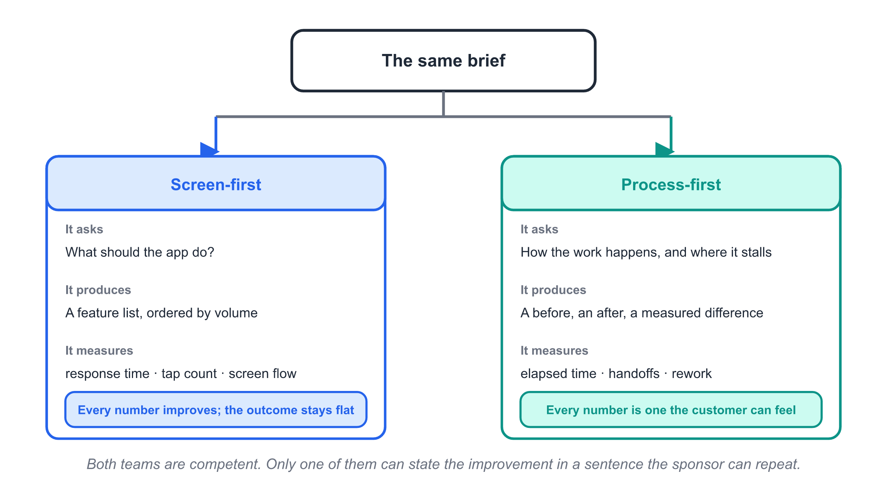
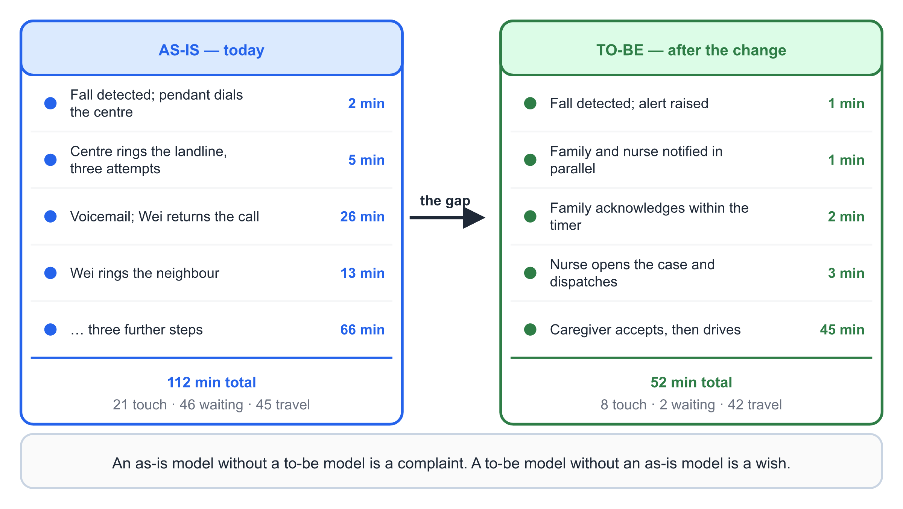
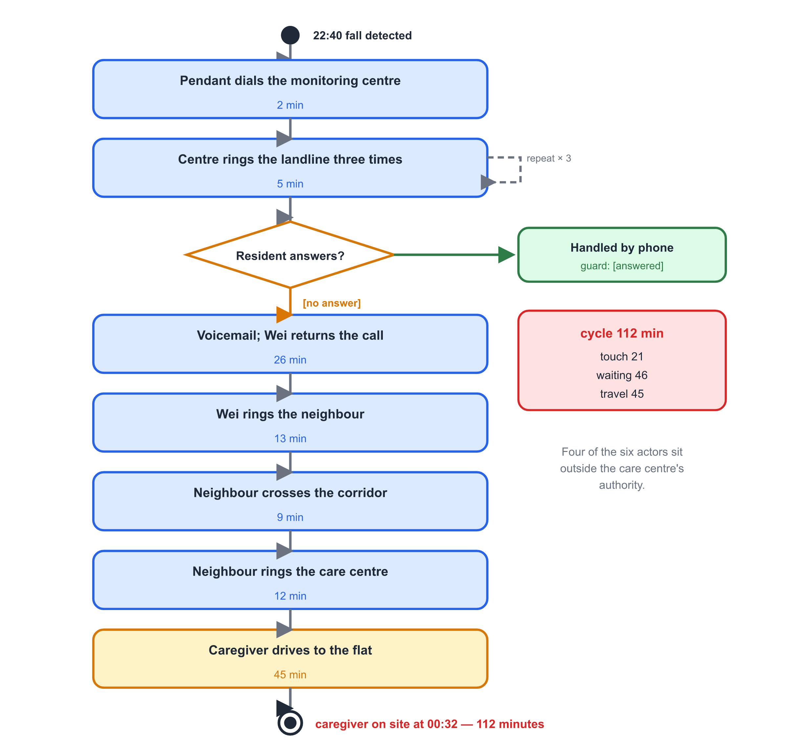
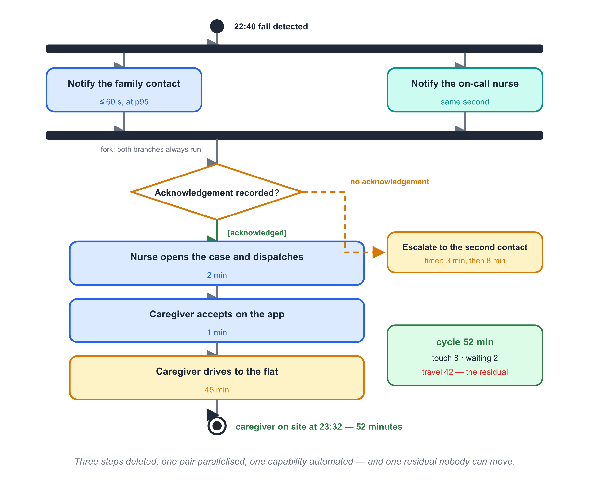
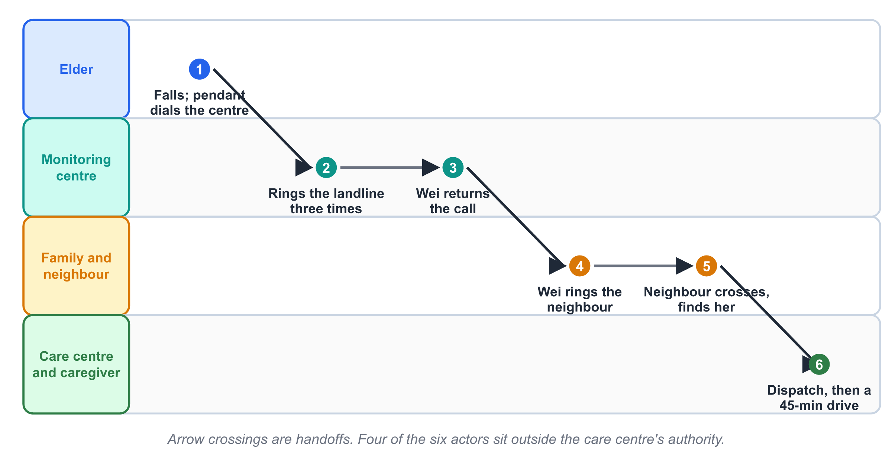
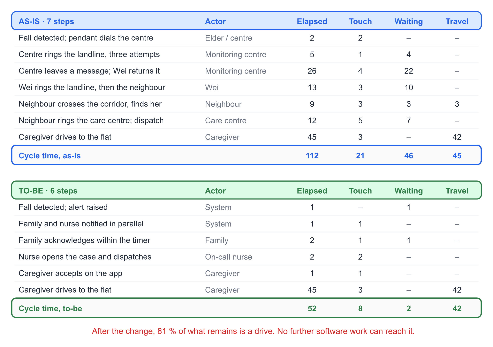
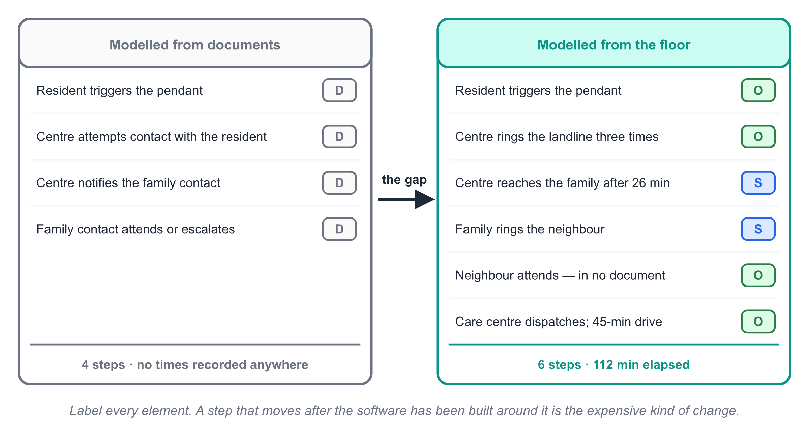
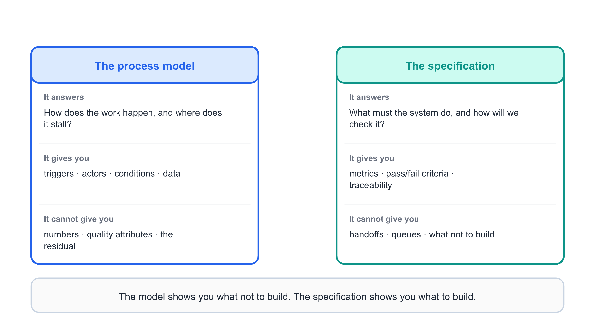
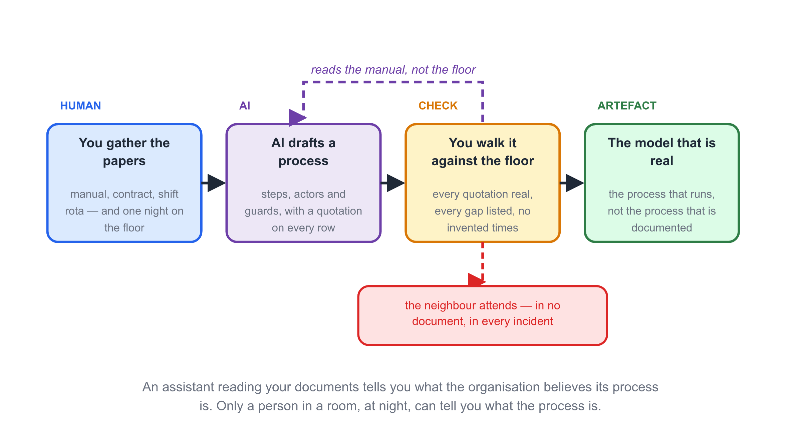

# Chapter 6 — Business Process Modelling

## Learning Objectives

By the end of this chapter you will be able to:

1. Explain why a system that is technically correct but wrongly placed inside
   its business process still fails, and who pays for that failure.
2. Distinguish an as-is model, a to-be model and the *gap* between them, and
   say what each one is for.
3. Read and draw an activity diagram: initial node, action, decision with
   guarded branches, merge, fork, join and final node.
4. Add swimlanes to expose handoffs, and explain why handoffs — not
   activities — consume most of a process's elapsed time.
5. Measure a process with four numbers — cycle time, touch time, waiting
   time and transport — and account for every minute of a resident's wait.
6. Classify each step as value-adding, necessary non-value-adding or waste,
   and defend the classification to the person who performs the step.
7. Apply the four process moves in order — eliminate, simplify, parallelise,
   automate — and explain why automation comes last.
8. Label every element of a process model with its evidence status, and
   identify the steps that rest on an unsupported claim.
9. Derive requirements from a to-be model, and state which kinds of
   requirement a process model cannot give you.
10. Use an AI assistant to turn policy documents into a draft model, then
    find the places where the draft describes the *documented* process
    instead of the *real* one.

---

## Before You Read

Ten terms, ten lines. Read them once now; the chapter assumes all ten.

- **business process 业务流程** — a repeatable sequence of activities,
  performed by named actors, that produces an outcome somebody cares about.
- **as-is model 现状模型** — a model of how the work is done today, including
  the parts nobody is proud of.
- **to-be model 目标模型** — a model of how the work will be done after the
  change.
- **gap 差距** — the difference between the two. The gap, not the to-be
  picture, is what the project is funded to close.
- **activity diagram 活动图** — the UML notation for a process: activities,
  decisions, parallel branches, and who does what.
- **swimlane 泳道** — a horizontal band in an activity diagram that holds
  every activity performed by one actor.
- **handoff 交接** — the point where work moves from one actor to another.
- **cycle time 周期时间** — elapsed clock time from the start of the process
  to its outcome.
- **touch time 作业时间** — the part of the cycle during which somebody is
  actively working on the case.
- **value-adding 增值的** — a step that changes what the customer receives,
  does it right the first time, and that the customer would pay for.

## Opening Scenario

Chapter 1 told you about an alarm call that took too long. This is the same
call with a clock running.

Grandma Lin falls at 22:40 on a Tuesday. She is conscious, and she is lucky:
the pendant on her wrist still works. What follows takes place entirely
inside systems that were *working correctly*.

The pendant dials a monitoring centre in another province. The centre follows
its script: ring the residence, three attempts, ninety seconds apart. No
answer — the telephone is on the far side of the room. The centre then rings
the registered family contact. Wei is asleep with his phone on silent; the
call goes to voicemail, and he returns it twenty-six minutes later. He rings
the landline, gets nothing, and rings the neighbour. The neighbour walks
across the corridor, finds her on the floor, and rings the care centre. The
care centre dispatches the caregiver on shift, who drives forty-five minutes
across the river.

The caregiver reaches the flat at 00:32. One hour and fifty-two minutes.

Sit with the uncomfortable detail for a moment. Every actor did their job.
The pendant worked. The monitoring centre followed its procedure. Wei called
back as soon as he saw the notification. The neighbour came immediately.
Nobody was negligent, and the outcome was still nearly two hours.

Now put the team in the room. They have a specification with thirty-three
numbered requirements, a working prototype, and no explanation for why the
first field trial felt wrong. Mei prints the timeline above, tapes it to the
wall, and asks the only question that matters: *where were we planning to
make this faster?*

The answer, written on the whiteboard in the language of Chapter 5, was
"notification within 60 seconds" — R-014. And R-014 is a real improvement
that attacks twenty-five minutes out of a hundred and twelve.

The team had spent ten weeks optimising one step of a seven-step process.
They had never drawn the other six.

## Core Concepts

### 6.1 The Software Is a Participant, Not the Process

A software system almost never *is* the business process it serves. It is one
actor inside that process, and usually a recent one. The care centre's
process for handling an alarm existed for decades before CareLink; the
neighbour, the landline and the drive across the river all predate the
sprint.

This produces the single most expensive mistake in requirements work, and it
is a mistake of *framing* rather than of skill:

> **Key point.** A system cannot deliver an outcome the process around it
> loses. Team optimises what it can see, and it can only see its own
> software.

Two teams given the same brief diverge here:

- The **screen-first** team asks "what should the app do?" and gets a
  feature list. Its measurements are response times, tap counts and screen
  flows — all properties of the software, all improving while the outcome
  stays flat.
- The **process-first** team asks "how does the work happen, and where does
  it stall?" and gets a model with a before, an after and a measured
  difference. Its measurements are elapsed time, handoffs and rework — all
  properties of the *outcome*, all of them things a customer can feel.

The screen-first team is not lazy. It is doing the work it was asked to do,
measured by numbers it can obtain in an afternoon. The process-first team is
doing something harder: it is spending a week in other people's working
lives so that it can measure the right thing.

{width=15cm}

*Fig. 6-1. Two framings of the same brief. The screen-first branch produces work that is measurable and irrelevant; the process-first branch produces a measurement of the outcome.*

There is a second reason to model the business, and it is a commercial one.
A process model is the only artefact in requirements engineering that speaks
the language of the person funding the project. "The system shall notify the
family within 60 seconds" is a promise about your software. "Time to a person
who owns the problem falls from 112 minutes to 7" is a promise about *their
business*, and it is the sentence that survives the review meeting where
budgets are cut.

### 6.2 Three Models, One Purpose: the Gap

Process modelling produces two pictures, and confusing them is why so many
process exercises end as decoration.

The **as-is model** describes the process as it actually runs today. Not as
the procedure manual says it runs — as it runs. It contains the workarounds,
the phone calls that are not in the system, and the neighbour who appears
nowhere in the care centre's documentation. The as-is model's job is to make
the cost visible: where the time goes, where the case changes hands, where
the same information is written down for the third time.

The **to-be model** describes the process as it will run after the change.
Its job is to be *specific enough to argue with*: which actor performs which
step, in what order, triggered by what, and with what guarantee.

The **gap** is the difference, and the gap is the product. Nobody buys an
as-is picture; they already live inside it. Nobody buys a to-be picture
either — that is a plan. What a sponsor approves is a claim of the form *this
specific change removes this specific cost*, and you cannot state that claim
without both pictures and a ruler.

{width=15cm}

*Fig. 6-2. The gap is the deliverable. An as-is model without a to-be model is a complaint; a to-be model without an as-is model is a wish.*

Two disciplines keep the pair honest.

**Model the as-is before you design the to-be.** Teams that skip the as-is
model reliably automate the wrong step, because the step that *looks* slow
from the outside is rarely the step that *is* slow. In the alarm call, the
visible drama is the fall; the actual cost is the twenty-six minutes during
which the case belonged to nobody.

**Do not let the to-be model describe the software you already planned to
build.** There is a strong pull towards drawing a to-be process that happens
to need exactly the features on your backlog. Use the as-is evidence as the
test: every step you keep in the to-be model must be there because the as-is
model showed it was needed, not because it was already specified.

> **Key point.** The as-is model is evidence. The to-be model is a design.
> The gap is the business case. Produce them in that order and refuse to
> produce them in any other.

### 6.3 Reading and Drawing an Activity Diagram

Three notations compete for this job: UML activity diagrams, BPMN, and the
value-stream map borrowed from manufacturing. They share a skeleton, and this
book uses **UML activity diagrams**, because they use the same vocabulary as
the use-case, class and state models of Chapters 7 to 9 — one notation to
learn instead of four.

The vocabulary is small. Six elements carry almost everything:

| Element | Drawn as | Means |
|---|---|---|
| Initial node | filled circle | where the process starts |
| Action | rounded rectangle | one step, performed by one actor, with a name that starts with a verb |
| Decision | diamond | a choice; every outgoing branch carries a **guard** in square brackets |
| Merge | diamond | branches that converge again; no guards |
| Fork / join | thick bar | branches that run *in parallel*; the join waits for all of them |
| Final node | ringed circle | the outcome — one per process, and it should name a result |

Two rules are worth committing to memory, because they catch most beginner
errors.

**Every decision branch needs a guard, and the guards must be exhaustive.**
A diamond with two outgoing arrows labelled `[alert raised]` and `[no alert]`
is correct. A diamond with one unlabelled arrow going right and one going
down is not a model; it is a drawing. The missing case is always the
interesting one — in the alarm process, the missing case was *the call
centre reaches nobody at all*, which is precisely what happened.

**Use a fork only for genuine parallelism, and always close it with a join.**
A fork means both branches run, always. In the to-be process, the family
notification and the on-call nurse notification do run in parallel, and that
parallelism is the whole design: it is what removes the twenty-six minutes.
Choose a decision when the paths are alternatives; choose a fork when they
are simultaneous. Getting this wrong is what makes a to-be model quietly
unbuildable.

Then come the labels that turn a diagram into an analysis. On every action,
write four things you will need later, in a corner or in a table beside the
model:

- **the actor** — who performs it;
- **the elapsed time** — how long the case sits there, not how long the work
  takes;
- **the input and the output** — the artefact that enters and the artefact
  that leaves;
- **the evidence label** — where the fact came from (see §6.7).

The first two are what make the model quantitative. Without them you have
drawn a process; with them you have measured one.

{width=15cm}

*Fig. 6-3. The as-is alarm call. The retry loop on the second step — ring, no answer, try again — is invisible in the care centre's procedure manual and costs five minutes every time.*

{width=15cm}

*Fig. 6-4. The to-be alarm call. Two steps are gone, one is parallelised, and the fork at the start is the design decision that removes the queue.*

Compare the two figures before reading on, and notice how little of the
change is software. The to-be model deletes the scripted landline check
because the wristband reports its own position. It replaces the serial chain
*centre → family → neighbour* with a fork, so both the family and the nurse
learn at the same second. It adds exactly one genuinely new capability — an
acknowledgement that is recorded, and a timer that escalates when no
acknowledgement arrives.

That last one is the whole system. Everything else in the to-be process could
be built with a telephone and better manners.

> **Key point.** In most to-be models, the step that carries the value is the
> one that closes the loop, not the one that detects the event. Detection is
> usually cheap; ownership is what is missing.

### 6.4 Swimlanes: Handoffs Are Where Time Goes

An activity diagram drawn as a single column of boxes answers "in what
order?". A **swimlane** — one horizontal band per actor — answers the more
useful question: "and who is holding it now?"

Redraw the as-is process with swimlanes and the shape changes. What looked
like a sequence of seven steps becomes a *zigzag*: Lin → monitoring centre →
Wei → neighbour → care centre → caregiver. Six actors, five handoffs, and
each handoff has the same anatomy.

A handoff costs three things, and only the first is obvious:

1. **A queue.** The receiving actor is busy, or asleep, or away from a
   screen. The case waits, and the wait is charged to the process, not to the
   person.
2. **A loss of context.** The neighbour learns that "she has fallen" and
   nothing about her medication, her mobility, or whether she has been
   admitted before. The monitoring centre knows all three and passes none of
   it, because the telephone has no fields.
3. **A new owner who must be convinced.** In the alarm call, nine minutes
   pass before the neighbour has established what has happened, and twelve
   more before the care centre has decided that this is theirs to dispatch.
   That conversation is pure process cost: it produces no care.

{width=15cm}

*Fig. 6-5. The same process as Fig. 6-3, redrawn with swimlanes. The arrow crossings are handoffs, and four of the six actors are outside the care centre's system boundary.*

There is a widely repeated claim that every handoff adds a fixed percentage
to a process — that the cost doubles, or rises by some memorable factor. You
will meet this claim in textbooks and in vendor decks, and it is worth
knowing how to treat it: as a hypothesis, not a law. Handoff cost depends on
queue length, on whether the receiving actor has the case's context, and on
whether they have an incentive to accept it. In this book, put the number on
the diagram where you can defend it, and mark the ones you cannot.

The practical rule that does survive scrutiny is structural rather than
numerical: **the more actors your process crosses, the more of its time is
outside your control.** CareLink's team counted six actors on the as-is
diagram and found that four of them — Lin, the monitoring centre, Wei, the
neighbour — were outside the care centre's decision-making. The system could
not make any of them faster. It could only change *how many times the case
had to change hands before it reached someone who could act.*

That is the design brief, stated in one sentence, and it is a sentence that
could not have been written before the swimlane was drawn.

### 6.5 Where the Time Actually Goes

A process model becomes an argument the moment you put numbers on it. Four
numbers do most of the work:

- **Cycle time** — elapsed clock time from start to outcome. This is what
  the customer experiences.
- **Touch time** — the part of the cycle during which somebody is actively
  working on the case.
- **Waiting time** — the case sits in a queue, a batch, a voicemail or a
  sleep. Nobody is doing anything, and the clock is still running.
- **Transport time** — the case is physically moving between places. It is
  neither work nor waiting, and folding it into either is how a process
  analysis loses its own credibility.

With those four, every minute of the cycle is accounted for and nothing hides
in a residual. The arithmetic between them is the finding. In the as-is alarm
call the cycle is 112 minutes, and only **21** of those minutes are touch
time: nineteen per cent of the process is somebody actually working on the
case. Forty-six minutes are waiting — inbox, voicemail, sleep — and
forty-five are a person in a car. Eighty-one per cent of the process is a
case going nowhere, and nobody inside the process experiences that as cost,
which is exactly why nobody reports it.

The four mechanisms that produce waiting time are worth naming, because each
has a different remedy:

| Mechanism | What it looks like | The remedy |
|---|---|---|
| Queue | the case waits for a busy actor | add capacity, or remove the handoff |
| Batch | work accumulates and is done in a sitting | shorten the batch, or process singly |
| Rework | the case returns because something was missing | fix the input, not the loop |
| Blocked | the case waits for information | make the information travel with the case |

In the as-is alarm call, all four are present. The landline ring is a queue.
Wei's return call is a batch, done once when he wakes. The care centre is
blocked until somebody has physically confirmed what has happened. And the
last stretch is rework in the everyday sense: the address, the key-box code
and the care notes were known to the monitoring centre all along, and reach
the caregiver from nobody.

{width=15cm}

*Fig. 6-7. Cycle time, touch time, waiting and transport, step by step. The subtotal is what the project claims; the transport row is what it honestly cannot reach.*

Read the bottom of that table carefully, because it contains the most
important sentence in the chapter: **the final 42 minutes are a car.** After
every process improvement CareLink can achieve, the caregiver still has to
drive across the river. The software removed 60 minutes of the 112 and cannot
touch the rest — because the rest is a road.

This is not a failure. It is the model doing its job. A process model that
reports only improvement is a sales document; a process model that also
reports the floor is an engineering document. And the floor is actionable in
its own right: it tells the care centre that the next investment is a second
caregiver stationed east of the river, not a faster app.

> **Key point.** Report cycle time, and report the residual you cannot move.
> A model that claims an unqualified 100 % improvement is a model that will
> be audited by the first person who notices the floor.

### 6.6 Four Moves, in Order: Eliminate, Simplify, Parallelise, Automate

Process improvement has a canonical order of attack, and the order is not
arbitrary. Attempts out of order produce expensive software wrapped around
work that should not exist.

**Move 1 — Eliminate.** Ask of every step: *what would break if this step did
not happen at all?* If the answer is "nothing observable", the step is
candidate waste. In the alarm process, the scripted landline check exists to
establish that the resident is at home. Once the wristband reports its own
position, the check has no output that anything downstream uses. The team
deleted it. Deletion costs nothing and is the only intervention that improves
every metric at once — cycle time, touch time, and cost.

**Move 2 — Simplify.** For steps that must exist, reduce what they demand.
The care centre's dispatch step required a nurse to look up the resident's
address, key-box code and care notes in three systems. Simplifying it meant
one screen, built in a day, with no change to the process's structure.

**Move 3 — Parallelise.** Where two steps do not depend on each other, run
them together. This is where the fork in Fig. 6-4 came from: notifying the
family and notifying the on-call nurse are independent, and running them
serially was a design choice nobody had made on purpose. Parallelising
removed 26 minutes without adding a single feature.

**Move 4 — Automate.** Only now. Automation applied to a step that should
have been eliminated produces a faster version of a mistake, and it is the
hardest change to reverse because it comes with a maintenance obligation.
Hammer's 1990 argument — that re-engineering means obliterating work, not
mechanising it — has aged well precisely because the temptation has not.

Three practical tests decide whether a step is worth attacking at all:

- **The delete test.** Could this step disappear with no observable change to
  the outcome? → eliminate.
- **The parallel test.** Does this step depend on the previous one's output?
  If not, why is it serial?
- **The automate-last test.** Would automating this step make the process
  better, or merely make the current process faster? If the latter, go back
  to Move 1.

In the CareLink to-be model, three steps were deleted, one was simplified,
one pair was parallelised, and exactly one capability was automated. The
automated step — the acknowledgement timer — is the one that carries the
value. Three quarters of the improvement came from the first three moves,
none of which needed the software to be clever.

### 6.7 Evidence on the Model: Four Labels

A process model is a claim about how other people work, and most of its boxes
were drawn by someone who has never done the job. The discipline that keeps
the model honest is to label each element with where the fact came from.

Four labels cover the ground:

- **[O] Observed** — you watched it happen, or you read it from a system log.
  The strongest evidence, and the rarest, because observation is slow.
- **[S] Stated** — an actor told you, and you believe them. Weaker than
  observation for two reasons: people report the process as it is supposed to
  run, and they systematically underestimate the time their own steps take.
- **[D] Documented** — it appears in a procedure manual, a policy document or
  a contract. This is evidence about the *document*, not about the work.
- **[A] Assumed** — you put it in because you need a step there and nobody
  could confirm it. Legitimate, provided it is labelled and has a name
  attached to the job of confirming it.

The labels are not bureaucracy; they are the model's error bars. A to-be
model built entirely on `[D]` elements will be built to the documented
process and will fail against the real one, and it will fail in a way that is
very hard to diagnose, because everybody's paperwork will agree that the
system is correct.

{width=15cm}

*Fig. 6-6. The same model with evidence labels. The `[A]` steps are the ones that will move during construction — and moving a step after the software has been built around it is the expensive kind of change.*

The alarm call gives the labels their sharpest illustration. The care
centre's procedure manual — `[D]` — describes a four-step escalation:
resident, family, care centre, emergency services. The process that actually
runs, `[O]`, has seven steps, and the step that resolves every real incident
in the building is *the neighbour*, who appears in no document at all.

That gap between the documented and the observed process is not fraud or
negligence. It is normal. Procedures describe the process as designed;
people run the process as it has to work. Your job is to model the second
one, because that is the one your software will be dropped into.

> **Key point.** Model the process people run, not the process people
> document. Where you cannot tell the difference, label the element `[A]`
> and name the person who will confirm it.

### 6.8 From a Process Step to a Requirement

The to-be model is not a specification, and treating it as one produces a
system that is well integrated and incomplete. But it is the best source of
requirements you will ever have, because each to-be step hands you four of
the five components of a bounded requirement (§5.6) for free.

Take one step from Fig. 6-4: *Notified party acknowledges the alert.*

| Requirement component | Read off the model |
|---|---|
| Condition | when an alert is raised and a notification is delivered |
| Capability | record an acknowledgement, attributed to a named person |
| Actor / subject | the notified family contact or the on-call nurse |
| Trigger for the next step | no acknowledgement within the escalation interval |
| Metric | **not in the model** — must be decided by the Product Owner |

Four components free, one missing. The metric is missing because a process
model has no opinion about how long three minutes should be; it only records
that a timer exists. This is the general shape of the transfer: **the model
gives you triggers, actors, conditions and data; it does not give you
numbers, and it does not give you quality attributes at all.**

That second gap is the one teams forget. Nothing in a process diagram tells
you that the notification must arrive within 60 seconds at p95, that the
care notes must be encrypted at rest, or that the system must remain usable
on a two-year-old Android phone. Process models are blind to non-functional
requirements, and a project steered only by its process model will deliver a
logically perfect process that nobody can use.

{width=15cm}

*Fig. 6-9. Two artefacts, two questions. The model answers "how does the work happen?"; the specification answers "what must the system do?". Neither substitutes for the other.*

There is a third thing the model does not give you, and it is the most
useful: **the model shows you what not to build.** The as-is analysis
revealed that four of the six actors were outside the care centre's
authority. The system cannot make the neighbour walk faster or the monitoring
centre change its script. Any requirement asking CareLink to do so is a
requirement with a demoralised team on the other end of it.

So the to-be model sends work back to Chapter 5, and this is what happened
with CareLink. The escalation chain — R-021 in the specification — had been
written as a three-step timer triggered by "an unacknowledged alert". The
process model showed that the correct trigger is not the alert but the
*notification's delivery status*, which is a different event with a different
owner. R-021 went back for revision, and the process diagram went into the
specification's traceability appendix as the evidence for the change.

That is the relationship to aim for: not "the process model tells us what to
build", but "the process model tells us which of our requirements are
pointing at the wrong event".

### 6.9 When a Process Model Is Not Worth Drawing

Like every artefact in this book, the process model has a range, and it is
worth knowing where the edges are.

**Draw one when the outcome depends on several actors.** If the customer's
experience is assembled by three or more people or systems, the handoffs are
where your problem lives, and only a model will show them. This covers most
service processes and most enterprise systems.

**Draw one when you intend to claim an improvement.** Any business case that
promises to save time, money or incidents needs a before-and-after
measurement, and a process model with times on it is the cheapest honest way
to produce one.

**Skip it when the process has one actor and one step.** A build pipeline is
a process, but nobody is handing anything to anybody, and a diagram of it
would restate the code. Careful: the moment a human approves the deploy, you
have two actors and a queue, and the model earns its place.

**Stop drawing when the model stops changing decisions.** A model that has
been reviewed twice with no element moving is finished. Adding a third level
of sub-process detail to a process the team already understands is a way of
feeling productive without doing the work — and it is very common in teams
whose sponsor asked to see "the business view".

## CareLink in Action

The as-is model takes eleven days and produces an argument nobody expected.

**Day 1–3, observation.** Deng, the night-shift supervisor, arranges for a
student to sit in the monitoring room for two evenings. This is the cheapest
and least popular kind of evidence: nine hours of watching, during which
nothing happens for eight. It produces two alarm calls and, more usefully,
the timestamps from the call system.

The first finding is that the process has seven steps, not the four in the
manual. The call system's own logs show the scripted landline attempts, which
the manual describes as a single step. The second finding is the neighbour — who is
named in neither the manual nor the call logs, and who resolved both
incidents.

**Day 4–7, reconstruction and measurement.** The team rebuilds two real
incidents on the diagram with a stopwatch, and gets cycle times of 112 and 148 minutes, with touch times of 21 and 26.
Everyone present is surprised by the same number: the call centre's own scripted check consumes five minutes on
paper and is charged to the process as *five minutes of queue*, because the
ninety-second intervals are silence.

**Day 8–9, the gap.** The to-be model is drawn in a single afternoon, which
is normal — the hard part was the as-is. The changes are small and entirely
uncontroversial once the numbers are on the board: delete the landline check,
fork the notifications, add a recorded acknowledgement with an escalation
timer, and put the address and key-box code on the notification itself.

**Day 10, the argument.** The to-be model predicts a cycle time of 52
minutes. The care centre's operations manager reads it and says the number
is wrong: her contract commits to a response within 60 minutes from the
moment the centre is *notified*, and by her reading the new process has
already met it. Mei has to make a decision on the spot about which clock the
project is claiming improvement against — the resident's clock, starting at
the fall, or the centre's clock, starting at the notification.

She chooses the resident's clock, and writes down why. The centre's metric is
the one its contract uses, and the resident's metric is the one care is for.
Under the centre's clock, CareLink's improvement looks like seven minutes out
of fifty-seven — and on that reading the care centre was already inside its
contractual sixty. The resident had nonetheless been waiting for a hundred
and twelve. Under the resident's clock the same change is 112 minutes down to
52, which is fifty-four per cent of a person's wait.
The same change, two stories, and the choice between them is a decision that
belongs in the record, not in the head of whoever wrote the deck.

**Day 11, the honest residual.** The team adds the sentence that the
operations manager later quotes in a funding bid: *CareLink cannot reduce
this process below 42 minutes, because 42 minutes of it is a car.*

Two things happen after the model is finished, and both are worth reporting
as outcomes rather than side effects.

The care centre commissions the second east-side caregiver post. This was
not on anyone's roadmap; it fell out of a table cell that said "residual: 42 min (transport)". The process model found a staffing decision that no
software project was going to find, because nobody had ever written the
whole process down in one place.

And the specification shrinks. Three requirements on the backlog — a
supervisor notification feature, an automatic dispatch-to-nearest-caregiver
feature, and a care-centre script-check screen — are struck out as
*solutions to process steps the to-be model deletes*. Removing them is
recorded with the same ceremony as adding them, because a requirement
removed for a stated reason is a decision, and a requirement quietly dropped
from a sprint board is a future argument.

## AI Companion

> **This chapter's AI angle:** AI is genuinely fast at turning a stack of
> policy documents into a draft process model. That draft describes the
> process as *written*, which is exactly the process you must not model. The
> value is in the diff between the draft and the floor.

**1. What AI is good at here**

- Extracting candidate activities, actors and handoffs from procedure
  manuals, SOPs, service contracts and internal wikis, in minutes instead of
  days.
- Producing a first-draft activity flow with decision points and guards, in
  a notation you can edit rather than a paragraph you must re-read.
- Naming the gaps: asked explicitly to list "steps that the documents do not
  cover", a good model will surface the exceptions, the escalations and the
  informal workarounds — which is where your `[A]` labels belong.
- Rebuilding a model from a revised description, so that the cost of a
  what-if ("what if the family notification forks to the nurse?") falls to
  seconds and the team actually explores alternatives instead of defending
  the first one.

**2. Prompt pattern** (copy-paste)

> You are a business analyst. Below are policy and procedure documents for a
> care centre's alarm-handling process.
> Produce a draft activity diagram in text form, one line per element, with
> the columns: Step | Actor | Action (verb first) | Input | Output | Source
> (quote the document sentence) | Confidence (high/medium/low).
> Rules:
> - Model only what the documents state. Do not add a step because it is
>   obvious or conventional.
> - Where the documents are silent about who performs a step or what
>   triggers it, write "UNSPECIFIED" — do not infer.
> - End with a section headed "Not covered by these documents", listing every
>   exception path, after-hours case and escalation the documents omit.
> - Do not estimate times. Any duration in the output must be quoted from a
>   source or left blank.

**3. Verify before you trust**

- [ ] Every row's Source column contains a real quotation you can find in the
      document. A confident row with no sentence behind it is invented.
- [ ] The output has no invented times. Assistants fill empty duration fields
      with plausible numbers, and a plausible number in a process model
      becomes a business case.
- [ ] The "Not covered" section is non-empty. A document set that genuinely
      covers every exception and after-hours path is rare; an empty section is
      more likely to mean the assistant summarised than that it found none.
- [ ] No `UNSPECIFIED` row has been quietly resolved downstream. Those rows
      are your interview agenda, and they are the most valuable output.
- [ ] You have compared the draft against the observed process. The whole
      point is the difference — if the draft and reality agree completely, you
      have not modelled the real process.

**4. Typical AI failure in this chapter**

{width=15cm}

*Fig. 6-8. AI-assisted process extraction. The check is not whether the draft is well formed but whether it describes the process that runs.*

*Source:* the care centre's alarm-handling procedure (four pages, three
annexes), the monitoring-centre contract, and the shift rota.

*AI output:* a clean six-step flow — resident triggers pendant, monitoring
centre receives, centre attempts contact with resident, centre notifies
family contact, family contact attends or escalates, care centre dispatches
on request. Every row carries a quotation. It is, by the evidence, correct.

*What is wrong:* it is correct about a process that does not run. The draft
has no neighbour, because the neighbour is in no document. It has no rework
loop, because the manual describes the ninety-second retry as good practice
rather than as elapsed time. It shows the family contact as a step, which the
documents support, and misses that in both observed incidents the family
contact did not attend at all — a different actor, doing a different job, in
about the same place in the diagram.

The failure is not hallucination. This is the harder kind: the output is
faithfully derived from its sources, and its sources describe the process as
designed. Nothing in the pipeline is broken, and the artefact is still
unusable, because the team asked for a model and received a paraphrase of the
manual.

*The repair:* treat the draft as a **documented-process baseline** and label
all of it `[D]`. Then walk it against the observed timeline, element by
element, promoting what survives to `[O]` and marking what does not. In
CareLink the diff took forty minutes and produced three new process steps,
one deleted one, and the neighbour — who then appeared in the to-be model as
a *recipient* of the family notification rather than as an unmanaged
fallback.

> 🤖 **AI note:** an assistant reading your documents can tell you what your
> organisation believes its process is. It cannot tell you what your
> organisation's process is. Closing that gap requires a person in a room,
> at night, watching.

## Common Pitfalls

1. **Modelling the documented process.** The manual is a statement about
   intent, and the workaround is a statement about reality. A system built on
   the first will be integrated into the second by people who have no
   official way to record what they did. *Correction:* observe at least one
   real case end to end, and label every element `[O]`, `[S]`, `[D]` or
   `[A]`.
2. **Automating the step that is easiest to automate.** It is usually not
   the step that costs the most. In the alarm call the pendant's detection
   and the centre's dashboard were both easy to automate and together
   accounted for four of the 112 minutes. *Correction:* run the four moves in
   order and refuse to start at Move 4.
3. **A to-be model with no as-is evidence.** The to-be picture then describes
   the software the team already wanted, and every element of it will be
   defensible individually and wrong collectively. *Correction:* no to-be
   step without an as-is step that justifies it, recorded in the traceability
   appendix.
4. **Modelling the organisation chart instead of the work.** Swimlanes named
   after departments rather than actors produce a diagram that is tidy,
   accurate about reporting lines, and useless about handoffs. *Correction:*
   lanes are named after whoever actually does the step, including the
   neighbour, the volunteer and the temp.
5. **Claiming an improvement against the wrong clock.** "Notification within
   60 seconds" measured from notification against "help within 52 minutes"
   measured from the fall are two different claims, and choosing between them
   is a decision with an owner, not a presentational choice. *Correction:*
   name the clock in the model, and record who chose it.

## Guided Lab: Map One Real Process (45 minutes)

*In teams of three to five. Bring one process from your project case that
involves at least three distinct actors.*

| Minutes | Activity |
|---|---|
| 0–5 | **Pick and bound.** Name the process, its trigger and its outcome sentence. Write the outcome as something a person receives, not something the system outputs. If you cannot name three actors, choose another process. |
| 5–20 | **Draw the as-is.** One box per step, verb first. Add the decision diamonds and give every branch a guard. Then redraw with swimlanes, one per actor. Expect the second version to look nothing like the first; that is the point. |
| 20–28 | **Put numbers on it.** Beside each action write elapsed time and touch time. If you have no data, write your estimate and mark it `[A]`. Total both columns and compute the waiting share. |
| 28–35 | **Classify and attack.** Mark every step value-adding, necessary non-value-adding or waste. Then run the four moves in order: what can be deleted, simplified, parallelised — and only then, what should be automated. |
| 35–45 | **Draw the to-be and state the gap.** Redraw with your changes. Write one sentence of the form: *cycle time falls from X to Y; the residual Z we cannot move is ____.* Then list the requirements the to-be model hands you and the metrics it does not. |

*Expected output:* an as-is model with swimlanes and times, a to-be model, a
gap statement with an honest residual, and a classified list of what you
would delete before automating. Keep the as-is model — it is the evidence for
every process claim your project will make for the rest of the term.

## Language Focus

This week you must **map**, **measure** and **justify**. These three moves
carry every Chapter 6 assignment.

| Move | Pattern | Example |
|---|---|---|
| Map | **When** 〈trigger〉, 〈actor〉 〈verb-first action〉. **If** 〈condition〉, **then** 〈branch〉; **otherwise** 〈branch〉. | *When a fall is detected, the system notifies the family contact and the on-call nurse in parallel. If no acknowledgement arrives within the escalation interval, the system escalates to the second contact.* |
| Measure | **The cycle time is** 〈elapsed〉, **of which** 〈touch〉 **is touch time,** 〈waiting〉 **is waiting and** 〈transport〉 **is travel.** **The residual we cannot move is** 〈floor〉 **because** 〈reason〉. | *The cycle time is 112 minutes, of which 21 is touch time, 46 is waiting and 45 is travel. The residual of 42 minutes cannot be reduced by any system change.* |
| Justify | **This step exists because** 〈evidence label〉. **Removing it would change** 〈observable outcome〉. | *This step exists because the procedure manual requires it `[D]`; removing it would change nothing any downstream step reads, so it is waste.* |

Two notes on the vocabulary that carries these patterns. **Actor** means
whoever performs the step, never the department that owns it — the word
choice is the difference between a model of the work and a model of the
org chart. And **elapsed** versus **touch** must never be blurred: writing
"the step takes five minutes" when the five minutes are three rings and two
minutes of a nurse's attention is how a process hides four minutes per
incident. Say which clock you mean, every time.

Notice, too, that the Justify pattern forces an evidence label into the
sentence. That is deliberate. A sentence that cannot carry a label —
"I think this step is needed" — is not a justification; it is a hesitation,
and it belongs on the interview agenda rather than in the model.

Three short exercises (answers in the instructor's manual):

1. Write the guard conditions for a decision where a monitoring centre
   cannot reach the resident, ensuring the branches are exhaustive.
2. Rewrite as a gap statement: *The app will notify the family faster, which
   should make the process better.*
3. Label each with `[O]`, `[S]`, `[D]` or `[A]`: (i) the nurse says dispatch
   takes about ten minutes; (ii) the contract requires a 60-minute response;
   (iii) the call log shows 26 minutes between notification and call-back;
   (iv) somebody must check the flat number before dispatch.

## Summary and Key Terms

- A system is a **participant** in a business process, not the process. A
  correct system in the wrong place produces a correct contribution and a bad
  outcome.
- **As-is, to-be and the gap.** The as-is model is evidence, the to-be model
  is a design, and the gap is what gets funded. Produce them in that order.
- An **activity diagram** needs six elements: initial node, action, decision
  with exhaustive guards, merge, fork and join, final node. Every action is
  labelled with actor, elapsed time, input, output and evidence.
- A **swimlane** redraw exposes handoffs — the points where a case queues,
  loses context and acquires a new owner who must be convinced.
- Measure a process with **cycle time, touch time, waiting time and
  transport**. In the CareLink alarm call only 21 of 112 minutes were touch
  time; 46 were waiting and 45 were travel.
- **Report the residual you cannot move.** In the alarm call, 42 minutes are
  a car, and saying so is what makes the rest of the claim credible.
- Attack in order: **eliminate, simplify, parallelise, automate.** Automation
  applied to a step that should not exist produces a faster mistake with a
  maintenance contract.
- Label every element `[O]` observed, `[S]` stated, `[D]` documented or `[A]`
  assumed. Model the process people run, not the process people document.
- A to-be model supplies **triggers, actors, conditions and data** — four of
  the five parts of a bounded requirement. It supplies no **numbers** and no
  **non-functional requirements**.
- A process model also tells you what **not** to build, and it is the only
  requirements artefact that speaks in the sponsor's language.
- AI drafts a process model from documents in minutes — and the draft is the
  *documented* process, which is precisely the one you must not model.

**Key terms:** business process 业务流程 · as-is model 现状模型 · to-be model
目标模型 · gap 差距 · activity diagram 活动图 · swimlane 泳道 · handoff 交接 ·
cycle time 周期时间 · touch time 作业时间 · waiting time 等待时间 ·
transport time 转运时间 ·
queue 排队 · rework 返工 · value-adding 增值的 · necessary non-value-adding
必要非增值 · waste 浪费 · eliminate / simplify / parallelise / automate
消除 / 简化 / 并行 / 自动化 · evidence label 证据标签 · documented process
文件化流程 · residual 不可压缩余量 · process owner 流程负责人

## Exercises

**(a) Concept checks**

1. Explain in two sentences why a system can be technically correct and still
   fail, using one example from your own project.
2. A decision diamond has one outgoing branch labelled `[resident answers]`
   and one unlabelled. State what is missing and why it matters, using the
   alarm call as your example.
3. Name the four process moves in order, and explain why automating first is
   the expensive mistake rather than merely the inefficient one.
4. Distinguish the two clocks in exercise 3 of the Language Focus section,
   and state who should decide which one a project claims improvement
   against.

**(b) Analysis problems**

5. Draw an as-is activity diagram for a process you know well:
   registering for a course, ordering a prescription, getting a laptop
   repaired. Include swimlanes, guards on every decision, and one rework
   loop. Then mark every step value-adding, necessary non-value-adding or
   waste.
6. For the process in question 5, put an elapsed time and a touch time on
   each step, total them, and compute the waiting share. Then write the
   sentence: *the residual we cannot move is ____ because ____.* If you
   cannot state a residual, you have not finished measuring.
7. A process has seven steps across four actors: 3, 12, 4, 41, 9, 2 and 6
   minutes elapsed, with touch times of 2, 3, 4, 5, 9, 2 and 6. Identify the
   single step that dominates, say whether it is a queue, a batch, rework or
   a block, and propose the cheapest intervention among the four moves.
8. Redraw the CareLink as-is model with the assumption that Wei's phone is
   not on silent and he answers on the second call. Recompute the cycle time.
   Then state what this does to the project's business case, and why a
   process model must not be built on the best case.
9. Take three requirements from your project and, using §6.8, state for each
   which component the process model can supply and which it cannot. Then
   identify one requirement you now believe is pointed at the wrong event.

**(c) AI-augmented tasks** — *graded on your critique, not on your prompt*

10. Find two documents that describe a process — a course regulation, a
    service-level agreement, a lab manual. Run the prompt pattern of §6.2 on
    them. Then: (i) count how many rows carry a quotation you can actually
    locate; (ii) count how many rows say `UNSPECIFIED`; (iii) read the "Not
    covered" section and mark which items you know to be real; (iv) state
    which rows you would need to observe before promoting to `[O]`.
11. The assistant's draft in question 10 almost certainly contains no
    invented times, because the prompt forbade them. Remove that prohibition,
    run it again, and compare. Report (i) how many durations appeared,
    (ii) which of them quoted a source and which did not, and (iii) what
    would have happened to your business case if you had accepted the first
    draft without checking.

**(d) Running Project Task 6 — due Week 7**

Take one end-to-end process from your project case that involves at least
three actors. Deliver four artefacts, together at most four pages.

1. **As-is activity diagram** — with swimlanes, guards on every decision, and
   at least one rework or exception loop. Label every element `[O]`, `[S]`,
   `[D]` or `[A]`, and name the person who will confirm each `[A]`.
2. **Measured cycle time** — a table of steps with elapsed time and touch
   time, the total, the waiting share, and one sentence naming the residual
   you cannot move and why.
3. **To-be model and gap statement** — the redrawn process, plus one sentence
   of the form *cycle time falls from X to Y; the residual Z is ____*. Record
   which of the four moves each change belongs to.
4. **Process-derived requirements** — at least five requirements read off the
   to-be model, each showing which components came from the model and which
   you had to decide. Mark the non-functional requirements the model could
   not give you and note where you will get them.

Finally, write one paragraph answering: *which step did you most want to
automate, and what did the four moves in order tell you to do instead?*
The gap between your instinct and the sequence is the lesson of this
chapter.

---

### References

- Object Management Group, *Unified Modeling Language (UML), Version 2.5.1*,
  formal/2017-12-05, 2017 — activities, swimlanes and the token semantics
  behind fork and join.
- Object Management Group, *Business Process Model and Notation (BPMN),
  Version 2.0*, formal/2011-01-03, 2011 — the heavier-weight alternative, and
  worth knowing before you commit to a notation.
- Hammer, M., *Reengineering Work: Don't Automate, Obliterate*, Harvard
  Business Review, July–August 1990 — the origin of the eliminate-first
  argument of §6.6.
- Rother, M. and Shook, J., *Learning to See: Value-Stream Mapping to Create
  Value and Eliminate Muda*, Lean Enterprise Institute, 1999 — the
  value-adding / non-value-adding classification and its visual conventions.
- Hines, P. and Rich, N., *The Seven Value Stream Mapping Tools*,
  International Journal of Operations and Production Management, 17(1),
  1997.
- Little, J. D. C., *A Proof for the Queuing Formula: L = λW*, Operations
  Research, 9(3), 1961 — the relationship between queue length, arrival rate
  and waiting time; useful whenever you need to argue about capacity.
- Dumas, M., La Rosa, M., Mendling, J. and Reijers, H., *Fundamentals of
  Business Process Management*, 2nd edition, Springer, 2018.
- Sharp, A. and McDermott, P., *Workflow Modeling: Tools for Process
  Improvement and Application Development*, 2nd edition, Artech House, 2009 —
  the source of the four-labelled-evidence discipline in §6.7.
- Checkland, P., *Systems Thinking, Systems Practice*, Wiley, 1981 — the
  richer picture of a human activity system, and the reason a process model
  is always a simplification with an owner.

---

## Figure List (authoring aid, removed before build)

| # | Type | Caption | Alt text |
|---|---|---|---|
| 6-1 | T1 | Why model the business before the software | Two branches from "the same brief": screen-first, whose measurements are properties of the software, and process-first, whose measurements are properties of the outcome |
| 6-2 | T2 | As-is, to-be, and the gap | Three panels: current process, desired process, and the measured difference that is the actual deliverable |
| 6-3 | T3 | CareLink as-is: how an alarm call is handled today | Nine-step activity diagram with a rework loop on the scripted landline check and per-step elapsed times |
| 6-4 | T3 | CareLink to-be: the same call with the system | Activity diagram with deleted steps shown as removed, a fork for parallel notification and a recorded acknowledgement with an escalation timer |
| 6-5 | T3 | Swimlane view across elder, caregiver and care centre | Same process drawn across six actor lanes; arrow crossings mark handoffs and four lanes sit outside the system boundary |
| 6-6 | T4 | Process model with unsupported claims flagged | Identical as-is and to-be models annotated with `[O]`, `[S]`, `[D]` and `[A]`, showing which claims would move during construction |
| 6-7 | T6 | Cycle-time table: as-is versus to-be | Step table with elapsed, touch, waiting and transport time per side, with subtotals and the residual that cannot be moved |
| 6-8 | T7 | AI-assisted process extraction from policy documents | Human supplies documents to AI which drafts a flow, to a check against observed practice, to a validated model |
| 6-9 | T1 | Process model and requirements: what each answers | Side-by-side contrast: the model answers how work happens, the specification answers what the system must do, with the components each supplies |
