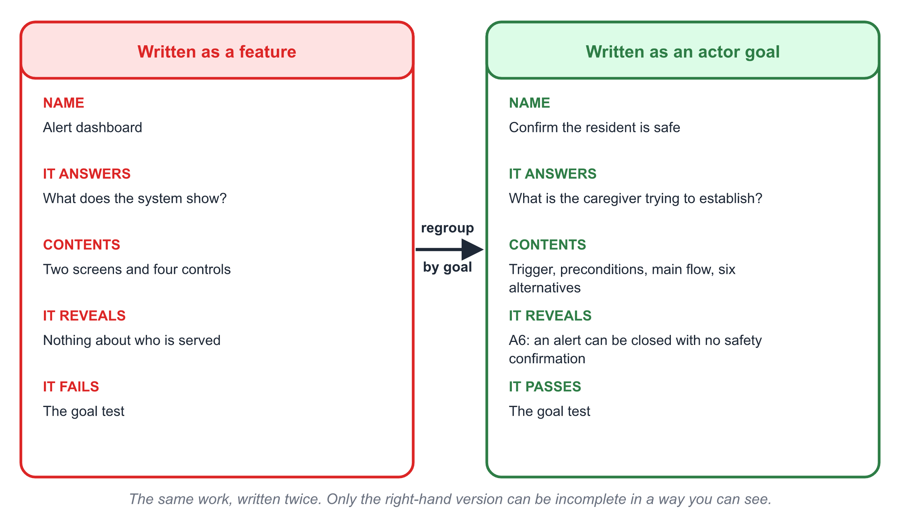
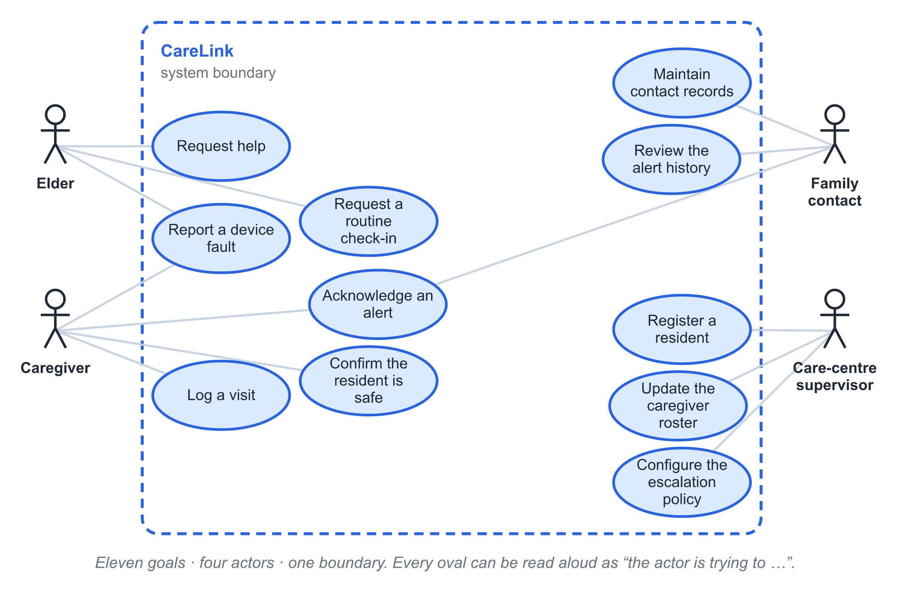
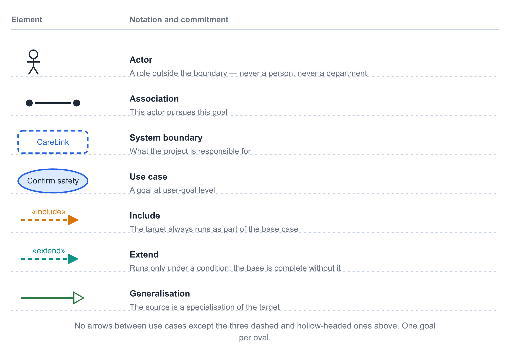
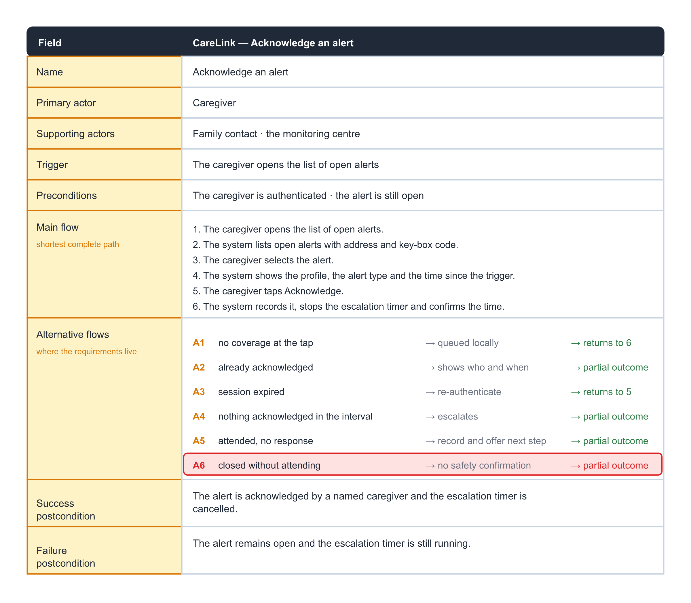
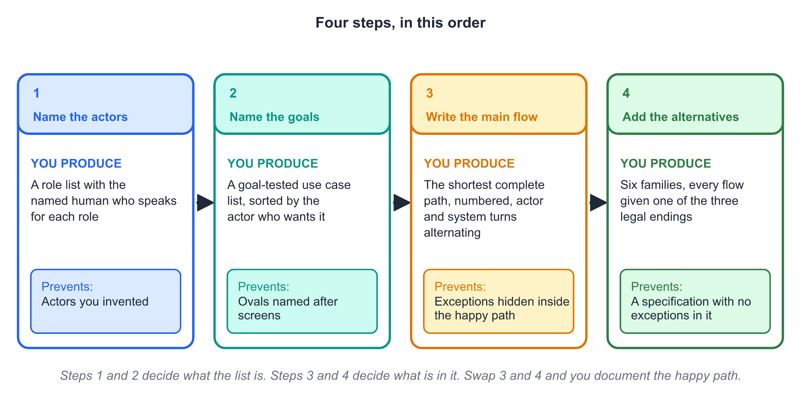
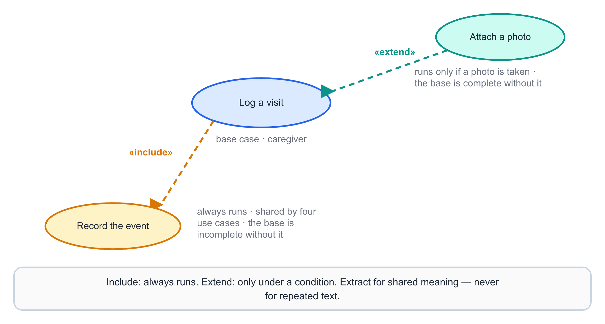
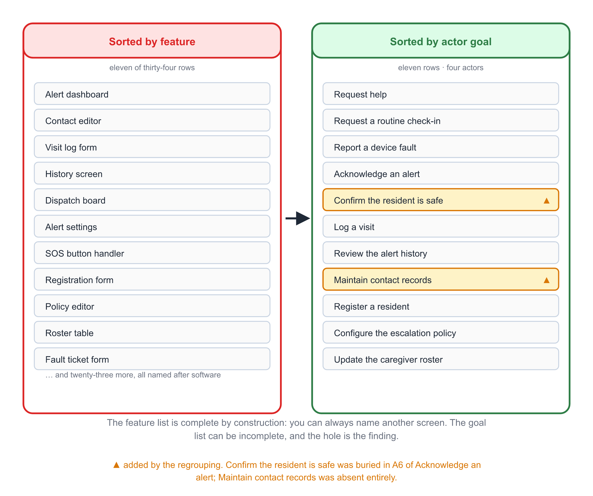
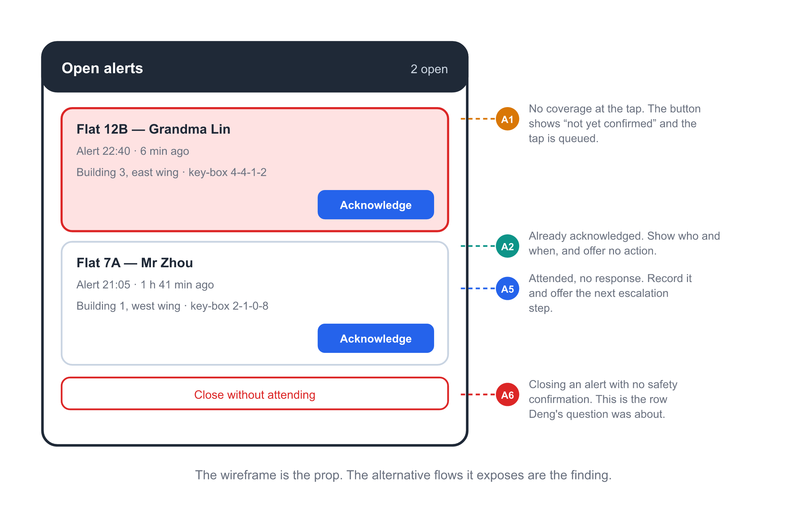
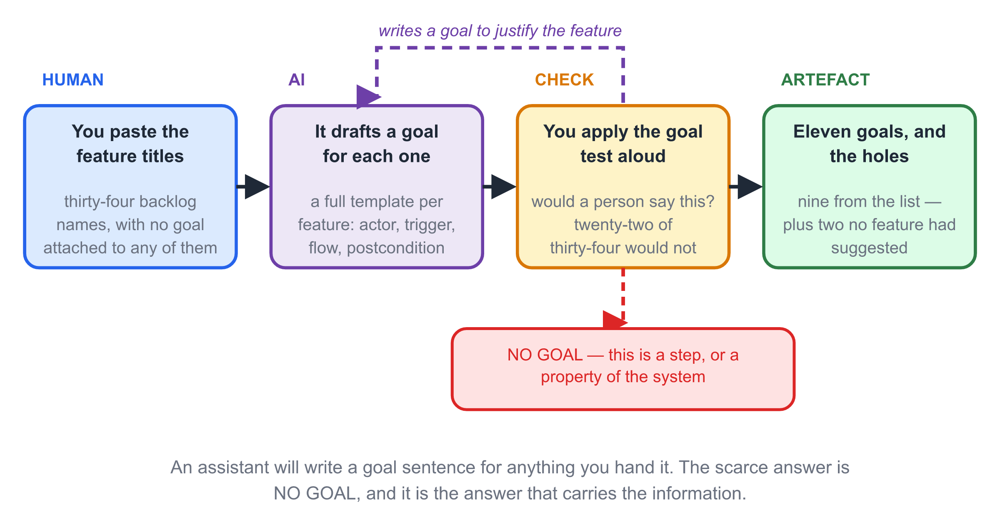

# Chapter 7 — Use Case Modelling

## Learning Objectives

By the end of this chapter you will be able to:

1. Distinguish a goal from a feature, and apply the goal test to any proposed
   use case name before you write a word of description.
2. Define the system boundary for your project, and state what moving one
   element across it costs the people who are left outside.
3. Identify actors as roles rather than people or departments, separate primary
   from supporting actors, and explain why the system is never its own actor.
4. Read and draw the seven elements of a use case diagram: actor, association,
   system boundary, use case, include, extend and generalisation.
5. Fill a use case description — name, actors, trigger, preconditions, main
   flow, alternative flows, success and failure postconditions — for one real
   case in your project.
6. Write a main flow as the *shortest complete* path to the goal rather than
   the typical one, and locate the requirements in the alternative flows.
7. Work the alternative-flow taxonomy — invalid input, actor unavailable,
   precondition false, external failure, timeout, cancellation — and record the
   families you decided cannot happen as well as the ones you wrote.
8. Choose between include and extend, and explain why a use case diagram must
   not be allowed to mirror your module structure.
9. Regroup a use case list by actor goal, and identify the goals that a
   feature-sorted list cannot show you are missing.
10. Use an AI assistant to draft a use case from a feature description, then
    find the exact place where it invented a goal to justify the feature.

---

## Before You Read

Ten terms, ten lines. Read them once now; the chapter assumes all ten.

- **use case 用例** — a goal that an actor outside the system pursues by
  interacting with it, together with the sequence of interactions that reaches
  that goal.
- **actor 参与者** — a role, played by a person, another system or a clock,
  that interacts with the system from outside its boundary.
- **system boundary 系统边界** — the line separating what the system is
  responsible for from what the surrounding organisation remains responsible
  for.
- **main flow 主流程** — the shortest complete path from trigger to a
  successful goal, with nothing going wrong.
- **alternative flow 备选流程** — a path that leaves the main flow because
  some condition did not hold.
- **include 包含** — a relationship for behaviour that *always* runs as part of
  the base case.
- **extend 扩展** — a relationship for behaviour that runs only under a
  condition, and whose base case is complete without it.
- **generalisation 泛化** — a relationship in which a specialised actor or use
  case inherits the behaviour of a general one.
- **goal level 目标层次** — the altitude at which a use case sits; a use case
  whose name describes a step is a step, not a use case.
- **postcondition 后置条件** — what is true once the use case has ended, stated
  separately for success and for failure.

## Opening Scenario

The review is going well until Deng asks a question.

Mei's team has spent two weeks on a use case diagram. Thirty-four ovals sit
inside one clean rectangle. Every actor in the care centre's organisation
chart has a place. The diagram is legible, consistent, and — as far as the
team is concerned — finished.

Deng is the night-shift supervisor. She has been quiet for forty minutes.
She asks: *at two in the morning my nurse opens the app and says she is going
to check on the old lady. She taps something, she does something, and twenty
minutes later she writes in the paper log that the resident is fine. Which of
those thirty-four is she doing?*

The team looks. The nearest oval is **View alert dashboard**. That is a
screen. The nurse's goal is to establish whether a person on the floor is
breathing.

Deng's question is not a request for another screen. It is the observation
that the diagram has been sorted by the wrong unit. Thirty-four ovals, every
one of them named after something the software does, and not one named after
something a person is trying to get done.

Both kinds of list are useful. Only one of them can be *incomplete in a way
you can see*, and that is the one this chapter is about. You can always name
another screen; the list of screens is complete by construction and therefore
tells you nothing about what is missing. You cannot always name another
human goal — and when you cannot, that silence is a finding.

## Core Concepts

### 7.1 A Use Case Is a Goal, Not a Feature

A use case is not a screen, a button, a class or a module. It is a goal that
somebody outside the system is pursuing, plus the conversation they have with
the system on the way to it.

The test is a sentence, spoken aloud:

> **Goal test.** Say: "〈actor〉 is trying to 〈use case name〉." If that
> sentence describes something a person would actually want, you have a use
> case. If it describes something the software does, you have a step.

Apply it to four candidates:

| Candidate name | Sentence | Verdict |
|---|---|---|
| Tap the SOS button | "The resident is trying to tap the SOS button." | A step. Nobody's goal is to tap. |
| Request help | "The resident is trying to get help." | A use case. |
| Enter a password | "The supervisor is trying to enter a password." | A step. The goal is to be recognised. |
| Confirm the resident is safe | "The caregiver is trying to establish that the resident is safe." | A use case, and — as you will see — one nobody had written down. |

The failure this table exposes is not a naming preference. A list of steps
cannot be incomplete, because there is always another button to describe. A
list of goals can be incomplete — and the hole is exactly where the project
is about to spend a term building the wrong thing.

There is a second axis, and it is the one that turns a plausible name into an
unusable one: **level**. The same activity can be described at three
altitudes.

- **Summary level.** "Live independently at home." Too high to be a use case:
  the system is not the actor who achieves it, and it is not achieved in one
  interaction.
- **User-goal level.** "Request help." This is the altitude a use case
  lives at: one actor, one sitting, one outcome the actor can tell you about
  afterwards.
- **Subfunction level.** "Confirm the address before dispatch." Too low: it
  is a step inside a goal, and it will be reached by several goals.

Most bad use case lists are not wrong; they are drawn at the wrong altitude.
Getting the altitude right usually merges a dozen ovals into two, and merges
are where the information comes from.

> **Key point.** The name of a use case is a sentence about a person, not a
> noun phrase about the system.

{width=15cm}

*Fig. 7-2. The same work, written twice. Only the right-hand version can be incomplete in a way you can see: the left column can always grow another row.*

### 7.2 Actors Are Roles, and the Boundary Is a Decision

An **actor** is a role that interacts with the system from outside it. It is
not a person, and it is not a department.

Not a person, because one person plays several roles and the system must
serve the role. Wei is the nominated family contact. At 2 a.m. he is also the
person whose phone is on silent. Those are the same actor with two different
outcomes, and the second outcome is an alternative flow — not a second actor
called "unreliable son".

Not a department, because departments do not tap screens. "The care centre"
is not an actor; the **care-centre supervisor** who configures the escalation
policy is. Actors drawn from the organisation chart produce a diagram that is
accurate about reporting lines and silent about work — the same error Chapter
6 warned about when it told you to name swimlanes after whoever performs the
step.

Three actor questions come up in every review.

**Is the system its own actor?** No. "The system validates the input" and
"The system logs the event" are not use cases; they are steps inside a use
case, or obligations that belong in the specification. An oval with the
system on both ends of the association is the most common way to fill a
diagram without deciding anything.

**Is a clock an actor?** Sometimes, as a *supporting* actor. A scheduled job
that produces the weekly report genuinely interacts with the system and
genuinely has no human on the other end — Chapter 5's R-033 is that case. But
a use case whose *only* actor is a timer deserves suspicion, and §7.9 shows
what happens in CareLink when the team tried it.

**Where is the boundary?** This is not a discovery, it is a decision, and it
is the most consequential one on the page. Every element you place outside
the boundary is an obligation you are handing back to a human being. In
CareLink the pendant is inside the boundary: the project is promising to
detect the press and route it. The neighbour is outside: the project is
promising to notify, not to manage who walks across the corridor. Chapter 6
put the neighbour in a swimlane because a process model must show the whole
process. Here she is deliberately absent, because a use case model shows what
the *system* is party to.

> **Key point.** The boundary is the promise. Draw it once, and record who
> owns the work you left outside it.

{width=15cm}

*Fig. 7-1. The CareLink use case model. Four actor roles, eleven goals, one boundary. Every oval reads aloud as “the actor is trying to …”; anything that does not is a step.*

### 7.3 The Anatomy of a Diagram

A use case diagram has seven elements and needs all seven to be readable:

| Element | Notation | What it commits you to |
|---|---|---|
| Actor | stick figure | A role outside the boundary that interacts with the system |
| Association | plain line, actor to use case | This actor initiates or participates in this goal |
| System boundary | rectangle | What the project is responsible for |
| Use case | oval | A goal at user-goal level |
| Include | dashed arrow, `«include»` | The target always runs as part of the source |
| Extend | dashed arrow, `«extend»` | The target runs only under a condition; the source is complete without it |
| Generalisation | solid arrow, hollow head | The source is a specialisation of the target |

Two constraints do more work than the notation.

**No arrows between use cases except the three above.** A solid line from one
oval to another, meaning "this one happens after that one", is the single
clearest sign that the diagram has become a flow chart. Sequence belongs in
the description and in Chapter 9's behavioural models; a use case diagram
shows who is served, not what happens next.

**One oval, one goal, one actor who wants it.** If two actors want the same
outcome, they share the oval and both are associated to it — that is what
"Search the catalogue" does for a customer and a librarian. If two actors
want different outcomes, they are different ovals however similar the screens
look.

The two classic cheats are worth naming, because both produce a diagram that
looks professional and carries no information. Cheat one is the system as its
own actor, described above. Cheat two is **include used as a call graph**:
the team extracts every step that appears twice into its own oval, and the
diagram slowly becomes a picture of the module structure. §7.6 gives the rule
that prevents it.

{width=15cm}

*Fig. 7-3. The seven elements and what each commits you to. The three dashed and hollow-headed arrows are the only arrows permitted between use cases.*

### 7.4 The Description, and Where the Requirements Live

The diagram is an index. The content is the description, and it has a fixed
shape:

| Field | What goes in it |
|---|---|
| **Name** | Goal-level verb phrase |
| **Primary actor** | The role whose goal this is |
| **Supporting actors** | Other roles or systems the case depends on |
| **Trigger** | The event that starts it |
| **Preconditions** | What must already be true; each one is a promise someone else must keep |
| **Main flow** | The shortest complete path from trigger to goal |
| **Alternative flows** | Every branch that leaves the main flow, and where each one ends |
| **Success postcondition** | What is true when the goal is reached |
| **Failure postcondition** | What is true when it is abandoned |

One field in that table is routinely got wrong, and it is the one that
decides whether the description is worth writing.

**The main flow is the shortest complete path, not the typical path.** If
you write the typical path — the one that usually happens, with the ordinary
fumbling included — you have hidden every exception inside a normative
sentence. When the resident's finger misses the button, or the phone is on
silent, or the network drops, the readers of your specification have no line
to point at and no way to say that they were not told.

**The alternative flows are where the requirements live.** A use case with
three lines of main flow and no alternatives is a feature with a name and a
fancier font. Count the alternatives instead; that number is the honest
measure of how much of the problem you have understood.

Every alternative flow must end somewhere specific, and there are exactly
three choices:

1. **Return to the main flow** at a named step, once the condition is
   resolved.
2. **End in failure**, leaving the failure postcondition true.
3. **End in a partial outcome** — the goal was not fully reached, but the
   system is in a state the actor must be told about.

An alternative flow that ends in none of these is a bug that has not been
reported yet.

Here is CareLink's **Acknowledge an alert**, at the length it was actually
written.

> **Main flow.** Precondition: an alert is open and the actor is authenticated.
> 1. The caregiver opens the open-alert list.
> 2. The system lists open alerts, newest first, with the resident's address
>    and key-box code.
> 3. The caregiver selects the alert.
> 4. The system displays the resident's profile, the alert type and the time
>    since the trigger.
> 5. The caregiver taps **Acknowledge**.
> 6. The system records the acknowledgement against the caregiver and stops
>    the escalation timer, and confirms the time to the caregiver.
>
> *Success postcondition:* the alert is marked acknowledged by a named
> caregiver, the escalation timer is cancelled, and R-021's escalation
> interval is no longer running.

> **Alternative flows.**
> **A1 — the acknowledgement does not reach the server** (no coverage at the
> moment of the tap). The system queues the acknowledgement locally and
> retries; the caregiver sees "not yet confirmed". *Ends:* returns to main
> step 6 when the queue clears.
> **A2 — another caregiver has already acknowledged the alert.** The system
> shows who and when, and offers no acknowledgement action. *Ends:* partial
> outcome.
> **A3 — the session has expired.** The caregiver re-authenticates; the
> alert context is preserved. *Ends:* returns to main step 5.
> **A4 — nothing is acknowledged within the escalation interval.** The
> system escalates to the next contact in the configured chain (R-021) and
> records the escalation. *Ends:* partial outcome; the original goal was
> never reached by this actor.
> **A5 — the caregiver arrives and nobody answers the door.** The caregiver
> records "attended, no response" and the system offers the next escalation
> step. *Ends:* partial outcome.
> **A6 — the caregiver closes the alert without attending.** *Ends:* partial
> outcome, and this row is the one Deng's question is about.

Two alternative flows in that list generated new requirements; one generated
a decision not to build; and A6 generated the finding described in §7.7. Hold
on to that.

{width=15cm}

*Fig. 7-4. The template filled for one CareLink case. The main flow is six steps with no recovery in it; the six alternative flows are where four new requirements came from.*

### 7.5 Writing One: Actors, Goals, Main Flow, Alternatives

Four steps, in this order.

**Step 1 — name the actors.** Roles only. Write down, beside each role, the
person who will speak for it when you need information. An actor with no
named human behind it is an actor you have invented, and its use cases will
be invented too.

**Step 2 — name the goals.** One sentence per actor per situation, and apply
the goal test to every one. Expect most of your first list to fail; in
CareLink twenty-two of thirty-four names described steps or screens.

**Step 3 — write the main flow.** Numbered, with every step alternating
between an actor action and a system response. That alternation is not
decoration: an unbroken run of system steps means the actor is not actually
in the loop and you are writing a function, not a use case.

**Step 4 — walk the alternative flows.** Use the taxonomy, and do it as a
checklist rather than as an act of imagination. Imagination produces the
exceptions you already know about; a checklist produces the families you have
never once thought about.

| Family | The question | CareLink example |
|---|---|---|
| **Invalid input** | What if the actor's input cannot be understood? | The resident's finger misses the pendant and presses it twice |
| **Actor unavailable** | What if the actor who must respond does not? | The family contact's phone is on silent (A4) |
| **Precondition false** | What if something we assumed was true is not? | The alert has already been closed by another carer (A2) |
| **External failure** | What if a system we depend on does not answer? | The SMS gateway times out at 3 a.m. |
| **Timeout** | What if nothing happens within the expected interval? | No acknowledgement within the escalation interval |
| **Cancellation** | What if somebody changes their mind? | The caregiver is recalled to a nearer case en route |

The sixth family is the one everybody forgets, and it is the one that
produces the worst bugs, because a cancellation arrives *after* the system
has already committed to a course of action. Writing "cancellation" on the
checklist makes the team ask what happens to the timer, the dispatch and the
notification that are already in flight.

The checklist has a second, equal output. For each family you may write
**"we decided this cannot happen, because…"** and record who decided it. That
sentence is a different artefact from silence. Six months later, when it
turns out that it can happen, the record tells you the decision was made
rather than forgotten.

{width=15cm}

*Fig. 7-5. Four steps, in this order. Steps 1 and 2 decide what the list is; steps 3 and 4 decide what is in it.*

### 7.6 Include, Extend, and the Temptation to Reuse

These two relationships cause more confusion than the rest of the notation
combined, and the confusion has a single cause: teams reach for them when
they want to avoid writing the same paragraph twice.

**Include** is for behaviour that *always* runs as part of the base case, and
that at least two use cases need. CareLink's **Record the event** is included
by four cases, because an audit requirement demands that every alert-state
change is logged whatever caused it. The fragment is not optional in any of
them, and that is what makes it an include.

**Extend** is for behaviour that runs *only under a condition*, and whose
base case is complete without it. **Attach a photo to a visit log** extends
**Log a visit**: a visit log with no photo is a finished visit log.

The rule that keeps a diagram honest:

> **Extraction rule.** Extract a fragment when its *meaning* is shared, not
> when its *text* is. If two use cases share a sentence but not a purpose,
> write the sentence twice.

The rule exists because of the second classic cheat introduced in §7.3. When
a team starts extracting shared steps, the use case diagram converges on the
class diagram: one oval per reusable behaviour, include arrows wherever one
oval calls another, and no information at all about who is served. The
symptom is a diagram where the ovals are all at subfunction level and most of
the arrows are includes. The cure is the goal test from §7.1, applied again,
in the knowledge that a diagram of include arrows will pass a casual reading.

There is one more confusion worth settling here, because CareLink got it
wrong in a review. **Escalation is not an extend.** When nothing is
acknowledged, the system escalates — but the escalation is not optional
behaviour of an otherwise complete case; it is the *timeout branch* of
**Acknowledge an alert**, and it belongs in A4. Modelling it as an extend
hides the escalation timer inside a parenthetical, and the timer is precisely
the thing R-021 makes a promise about. §7.9 generalises the lesson.

{width=15cm}

*Fig. 7-6. Include and extend on one base case. The include always runs and is shared; the extend is optional, and the base is complete without it.*

### 7.7 Grouping by Feature versus Grouping by Goal

The same eleven use cases can be sorted two ways, and the two sortings are
not equally useful.

Sort them **by feature** and you get a list that is complete by construction.
Every row names something the software does. If you cannot think of a tenth
row, you can always think of a screen.

Sort them **by actor goal** and you get a list that can be *incomplete*, and
whose holes are visible. For each row you can name the actor and the
situation: Wei, at 2 a.m., having just seen a notification. A feature row
gives you only the screen.

The test that separates them, applied to any row:

> **Situation test.** Name the actor and the situation. "The caregiver,
> arriving at a flat where nobody answers the door" is a situation. "The
> alert dashboard" is not.

When Mei's team applied the level test, the twelve survivors became nine use
cases across four actors. The nine were the first-pass list — and the first-pass
list was wrong. Putting it beside the thirty-four feature names and reading
across produced eleven:

| Use case | Primary actor | How it arrived | Release 1 |
|---|---|---|---|
| Request help | Elder | first pass | Must |
| Request a routine check-in | Elder | first pass | Could |
| Report a device fault | Elder, caregiver | first pass | Could |
| Acknowledge an alert | Family contact, caregiver | first pass | Must |
| Confirm the resident is safe | Caregiver | **regrouping — buried in A6** | Must |
| Log a visit | Caregiver | first pass | Should |
| Review the alert history | Family contact | first pass | Should |
| Maintain contact records | Family contact | **regrouping — absent entirely** | Must |
| Register a resident | Care-centre supervisor | first pass | Should |
| Configure the escalation policy | Care-centre supervisor | first pass | Must |
| Update the caregiver roster | Care-centre supervisor | first pass | Could |

The regrouping produced two findings, and they are different in kind.

**One goal was absent.** Nobody had written **Maintain contact records**. The
consequence was visible immediately: with no way to correct a wrong phone
number, the family would telephone the care centre and a supervisor would
edit a row in a spreadsheet — which is exactly the manual work the project
exists to delete. The feature list could not have shown this, because there
was no feature to be missing. The *goal* list showed it, because there was a
hole where a goal should be.

**One goal was buried.** **Confirm the resident is safe** existed already —
as the last clause of alternative flow A6, in the middle of another use case.
Deng's question at the review was about A6. A caregiver who closes an alert
without attending is making a judgement about a person's safety, and nothing
in A6's one line required her to record it, or prevented her from closing an
alert she had not verified.

The first finding is a hole. The second is a mis-filing, and mis-filings are
more dangerous, because the capability exists, passes every test the team
runs, and is invisible at exactly the altitude where decisions are taken.
Raising it to a use case changed the release plan: **Confirm the resident is
safe** became a Must, on the argument that a wrongly closed alert is worse
than a slow one.

> **Key point.** A feature list is complete by construction and therefore
> tells you nothing. A goal list can be incomplete, and the incompleteness is
> the finding.

{width=15cm}

*Fig. 7-7. Thirty-four features and eleven goals, side by side. The feature list has no holes because it can always grow another row; the goal list has two, and both became requirements.*

### 7.8 From Use Cases to the Specification

Use cases do not replace the specification. They organise it.

The connection runs through the alternative flows. Each alternative flow is a
branch the system must handle, so each one is either an existing requirement,
a new requirement, or a decision not to build. Sorting CareLink's six flows
for **Acknowledge an alert** gave:

| Flow | Outcome |
|---|---|
| A1 no coverage at the tap | New requirement **R-053** — local queue and retry with a visible unconfirmed state |
| A2 already acknowledged | New requirement **R-054** — show the acknowledging caregiver and time; suppress the action |
| A3 session expired | Absorbed into R-016 (authentication), no change |
| A4 escalation interval elapses | Covered by **R-021**, confirmed rather than changed |
| A5 attended, no response | New requirement **R-055** — record "attended, no response" and offer the next escalation step |
| A6 closed without attending | New requirement **R-056** — closing an alert requires a recorded safety confirmation |

Four requirements out of six flows, from one use case. That ratio is normal
for a first pass, and it is why the alternative flows are worth the trouble:
the team had spent two weeks on ovals and was about to produce a
specification with no A1, no A5 and no A6 in it.

The reciprocal check runs the other way, and it is the cheapest quality
control in requirements engineering:

> **Coverage check.** Every requirement must be filed under a use case, or
> under a documented reason why not.

A requirement that fits no goal is either a constraint, a non-functional
requirement, or work nobody asked for. CareLink's R-045 — export the last
thirty days as CSV — was a Could in Chapter 5's MoSCoW table that fitted no
goal at all, and the coverage check is what turned it from a plausible
feature into a question with an owner.

What a use case gives you, and what it does not:

| A use case supplies | A use case does not supply |
|---|---|
| The actor, the trigger and the goal | Numeric thresholds |
| The interaction sequence, in order | Non-functional requirements |
| The exception set, via alternative flows | The data model or the persisted state |
| Coverage: a place to file every requirement | Timing, concurrency or ordering guarantees between cases |

The right-hand column is why Chapters 8 to 10 exist, and why a specification
that consists of use cases alone is not a specification.

{width=15cm}

*Fig. 7-9. The wireframe used as the prop in the walkthrough. Every annotation on the right is an alternative flow the screen makes visible.*

### 7.9 When a Use Case Is the Wrong Tool

Use case modelling pays when the system's behaviour is dominated by
**somebody trying to get something done**. It pays badly when it is not.

**When few human goals exist.** A nightly reconciliation job, a batch
scoring pipeline, an algorithm-dominated component. These have triggers and
obligations but very few goals, and forcing them into ovals produces a
diagram that is a formality.

**When the interesting behaviour is state, not sequence.** A resident's
status — monitored, alerting, attended, resolved — determines what is legal
next, and a use case cannot state that without becoming a state machine by
another name. That is Chapter 9's job.

**When the interesting behaviour is data.** "What does the system know about
a resident, and how is it related?" is not a question about interactions.
That is Chapter 8's job.

**When nobody has the goal.** This is the CareLink case, and it is the one
worth remembering. The team tried once to draw **Escalate an unacknowledged
alert** as a use case. It had a trigger, a flow and a postcondition. The
argument in the review was about who owned the screen.

The problem was the actor. Escalation has no primary actor at user-goal
level. There is no person whose goal is to be escalated; the escalation is
the system discharging an obligation that R-021 imposes. A use case with the
system on both ends of the association is Cheat One from §7.3, and it
survived two weeks of review because the oval had a plausible name.

Mei's rule for the team, and it is the rule this chapter has been building
towards: **an obligation is not a goal.** Obligations live in requirements
and, where they fire because a step did not happen, in the alternative flow
of the use case that failed. Escalation became A4 of **Acknowledge an
alert**, the screen argument evaporated — there is no escalation screen;
there is a timer that fires when nobody acknowledged — and the discussion
that had consumed two weeks was replaced by a single line about an interval.

> **Key point.** If no actor has the goal, it is not a use case. It is a
> promise, and promises belong in the specification.

Finally, keep Chapter 6's boundary lesson in front of you. The process model
has the neighbour, the landline and the forty-two-minute drive across the
river, because a process model must account for a person's whole wait. The
use case model must not. Writing the neighbour as an actor would commit
CareLink to managing a person the project has no authority over, and every
use case derived from that actor would describe work the system cannot do.

A use case has one actor's goal. A process has several actors' goals in
sequence. Confusing the two is how a team arrives at a review with
thirty-four ovals and no answer to a supervisor's question.

## CareLink in Action

Four sessions, and the diagram gets smaller every time.

**Session 1 — the goal test, in public.** The team lines up thirty-four
names taken straight from the backlog's feature titles and reads each one
aloud inside the goal sentence. Twenty-two fail, and the failures cluster:
eleven are screens, seven are steps, four are properties of the system rather
than goals of an actor. Twelve survive, and applying the level test to those
twelve removes three more — two are subfunctions of goals already on the
list, and one is a summary-level ambition that no single interaction
achieves.

Nine use cases, four actors, one boundary.

**Session 2 — the boundary, and the escalation argument.** The team puts the
pendant inside the boundary and the neighbour outside it, and writes down who
owns the work that is now outside: the care centre, not the project. Then
somebody draws **Escalate an unacknowledged alert** with the system as its
own actor. It is the most confident-looking oval on the board. Under Mei's
rule it becomes A4 of **Acknowledge an alert**, and an argument that had run
for two weeks about who owned the escalation screen ends in a sentence about
an interval.

**Session 3 — the descriptions.** Nine templates, and the team is surprised
by where the time goes. **Request help** takes forty minutes: the main flow
is seven steps and the alternative flows take longer to write than the figure
they react to. **Acknowledge an alert** takes ninety, and produces the six
flows in §7.4, four of which immediately become requirements R-053 to R-056.

Two of the nine are still unfinished at the end of the session, and the
reason is on the record: both have a precondition nobody can confirm —
whether the health authority's rules permit an alert log to be stored outside
the province. That is Chapter 5's open question OQ-3, and it is now attached
to two use cases and four requirements, which is a good deal more visible
than it was as a footnote.

**Session 4 — the regrouping, and Deng.** The team puts the thirty-four
feature names and the nine first-pass goals side by side and reads across.
The feature list has thirty-four rows and looks finished. The goal list has a
hole where **Maintain contact records** should be, and a mis-filing where
**Confirm the resident is safe** is buried in A6 of **Acknowledge an alert**.

Deng, who asked the question at the review, ends up as the named human behind
the caregiver actor. She is asked to confirm the alternatives for **Confirm
the resident is safe**, and she strikes one out and adds two: a caregiver who
finds the flat empty, and a caregiver who finds the resident confused but
uninjured. Both are situations the paper log records every week and no
requirement had ever mentioned.

Three things are true at the end that were not true at the start.

The diagram is smaller: eleven ovals instead of thirty-four, one page instead
of five. The specification is larger: four new requirements, two goals added
to the list and one of them straight into release 1, and two more waiting on a
decision. And the team has stopped
treating the diagram as the deliverable. The nine descriptions are the
deliverable; the diagram is the index to them.

## AI Companion

> **This chapter's AI angle:** an assistant will produce a use case for every
> feature you name, because the shape of a use case is a shape it can fill.
> The failure is specific and worth learning to see: it writes a goal
> sentence that is grammatically fine and about nobody. Your job is the
> answer it will not give you — *no goal*.

**1. What AI is good at here**

- Turning a terse description into a structured template with every field
  filled, so that the blank fields become visible questions.
- Expanding a two-line description into a numbered main flow with actor and
  system turns alternating — mechanical work that costs a team an hour and an
  assistant seconds.
- Naming the alternative-flow *families* you did not think of. Run it as a
  checklist against your own list rather than as an author, and the two lists
  differ exactly where your blind spot is.
- Lifting step-level names to goal level. Give it the feature titles and ask
  for the actor's goal, and it will often find the right altitude — which is
  a fast way to see which names have no altitude at all.

**2. Prompt pattern** (copy-paste)

> You are a requirements analyst. I will give you a list of feature names
> from a backlog.
> For each one, do three things:
> 1. State the goal that an actor outside the system is pursuing. Write it as
>    "〈actor〉 wants to 〈goal〉". If no such sentence exists, write exactly
>    "NO GOAL — this is a step or a property of the system".
> 2. If a goal exists, fill this template: primary actor, supporting actors,
>    trigger, preconditions, main flow (numbered, alternating actor action
>    and system response), alternative flows, success postcondition, failure
>    postcondition.
> 3. List alternative flows under exactly these six headings: invalid input,
>    actor unavailable, precondition false, external failure, timeout,
>    cancellation. Under each heading write "none — reason:" rather than
>    leaving it out.
> Rules:
> - Do not invent an actor goal in order to justify a feature. If the only
>   sentence you can write is "the user wants to 〈feature name〉", answer
>   NO GOAL. NO GOAL is a valid and expected answer.
> - The main flow is the shortest complete path, not the typical path. Do not
>   include any recovery or retry in it.
> - Mark every threshold, duration or count as THRESHOLD TO CONFIRM. Do not
>   supply a number.
> - End with a section headed "Exceptions this description does not cover",
>   listing what you could not derive from the feature name alone.

**3. Verify before you trust**

- [ ] Every goal sentence passes the goal test out loud. "The caregiver wants
      to open the alert dashboard" passes grammar and fails the test; a
      dashboard is not a thing anybody wants.
- [ ] The output contains at least one NO GOAL. If every feature converted
      cleanly into a goal, you almost certainly pasted a list of goals rather
      than a list of features — check which list you gave it.
- [ ] No invented numbers. Assistants fill THRESHOLD TO CONFIRM fields with
      plausible values when the instruction decays, and a plausible
      thirty-second interval becomes a promise.
- [ ] The alternative flows are drawn from *your* description, not from
      generic software experience. Every assistant will produce "what if the
      network is down"; that is not a finding, and it should not crowd out A5
      and A6.
- [ ] The main flow does not quietly contain a recovery. A "retry" or
      "if that fails" inside the numbered main flow means the shortest path
      was not written.
- [ ] Compare the "Exceptions this description does not cover" section against
      the six families. Anything missing from both sections is a family the
      assistant skipped, not a family you decided against.

**4. Typical AI failure in this chapter**

{width=15cm}

*Fig. 7-8. AI-assisted use case drafting. The check is not whether the draft is well formed but whether the goal it names belongs to anybody.*

*Source:* the team's thirty-four backlog feature titles, pasted with the
prompt above.

*AI output:* thirty-four use cases, every one with a complete template. Two
are good. **Maintain contact records** and **Review the alert history** come
back with real goals because those features genuinely are goals. And then
there is this row:

> **Open the alert dashboard.** Primary actor: caregiver. Trigger: the
> caregiver taps the alert icon. Main flow: 1. The caregiver taps the alert
> icon. 2. The system displays the open-alert dashboard. … 6. The system
> highlights new alerts. Success postcondition: the dashboard is displayed.

*What is wrong:* every field is filled and no field is true. The goal
sentence — "the caregiver wants to open the alert dashboard" — is about the
software. The main flow is a restatement of the trigger. The success
postcondition is a statement about a screen, which is not a state any
caregiver cares about. And the row is not an anomaly: it is one of
thirty-two.

The failure is not hallucination and it is not laziness. It is the
straightforward consequence of asking for a shape and supplying the content
of a different shape. A use case has the form *actor → goal → flow →
postcondition*, and a feature name will fill that form with a goal that exists
only in order to justify the feature. Every one of those invented goals is
**true of the software and false of the user**, and each one hides exactly
one real goal behind it.

This is the chapter's counterpart to Chapter 5's decision disguised as a
translation and Chapter 6's documented process mistaken for the real one. The
three failures share a structure: the output is fluent, internally
consistent, and about the wrong entity.

*The repair:* the prompt already allows NO GOAL, so re-running it does not
help — the assistant is obeying, and the input is the problem. Run the
thirty-four rows through the goal test by hand and keep the ones that survive.
Then, for each name you reject, ask the question that actually recovers the
missing information: *what goal would have to exist for this feature to be
worth building?*

That question recovered **Confirm the resident is safe** from the dashboard
row, and it produced **Maintain contact records** — which was not hiding
behind any feature at all, because no feature pointed at it. The second is
the more valuable result and the harder one to get: an assistant can only
fail to find a goal that a feature suggests. It cannot tell you about a goal
that nobody wrote down.

> 🤖 **AI note:** an assistant drafting use cases is fast, fluent and never
> embarrassed. It will write a goal sentence for anything you hand it. The
> scarce skill is the opposite one — reading a description, finding the
> actor's real goal, and being willing to say that a feature has none.

## Common Pitfalls

1. **Naming use cases after screens.** "View alert dashboard", "Manage
   settings", "Export CSV" name software, not goals, and they fill a diagram
   without deciding anything. *Correction:* read every name inside the goal
   sentence, aloud, every time.
2. **The system as its own actor.** An oval with the system on both ends —
   "Validate the address", "Send the notification", "Log the event" — is a
   step or an obligation. *Correction:* if the only actor is the system, it
   belongs in the main flow or in the specification.
3. **Include used as a call graph.** Extracting every shared step collapses
   the diagram onto the module structure, and the inclusion arrows take the
   place of the design decisions you have not made yet. *Correction:* extract
   for shared meaning, and only when the fragment must run in every base case.
4. **A main flow with no alternative flows.** The description then documents
   the happy path and hides every requirement that matters. *Correction:*
   walk the six families as a checklist, and write "none — reason" for the
   ones you are rejecting.
5. **An obligation dressed as a goal.** Escalation, archiving, retention
   sweeps and reminders have no actor whose goal they are. *Correction:* an
   obligation lives in a requirement and fires in an alternative flow.
6. **Sorting the list by feature.** A feature list is complete by
   construction, so it cannot show you a hole. *Correction:* regroup by actor
   goal and apply the situation test to every row.
7. **Confusing the use case model with the process model.** The process model
   must contain the neighbour and the car, because it accounts for a whole
   wait. The use case model stops at the boundary. *Correction:* before
   drawing, write down what the project is promising and draw the line there.

## Guided Lab: From Features to Goals in 45 Minutes

*In teams of three to five. Bring your project case's feature list or backlog,
and one person who can speak for an actor you have not spoken to yet.*

| Minutes | Activity |
|---|---|
| 0–8 | **Goal test what you have.** Read every feature name aloud inside the sentence "〈actor〉 is trying to 〈name〉". Sort into three piles: goals, steps, and names that are really properties of the system. Expect most of your list to move — in CareLink, twenty-two of thirty-four. |
| 8–15 | **Name the actors as roles.** One line each, and beside each role write the human who will answer your questions. Any role with no named human is a role you invented; mark it and move it to the interview agenda. |
| 15–20 | **Draw the boundary, and write down what you left outside.** For each thing outside, name the person or organisation that stays responsible for it. If you cannot, you have moved an obligation onto nobody. |
| 20–33 | **Write one description properly.** Pick the goal with the most actors involved. Fill all nine fields. Keep the main flow to the shortest complete path and put every recovery in an alternative flow. Then walk the six families — all six, including cancellation — and write "none — reason" where you reject one. |
| 33–40 | **Regroup and hunt the holes.** Sort your goals by feature, then by actor goal. For each goal-sorted row, name the actor and the situation. Circle every place where the goal-sorted list has a hole the feature-sorted list does not. |
| 40–45 | **Convert and count.** Turn each alternative flow into a requirement, a decision not to build, or a question. Count them. Then apply the coverage check from §7.8: file every existing requirement under a goal. |

*Expected output:* a goal-tested actor list with a named human beside each
role, a stated boundary with named owners for what is outside it, one
complete use case description with all six alternative-flow families
accounted for, and two sorted lists side by side showing at least one hole
that only the goal sorting reveals.

Keep the goal-sorted list. It is the only artefact in this chapter that can
tell you what you have not thought of.

## Language Focus

This week you must **name**, **describe** and **close**. These three moves
carry every Chapter 7 assignment.

| Move | Pattern | Example |
|---|---|---|
| Name | **〈Actor〉 wants to** 〈goal verb phrase〉. **This is at** 〈goal level〉. | *The caregiver wants to establish that the resident is safe. This is at user-goal level: one actor, one situation, one outcome she could tell you about afterwards.* |
| Describe | **The main flow is** 〈n〉 steps **and contains no** 〈recovery / retry〉. **The shortest complete path runs** 〈step 1〉 **to** 〈step n〉. | *The main flow is six steps and contains no retry. The shortest complete path runs from opening the alert list to a recorded acknowledgement.* |
| Close | **Under** 〈family〉, **the flow** 〈diverges how〉 **and ends** 〈return to step n / in failure / in a partial outcome〉. | *Under external failure, the acknowledgement is queued locally and the flow ends in a partial outcome the caregiver is told about.* |

Three notes on the vocabulary these patterns force you to choose between.

**Goal versus feature.** The word *goal* belongs only to an actor. A goal
written from the system's side is a feature, and a specification full of
features is one that has never asked who is served. This is the same
discipline Chapter 5 imposed when it made you name the actor in a requirement
and the same one Chapter 6 imposed when it made you name the performer of a
step.

**Main versus alternative.** The word *main* does not mean *usual*. It means
*shortest and complete*. If you find yourself writing "normally the phone is
on silent", you have left the main flow without saying so, and the reader has
no line to point at when the promise is broken.

**Ends.** Every alternative flow needs an ending, and the three legal endings
— return, failure, partial outcome — are not interchangeable. An alternative
that ends in a partial outcome is telling the actor that something did not
finish, and the system therefore owes her a sentence. An alternative with no
stated ending is telling her nothing, which is how a specification produces a
bug report six months later.

Three short exercises (answers in the instructor's manual):

1. Apply the goal test and name the goal level: (i) Search for a resident by
   address; (ii) Tap **Acknowledge**; (iii) Manage the platform; (iv) Confirm
   the resident is safe.
2. Write the alternative flows for **Request a routine check-in** under the
   families *actor unavailable* and *cancellation*, giving each an ending.
3. Rewrite as a goal-level name, or state NO GOAL: (i) Alert dashboard;
   (ii) Enter the key-box code; (iii) Configure the escalation policy;
   (iv) Escalate an unacknowledged alert; (v) Show the resident's profile.

## Summary and Key Terms

- A use case is a **goal an actor pursues**, not a feature the system has.
  The goal test — "〈actor〉 is trying to 〈name〉" — is the whole discipline.
- **Goal level** decides usefulness. Summary-level ambitions and
  subfunction-level steps both fail, for opposite reasons.
- **Actors are roles**, not people and not departments. The system is never
  its own actor.
- The **system boundary** is a decision, and every element outside it is an
  obligation handed to a named human. Chapter 6's process model contains the
  neighbour and the car; the use case model must not.
- The diagram has seven elements, and two constraints: no arrows between use
  cases except include, extend and generalisation, and one goal per oval.
- The **main flow is the shortest complete path**, not the typical one. Any
  recovery inside it means the happy path was not written.
- The **alternative flows are where the requirements live.** In CareLink's
  **Acknowledge an alert**, six flows produced four requirements, one
  confirmed requirement, one decision not to build, and one redesign.
- Walk the **six families** — invalid input, actor unavailable, precondition
  false, external failure, timeout, cancellation — and record your rejections
  as decisions. **Cancellation** is the family everybody forgets, and the one
  that arrives after the system has already committed.
- Choose **include** for behaviour that always runs and has shared meaning;
  choose **extend** for behaviour that runs only under a condition. Extract
  for meaning, never for repeated text.
- Sort by **actor goal**, not by feature. A feature list is complete by
  construction and cannot show you a hole; a goal list can, and the hole is
  the finding.
- An **obligation is not a goal.** Escalation, retention and archiving belong
  in requirements and in the alternative flow of the case that failed.
- AI will draft a complete-looking use case for **every** feature you name,
  and the goal it invents will be true of the software and false of the user.
  NO GOAL is the answer that carries the information, and an assistant will
  rarely volunteer it.

**Key terms:** use case 用例 · actor 参与者 · primary actor 主参与者 ·
supporting actor 支持参与者 · system boundary 系统边界 · association 关联 ·
include 包含 · extend 扩展 · generalisation 泛化 · main flow 主流程 ·
alternative flow 备选流程 · goal level 目标层次 · user-goal level 用户目标层 ·
precondition 前置条件 · postcondition 后置条件 · trigger 触发器 ·
use case description 用例描述 · goal test 目标测试 · coverage check 覆盖检查 ·
actor goal 参与者目标 · obligation 义务

## Exercises

**(a) Concept checks**

1. Apply the goal test to five names from your own project's backlog, and
   state for each whether it is a goal, a step or a property of the system.
2. Explain in three sentences why a feature-sorted use case list cannot show
   you a missing goal, using CareLink's **Maintain contact records** as your
   example.
3. State the difference between include and extend using two use cases from
   CareLink, and explain what goes wrong when a team extracts every shared
   step.
4. Explain why the main flow must be the shortest complete path rather than
   the typical path, and what a specification loses when the two are
   confused.

**(b) Analysis problems**

5. Draw a use case diagram for a system you know: a library lending system, a
   course registration system, a hospital appointment system. Include the
   boundary, all actors as roles, and no more than ten use cases. Then apply
   the goal test to every oval and remove the failures.
6. Write a complete description for the most actor-heavy use case in
   question 5, with all nine fields. Then walk all six alternative-flow
   families and give every flow one of the three legal endings.
7. Take the six alternative flows you wrote in question 6 and classify each
   as an existing requirement, a new requirement, a decision not to build, or
   an open question. Then state which of the seven you would have missed if
   you had written only the main flow.
8. Sort your project's use cases two ways — by feature and by actor goal —
   and list every difference between the two lists. For each difference,
   state whether it is an absent goal or a buried one, and say which is
   harder to find and why.
9. Draw the boundary for your project and write a two-column table: inside
   the boundary, and outside it. For every row outside, name the person or
   organisation that remains responsible. Then identify one element of your
   diagram you now believe sits on the wrong side.

**(c) AI-augmented tasks** — *graded on your critique, not on your prompt*

10. Paste ten feature names from your project into the prompt pattern in this
    chapter's AI Companion.
    Then: (i) count how many rows came back as NO GOAL; (ii) apply the goal
    test yourself to every row that did not, and count the disagreements;
    (iii) pick the three worst goal sentences and write, for each, the real
    goal it is hiding; (iv) state which of the ten features you would now
    argue against building.
11. Take one row from question 10 that the assistant filled completely, and
    delete the alternative-flow section. Run the prompt again with the six
    families removed from the instructions, and compare. Report (i) how many
    families the assistant covered anyway, (ii) which family it never
    mentioned in either run, and (iii) what would have happened to your
    specification if you had accepted the first draft.
12. Give the assistant a use case name and no feature names at all — for
    example *Confirm the resident is safe* — and ask it to write the
    description from that goal alone. Then compare the alternative flows it
    produces against the ones your team derived from observations. State
    which list is longer and which one is right, and what that difference
    tells you about the division of labour.

**(d) Running Project Task 7 — due Week 8**

Take the process model from Running Project Task 6 and derive the use case
model for the part of it the system is party to. Deliver four artefacts,
together at most four pages.

1. **Actor list** — roles only, with the named human who speaks for each role
   beside it, and a stated system boundary. Below the boundary, list what you
   left outside and who remains responsible for it.
2. **Goal-tested use case list** — no more than ten use cases, sorted by actor
   goal. Mark the ones that failed the goal test and say which pile they went
   into. Then sort the same list by feature and mark every difference.
3. **One complete use case description** — all nine fields, main flow as the
   shortest complete path, and all six alternative-flow families accounted
   for. Each alternative flow ends by returning to a named step, in failure,
   or in a partial outcome. Every rejection of a family carries a reason and
   a name.
4. **Requirement conversion table** — one row per alternative flow, classified
   as an existing requirement, a new requirement, a decision not to build, or
   an open question. Then apply the coverage check: file every requirement
   from Running Project Task 5 under a use case, or state why it fits none.

Finally, write one paragraph answering: *which goal did the regrouping reveal
that the feature list could not have shown you, and who paid for its absence
while it was missing?* The name in that answer is the reason this chapter
exists.

---

### References

- Jacobson, I., Christerson, M., Jonsson, P. and Övergaard, G.,
  *Object-Oriented Software Engineering: A Use Case Driven Approach*,
  Addison-Wesley, 1992 — the origin of the notation and of the
  actor-goal framing.
- Cockburn, A., *Writing Effective Use Cases*, Addison-Wesley, 2001 — goal
  levels, the sea-level metaphor, and the template this chapter's §7.4
  follows.
- Cockburn, A., *Structuring Use Cases with Goals*, Journal of
  Object-Oriented Programming, 1997 — the argument for goals over functions
  that §7.1 condenses.
- Larman, C., *Applying UML and Patterns: An Introduction to
  Object-Oriented Analysis and Design and Iterative Development*, 3rd
  edition, Prentice Hall, 2004 — the essential-use-case and system-operation
  view that Chapters 8 and 9 continue.
- Constantine, L. and Lockwood, L., *Software for Use: A Practical Guide to
  the Models and Methods of Usage-Centered Design*, Addison-Wesley, 1999 —
  essential use cases and the rejection of the system as its own actor.
- Fowler, M., *UML Distilled: A Brief Guide to the Standard Object Modeling
  Language*, 3rd edition, Addison-Wesley, 2003 — the pragmatic reading of
  include and extend used in §7.6.
- Bittner, K. and Spence, I., *Use Case Modeling*, Addison-Wesley, 2002 —
  the alternative-flow taxonomy and the discipline of ending every flow.
- Object Management Group, *Unified Modeling Language (UML), Version 2.5.1*,
  formal/2017-12-05, 2017 — use case, actor, include, extend and
  generalisation, formally defined.
- Kruchten, P., *The Rational Unified Process: An Introduction*, 3rd
  edition, Addison-Wesley, 2003 — the use-case-driven process in which this
  notation originally lived.
- Alexander, I. and Maiden, N., eds., *Scenarios, Stories, Use Cases:
  Through the Systems Development Life-Cycle*, Wiley, 2004 — what use cases
  do and do not capture, and the honest limits of §7.9.

---

## Figure List (authoring aid, removed before build)

| # | Type | Caption | Alt text |
|---|---|---|---|
| 7-1 | T3 | CareLink use case diagram: eleven goals, four actors | Eleven ovals inside one system boundary, four actors associated to them, showing which goals each role pursues |
| 7-2 | T4 | Use case versus function: the same feature described both ways | Left: a feature title and a screen. Right: the same work written as an actor goal with trigger, flow and postcondition |
| 7-3 | T3 | The anatomy of a use case diagram | Labelled reference diagram showing actor, association, boundary, use case, include, extend and generalisation, each with a one-line rule |
| 7-4 | T3 | The use case description template, filled for Acknowledge an alert | Two-column template: field name beside the CareLink content, with the six alternative flows listed and each ending marked |
| 7-5 | T2 | Writing a use case: identify actors, name goals, write the main flow, add alternatives | Four-step sequence with the artefact produced at each step and the failure mode each step prevents |
| 7-6 | T3 | Include and extend in CareLink | Fragment diagram: one base case with an always-run include shared by four cases, and a conditional extend whose base is complete without it |
| 7-7 | T4 | The same work sorted by feature and by actor goal | Two sorted lists side by side; the goal-sorted list shows one absent goal and one buried goal that the feature list cannot reveal |
| 7-8 | T7 | AI-assisted use case drafting, with verification | Human supplies feature names to AI which drafts a goal and a flow, to a goal test against the actor's real intention, to a corrected use case |
| 7-9 | T5 | CareLink alarm screen, as a use case prop for review | Wireframe of the open-alert list and acknowledgement control, used in the walkthrough and annotated with the alternative flows it exposes |
