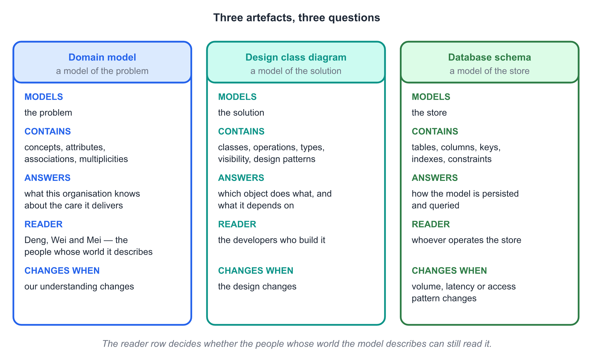
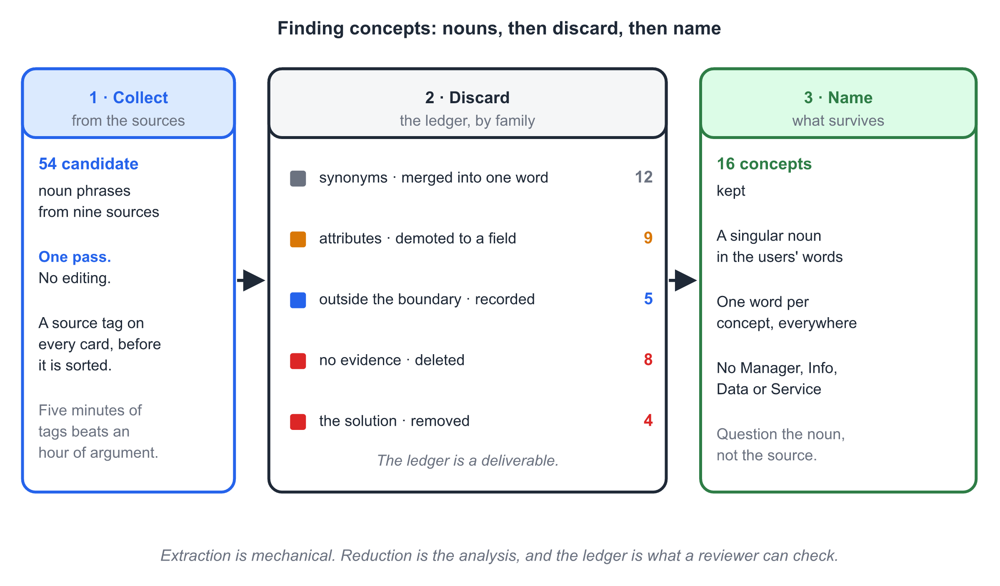
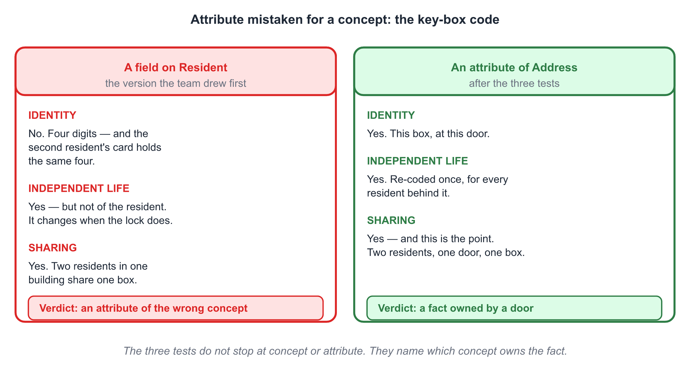
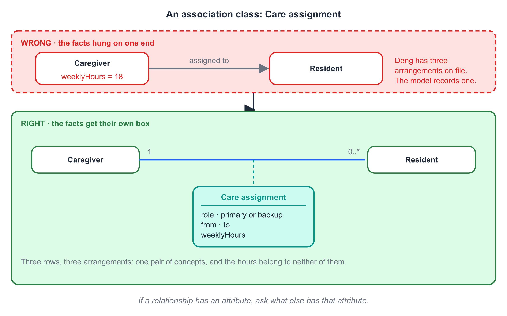
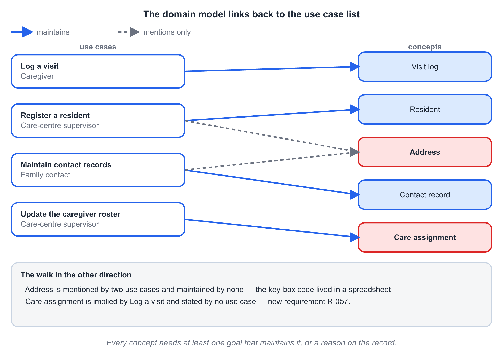
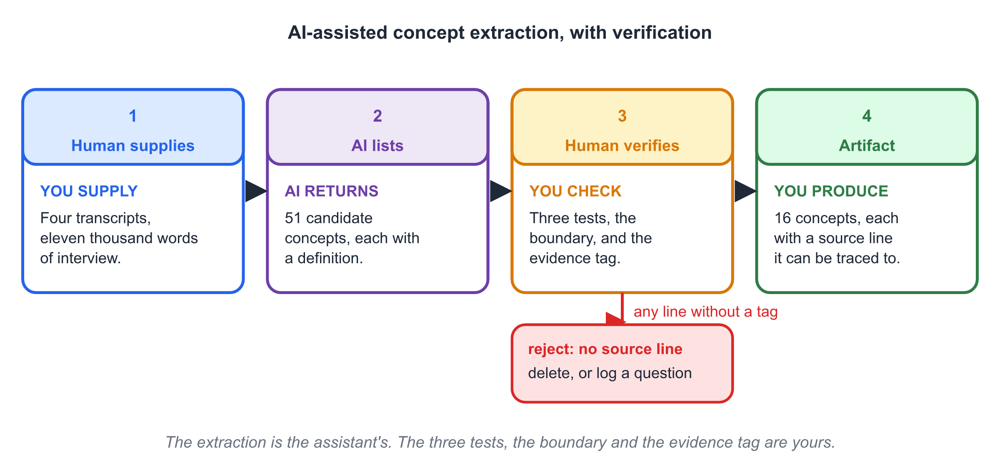

# Chapter 8 — Domain Modelling

## Learning Objectives

By the end of this chapter you will be able to:

1. Distinguish the domain model, the design class diagram and the database
   schema, and state what each one is a model of and who reads it.
2. Apply noun-phrase analysis to transcripts and documents, and reduce a
   candidate list by merging, demoting and rejecting rather than by intuition.
3. State the three tests — identity, independent life, sharing — that separate
   a concept from an attribute, and apply them to a word that could go either
   way.
4. Read and draw a domain model: concept, attribute, association, multiplicity,
   association end name, generalisation and association class.
5. Name association ends so a reader can tell which participant plays which
   role, and explain why a pair of concepts sometimes needs two associations.
6. Decide whether an association's own data deserves an association class or a
   full concept, and state the cost of getting it wrong.
7. Record the evidence behind every concept, and treat a concept with no
   evidence as a finding rather than as a detail.
8. Walk the model against the use case list in both directions, and state what
   each direction finds.
9. Use an AI assistant to extract candidate concepts from a description, then
   remove every attribute, duplicate and invented noun before the model is used.

---

## Before You Read

Ten terms, ten lines. Read them once now; the chapter assumes all ten.

- **domain model 领域模型** — a model of the concepts in the problem world,
  their attributes and their relationships, written in the users' vocabulary.
- **concept 概念** — a thing the organisation must remember something about,
  which has its own identity and its own history.
- **conceptual class 概念类** — the class symbol used to draw a concept. It
  carries a name, attributes and associations, and no operations.
- **attribute 属性** — a fact recorded about a concept, with no identity of its
  own outside the concept that holds it.
- **association 关联** — a relationship between two concepts that the
  organisation needs to remember.
- **multiplicity 多重度** — how many objects may take part at one end of an
  association, read in the direction of the other end.
- **association end name 关联端名** — the role written at one end of an
  association, read from the far end towards the near one.
- **association class 关联类** — a concept that exists only because two other
  concepts are related, and holds the facts about that relationship.
- **generalisation 泛化** — a relationship in which one concept inherits the
  identity, attributes and associations of a more general one.
- **ubiquitous language 统一语言** — one agreed word per concept, used by the
  users and the team in speech, in the specification and in the code.

## Opening Scenario

Piotr joins the team in March to build the persistence layer, and his first
request is a schema.

Mei's team has eleven use cases and thirty-seven numbered requirements, and —
as far as anyone can tell from the repository — no data model at all. So they
draw one. Two hours later there are thirteen boxes on the whiteboard and an
argument that will not close.

The argument is about a key-box code. Room 3B has a grey box on the wall
beside the door, it holds the flat key, and its four digits are the fourth
thing every caregiver asks for at two in the morning.

> "It is a field on the resident," says one.
>
> "It is a field on the address," says another. "Two of our residents live in
> the same building. They share a front door, and they share the box."
>
> "Then it is a field on the building."
>
> "There is no building box on the board."

Piotr, who has been quiet for an hour, says the sentence that ends the
argument.

*If it is a field, I know exactly how to store it. That is the problem. I can
store any of those four answers equally well, and three of them are wrong.*

Then he asks the harder question, and it is the one this chapter is about.
*Where did **Caregiver** come from? Is it a box because a caregiver is a thing
in the world, or because we needed somewhere to hang the hours?*

The team looks at the board again. **Caregiver** is there because Deng exists.
**Family contact** is there because Wei exists. **Supervisor** is there
because somebody configures the escalation policy. Three concepts, and the
people behind them will not sit still: Wei is also the nominated contact for
the neighbour upstairs, and Deng, who is a caregiver at two in the morning, is
the shift supervisor on Fridays.

The team spent ten weeks learning to ask *who wants this?* Chapter 7 taught
them to answer with a role. This chapter asks what a role is once you draw it
as a concept — and the answer is not obvious, because both answers are
drawable and only one of them survives contact with a person who changes job.

What follows has a shape worth stating at the start, because every mistake in
the chapter is a failure to hold on to it.

> **The domain model is a model of the problem, not of the database.**
>
> It is built from the words the users use. It carries no keys, no data types
> and no indexes. It is finished when the users can read it and find nothing
> missing — which is long before Piotr writes his first table.

## Core Concepts

### 8.1 Three Artefacts, Three Questions

Three artefacts are routinely confused, and the confusion is expensive in
different ways depending on which pair you mix up.

| | Domain model | Design class diagram | Database schema |
|---|---|---|---|
| **Models** | the problem | the solution | the store |
| **Vocabulary** | the users' words | the design's words | the platform's words |
| **Contains** | concepts, attributes, associations, multiplicities | classes, operations, visibility, types, patterns | tables, columns, keys, indexes, constraints |
| **Answers** | "what does this organisation know about?" | "which object does what?" | "how is this persisted and queried?" |
| **Reader** | Mei, Deng, Wei — and the team | developers | whoever operates the store |
| **Changes when** | our understanding changes | the design changes | volume, latency or access pattern changes |

Read the last two rows again, because they carry the argument. The domain
model's reader is **the person whose world is being modelled**, not a
developer. The moment a concept is named `RESIDENT_T` or carries a surrogate
key, that reader is gone, and so is the only cheap check the model will ever
get.

Three specific confusions, and what each one costs.

**Storing first.** If the team goes straight to tables, the key-box code
becomes a column on whichever table was drawn first. Nothing in the tool
complains. The error surfaces at two in the morning, when a caregiver is
given the code for the wrong box in a building with two front doors — in
production, as a support call, not in a review as a question.

**Modelling the software.** Concepts called `User`, `Session`, `Screen`,
`Database` or `AlertManager` are not concepts of the problem, they are pieces
of the answer. A domain model containing them is a design with the reasoning
removed. It reads fluently, which is why it survives review.

**Designing early.** Operations, visibility and types belong to Chapter 11 and
later. Putting them in the domain model means committing to a design before
the requirements are agreed, and it makes the model unreadable to the one
person who could tell you it is wrong.

One consequence of the first row deserves its own sentence, because students
argue about it every year.

> **A domain model has no surrogate keys — and real-world identifiers are not
> surrogate keys.**
>
> A wristband serial number is a fact about a device that exists in the world,
> printed on the casing, quoted in a support call. It belongs in the model. An
> auto-incrementing `resident_id` does not exist until a table does, and it
> belongs in the schema.

The distinction is not pedantry. A serial number is something the organisation
already knows and talks about; a surrogate key is something the storage
invented so that it could index. One is part of the problem, the other is part
of the answer.

{width=15cm}

*Fig. 8-1. Three artefacts, three questions. The middle row is the one that decides whether the model can be read by the people whose world it describes.*

### 8.2 Finding Concepts: Nouns, Then Discard, Then Name

A domain model begins as a pile of noun phrases. The technique is old, it is
mechanical, and it works better than brainstorming because it is answerable to
a source.

> **Noun-phrase analysis.** Go through the sources — interview transcripts,
> policy documents, the use case descriptions you already wrote — and take out
> every noun phrase that the organisation talks about as a thing.

Four rules make it usable.

**Rule 1 — one pass, no editing.** Collect first. Evaluating while collecting
is how a team ends up with the twelve concepts it already had.

**Rule 2 — keep the source beside every candidate.** Write the line tag next
to the noun. If nobody can produce the source, you have found an invented
concept within five minutes of finding it, and the cheapest possible moment to
deal with it is now.

**Rule 3 — expect to discard most of the list.** In CareLink, fifty-four
candidate noun phrases produced sixteen concepts. The discards are not
failures; they are the analysis, and they come in five families.

| Family | What it looks like | CareLink example | Where it goes |
|---|---|---|---|
| **Synonym / duplicate** | the same thing said twice | *shift*, *tour*, *rota* | merged under one word |
| **Attribute** | a fact about a thing | *heart-rate threshold*, *care level* | an attribute of a concept |
| **Outside the boundary** | a real thing the system is not party to | *ambulance*, *next of kin's employer* | recorded, with an owner |
| **No evidence** | the team's invention, tidying the model | *building*, *alert rule* | deleted, or logged as an open question |
| **The solution** | a piece of the software | *dashboard*, *session*, *manager* | removed; it is a design |

**Rule 4 — the discard list is a deliverable.** Keep it. Three of those five
families will be re-proposed in the next review by somebody who did not see
this one, and the list is what saves the argument from being re-run.

Then naming, which is where a model survives or dies. Four tests for a name:

1. **Singular noun, from the users' vocabulary.** *Resident*, not *residents*
   and not *CareLinkUser*. If the users say *the lady in 3B*, find out what the
   care centre writes in its paper file, and use that.
2. **One word per concept, everywhere.** This is the ubiquitous language, and
   it is a commitment that binds the team's speech, the specification and the
   eventual code. If the roster calls them *tours* and the app calls them
   *shifts*, one of the two words loses now, in a meeting, rather than in the
   database forever.
3. **No verbs, no roles, no structures.** *Escalation* is an event, not a
   thing, until you say *EscalationPolicy* and *EscalationStep* — and then you
   have said something falsifiable.
4. **No suffix invented by the team.** *Manager*, *Handler*, *Info*, *Data*,
   *Record*, *Facade*, *Service* — none of these appear in a transcript. A
   concept ending in *Manager* is a design decision wearing a domain name.

> **Key point.** Extraction is mechanical. Reduction is the analysis.

{width=15cm}

*Fig. 8-2. Fifty-four candidates become sixteen concepts. The discard list is not waste — it is the part of the analysis a reviewer can check.*

### 8.3 Concept or Attribute? The Three Tests

This is the decision students get wrong most often, in both directions, and it
is worth having a procedure rather than an instinct.

> **The three tests.** Take the candidate and ask, in this order:
>
> 1. **Identity.** Does it have an identity of its own, separate from the
>    thing you found it on? Two of them can be different while everything else
>    is the same.
> 2. **Independent life.** Does anything happen to it that does not happen to
>    its owner? Can it change, expire, be replaced, or need correcting, on its
>    own schedule?
> 3. **Sharing.** Can two things of the owning kind refer to the same one?
>
> All three no → **attribute**. Any one yes → **concept**.

Apply it to the key-box code, which is the argument from the opening scenario.

| Test | Key-box code on **Resident** | Key-box code on **Address** |
|---|---|---|
| Identity | No — it is four digits, two boxes hold the same digits | Yes — this box, at this door |
| Independent life | Yes — it is re-coded when a key is lost | Yes — the *box* is re-coded, not the person |
| Sharing | Yes — two residents in one building share one box | Yes — and this is the point |
| **Verdict** | attribute of the wrong thing | **attribute of Address** |

The test does not stop at "concept or attribute". It also tells you *which*
concept, and that is where the key-box bug actually lived. The code has
independent life, so it is not a fact about a person. Two residents share it,
so it is not a fact about a residency. It is a fact about a door, and a door is
an address.

Now apply the same three tests to four more candidates, because the interesting
cases are the ones where the answer is surprising.

| Candidate | Identity? | Independent life? | Sharing? | Verdict | Why |
|---|---|---|---|---|---|
| **date of birth** | no | no | no | attribute of Person | nothing happens to a birth date |
| **phone number** | no | yes (re-verified, reassigned) | yes | attribute, but re-verify it | keep as attribute; a `verifiedOn` date beside it |
| **care level** | no | yes | no | attribute of Resident | changes on assessment, but is not a thing |
| **SafetyConfirmation** | **yes** | **yes** | no | **concept** | who confirmed, when, how, with what note — four facts, one owner |

The fourth row is the chapter's most useful case, because it is a concept that
used to be an attribute. In an earlier draft, *Alert* carried
`acknowledgedBy`. Chapter 7's finding — a caregiver may not close an alert
without recording a safety judgement — turned that single field into a thing
with its own identity and its own history. The field could say *who*. It could
not say *how* the caregiver established it, or *what she saw*, and there was
nowhere to attach those facts to a person's decision.

> **Key point.** An attribute that keeps growing fields is a concept asking to
> be let out.

The reverse error is just as common and gets less attention. **A concept that
is really an attribute** usually arrives with a capital letter and a plausible
name: `AlertTime`, `ResidentName`, `CaregiverHours`. Test each one. `AlertTime`
has no identity — it is the moment an alert was raised, and it belongs on
Alert. `CaregiverHours` is trickier, and it takes you straight to §8.6: hours
are a fact about an *assignment*, not about a caregiver, and if you hang them
on the caregiver you have just guaranteed that a caregiver with two
assignments can only be recorded for one of them.

There is one more piece of discipline, and it is about restraint. A model that
promotes everything is as unreadable as one that promotes nothing, and it
carries a specific cost: every concept becomes something a developer must
design, store and keep consistent. Promote when a test says yes. When the
tests are borderline, prefer the attribute, because promoting an attribute
later is a whiteboard edit and demoting a concept later is a migration.

> 🤖 **AI note:** an assistant handing you a concept list will not distinguish
> between a thing and a fact about a thing — in a list of nouns, *heart rate*
> and *alert* look identical. This chapter's AI Companion hands the extraction
> to an assistant and keeps the three tests here.

{width=15cm}

*Fig. 8-5. The same four digits, three places to put them, and only one that survives a building with two front doors. The three tests name the owner.*

### 8.4 The CareLink Domain Model, First Pass

Thirteen concepts, drawn before a single attribute was added. This is
deliberate, and it is the second thing students find hardest to believe.

> **Draw the concepts and the associations before you draw an attribute.**

The reason is that attributes are seductive. The moment a box has fields in
it, attention moves inside the box, and the associations — which are where the
errors live — stop being examined. A first pass with thirteen named boxes and
no fields forces every conversation onto the relationships.

The first pass, in the nouns the care centre actually uses:

**Resident**, **Family contact**, **Caregiver**, **Supervisor**, **Address**,
**Device**, **Alert**, **Escalation policy**, **Escalation step**,
**Contact record**, **Visit log**, **Care assignment**, **Notification**.

Nine associations carry the whole model:

1. A **Resident** lives at an **Address**; an Address holds one or more
   Residents.
2. A **Resident** is cared for by one or more **Caregivers**, through a
   **Care assignment**.
3. A **Resident** may wear or host a **Device**.
4. An **Alert** concerns exactly one **Resident**.
5. An **Alert** is raised under exactly one **Escalation policy**, and a policy
   is composed of one or more ordered **Escalation steps**.
6. A **Caregiver** visits a Resident, and the visit is recorded as a
   **Visit log**.
7. A **Resident** has one or more **Contact records**, each naming a
   **Family contact**.
8. An **Alert** produces one or more **Notifications**, each sent to a
   **Family contact** or a **Caregiver**.
9. A **Supervisor** publishes the Escalation policies and manages the
   Caregivers.

Two things are absent from that list on purpose, and both absences are
decisions rather than oversights.

**No `User`.** Four of the thirteen concepts are people-ish, and it is tempting
to add a fifth called `User` that generalises them, because the implementation
will have one login table. That is the solution leaking in. The domain has an
elder, a son, a nurse and a coordinator, and they do different things; a single
`User` concept would let the model say that a son can be rostered for a night
shift.

**No `Building`.** It is a real thing in the world. It is also a thing the
care centre has no system for: nothing in eleven use cases registers, lists or
maintains a building. The team recorded it in the boundary list with an owner
and moved on. §8.7 returns to it, because the *no evidence* and *outside the
boundary* verdicts are different, and the difference matters.

{width=15cm}

*Fig. 8-3. Thirteen concepts and nine associations. Nothing inside a box: the first pass is about what is related to what.*

### 8.5 Attributes, Multiplicity, and the Person Question

With the associations agreed, attributes stop being decoration and become
answers to specific questions.

**Attributes** are the facts the organisation records. Three rules keep them
honest.

- **A real-world fact, not a storage decision.** `careLevel`, `raisedAt`,
  `keyBoxCode`, `serialNumber`. Not `rowId`, not `createdBy`, not `isDeleted`.
- **No data types, no visibility.** `raisedAt`, not `raisedAt: Timestamp` and
  not `- raisedAt`. Types appear in Chapter 13; the domain model is read by
  people who do not have a schema in front of them.
- **Derived values are marked, not stored.** If `timeToAcknowledge` can be
  computed from two other attributes, write it `/timeToAcknowledge`. A marked
  derived attribute is a statement about what the organisation cares about; an
  unmarked one is a promise that it will always agree with its inputs.

**Multiplicity** is not a guess. It is the written answer to a sentence you say
out loud:

> **Multiplicity method.** Say the association in both directions, as complete
> sentences. Then copy the numbers out of the sentences.
>
> *"A resident is assigned zero or more caregivers."* → at the caregiver end:
> `0..*`.
>
> *"A caregiver is assigned to one or more residents."* → at the resident end:
> `1..*`.

Almost every multiplicity error is a reading error rather than a domain error.
The team that writes `1` where it means `0..1` has usually been thinking about
the typical case, which is the same mistake Chapter 7 warned about when it
insisted that the main flow is the shortest complete path and not the usual
one. The two mistakes have one cure: **write the sentence, then copy the
number.**

**Association end names** are needed in one situation and add noise in all
others: when two concepts are connected more than once, or when the direction
is genuinely unclear. CareLink has both cases.

Caregiver and Resident are connected twice — once by an assignment and once by
a visit. Two bare lines between the same pair are unreadable, so each end is
named: the caregiver end of the assignment is `assigned caregiver`, the
resident end is `assigned resident`; the visit line carries `visiting
caregiver` and `visited resident`. The names are read from the far end, and
they are what makes the diagram a sentence rather than a scribble.

**Aggregation** deserves one paragraph and no more, because it is the most
over-used symbol in the notation. A filled diamond says the part has no life
without the whole. CareLink has exactly one honest case: an **Escalation
policy** *is composed of* one or more **Escalation steps**, in order, and a
step that is removed from its policy means nothing. Everywhere else, the team
drew a plain association. Measured against the three tests, most of the
diamonds students draw are statements about nothing.

Then the question from the opening scenario.

**Is Deng a Caregiver or a Person?** Both answers are drawable, and only one of
them survives a person who changes job.

- If the model has four concepts — Resident, Family contact, Caregiver,
  Supervisor — then Deng exists four times over the course of a career, and the
  model cannot express the sentence *Deng is a caregiver on Tuesday and the
  shift supervisor on Friday*, because the two Dengs are unrelated.
- If the model has one **Person** concept, the model can say that. It also gets
  Wei right: one person, and a contact record that makes him the nominated
  contact for two residents.

The team's decision, and the sentence to remember:

> **Generalise when concepts share identity and differ by role. Do not
> generalise when they differ by state.**

Deng's identity does not change when her role changes, so **Person** earns its
place, and the four role concepts specialise it. A resident who becomes a
family contact tomorrow keeps one identity and gains a role. Chapter 7 said
that actors are roles, not people; the domain model says the same thing from
the other side — a role is a concept, and the person behind it is one too.

The counter-example keeps the rule honest. An **Alert** has states — open,
acknowledged, resolved — and it is tempting to model those as subclasses:
`OpenAlert`, `AcknowledgedAlert`. Do not. An alert's *state* changes, and a
concept that changes state is one concept with an attribute, plus a
specification of which state changes are legal. That specification is Chapter
9's subject, and this chapter's boundary is exactly there.

{width=15cm}

*Fig. 8-4. The refined model. Person and its four role concepts; attributes that are facts rather than storage; multiplicities read out of sentences.*

### 8.6 Associations That Carry Their Own Data

Consider what an assignment consists of. Deng is the primary caregiver for
three residents on weekday nights; who covers Saturday is a different person;
the arrangement started on a date and ends on a date.

Every one of those facts is about *the link between a caregiver and a
resident*. It is not about the caregiver — Deng has three different
arrangements — and it is not about the resident, who is covered by several
caregivers. Hang `weeklyHours` on Caregiver and the model can record one
number for a person with three assignments. Hang it on Resident and it can
record one number for a person with three caregivers. Both are wrong, and both
are wrong in the same way: the fact belongs to a relationship, and the
notation has one place to put it.

> **Association class.** A concept that exists only because two concepts are
> related. Draw it as a box joined to the middle of the association by a dashed
> line.

CareLink's is **Care assignment**: the box between Caregiver and Resident,
holding `role` (primary or backup), `from`, `to` and `weeklyHours`.

Two questions follow, and both are asked in every review.

**Is an association class really just a class?** Almost. The difference is
where the identity comes from. An association class has no independent
identity; it exists for the duration of the link and is meaningless without it.
The practical rule the team adopted:

> **Promote an association class to a full concept when it acquires its own
> associations or its own life cycle. Keep it as an association class while
> its facts are only about the link.**

Care assignment is promoted in Chapter 13's design, because a visit log must
point at the assignment that authorised it — an association, which is exactly
the trigger. In the domain model it stays an association class, because the
domain's question is *what do we know about this arrangement*, not *what points
at it*.

**When does the pattern recur?** Whenever an association acquires a fact about
itself, and CareLink has a second instance. **Contact record** sits between
Resident and Person: Wei is the nominated contact for his mother and for the
neighbour upstairs, and the two records differ — different priority, different
verification date, different relationship. One Person, two links, two different
sets of facts. That is the same shape as Care assignment, and a team that has
drawn it once recognises it in ten seconds the second time.

The diagnostic is one question, worth putting on the wall:

> **If a relationship has an attribute, ask what else has that attribute.**

If the answer is *both ends, independently*, you have an association class. If
the answer is *one end only*, you have an attribute that is on the wrong
concept, and §8.3's three tests will name the right one.

{width=15cm}

*Fig. 8-6. Care assignment, drawn as an association class. The same facts hung on either end record one arrangement for a person who has three.*

### 8.7 Evidence: Every Concept Has a Source

Every concept in the model is traceable to something a user said, something a
document states, or something a person was observed doing. The team uses four
source tags, and they cost nothing to maintain:

| Tag | Source | Example |
|---|---|---|
| **INT-n** | interview or workshop, with a speaker and a line | INT-3, Deng, "the box code is on the paperwork" |
| **OBS-n** | observation, during a shift or a visit | OBS-1, 02:40, caregiver asks for the code twice |
| **POL-n** | policy or procedure document | POL-2, §4.3, key-holder records |
| **UC-n** | a use case description written in Chapter 7 | UC-4, **Acknowledge an alert** |

A concept with a source has a reader who can confirm it. A concept without one
has three possible verdicts, and only one of them is *delete*.

1. **Supported** — at least one source states it directly. Nothing more to do.
2. **Inferred** — no source names it, but several sources imply it. Keep it,
   mark it, and put the question on the interview agenda. *Care assignment* was
   inferred: nobody says the words, and three separate use cases cannot be
   written without it.
3. **Unsupported** — no source states it and none implies it. It was invented
   to make the model look tidy. Either delete it, or record it as an open
   question with an owner. *Building* reached this verdict and became an
   attribute of Address (`entrance`, `floor`) plus a note.

The third verdict is the one that repays attention, because unsupported
concepts do not announce themselves. They arrive with the tidiness of a good
idea — *surely there is a Building* — and they are invisible in review, because
every participant is reasoning from the model rather than from the transcripts.

> **Evidence check.** For every concept, name the source. If you cannot, write
> down who you would have to ask, and add the question to the interview agenda.

This is the same discipline Chapter 5 imposed when it demanded a source beside
every requirement and Chapter 6 imposed when it flagged a process step nobody
had evidence for. It is the third appearance of one rule:

> **A model is not a picture of what you believe. It is a picture of what you
> can trace.**

{width=15cm}

*Fig. 8-9. The concept inventory. Every concept carries its source; the eight unsupported candidates were the team's inventions, and they were found in an afternoon.*

### 8.8 The Model and the Use Case List

A domain model and a use case list are two views of one project, and each one
can be used to check the other. The check runs in both directions, and the two
directions find different things.

**Direction 1 — every use case, to the concepts it touches.** For each use
case, list the concepts it reads or changes. Two findings are possible.

- A use case that touches **no** concept is either a pure interface case
  (nothing to record) or badly named. In CareLink, **Review the alert history**
  touches Alert and Resident, so the rule is satisfied; a case named
  **Open the dashboard** would have touched nothing, which is Chapter 7's
  diagnosis arriving from a new direction.
- A concept touched by **no** use case is either infrastructure, or work nobody
  has asked for. **CareCentre** touches nothing until *Update the caregiver
  roster* is read carefully.

**Direction 2 — every concept, to the use cases that maintain it.** A concept
that the use cases obviously imply, and that no use case creates or maintains,
is a hole. This direction is the more valuable one, and CareLink's walk
produced three findings.

**Finding 1 — Address had no use case.** Four use cases mention an address;
none of them maintains one. The key-box code had been living in a spreadsheet
in the office, and the reason is now visible: the model had a place for the
code, and the *requirement set* had no goal that would put it there. When the
team checked, they found the word *address* in the specification exactly once,
inside a requirement about notification content.

**Finding 2 — Care assignment is implied and unstated.** *Log a visit* can be
written without ever mentioning an assignment, which means a caregiver can log
a visit to a resident she is not assigned to, and nothing in the specification
forbids it. That is not a modelling error; it is a missing requirement that the
model made visible. It became **R-057**: a visit log may only be created
against an active assignment, and a caregiver may only record visits for
residents assigned to her.

**Finding 3 — Safety confirmation had nowhere to live.** Chapter 7 produced
R-056 — closing an alert requires a recorded safety confirmation — and no
concept could hold it. The requirement was correct and unimplementable at the
same time, and only the model could show that.

There is a fourth result, and it is the quiet kind. **R-045**, export the last
thirty days as CSV, touches no concept at all. It is a report over other
concepts, which confirms Chapter 5's instinct that it was a Could and not a
Must: it adds no knowledge about the care centre's world.

| Finding | Direction | What it produced |
|---|---|---|
| Address unmaintained | concept → use cases | a gap in the requirement set, traced to a spreadsheet |
| Care assignment unstated | concept → use cases | new requirement **R-057** |
| Safety confirmation homeless | concept → use cases | R-056 repaired; new concept **SafetyConfirmation** |
| CSV export touches nothing | use case → concepts | confirmation that R-045 is reporting, not domain |

{width=15cm}

*Fig. 8-7. The walk in one direction. Each concept is maintained by at least one goal, and each goal reaches at least one concept — the two places where the arrows stop are the findings.*

### 8.9 Where the Domain Model Stops

A domain model answers one question: *what does this organisation know about?*
It is worth being precise about the questions it cannot answer, because
students spend a great deal of effort trying to make it answer them.

**It cannot say what happens.** Alert has states, an escalation policy has a
timer, and an assignment starts and ends. The domain model can show that these
concepts exist and how they are related. It cannot state which transitions are
legal, in what order, or under what guard. That is a behavioural model, and it
is Chapter 9.

**It cannot say who does what.** A domain model has no operations. Which object
answers a message, and which class is responsible for a computation, are design
questions — Chapter 12 and Chapter 13.

**It cannot be stored.** This is the point of §8.1, and it is worth restating
as a hand-off rather than a prohibition. The schema is derivable from the
domain model plus the design decisions, and a team that derives it will find
that the key-box code sits on a table of addresses — a decision it made in a
meeting, with the care centre in the room, rather than in a migration script
six months later.

**It is not the glossary, but it should agree with it.** The concept inventory
of §8.7 and the specification's glossary are the same list seen twice: one
carries evidence and relationships, the other carries definitions. When they
disagree, the disagreement is a finding, and it is usually a word that means
two things in two documents. Fix it in the same week.

Three chapters have now approached the same problem from three sides, and the
sequence is worth seeing whole. Chapter 6 asked **how work happens** and drew a
process. Chapter 7 asked **who wants what** and drew goals. This chapter asked
**what the organisation knows about** and drew concepts. None of the three
substitutes for the others, and a specification that holds all three can be
read by anyone in the organisation — which is the only test that matters.

## CareLink in Action

Four sessions, and the model gets smaller in each one.

**Session 1 — the noun list.** Nine sources: four interview transcripts, the
care centre's key-holder procedure, two shift observations, and the eleven use
case descriptions. Fifty-four candidate noun phrases, each written on a card
with its source tag in the corner. Nobody evaluates anything for ninety
minutes, and the discipline shows: five of the fifty-four turn out to be things
the team had been saying to each other for two weeks that no user has ever
said.

**Session 2 — the ledger.** The cards sort into six piles: sixteen concepts,
twelve synonyms, nine attributes, five outside the boundary, eight with no
evidence, and four pieces of the solution the team had smuggled in. Two arguments are worth recording.

The first is about **tour**, **shift** and **rota**. The roster document uses
*tour*; the app's prototype says *shift*; Deng says *on shift*. The team keeps
*shift*, changes the roster document, and writes the retired words into the
glossary with a line saying they are retired. The ubiquitous language is not a
preference; it is a commitment, and it is cheapest to make in a meeting.

The second is about **Building**. It is a real thing, the team is certain it
exists, and after twenty minutes nobody can produce a source. It goes to the
unsupported pile, and the resolution is better than either deleting it or
keeping it: `entrance` and `floor` become attributes of Address, and the
question *who maintains the list of buildings?* goes to the care centre
manager as an open question with a name and a date.

**Session 3 — the model, and Deng's answer.** Thirteen concepts and seven
associations go on the wall, with no attributes in any box. Then the argument
from the opening scenario is re-run, in front of Deng, and it is settled in one
question.

Mei asks: *on Friday, are you a caregiver or a supervisor?*

Deng's answer is the chapter's key point, and she does not know she is making
it. *Both. It depends on the day. Why does the software care?*

Because a model with four unrelated people-concepts cannot record that the
caregiver who was on shift on Tuesday is the supervisor who reviews the
escalation policy on Friday. **Person** earns its place, and the four role
concepts specialise it. Then the attributes go in, and the multiplicities are
read out loud, one association at a time — a forty-minute exercise that
produces two corrections and no arguments.

**Session 4 — the walk, and Piotr's schema.** The team walks the model against
the eleven use cases in both directions. The three findings of §8.8 come out of
the second direction, and R-057 is written on a card that is still taped to the
wall at the end of the term.

Piotr gets part of what he asked for, and he gets it in the right order. He
does not get a schema. He gets sixteen concepts, their attributes, seven
associations with multiplicities, and a sentence in the minutes that says the
schema will be derived from this model in the design phase — which is to say,
after the model has been read by the people whose world it describes. He also
gets the key-box code on the right table, which he points out is the only part
of the two hours he would have got wrong.

Three things are true at the end that were not true at the start.

The model is smaller than the board was: sixteen concepts instead of thirteen
boxes and a growing field list. The specification is larger: one new
requirement, one repaired, one gap traced to a spreadsheet in the office, and
one open question with an owner. And the argument about the key-box code did
not happen again — not because anyone remembered the answer, but because the
answer is now written in a place where a caregiver can read it.

## AI Companion

> **This chapter's AI angle:** an assistant asked for concepts will return
> every noun it can find, and in a list of nouns *heart rate* and *alert* look
> identical. The failure is not invention — it is **indifference to the
> distinction** you have just spent four pages establishing.

**1. What AI is good at here**

- **Exhaustive extraction.** Give it a transcript and it will find noun phrases
  a tired reader skips, including the ones that matter — the words a user says
  twice.
- **Synonym clustering.** Ask it to group the candidates that mean the same
  thing, and it will find *tour / shift / rota* faster than a room of people
  who all use one of the three.
- **Definition drafting.** For each accepted concept, a one-line definition in
  the organisation's vocabulary, ready to be corrected. Correcting sixteen
  definitions is much cheaper than writing them.
- **Generating the association sentences.** Ask for both directions of every
  association as full sentences. Then read the sentences and copy the numbers
  yourself, which is §8.5's method with the typing done for you.

**2. Prompt pattern** (copy-paste)

> You are a domain analyst. I will give you interview transcripts from a care
> organisation.
> 1. Extract every noun phrase that the speakers treat as a thing. One per
>    line, with the transcript line tag beside it.
> 2. Group the list into: (a) distinct candidate concepts; (b) rows that look
>    like synonyms of another row — say which one they duplicate; (c) rows
>    that are facts about a thing rather than things.
> 3. For group (a) only, write one definition line per concept, in the
>    speakers' own vocabulary, and name the line tag that supports it.
> 4. For each pair of group (a) concepts that the transcripts relate, write the
>    association in both directions as a complete sentence. Do not supply
>    multiplicities — leave "MULTIPLICITY TO CONFIRM".
> Rules:
> - Do not add a concept the transcripts do not support. If a concept seems
>   necessary but unstated, put it in a separate section headed "IMPLIED, NOT
>   STATED" with the sentence that implies it.
> - Do not propose concepts for software: no User, Session, Screen, Manager or
>   Database. If a transcript mentions one, put it in a section headed
>   "SOLUTION WORDS — NOT CONCEPTS".
> - Do not invent identifiers, data types or keys.
> - End with "Ambiguities to resolve", listing every noun that could be two
>   different things.

**3. Verify before you trust**

- [ ] **Every concept has a line tag.** A concept whose support you cannot
      click back to is the assistant's tidy idea, not the care centre's world.
- [ ] **At least one row is in group (c).** If the assistant classified every
      candidate as a concept, it did not do step 2 at all. *Heart rate*,
      *threshold*, *care level* and *key-box code* are all facts about things.
- [ ] **No solution words in group (a).** `User`, `Session`, `Screen` and
      anything ending in *Manager* are the answer, not the problem. Check
      whether the assistant quietly invented a `User` to generalise four roles
      — it will, if you let it, and it will be wrong for the reason §8.5 gives.
- [ ] **No multiplicities.** The instruction says MULTIPLICITY TO CONFIRM. If
      numbers appear anyway, the instruction decayed and you are reading guesses.
- [ ] **The "IMPLIED, NOT STATED" section is not empty.** Care assignment is
      the case in point: no transcript says the words, and the model is
      unusable without it. An assistant that returns nothing here has been too
      literal.
- [ ] **Synonym groups do not merge different things.** Check every group by
      hand. *Visit* and *call* are not synonyms in a care centre: one is a
      caregiver at the door, the other is a phone conversation.

**4. Typical AI failure in this chapter**

{width=15cm}

*Fig. 8-8. AI-assisted concept extraction. The check is not whether the list is complete but whether anything on it is a fact rather than a thing.*

*Source:* the four interview transcripts, about eleven thousand words, pasted
with the prompt above.

*AI output:* fifty-one candidate concepts, alphabetised, with definitions.
Three of them are excellent and the team keeps them unchanged. Then there is
this run of five, which is contiguous in the output:

> - **Address** — a place where a resident lives.
> - **Building** — the structure containing one or more addresses.
> - **Floor** — the level within a building on which an address is located.
> - **Key box** — a secure container holding a key, located at an address.
> - **Key box code** — the code that opens a key box.

Every definition is well written. Every line is plausible. And the list has
reconstructed, in five tidy steps, exactly the disagreement the team spent two
hours on — the one that produced the wrong key-box code at two in the morning.

*What is wrong:* the assistant has no notion of the distinction the chapter
turns on. It cannot see that *key box code* is a fact while *Address* is a
thing, because a noun phrase is a noun phrase. It cannot see that *Building* has
no evidence, because a plausible hierarchy is self-supporting. And it has
quietly done the thing §8.5 warns against: it has added two concepts
(*Building*, *Floor*) that no transcript supports, in order to make a tidy
four-level structure out of one attribute.

The failure is worth stating precisely, because it is not the failure of
Chapter 7. There, the assistant filled a form with a goal that belonged to
nobody. Here it did something subtler: it produced a *correct-looking
structure* by inventing the levels above it. The three tests of §8.3 are not
complex, and they are exactly what an assistant working on nouns cannot apply.

*The repair:* re-run the prompt with one added line — *"For every candidate,
state whether it is a thing or a fact about a thing, and cite the line tag that
supports it."* The second run moves *key box code* and *floor* into group (c),
drops *Building* into the unsupported pile, and leaves *Address* alone.

Two rows survive both runs and are interesting for that reason. **Key box** is
classified inconsistently, and the reason is genuine: it is a thing in the
world, and it is also not something the care centre's system manages. It
belongs in the boundary list with an owner, not in the model — a verdict the
three tests cannot reach, because the boundary is a decision about what the
project is promising, not a property of the noun.

> 🤖 **AI note:** the assistant's list is a good start and a bad finish. Use it
> for extraction and synonym clustering; apply the three tests, the boundary,
> and the evidence check yourself. Those three steps are the difference between
> a list of nouns and a model.

## Common Pitfalls

1. **Modelling the solution.** `User`, `Session`, `Screen`, `Database`,
   `AlertManager` are pieces of the answer. *Correction:* if the name does not
   appear in a transcript or a policy document, it is not a problem concept.
2. **Promoting attributes to concepts.** `AlertTime`, `ResidentName`,
   `CaregiverHours` are facts. *Correction:* apply the three tests; when they
   are borderline, prefer the attribute.
3. **Demoting concepts to attributes.** `SafetyConfirmation` began life as
   `acknowledgedBy` on Alert, and could not record *how* the caregiver
   established that the resident was safe. *Correction:* an attribute that
   keeps growing fields is a concept asking to be let out.
4. **Adding `User` to tidy four roles.** It makes the model smaller and lets a
   son be rostered for a night shift. *Correction:* generalise when concepts
   share identity and differ by role; record the roles.
5. **Guessing multiplicities.** A `1` where the truth is `0..1` is the
   modelling version of Chapter 7's "typical path" mistake. *Correction:* write
   the sentence in both directions, then copy the numbers out of it.
6. **Hanging an association's facts on one end.** `weeklyHours` on Caregiver
   records one arrangement for a person who has three. *Correction:* if a link
   has an attribute, ask what else has it; if both ends do, it is an
   association class.
7. **Keys, types and indexes in the model.** A surrogate key is an artefact of
   the store. *Correction:* keep real-world identifiers, such as a wristband
   serial number, and move `resident_id` to the schema.
8. **Decorating everything with aggregation diamonds.** Most diamonds carry no
   information and cost the reader a decision per symbol. *Correction:* use a
   filled diamond only when the part has no life without the whole.
9. **A concept with no evidence, kept because it is obviously true.** *Building*
   is the example: real in the world, unsupported by any source. *Correction:*
   name the source, or name the person you would have to ask.
10. **An AI concept list accepted because it looks complete.** Every line of it
    is plausible by construction. *Correction:* run the three tests, the
    boundary and the evidence check as three separate passes.

## Guided Lab: From a Transcript to Sixteen Concepts in 50 Minutes

*In teams of three to five. Bring one interview transcript from your project —
at least three pages — and a coloured pen per person.*

| Minutes | Activity |
|---|---|
| 0–12 | **One pass, no editing.** Every team member reads the same transcript and lists noun phrases on their own. Then read all four lists aloud and write every distinct candidate on the board. Do not evaluate. Expect your combined list to be longer than any individual's by a third. |
| 12–22 | **The ledger.** Sort every candidate into six piles: concepts, synonyms, attributes, outside the boundary, no evidence, and the solution. Write a source tag on each card before it is sorted — a card without a tag is examined first, not last. |
| 22–30 | **The three tests, on the hard cases.** Take the five candidates your team disagreed about most, and put each through identity, independent life and sharing. Write the verdict in a sentence. Then re-run the methods on one candidate that looks like a concept and is really an attribute, and one that looks like an attribute and is really a concept. |
| 30–38 | **Draw concepts and associations only.** No attributes in any box. Every association gets a sentence said out loud and a multiplicity copied from it. Name both ends of any pair of concepts connected twice. |
| 38–45 | **Evidence pass.** For each concept, name the source out loud. Move inferred ones to a marked list, and put the question on an interview agenda. Move unsupported ones to a second list with an owner. |
| 45–50 | **The walk, both directions.** For each use case, list the concepts it touches. Then for each concept, name the use case that creates or maintains it, and mark every concept that has none. Circle the finding. |

*Expected output:* one candidate list with four source tags in evidence; a
ledger of six piles where the concepts pile is a **minority** of the
candidates; a credited model with concepts and associations but no attributes;
one promoted attribute and one demoted concept, each justified in a sentence;
and at least one concept the use case list does not maintain, with a decision
recorded against it.

Keep the ledger. It is the only artefact in this chapter that records what you
decided *not* to model, and it is what stops the same argument being re-run
next month.

## Language Focus

This week you must **identify**, **relate** and **justify**. These three moves
carry every Chapter 8 assignment.

| Move | Pattern | Example |
|---|---|---|
| Identify | **〈Noun〉 is** a concept **because it has** 〈identity / independent life / sharing〉. **It is not** an attribute **because** 〈reason〉. | *Address is a concept because two residents in one building share one, and the box is re-coded without them being involved. It is not an attribute of Resident because the code has to change for both of them at once.* |
| Relate | **A** 〈concept A〉 **is associated with** 〈multiplicity〉 〈concept B〉, **read as** 〈sentence〉. | *A caregiver is associated with zero or more residents, read as "a caregiver is assigned to the residents on her roster". The multiplicity is read from the sentence, not chosen.* |
| Justify | **The fact belongs to the** 〈link / concept〉, **because** 〈what happens if it is put at one end〉. | *The weekly hours belong to the link, because putting them on Caregiver records one arrangement for a person who has three.* |

Three notes on the vocabulary these patterns force you to choose between.

**Thing versus fact.** *Concept* is reserved for something with identity. A
fact about it is an *attribute*, and calling an attribute a concept is the
error the chapter is built around. The same discipline Chapter 5 imposed when
it made you separate a requirement from a design decision.

**Model versus schema.** *Model* is the problem; *schema* is the store. If you
find yourself writing the word *key*, *table* or *type* in a domain sentence,
you have crossed into §8.1's third column, and the sentence belongs in a
design document.

**Role versus state.** Concepts differ by *role* when one thing can take
several of them on and keep one identity — a person who is a caregiver and a
supervisor. Concepts differ by *state* when one thing changes through them over
time — an alert that is open, then acknowledged, then resolved. Role gives you
generalisation; state gives you an attribute and a later chapter.

Three short exercises (answers in the instructor's manual):

1. Apply the three tests and state the verdict: (i) the resident's date of
   birth; (ii) the wristband serial number; (iii) the escalation interval;
   (iv) the caregiver's certification.
2. Write the association sentence in both directions and read off the
   multiplicity: (i) Alert and Resident; (ii) Escalation policy and Escalation
   step; (iii) Visit log and Caregiver.
3. State whether each pair is a role difference or a state difference, and say
   what follows for the model: (i) Caregiver and Supervisor; (ii) Alert and
   Acknowledged alert; (iii) Resident and Family contact.

## Summary and Key Terms

- The **domain model, the design class diagram and the database schema** answer
  three different questions. The domain model is a model of the **problem**,
  read by the people whose world it describes.
- **No surrogate keys in the model** — but a real-world identifier such as a
  wristband serial number is a fact about the world and belongs there.
- **Noun-phrase analysis** produces candidates; the analysis is in the
  reduction. Fifty-four candidates became sixteen concepts, and the discard
  list is a deliverable in five families: synonyms, attributes, outside the
  boundary, no evidence, and the solution.
- The **three tests** — identity, independent life, sharing — decide concept
  versus attribute, and they also name *which* concept owns the fact. That is
  how the key-box code ended up on Address.
- An attribute that keeps growing fields is a concept asking to be let out.
  **SafetyConfirmation** was `acknowledgedBy` until Chapter 7 made it a thing.
- **Draw concepts and associations before attributes.** Attributes move
  attention inside boxes; the errors live in the relationships.
- **Multiplicity is read, not chosen.** Say the sentence in both directions and
  copy the numbers out of it.
- **Generalise when concepts share identity and differ by role; do not
  generalise when they differ by state.** That is why **Person** earns its
  place and `OpenAlert` does not.
- An **association class** holds facts about a link. Promote it when it gains
  its own associations or its own life cycle.
- Every concept carries **evidence**. Supported, inferred and unsupported are
  three different verdicts, and only the last one is about deletion.
- Walking the model against the use case list in **both directions** found a
  gap traced to a spreadsheet, a repaired requirement, and new requirement
  **R-057**.
- AI will extract every noun and cannot tell a **thing** from a **fact about a
  thing**. Extraction is the assistant's job; the three tests, the boundary and
  the evidence pass are yours.

**Key terms:** domain model 领域模型 · concept 概念 · conceptual class 概念类 ·
attribute 属性 · association 关联 · multiplicity 多重度 · association end name
关联端名 · association class 关联类 · generalisation 泛化 · aggregation 聚合 ·
composition 组合 · identity 标识 · role 角色 · ubiquitous language 统一语言 ·
concept inventory 概念清单 · evidence 证据 · surrogate key 代理键 ·
real-world identifier 现实标识 · boundary list 边界清单 · derived attribute
派生属性

## Exercises

**(a) Concept checks**

1. Explain, in three sentences each, what the domain model, the design class
   diagram and the database schema are models of, and name the reader of each.
2. State the three tests for concept versus attribute. Then apply them to the
   key-box code and explain why the answer changes the owner of the fact.
3. Explain why a domain model should contain no surrogate keys, and give one
   identifier that does belong in a domain model. Justify the difference.
4. Explain the rule "generalise when concepts share identity and differ by
   role; do not generalise when they differ by state", using Person and Alert
   in CareLink.

**(b) Analysis problems**

5. Take any three pages of prose you have written about your project — a
   requirements description, a use case, a proposal — and run noun-phrase
   analysis over it. Produce the candidate list, then the ledger in five
   families. State the ratio of candidates to concepts and compare it with
   CareLink's fifty-four to sixteen.
6. Draw a domain model for your project with **no attributes in any box**:
   concepts and associations only. Then read every association aloud in both
   directions and write the multiplicities in. Count how many you changed after
   saying the sentence out loud.
7. Find one association in your model that carries facts of its own. Draw it
   first as attributes on one end, then as an association class, and write a
   short paragraph stating what goes wrong in the first version and for whom.
8. Take five concepts from your model and write a source tag for each: an
   interview, an observation, a document or a use case description. List the
   concepts with no source, and for each one write the question you would ask
   and the person who would answer it.
9. Walk your domain model against your use case list in both directions.
   Report (i) every concept no use case maintains, and (ii) every use case that
   touches no concept. For each finding, state whether it is a missing
   requirement, a reporting concern, or a badly named case.

**(c) AI-augmented tasks** — *graded on your critique, not on your prompt*

10. Paste one transcript from your project into the prompt pattern in this
    chapter's AI Companion. Then report: (i) how many candidates came back;
    (ii) how many were sorted into group (c) as facts rather than things; (iii) whether `User`, `Session` or
    any *Manager* appeared; (iv) how many multiplicities it supplied despite
    being told not to. Then state which single instruction it obeyed least
    well, and why.
11. Take the assistant's list and apply the three tests to the ten candidates
    you consider hardest. Record every disagreement between its sorting and
    yours, and for each disagreement write the sentence that settles it. Then
    state which of the two lists you would show to a user, and why.
12. Delete the "IMPLIED, NOT STATED" instruction from the prompt and run it
    again on the same transcript. Report what the assistant did with the
    concepts your model cannot work without — Care assignment is CareLink's
    example — and state what that tells you about the division of labour
    between an assistant and an analyst.

**(d) Running Project Task 8 — due Week 9**

Take the use case model from Running Project Task 7 and produce the domain
model for your project. Deliver four artefacts, together at most four pages.

1. **Candidate list and ledger** — the noun phrases from at least three
   sources, each with a source tag, sorted into the five families: concepts,
   synonyms, attributes, outside the boundary, no evidence. State the ratio of
   candidates to concepts.
2. **The domain model** — concepts, attributes, associations, multiplicities
   and named association ends. No operations, no keys, no data types. Include
   at least one generalisation, and justify it against the role-versus-state
   rule, and at least one association class, with a sentence saying what goes
   wrong when its facts are hung on one end.
3. **Concept inventory** — one row per concept: name, one-line definition in
   the users' vocabulary, source tag, and verdict (supported, inferred, or
   unsupported). For every inferred or unsupported concept, name the person you
   would have to ask.
4. **The two-direction walk** — a table with one row per finding, stating the
   direction it came from and what it produced: a new requirement, a repaired
   one, a gap, or a confirmation that something is a reporting concern.
   Convert every finding into a requirement, a decision, or an open question
   with an owner.

Finally, write one paragraph answering: *which fact in your model was attached
to the wrong concept, who would have paid for that error in the field, and
which of the three tests found it?* The name in that answer is the reason this
chapter exists.

---

### References

- Abbott, R. J., "Program Design by Informal English Descriptions",
  *Communications of the ACM*, 26(11), 1983 — the noun-phrase technique that
  §8.2 reduces to four rules.
- Chen, P. P., "The Entity-Relationship Model — Toward a Unified View of Data",
  *ACM Transactions on Database Systems*, 1(1), 1976 — where separating the
  model of the world from the model of the store began.
- Larman, C., *Applying UML and Patterns: An Introduction to
  Object-Oriented Analysis and Design and Iterative Development*, 3rd
  edition, Prentice Hall, 2004 — the conceptual model, the "Concept or
  Attribute?" guidelines behind §8.3, and the association-class treatment in
  §8.6.
- Fowler, M., *UML Distilled: A Brief Guide to the Standard Object Modeling
  Language*, 3rd edition, Addison-Wesley, 2003 — multiplicity, association
  classes, and the warning against decorating a model with aggregation.
- Evans, E., *Domain-Driven Design: Tackling Complexity in the Heart of
  Software*, Addison-Wesley, 2003 — the ubiquitous language, and the argument
  that the domain model is not the schema.
- Rumbaugh, J., Blaha, M., Premerlani, W., Eddy, F. and Lorensen, W.,
  *Object-Oriented Modeling and Design*, Prentice Hall, 1991 — the object model
  this notation descends from, including the object and dynamic model split
  that Chapter 9 completes.
- Wirfs-Brock, R. and McKean, A., *Object Design: Roles, Responsibilities, and
  Collaborations*, Addison-Wesley, 2003 — role modelling, and the
  person-versus-role distinction of §8.5.
- Hay, D. C., *Data Model Patterns: Conventions of Thought*, Dorset House,
  1996 — the data modeller's view of the same problem, and the natural-versus-
  surrogate key distinction.
- Booch, G., Rumbaugh, J. and Jacobson, I., *The Unified Modeling Language User
  Guide*, 2nd edition, Addison-Wesley, 2005 — concepts, associations and
  association classes in the notation students will meet in tools.
- Object Management Group, *Unified Modeling Language (UML), Version 2.5.1*,
  formal/2017-12-05, 2017 — concept, association, multiplicity, generalisation
  and association class, formally defined.

---

## Figure List (authoring aid, removed before build)

| # | Type | Caption | Alt text |
|---|---|---|---|
| 8-1 | T1 | Domain model, design class diagram and database schema: three different artefacts | Three linked panels comparing what each artefact models, its vocabulary, its reader and when it changes |
| 8-2 | T2 | Finding concepts: collect noun phrases, discard five families, then name what survives | A pipeline from fifty-four candidate noun phrases through a five-family discard stage to sixteen named concepts |
| 8-3 | T3 | CareLink domain model, first pass: thirteen concepts, no attributes | Thirteen concept boxes joined by nine associations, with no attributes inside any box |
| 8-4 | T3 | CareLink domain model with attributes and multiplicities | The refined model: Person and four role concepts, attributes as real-world facts, multiplicities and named ends |
| 8-5 | T4 | Attribute mistaken for a concept: the key-box code | The same four digits placed on Resident, on Address and on Building, with the three tests deciding the owner |
| 8-6 | T3 | Association classes and why CareLink needs one | Care assignment drawn as an association class between Caregiver and Resident, beside the wrong version with the facts hung on one end |
| 8-7 | T1 | The domain model links back to the use case list | Mapping arrows from concepts to the use cases that maintain them, with the concepts no use case maintains marked as findings |
| 8-8 | T7 | AI-assisted concept extraction, with verification | Human supplies a transcript, AI lists candidate concepts, human applies the three tests and the evidence check, to a credited model |
| 8-9 | T6 | Concept inventory: name, definition, evidence, verdict | Table of CareLink concepts with definition, source tag and verdict, beside the ledger of candidates that were discarded |
