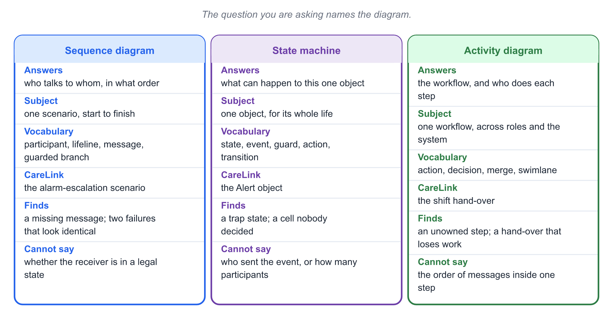
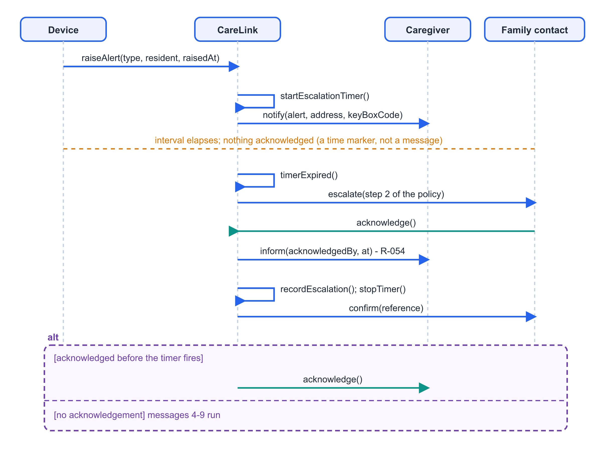
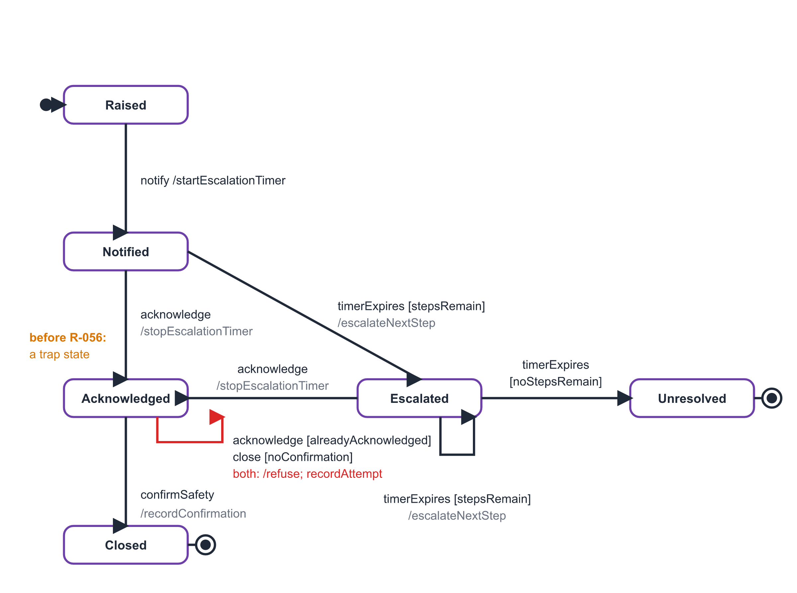
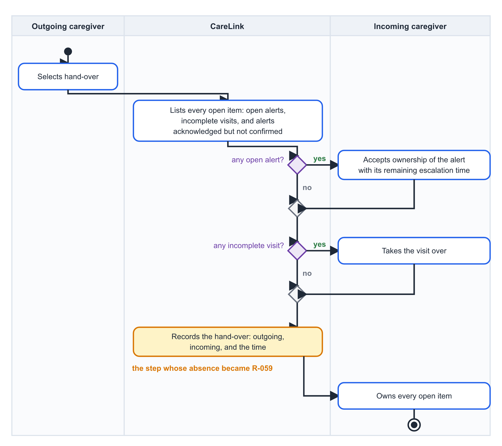
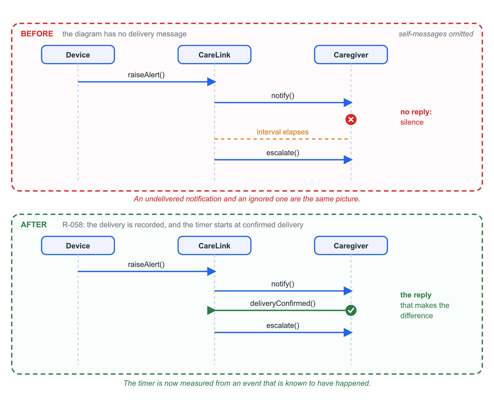
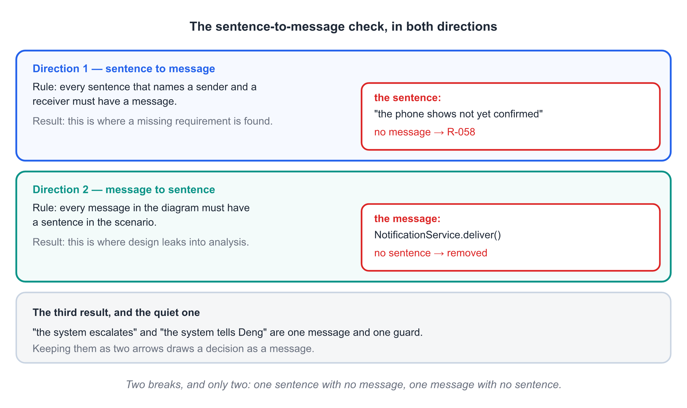
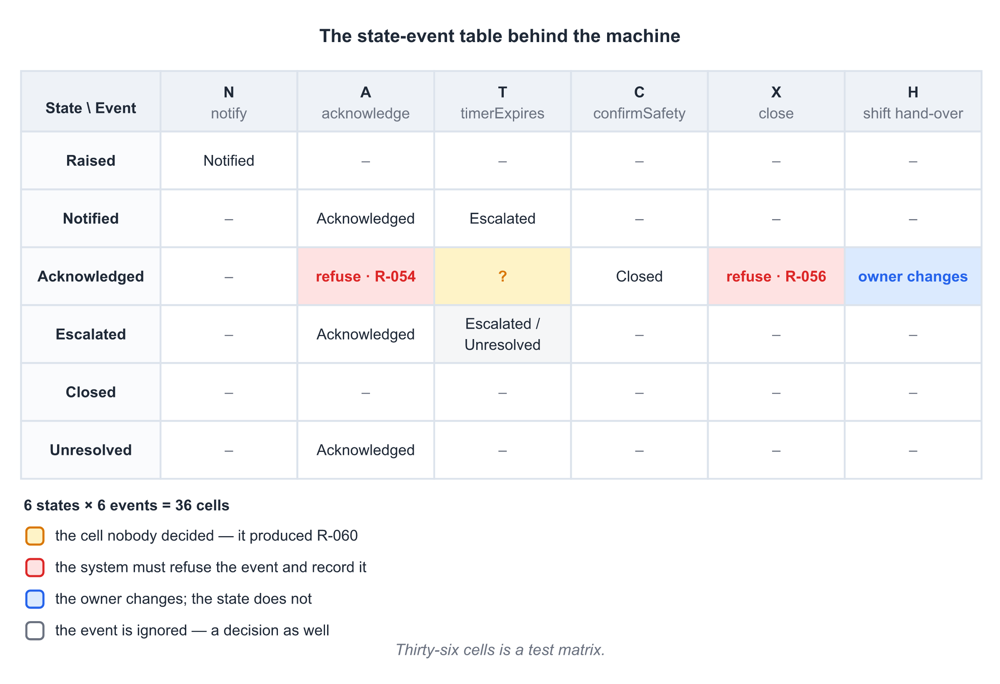
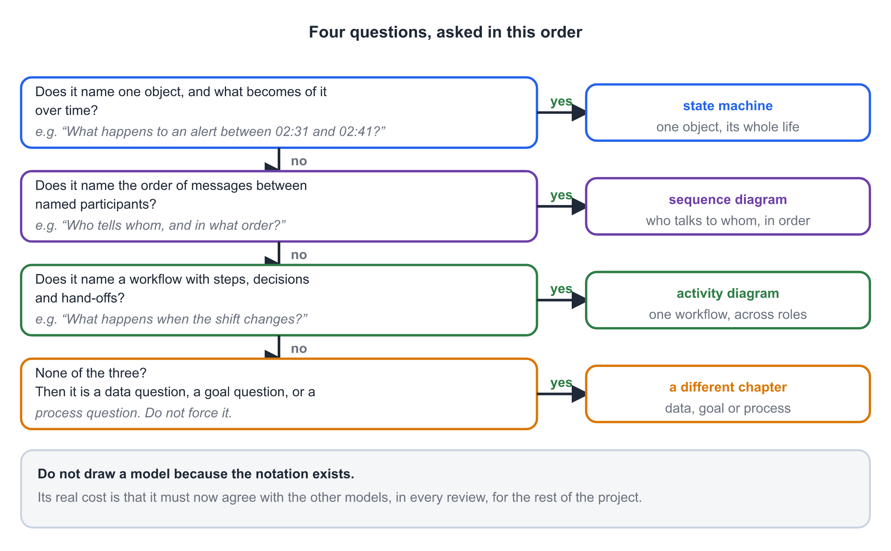
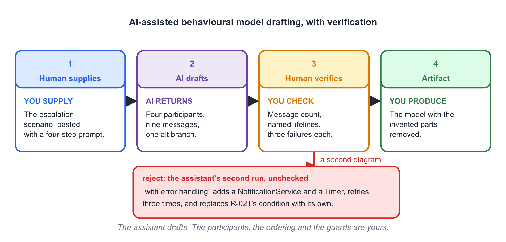

# Chapter 9 — Behavioural Modelling

## Learning Objectives

By the end of this chapter you will be able to:

1. Explain what a behavioural model supplies that a use case description and a
   domain model cannot, and state the question each of the three behavioural
   models answers.
2. Write a scenario: concrete names and values, one path, one ending.
3. Read and draw a sequence diagram — participant, lifeline, message, ordering,
   self-message and guarded branch — and justify the order it claims.
4. Read and draw a state machine for a single object: state, event, guard,
   action, initial state and terminal state.
5. Run the reachability check and the exit check on a state machine, and say
   what each one finds.
6. Read and draw an activity diagram with decisions, merges and swimlanes, and
   state what it adds to a use case list.
7. Check a behavioural model against its scenario in both directions, and
   classify what each direction finds.
8. Build a state-event table, fill every cell, and use the cells you cannot
   fill as findings.
9. Use an AI assistant to draft a behavioural model from a scenario, then
   correct its ordering, its missing branches and its invented participants.

---

## Before You Read

Ten terms, ten lines. Read them once now; the chapter assumes all ten.

- **behavioural model 行为模型** — a model of what the system does over time,
  as opposed to what it knows or what it is made of.
- **scenario 场景** — one concrete path through a use case, with named
  participants and values, from a trigger to a single outcome.
- **sequence diagram 顺序图** — an interaction diagram showing participants
  left to right and messages in time order, top to bottom.
- **lifeline 生命线** — the vertical line under a participant, standing for
  that participant for as long as the interaction lasts.
- **message 消息** — one communication from a sender to a receiver. In a
  sequence diagram, the messages and their order are the whole content.
- **state machine 状态机** — a model of one object's life: the states it can be
  in, the events that reach it, and what each event does in each state.
- **state 状态** — a condition an object remains in for a while. If you can ask
  how long it has been in it, it is a state.
- **event 事件** — something that arrives and may move the object. Arriving is
  not the same as being handled.
- **guard 守卫条件** — a condition in brackets on a transition. The transition
  runs only when the guard is true.
- **activity diagram 活动图** — a model of a workflow: the steps, the decisions
  between them, and who performs each one.

## Opening Scenario

Friday, 22:50. Deng finishes her shift and Anya starts hers, and there are two
things on the board that neither of them can close.

The first is an alert raised at 22:31. Deng acknowledged it at 22:33 and drove
to the flat, and the resident was not at home. Chapter 7's R-056 says an alert
cannot be closed without a recorded safety confirmation, and Deng has not made
one, because there is nobody to confirm anything about. So the alert sits in
the state it was in at 22:33, and it has been sitting there for seventeen
minutes.

The second is older and worse. On Tuesday at 02:31 a pendant was pressed twice
in the same flat. At 02:36 the escalation interval expired and the system sent
the alert to Wei, the nominated family contact. Wei acknowledged at 02:41.
Deng acknowledges the same alert at 02:41. The record shows two
acknowledgements with the same minute on them, and no column anywhere that says
which one arrived first.

> "Which of these is mine?" asks Anya.

Nobody can answer, and the reason is not a missing document. The team has
eleven use cases, sixteen concepts and thirty-eight numbered requirements. It
has a description of **Acknowledge an alert** with a six-step main flow and six
alternative flows. What it does not have is a single artefact that says what an
alert *is* between the moment it is raised and the moment it is closed, or who
holds it when the person holding it goes home.

> **A use case says who wants what. A domain model says what the organisation
> knows. Neither one says what is true at 23:00.**

That gap has a shape, and the shape is the chapter.

> **Three models, three questions.** An interaction model answers *who talks to
> whom, in what order*. A state machine answers *what can happen to this one
> object, and when*. An activity model answers *what is the workflow, and who
> does each step*. This chapter draws all three for CareLink, and the
> uncomfortable part is that the same Friday evening comes out different in
> each one.

One confusion is worth clearing before any of them is drawn, because Chapter 6
has already filled a whiteboard with what looks like the same picture.

> **Chapter 6 drew the care centre's process. This chapter draws the system's
> behaviour, and they are not the same drawing.** The as-is alarm diagram has a
> telephone in it, because the process being fixed has a telephone in it.
> Nothing in this chapter has a telephone in it — the activity diagram of §9.5
> shows a swimlane per actor so that you can see which steps the system
> performs and which ones stay in somebody's hands.

## Core Concepts

### 9.1 Three Models, Three Questions

Three behavioural models, three questions, and a habit of drawing whichever one
the team drew last. The mapping is worth committing to memory, because almost
every wasted afternoon in this part of the project is a diagram answering a
question nobody asked.

| | Sequence diagram | State machine | Activity diagram |
|---|---|---|---|
| **Answers** | who talks to whom, in what order | what can happen to this one object | what is the workflow, and who does each step |
| **Subject** | one scenario, start to finish | one object, for its whole life | one workflow, across roles and the system |
| **Vocabulary** | participant, lifeline, message, self-message, guarded branch | state, event, guard, action, transition | action, decision, merge, swimlane |
| **CareLink artefact** | the alarm-escalation scenario | the Alert object | the shift hand-over |
| **Finds** | a missing message; two failures that look identical | a trap state; a cell nobody decided | an unowned step; a hand-over that loses work |
| **Cannot say** | whether the receiver is in a legal state | who sent the event, or how many participants there are | the order of messages inside one step |

The last two rows carry the argument. Each model is strong exactly where another
is silent, and the silence is not a defect — it is the reason all three exist.

The way to choose is to listen to your own question.

> **Ask the question in the singular.** "What happens to *this alert* over its
> life?" is a state question. "What happens when the pendant is pressed?" is a
> scenario question. "What happens at hand-over?" is a workflow question. The
> grammar of the question tells you the diagram, and it tells you before you
> have spent ten minutes on the whiteboard.

Two consequences follow, and both of them are about restraint.

**Not every object needs a state machine.** An object whose states change
nothing in the specification is an object with an attribute. Chapter 8's rule —
generalise by role, not by state — has a twin here: **give an object a state
machine when its states change what the requirements demand of it, and not
otherwise.** Address has no state machine. Alert does, because R-021's escalation
interval runs differently in each of its states.

**Not every workflow needs an activity diagram.** A workflow that never crosses
a role boundary is a use case with more steps, and the use case description
already has it.

The rule the team wrote on the wall, and the one this chapter is built to
justify:

> **One scenario, per path that has to work. One state machine, per object whose
> states change the requirements. One activity diagram, per workflow that
> crosses a role boundary.**

Everything else is a picture of something you already knew, and it will have to
be maintained.

{width=15cm}

*Fig. 9-1. Three models, three questions. Choosing is not a matter of taste — the question you are asking names the diagram you need.*

### 9.2 The Scenario Comes First

A behavioural model is not derived from a use case. It is derived from a
**scenario**, and the scenario is a piece of writing that comes before any
diagram.

> **Scenario.** A specific instance of a use case: a named trigger, named
> participants, named values, one path, and one outcome.

Here is CareLink's, written at the length it was actually written.

> Tuesday, 02:31. The pendant in flat 3B is pressed twice within a second. The
> system raises an alert against the resident of 3B. The caregiver on shift,
> Deng, is sent a notification. Deng receives it at 02:33. The escalation
> interval expires at 02:36 with nothing acknowledged. The system sends the
> next escalation step to the nominated contact, Wei. Wei acknowledges at
> 02:41. The system tells Deng who acknowledged and when. The system records
> the escalation.

Three properties make that paragraph usable, and each one is a rule.

**Concrete.** "The caregiver" is not concrete. "Deng, on the night shift, at
02:33" is. The values matter because a scenario with no numbers cannot be
checked: 02:36 is the escalation interval expiring, and if you do not write it
down you will not notice that it expires seven minutes before the
acknowledgement arrives.

**One path.** A scenario does not branch. If you find yourself writing *or*,
you have two scenarios and you should write both. The sentence *"the caregiver
acknowledges, or the interval elapses first"* is two scenarios wearing one
sentence, and it is the single commonest reason a sequence diagram has no
branch in it.

**One ending, from Chapter 7's three.** Success, failure, or partial outcome.
A scenario that ends in none of the three is a scenario whose author stopped
writing.

**Where scenarios come from.** Chapter 7 left six alternative flows on the
board for **Acknowledge an alert** — A1 to A6 — and each one is a scenario
waiting to be written out. That is the point of writing alternative flows
rather than alternative bullet points: a flow is a path, and a path can be
narrated.

Then a writing discipline, and the last line of it is the one that saves the
diagram.

- Present tense, active voice.
- One action per sentence.
- **Name the sender and the receiver in every sentence.**
- Start every sentence with a time or a state, so the order is in the text and
  not only in your head.

> If you write "the system escalates", you have named one party, and the
> diagram will get an arrow pointing at nothing. Write "the system sends the
> next escalation step to Wei" and the arrow has two ends.

That check is mechanical, and §9.7 turns it into a procedure: the sentences
that name two parties become messages, and the sentences that name one party
become guards.

### 9.3 The Sequence Diagram

The sequence diagram is the transcription of the scenario, and it has six parts.

1. **Participants, left to right.** Put the participant that starts the
   scenario on the left. The rest go in the order they first appear in the
   text. CareLink's four are **Device**, **CareLink**, **Caregiver** and
   **Family contact**, and that order is the order of the paragraph.
2. **Lifelines, top to bottom.** The vertical line under each participant
   stands for that participant for the duration of the interaction. Nothing
   else in the diagram has a vertical axis: **time is the only thing the
   vertical direction means.**
3. **Messages, in order.** A message has a sender, a receiver and a name. The
   name is an event in the users' vocabulary — `acknowledge(alert, caregiver,
   at)`, not `tapAcknowledge()` and not `openDashboard()`.
4. **Returns, only when they are used.** If a guard downstream depends on the
   value, draw the return. If nothing depends on it, drawing it is noise.
   Drawing none of them when a guard depends on one is a hole.
5. **A self-message** is a message an object sends itself, drawn as a loop back
   to its own lifeline. In CareLink, every timer in the system lives in a
   self-message, because a timer is not a participant.
6. **A branch** is drawn as a fragment with a guard on each part: `alt
   [delivered] … [not delivered]`, or `opt [interval elapses] …`. The guard is a
   condition, not a comment.

CareLink's escalation scenario, as nine messages. Read them in the order they
appear, because that order is the model.

| # | Sender | Receiver | Message |
|---|---|---|---|
| 1 | Device | CareLink | `raiseAlert(type, resident, raisedAt)` |
| 2 | CareLink | CareLink | `startEscalationTimer()` — R-021's interval |
| 3 | CareLink | Caregiver | `notify(alert, address, keyBoxCode)` |
| — | *interval elapses; nothing acknowledged* | | *a time marker, not a message* |
| 4 | CareLink | CareLink | `timerExpired()` |
| 5 | CareLink | Family contact | `escalate(step 2 of the policy)` |
| 6 | Family contact | CareLink | `acknowledge()` |
| 7 | CareLink | Caregiver | `inform(acknowledgedBy, at)` — R-054 |
| 8 | CareLink | CareLink | `recordEscalation(); stopTimer()` |
| 9 | CareLink | Family contact | `confirm(reference)` |

And the branch that shares the diagram with all nine: at any point after
message 3, an `alt` fragment in which **Caregiver → CareLink:
`acknowledge()`** runs before the timer fires, and messages 4 to 8 do not
happen.

> **A sequence diagram is a claim about ordering.** Its whole content is which
> message precedes which. Two diagrams that are both readable and both
> plausible are not two models — one of them is decoration.

The claim in that table is that message 5 precedes message 6, that message 7
follows message 6, and that message 2 precedes everything. When the team read
it aloud, two of those claims turned out to be wrong, and both are worth
keeping.

**The first is that message 3 has no reply.** Nothing confirms that the
notification reached Deng. If her phone had no coverage — Chapter 7's A1 — the
diagram after message 3 looks exactly the same as it does when she received the
notification and ignored it. Two different failures, one picture. §9.6 is about
that, and it produced R-058.

**The second is that messages 6 and 7 have the same name as the branch.** The
`acknowledge()` in the branch and the `acknowledge()` in message 6 are the same
event arriving at the same object, and on Tuesday they arrived in the same
minute. The diagram does not say which one the record should believe. §9.8
finds that cell, and it produced R-060.

{width=15cm}

*Fig. 9-2. Nine messages and one branch. The branch shares the diagram with the escalation it prevents, because a sequence diagram that shows only the path that worked is a claim that nothing else can happen.*

### 9.4 The State Machine

The sequence diagram follows one path. The state machine follows one object
through every path it has, and the object this chapter follows is the alert.

> **State machine.** A model of a single object: the states it can be in, the
> events that can reach it, and, for each state and event, whether the event
> moves it and where.

Six parts, and each one has a rule that decides whether you have drawn it.

| Element | Drawn as | Means | The rule |
|---|---|---|---|
| **initial state** | filled dot | where the object's life begins | exactly one per machine |
| **state** | rounded box with a name | a condition that persists | if you can ask *how long*, it is a state |
| **transition** | arrow labelled `event [guard] / action` | an event that moves the object | if it does not move the object, it is not a transition |
| **guard** | `[condition]` in brackets | the move happens only when true | a false guard means the event was ignored, not refused |
| **action** | `/effect` after a slash | work that runs as part of the move | it belongs to the move, not to the state |
| **terminal state** | ringed dot | a state with no exits | the object's life is over |

The distinction that students lose most marks on is the second and fifth rows.
**A state is a condition, not an activity.** `Notified` is a state: an alert
stays in it for as long as the escalation interval runs, and you can ask how
long. `Walking to the door` is not a state, however long the walk is: it is an
activity, and it belongs inside a transition as an action, because nothing in
the requirements treats the walk differently from the arrival.

The alert's life, in the order the team drew it:

**Raised** — the alert exists and nothing has been sent. **Notified** — the
escalation interval is running. **Acknowledged** — a named person has taken
responsibility. **Escalated** — the interval expired and the next step of the
policy has gone out. **Closed** and **Unresolved** — the two terminal states:
somebody confirmed the resident was safe, or the chain ran out without anybody
doing so.

The transitions:

| From | Event | Guard | Action | To |
|---|---|---|---|---|
| *(initial)* | — | — | — | Raised |
| Raised | `notify` | — | `/startEscalationTimer` | Notified |
| Notified | `acknowledge` | — | `/stopEscalationTimer` | Acknowledged |
| Notified | `timerExpires` | `[stepsRemain]` | `/escalateNextStep` | Escalated |
| Escalated | `acknowledge` | — | `/stopEscalationTimer` | Acknowledged |
| Escalated | `timerExpires` | `[stepsRemain]` | `/escalateNextStep` | Escalated |
| Escalated | `timerExpires` | `[noStepsRemain]` | — | Unresolved |
| Acknowledged | `confirmSafety` | — | `/recordConfirmation` | Closed |
| Acknowledged | `acknowledge` | `[alreadyAcknowledged]` | `/refuse; recordAttempt` | Acknowledged |
| Acknowledged | `close` | `[noConfirmation]` | `/refuse; recordAttempt` | Acknowledged |

Two rows in that table are unusual, and both of them are deliberate.

**The two refusals.** In UML, an event with no transition is simply ignored —
that is the notation's default, and it is usually what you want. But R-054 and
R-056 do not ask for silence. R-054 says a second acknowledgement must show who
and when; R-056 says an alert may not be closed without a recorded safety
confirmation. Both of those are *refusals*, and a refusal is a transition:

> **Ignored and refused are different.** An event with no transition is silently
> ignored, which is the notation's default. An event the system must refuse is a
> transition to a state, drawn like any other. The state machine is where you
> find out that you never decided which one you meant.

**The two guarded exits from Escalated.** One event, two guards, because the
policy has a last step and something has to happen after it. Modelling that as
a third state would have been wrong: `Unresolved` is not a stage of escalation,
it is the end of it.

Then the three checks, which are the whole value of having drawn a machine
rather than a paragraph.

**Reachability.** Every state must be reachable from the initial state. A state
nothing leads to is a leftover — nearly always a requirement that was cut and
whose picture nobody removed. CareLink passed on the second attempt; the first
attempt had an `Overdue` state left over from a deadline feature that Chapter 5
had already dropped.

**Exit.** Every non-terminal state must have at least one way out. A state with
no exit is a trap: the object arrives and the organisation has no way to move
it. This is the check that found CareLink's worst bug, and it found it six
weeks before the code existed.

Before R-056, `Acknowledged` had exactly one exit, `confirmSafety`, and no
requirement obliged anybody to reach it. An alert that had been acknowledged
could therefore stay acknowledged forever, with the escalation timer stopped and
no record of whether the resident had been seen. **The trap state was not a
missing arrow. It was a missing requirement**, and Chapter 7 wrote it as R-056
without knowing that this diagram would explain why.

> **A trap state means a missing requirement, not a missing arrow.** If the
> only way out is an event no requirement generates, the model has just told you
> which requirement to go and write.

And then the payoff of a rule from the previous chapter, which is worth seeing
land.

> Chapter 8 refused to model `OpenAlert` and `AcknowledgedAlert` as concepts,
> on the rule *do not generalise when concepts differ by state*. This diagram is
> where that refusal pays. The states it declined to promote to concepts are
> exactly the states on the machine. Had it promoted them, the project would
> need a second model, in a different notation, to say the same thing — and the
> two would drift apart by the second week.

One limit belongs at the end of the subsection rather than in a later chapter.

> **A state machine is about one object.** The moment a diagram contains two
> objects' states, you have two diagrams drawn on one page.

CareLink needs two of them to agree: a **Notification** may be `Delivered`
while its alert is still `Notified`, and an alert may not be `Closed` while any
of its notifications is still `Pending`. That agreement is a cross-object rule,
it is not expressible in either machine alone, and the team wrote it down as a
design note with a test beside it — which is the honest outcome. A rule you
cannot draw is still a rule, and an unwritten rule is one that gets broken.

{width=15cm}

*Fig. 9-3. One object's life. The two red self-transitions are refusals, not omissions: R-054 and R-056 ask the system to say no and record the attempt.*

### 9.5 The Activity Diagram

The third question is about workflow, and the workflow CareLink needed was the
one Anya asked about at 22:50: the shift hand-over.

One paragraph of scope first, because Chapter 6 is close by.

> Chapter 6 drew the care centre's **business process**: how an alarm call is
> handled today, with a telephone in it, and how it should be handled tomorrow.
> That drawing exists to decide what the system must replace. This one is
> narrower and it is about the system: which steps the system performs, which
> steps a person performs, and where the work passes between them.

The notation has five parts. **Actions** are rounded boxes. A **decision** is a
diamond with one entry and several exits, and every exit carries the answer to
the question. A **merge** is a diamond with several entries and one exit, and it
carries nothing. A **fork and join** is a bar, for steps that genuinely run at
the same time. A **swimlane** is a lane per performer, so that responsibility is
visible without a word of explanation.

> **A decision asks a question and every outgoing edge carries the answer. A
> merge asks nothing and carries no guards.** Drawing guards on a merge is the
> commonest small error in the notation, and it makes a reader believe the
> diamond is deciding something.

CareLink's hand-over, in three lanes — **Outgoing caregiver**, **CareLink**,
**Incoming caregiver**.

1. *Outgoing* — selects hand-over.
2. *CareLink* — lists every open item: open alerts, incomplete visits, alerts
   acknowledged but not confirmed.
3. *Decision* — **any open alert?** *yes:* CareLink shows the alert **with its
   remaining escalation time**, and the incoming caregiver accepts ownership.
   *no:* the merge.
4. *Decision* — **any incomplete visit?** *yes:* the incoming caregiver takes
   the visit over. *no:* the merge.
5. *CareLink* — records the hand-over: outgoing, incoming, time.
6. *Incoming* — owns every open item. End.

The first draft had no step 5, and its absence is the finding.

> Without a recorded hand-over, an alert can be owned by a person who has gone
> home, and the escalation timer keeps running against her name. The system
> would continue to escalate an alert that nobody on shift had ever seen, and
> the record would name the right person for the wrong shift.

That became **R-059**, and it had a second consequence that reached back into
Chapter 7. The hand-over behaviour belongs to **Update the caregiver roster**,
which Chapter 5's MoSCoW table had as a Could. An open alert with no owner at
23:00 is not optional, so the row moved to **Must** — a MoSCoW change produced
by a diagram, which is a thing that happens more often than the priority
meetings would suggest.

Two more decisions came out of the same twenty minutes, and neither of them is
a requirement.

**The timer is not paused.** The team considered stopping the escalation clock
while the caregiver drives to the door, and refused. The interval's entire
purpose is to bound how long a resident waits, and a clock that stops whenever
somebody is on the way measures nothing. Recorded as a decision with its
reason, in Chapter 7's form: *we decided this cannot happen, because a timer
that pauses is not a timer.*

**The two questions are asked in sequence, not at once.** Should the screen
check alerts and visits simultaneously? No — a hand-over is a conversation, and
a form that asks two questions at once gets one of them skipped. That is a
human fact with a diagram behind it, and it is the sort of thing that never
appears in a requirements document unless somebody writes it down.

{width=15cm}

*Fig. 9-4. The hand-over, in three lanes. The step that is easy to leave out — recording who handed over to whom — is the step that R-059 exists to require.*

### 9.6 Why the Happy Path Is Not Enough

Chapter 7 said the main flow is the shortest complete path, not the typical one.
The same rule bites here, in a notation that hides the damage better.

A sequence diagram drawn from a main flow has an air of completeness that a use
case description does not. It has participants, it has arrows, it has an order.
What it does not have is any of the three ways a message can disappoint you.

> **Every message has exactly three ways to disappoint you.** It can fail to
> arrive. It can arrive twice. It can arrive too late. A diagram that shows none
> of the three is a diagram of a system that does not exist.

The three are different problems with different fixes, and it is worth keeping
them apart, because two of them look identical in the picture.

| Failure | What it looks like in the diagram | What it needs |
|---|---|---|
| **It never arrived** | silence — indistinguishable from being ignored | a delivery confirmation, and a branch for the undelivered case |
| **It arrived twice** | the same message twice, in the same minute | a tie-breaking rule, or a receiver that can absorb a repeat |
| **It arrived too late** | a correct message that is now pointless | a guard on recency, and a record of both times |

CareLink had all three, and the first one is the reason R-058 exists.

**The message that never arrived.** Message 3 sends the notification, and
nothing comes back. When Deng's phone is out of coverage, Chapter 7's A1 fires:
the acknowledgement is queued locally and retried, and the caregiver sees "not
yet confirmed". The team read that flow aloud and then looked at the diagram,
and the diagram had nothing in it. After message 3, an undelivered notification
and an ignored notification are the same picture: silence, then a timer.

> "If we cannot tell whether the phone got it," said Mei, "then A1 and A4 look
> the same to us. And they are not the same. In one of them we have seven
> minutes of warning and in the other we have none, because the person we are
> waiting for does not know there is anything to wait for."

The fix is a message, and a rule about where the clock starts:

> **R-058 — a notification's delivery must be recorded, and the escalation
> timer starts at confirmed delivery, not at the moment the alert was raised.**

That second clause is the interesting one. It is a timing guarantee, and
Chapter 7 said plainly that a use case cannot supply one — the "does not
supply" column of its closing table has *timing, concurrency or ordering
guarantees between cases* in it. It took a sequence diagram to see that the
guarantee was missing.

**The message that arrived twice.** On Tuesday, Wei's acknowledgement and
Deng's arrived in the same minute. Both were accepted, both were recorded, and
neither column says which came first. R-054, written in Chapter 7, handles the
second acknowledgement by showing who acknowledged and when — and *when* turns
out to be exactly the value nobody has. §9.8 finds this cell in a table and
produces R-060.

**The message that arrived too late.** Wei acknowledged at 02:41. The
escalation had already gone out at 02:36, correctly, because the interval had
expired. So the escalation was right and pointless at the same time, and
nothing in the record could have prevented it. The honest fix is not to prevent
it but to make it visible: the record should say that an escalation was sent
and was answered five minutes later by the same person it was sent to, because
that is a fact about how long the chain takes.

> **A late message is not a defect.** It is information about a chain that is
> slower than its own interval, and the only way to see it is to draw both the
> send and the answer and read the gap.

{width=15cm}

*Fig. 9-5. Before and after. The upper diagram cannot tell an undelivered notification from an ignored one; the lower one adds the message that separates them, and moves the start of the timer.*

### 9.7 From the Sentence to the Message

The scenario and the diagram are two transcriptions of one thing, and the check
between them runs in both directions. It costs ten minutes and it is the
cheapest quality control in this chapter.

> **Sentence-to-message check.**
>
> - Every sentence that names a sender and a receiver must have a message in
>   the diagram.
> - Every message in the diagram must have a sentence in the scenario.
> - A sentence with no message is a **missing message**.
> - A message with no sentence is an **invented message**.

The first direction finds requirements. The second finds design, and it is
skipped by every team that is in a hurry.

**Direction 1 — sentence to message, on CareLink's Tuesday scenario.** The
paragraph has eleven sentences. Nine name two parties and became the nine
messages of §9.3. One — *nothing is acknowledged within the interval* — names
nobody and became a time marker. And one did not make it:

> *The caregiver's phone shows "not yet confirmed".*

That sentence names one party, and the diagram has no message that produces it.
It is not a guard either, because a guard is a condition and this is a state the
caregiver can see. It is a missing message, and it is the third independent
route to R-058: an alternative flow, a reading of the diagram, and a
sentence-by-sentence walk all arrived at the same missing requirement. That is
what agreement looks like.

**Direction 2 — message to sentence.** The first draft of the diagram had a
message that the scenario does not contain:

> CareLink → `NotificationService` : `deliver(notification)`

There is no such sentence in the scenario because there is no such thing in the
care centre. Nobody at 02:31 has an opinion about a notification service. It
was a design decision wearing the scenario's clothes, and it belongs in Chapter
13. Removing it took four seconds; not removing it would have put an internal
component into an analysis model and given it a name that users would
eventually have to be taught.

> **The second direction is where design leaks into analysis.** An invented
> message is nearly always something the designer needed and the scenario never
> mentioned, and it is invisible unless you insist that every arrow has a
> sentence.

**The third result is the quiet one.** Two sentences — *the system escalates*
and *the family contact is told* — are one message and one guard. The first is
a decision about whether to send, the second is the sending. A model that keeps
them as two arrows has drawn a decision as a message; a model that keeps only
the second has thrown away the guard that §9.8 will need.

| Finding | Direction | What it was | What it produced |
|---|---|---|---|
| "not yet confirmed" has no message | sentence → message | a missing message | R-058, third route |
| `NotificationService.deliver()` has no sentence | message → sentence | an invented message | removed; a design note for Chapter 13 |
| "escalates" and "is told" are one message | both | a decision drawn as a message | the guard in §9.8 |

{width=15cm}

*Fig. 9-6. Every sentence with two parties has a message, and every message has a sentence. The two places the mapping breaks are the only two places worth reviewing.*

### 9.8 The State-Event Table

A state machine shows the transitions somebody remembered to draw. A table asks
about every pair, and the pairs with no answer are the cells nobody decided.

The table has one row per state and one column per event, and every cell holds
one of four things: the state the object moves to, `–` for an event the object
ignores, `refuse` for an event the system must reject and record, or a blank —
and a blank is the finding.

Events, in shorthand: **N** `notify`, **A** `acknowledge`, **T**
`timerExpires`, **C** `confirmSafety`, **X** `close`, **H** `shift hand-over`.

| State \ Event | N | A | T | C | X | H |
|---|---|---|---|---|---|---|
| **Raised** | Notified | – | – | – | – | – |
| **Notified** | – | Acknowledged | Escalated | – | – | – |
| **Acknowledged** | – | refuse · R-054 | **?** | Closed | refuse · R-056 | *owner changes* |
| **Escalated** | – | Acknowledged | Escalated / Unresolved | – | – | – |
| **Closed** | – | – | – | – | – | – |
| **Unresolved** | – | Acknowledged | – | – | – | – |

Six states and six events make **thirty-six cells**. **Seven cells move the
object**, two more **refuse** the event, one records a **change of owner**
without moving anything, and the remaining **twenty-six mean the event is
ignored** — which is a decision as well, and it is the one nobody writes down.

Three of those cells are worth more than the other thirty-three.

**`Acknowledged` × `T` — the cell with the question mark.** The transition
Notified → Acknowledged carries the action `/stopEscalationTimer`, so the timer
is stopped when the acknowledgement is handled. But the table asks the question
the diagram never asked: what if the timer fires while the acknowledgement is
in flight? On Tuesday it did. The acknowledgement and the expiry were recorded
in the same minute, and the system had no rule for deciding between them.

Filling that cell needed a decision, and the team made it a requirement,
because a tester can test it:

> **R-060 — when an acknowledgement and a timer expiry fall within the same
> interval, the resulting state is determined by the recorded event times, and
> the record shows both.**

The alternative — deciding by arrival order — was rejected in one sentence:
arrival order is a property of the network, and the care centre should not have
a policy that depends on it.

**`Acknowledged` × `H` — ownership is not a state.** Look at the column and the
temptation is obvious: hand-over changes something, so make it a state. Do not.

> **Ownership is not a state.** If hand-over moved the alert to a new state,
> then every other event would have to be conditioned on who owns it, and the
> machine would double. The owner is an attribute of the alert; the state does
> not change when the owner does.

That is the second time in two chapters that the same instinct has had to be
resisted. Chapter 8 refused to generalise by state; this section refuses to
promote by ownership. Both refusals keep the model small, and both of them have
the same reason: **a model that absorbs every distinction stops distinguishing
anything.**

**`Unresolved` × `A` — the cell that keeps a person in the loop.** The chain
ran out. Nobody acknowledged. Should the alert still be acknowledgeable? The
table makes the answer obvious in a way the diagram did not: yes, because a
human being will eventually knock on that door, and the record must be able to
say who. The alternative — a terminal state that absorbs no further events —
would have left the worst case in the system unrecordable.

And the table's last gift is size, which is not a joke.

> **Thirty-six cells is a test matrix.** One test per moving cell, one per
> refusal, and one per ignored cell if you want to be thorough about the
> twenty-six. Chapter 10 will ask where the tests come from; the answer is on
> this page, and it was produced by filling in a grid.

{width=15cm}

*Fig. 9-7. The table behind the machine. The two cells that needed a decision — a timer expiry in Acknowledged, and a hand-over that changes the owner but not the state — are the ones a diagram would have left blank.*

### 9.9 Where Behavioural Models Stop

Three behavioural models have now been drawn for one evening in one care
centre, and the questions they cannot answer are as instructive as the ones
they can.

**They cannot supply the numbers.** The state machine says `[stepsRemain]`. It
does not say how many steps the policy has, or how long the interval is. Those
numbers live in R-021, and the discipline is to write **VALUE FROM
REQUIREMENT** in the model and go and find it. An interval invented in a
diagram is an interval nobody agreed to, and it will be discovered by a
resident.

**They cannot say who is responsible.** A sequence diagram has messages, not
methods. Which object answers `acknowledge()`, and which class owns the
escalation policy, are design questions, and they are Chapter 12's.

**They are not the tests, but they are the source of them.** §9.8's grid is a
test matrix, §9.4's branches are the cases, and the two refusals are the two
tests that students forget to write. A behavioural model that generates no
tests has been drawn for the wrong reader.

**They do not agree by themselves.** Three models describe one behaviour, and
where they disagree the disagreement is a finding. The team wrote down three
consistency rules, and the third one is the one that keeps the models small.

1. **Every message must be an event some state machine accepts.** If a sequence
   diagram sends `close()` to an object whose machine is in a state with no
   such transition, one of the two is wrong.
2. **Every decision must be a guard or an alternative flow.** A decision in an
   activity diagram that no state machine and no use case alternative flow
   contains is a decision somebody made alone.
3. **Every state that changes a requirement appears as a state; every state
   that does not is an attribute.** This is Chapter 8's role-versus-state rule
   seen from the behaviour side, and it is what kept the alert at six states
   instead of twelve.

And then the hand-over to the next chapter, stated as plainly as Chapter 8
stated its own.

Three chapters have now approached the same project from three directions.
Chapter 6 asked **how work happens** and drew a process. Chapter 7 asked **who
wants what** and drew goals. Chapter 8 asked **what the organisation knows**
and drew concepts. This chapter asked **what happens, in what order, and
under what condition** — and drew three models, because the question has three
halves. None of the four substitutes for the others, and a specification that
holds all four can be read by anybody in the organisation.

### 9.10 Choosing a Model

Four questions, asked in this order, will pick the diagram for you. Ask them in
the order given, because the first one that answers *yes* settles it.

1. Does the question name **one object** and what becomes of it over time? →
   **state machine.** *"What happens to an alert between 02:31 and 02:41?"*
2. Does the question name **the order of messages** between named
   participants? → **sequence diagram.** *"Who tells whom, and in what order?"*
3. Does the question name **a workflow** with steps, decisions and hand-offs? →
   **activity diagram.** *"What happens when the shift changes?"*
4. None of the three? Then it is a data question (Chapter 8), a goal question
   (Chapter 7), or a process question (Chapter 6). Do not force it.

One caution, and it is a caution about cost rather than about correctness.

> **Do not draw a model because the notation exists.** The cost of a
> behavioural model is not the drawing. It is that it must now agree with the
> other two, in every review, for the rest of the project.

The team drew four behavioural models in total: one sequence diagram for the
escalation scenario, one for the acknowledgement scenario, one state machine
for the alert, and one activity diagram for the hand-over. They deliberately did
not draw a state machine for a resident, an activity diagram for logging a
visit, or a sequence diagram for the roster — not because those models would
have been wrong, but because nobody was going to ask a question that they
answered.

{width=15cm}

*Fig. 9-9. Four questions in order. The first one that answers yes settles the choice; if none of them does, the question belongs to a different chapter.*

## CareLink in Action

Four sessions, and each one produces a model and a finding.

**Session 1 — the scenarios.** The team takes Chapter 7's six alternative flows
for **Acknowledge an alert** and writes each as a paragraph. Six scenarios,
each sixty to a hundred and twenty words, present tense, named values. The
discipline shows in the first ten minutes: writing A1 out in full — *no
coverage at the moment of the tap* — produces a sentence that the use case
description does not have, namely what the caregiver sees while the queue
drains. The sentence is *"the phone shows not yet confirmed"*, and it will come
back in §9.7 as a missing message.

Then Anya's question is written as a seventh scenario, and it does not fit any
existing use case. The nearest is **Update the caregiver roster**, which the
MoSCoW table has as a Could. Nobody in the room thinks it is a Could by the end
of the afternoon.

**Session 2 — the sequence diagram, and the message nobody sent.** Nine
messages on the wall in forty minutes. The argument takes the next hour and it
is about message 3. Mei's position is that a notification with no reply is not
a notification, it is a hope. The counter-position is that a delivery
confirmation is a technical detail and Chapter 5 taught them to keep technical
details out of requirements.

It is resolved by the scenario rather than by the argument. The A1 paragraph
says the acknowledgement is queued and retried, which means the *system does
not know* whether the notification arrived, which means R-021's interval is
being measured from an event that may not have happened. That is not a
technical detail. It is the meaning of a requirement, and it becomes **R-058**.

**Session 3 — the state machine, and the trap.** Six states, ten transitions,
two of the transitions drawn in red. The reachability check removes an
`Overdue` state that Chapter 5 had already deleted from the requirements and
nobody had deleted from the board.

Then the exit check, and the room goes quiet. `Acknowledged` has one exit and
no requirement that obliges anybody to take it. Deng, who is in the room,
supplies the reason in one sentence: *"so an alert can be acknowledged and then
just sit there, and the timer has stopped, and nobody knows whether I went."*
The team had written R-056 in Chapter 7 because Deng asked a question about A6.
This evening they find out why the question was worth asking.

**Session 4 — the table, and the thirty-six cells.** The grid goes up, and the
two question marks appear within ten minutes. The race — an acknowledgement and
a timer expiry in the same minute — produces R-060 and a one-sentence rejection
of arrival order. The hand-over column produces the ownership rule, and the
hand-over scenario produces R-059.

The activity diagram comes last, drawn in twenty-five minutes by two people
while the rest of the team watches, and it is the only one of the four models
that nobody argued about. Its finding is not in the diagram; it is in the
sentence that comes after it — *what happens to an alert that has escalated,
when the shift changes?* — and the answer is nothing, because the model had no
cell for it, which is exactly how the ownership rule earned its place.

Three things are true at the end that were not true at the start.

The specification has three more requirements and one fewer Could. The board
has four models instead of one argument. And the question Anya asked at 22:50
has an answer that fits in a sentence and did not exist as a sentence three
hours earlier: **an open alert belongs to the person on shift, and it stays
theirs until it is closed or handed over.**

Piotr gets the last word, and it is the same complaint he has made since March,
answered properly for the first time.

He does not get to choose the alert's states. He gets a table with thirty-six
cells and a rule that says the column takes exactly the values down the left-hand
side, and that two of them are refusals the code has to raise rather than
swallow. He reads it for a minute and says the thing the team has been waiting
ten weeks to hear: *"This is the first thing you have given me that I cannot get
wrong."*

## AI Companion

> **This chapter's AI angle:** an assistant asked to draw a sequence diagram
> will draw the happy path, call it the diagram, and offer to add error handling
> as a second version. It is fluent, it is well spaced, and it is the one thing
> a sequence diagram must not be — a claim that nothing goes wrong.

**1. What AI is good at here**

- **Transcribing a scenario into messages.** Hand it the paragraph and it will
  produce a numbered message list faster than a whiteboard, including the
  self-messages that people consistently forget because a timer is not a person.
- **Enumerating states and events.** Ask for the states a named object can be in
  and the events that can reach it, and you will get a list worth arguing with.
  Arguing with it is the point.
- **Building the state-event table.** A row per state and a column per event is
  exactly the mechanical work a machine should do, and doing it removes the
  temptation to skip the cells that are hard.
- **Finding the missing branch.** Ask, explicitly, for the three ways each
  message can disappoint you. Asked directly, it will list them; unasked, it
  will not.

**2. Prompt pattern** (copy-paste)

> You are a systems analyst. I will give you one scenario for a care-alerting
> system, written as a paragraph.
> 1. Convert the paragraph into a numbered list of messages, one per line, in
>    the form: sender -> receiver : name(arguments). Do not add a message that
>    no sentence in the paragraph supports.
> 2. List every sentence that names only one party, and say for each whether it
>    is a decision (a guard) or a missing message.
> 3. Name the object whose life this scenario changes. List its states and the
>    events that reach it, and give the result as a state-event table with one
>    row per state and one column per event. Use "-" where no transition
>    exists.
> 4. For every message in step 1, list the three ways it can disappoint us: it
>    does not arrive, it arrives twice, it arrives too late. For each, name the
>    guard or branch that handles it, or write "NOT HANDLED".
> Rules:
> - Use exactly the participants the paragraph names. If the system needs an
>   internal component to act, write it as a self-message on the system's own
>   lifeline.
> - Do not invent an interval, a duration, a retry count or a timeout. Write
>   "VALUE FROM REQUIREMENT" instead.
> - Do not name a class, a service or a method the paragraph does not name. A
>   message name is an event in the users' vocabulary.
> - End with "Decisions this model does not make", listing every guard you
>   supplied that the paragraph did not state.

**3. Verify before you trust**

- [ ] **The message count matches the sentences.** Count the scenario sentences
      that name two parties. The numbered list must have that many lines, plus
      the self-messages.
- [ ] **No lifeline the paragraph never names.** A participant the scenario does
      not mention is a design decision, and §9.7 is where it belongs.
- [ ] **Every message has three failure entries.** If step 4 came back empty,
      the assistant drew the happy path and stopped.
- [ ] **No blanks in the table.** Every cell is a state, `–`, or `refuse`. A
      blank cell is an undecided cell wearing the look of an empty one.
- [ ] **No numbers.** An interval, a retry count or a timeout that the
      requirements do not contain is an invention whatever it is labelled.
- [ ] **"Decisions this model does not make" is not empty.** Guards the
      assistant supplied are decisions it made on your behalf. An assistant that
      reports none did not do step 2 honestly.

**4. Typical AI failure in this chapter**

{width=15cm}

*Fig. 9-8. The assistant drafts; the ordering, the branches and the participants are yours. The second diagram is the dangerous one, because it looks more careful than the first.*

*Source:* the escalation scenario of §9.2, pasted with the prompt above.

*AI output:* a clean first diagram — four participants, nine messages, one
branch — and almost identical to the team's. Three of its messages are better
named than the team's and were kept unchanged. Then it offers a second diagram,
"with error handling", and that is where it goes wrong.

> - Participant added: **NotificationService**, with messages `send()` and
>   `ack()`.
> - Lifeline added: **Timer**, as a participant, with `start()` and `cancel()`.
> - `retry(notification)` drawn three times.
> - `escalate()` drawn only after the third `retry` fails.

Every line of it is plausible, and the third and fourth lines change the model's
meaning.

*What is wrong:* the assistant has silently replaced R-021's condition with a
retry policy that no requirement contains. In the human's diagram the escalation
fires because *the interval elapsed without an acknowledgement*. In the
assistant's second diagram it fires because *the delivery retry budget was
exhausted*. Those are different rules. One of them is in the requirement set and
the other one was invented forty seconds ago, along with a one-second delay that
appeared from nowhere.

This is worse than an omission, and the reason is worth stating precisely. An
omission is visible: there is a gap, and a gap gets reviewed. This reads as a
design, it is better presented than the original, and it has quietly answered a
question the team was going to answer — badly, and without knowing it.

*The repair:* re-run step 1 with one added line — *"Use exactly the participants
the paragraph names. If the system needs an internal component to act, write it
as a self-message on the system's own lifeline."* The second run moves the timer
and the delivery back onto CareLink's own lifeline as self-messages, drops the
invented retry delay, and restores R-021's condition as the guard on
`escalate()`.

Two lines survive both runs and are interesting for that reason. **`retry` is
real** — Chapter 7's A1 does queue and retry — and the assistant found it
without being told. And **`ack()` on the notification** is the row that becomes
R-058: the assistant proposed a delivery confirmation as a technical
convenience, and the review turned it into a requirement about where the
escalation clock starts.

> 🤖 **AI note:** the second diagram was not careless. It was *helpful*, which
> is the problem. It filled a gap you had not noticed by inventing a policy.
> Read its output as a list of decisions it made on your behalf, and give each
> one back deliberately or keep it on the record.

## Common Pitfalls

1. **Drawing the typical path.** A sequence diagram of the main flow is
   Chapter 7's "typical path" mistake in a new notation. *Correction:* every
   message has three ways to disappoint you; show the ones that change the
   design.
2. **Naming messages after screens and clicks.** `openDashboard()`,
   `tapAcknowledge()`. *Correction:* a message name is an event in the users'
   vocabulary — `acknowledge(alert, caregiver, at)`.
3. **Drawing a decision as a message.** `decideWhetherToEscalate()`.
   *Correction:* a decision is a guard on a transition or a use case
   alternative flow. It is never an arrow.
4. **A state that is really an activity.** `Walking to the door`, `Retrying the
   notification`. *Correction:* if you can only say "it is doing this", it is an
   action inside a transition; if you can ask how long it has been like this, it
   is a state.
5. **A trap state.** `Acknowledged` in CareLink had one exit and no requirement
   obliged anybody to take it. *Correction:* run the exit check; a trap state
   means a missing requirement, not a missing arrow.
6. **A state nothing leads to.** An `Overdue` state left on the board after the
   deadline feature was dropped. *Correction:* run the reachability check from
   the initial state.
7. **Guards on a merge.** *Correction:* a decision asks a question and every
   outgoing edge carries the answer; a merge only joins, and carries nothing.
8. **Putting ownership in the state machine.** If a hand-over moved the alert to
   a new state, every event would have to be conditioned on the owner, and the
   machine would double. *Correction:* ownership is an attribute; the state does
   not change when the owner does.
9. **Inventing the numbers.** An interval, a retry count or a timeout that no
   requirement contains. *Correction:* write VALUE FROM REQUIREMENT and go and
   find it. An invented interval is discovered by a resident.
10. **An AI diagram accepted because it has error handling.** The richer diagram
    is not the more correct one; the second version carried an invented retry
    policy and had changed the escalation trigger. *Correction:* read every
    added participant, message and guard as a decision, and accept it on the
    record or reject it.

## Guided Lab: One Scenario to Three Models in 55 Minutes

*In teams of three to five. Bring one use case description from your project —
main flow and at least three alternative flows — and a watch.*

| Minutes | Activity |
|---|---|
| 0–10 | **Write two scenarios.** Take the main flow and one alternative flow and write each as a paragraph: present tense, named trigger, named participants, one action per sentence, one ending from Chapter 7's three. No arrows yet. |
| 10–20 | **Scenario to messages.** For every sentence that names a sender and a receiver, write one line: `sender -> receiver : name(args)`. Then mark every sentence that names only one party, and decide for each whether it is a guard or a missing message. |
| 20–32 | **The state machine.** Name the object whose life your scenarios change. List its states and the events that reach it, draw the transitions, then run the reachability check and the exit check and write down what each found. |
| 32–42 | **The table.** Put the states against the events and fill every cell with a state, `–`, or `refuse`. Circle every cell your team argued about — those are the findings, and they are worth more than the cells you agreed on. |
| 42–50 | **The three failures.** Take the three most important messages and write the three ways each can disappoint you. For each, name the guard or the branch, or write NOT HANDLED. |
| 50–55 | **The diagram, last.** Only now draw the sequence diagram — from the message list, not from memory. Count the sentences that name two parties and count the message lines; the two numbers must agree. |

*Expected output:* two scenario paragraphs; a message list whose line count
equals the number of two-party sentences; a state machine with at least four
states, one guard, one refusal and no trap; a state-event table with no blank
cells and at least two circled arguments; and a sequence diagram with a branch,
drawn last.

Draw the diagram last. Teams that draw it first spend the remaining forty
minutes making the picture agree with what they already believed.

## Language Focus

This week you must **narrate**, **order** and **condition**. These three moves
carry every Chapter 9 assignment.

| Move | Pattern | Example |
|---|---|---|
| Narrate | **At** 〈time〉**,** 〈actor〉 〈does X〉**, and the system** 〈does Y〉**. | *At 02:31 the pendant is pressed twice, and the system raises an alert against the resident of 3B.* |
| Order | **〈Message A〉 must precede** 〈message B〉**, because** 〈what breaks if it does not〉. | *The delivery confirmation must precede the start of the timer, because a clock started on an unsent notification measures the wrong interval.* |
| Condition | **When** 〈event〉 **arrives in** 〈state〉**, and** 〈guard〉**, the object moves to** 〈state〉**; otherwise** 〈what happens instead〉. | *When a timer expiry arrives in Notified, and escalation steps remain, the alert moves to Escalated; otherwise it does not move at all.* |

Three notes on the vocabulary these patterns force you to choose between.

**Event versus trigger.** An *event* is something that arrives. A *trigger* is
the event that starts a use case. An event that starts nothing is still an
event, and it still needs a cell in the table — which is why `notify` appears
in the table's columns even though no use case begins with it.

**Shall, must, is.** Use *must* for a constraint on behaviour, *shall* for a
contractual requirement in the specification, and the present tense for what a
running system does. Mixing them in one paragraph is how a description becomes
unenforceable.

**Ordering vocabulary.** *Before*, *after*, *while* and *at the same time* are
four different claims. *At the same time* is the one that hides a race: if you
write it, you owe the reader a tie-breaking rule, and R-060 is what that rule
looks like when it is written down.

Three short exercises (answers in the instructor's manual):

1. Decide whether each sentence becomes a message or a guard, and say why:
   (i) "the system escalates to the next contact"; (ii) "the caregiver's phone
   shows not yet confirmed"; (iii) "nothing is acknowledged within the
   interval"; (iv) "the resident's finger misses the pendant and presses it
   twice".
2. Write the ordering claim in the pattern `A must precede B, because…` for:
   (i) delivery confirmation and timer start; (ii) safety confirmation and
   close; (iii) the hand-over record and the transfer of ownership.
3. Complete each sentence: "When 〈event〉 arrives in 〈state〉, and 〈guard〉, the
   object moves to 〈state〉; otherwise …" — (i) `acknowledge` in `Notified`;
   (ii) `timerExpires` in `Escalated`; (iii) `close` in `Acknowledged`.

## Summary and Key Terms

- A **behavioural model** answers the question a use case and a domain model
  cannot: what is true at a given moment, and what happens next.
- **Three models, three questions.** A sequence diagram answers *who talks to
  whom, in what order*. A state machine answers *what can happen to this one
  object*. An activity diagram answers *what is the workflow, and who does each
  step*.
- **The scenario comes first.** Concrete names and values, one path, one ending
  from Chapter 7's three. The diagram is a transcription, and §9.7 checks the
  two against each other in both directions.
- **A sequence diagram is a claim about ordering**, and its whole content is
  which message precedes which. A message is an event in the users' vocabulary,
  never a screen and never a click.
- **Every message has three ways to disappoint you:** it can fail to arrive,
  arrive twice, or arrive too late. A happy-path diagram describes a system that
  does not exist.
- **A state is a condition, not an activity.** If you can ask how long, it is a
  state; if you can only say what it is doing, it is an action inside a
  transition.
- Run the **reachability** check and the **exit** check. A trap state is a
  missing requirement, not a missing arrow — which is how R-056 was explained
  after the fact.
- **Ignored and refused are different.** The notation's default is to ignore; a
  refusal is a transition you must draw, because somebody has to write it.
- The **state-event table** asks about every pair. Thirty-six cells: seven move
  the object, two refuse, one changes the owner, twenty-six ignore — and the
  cells you cannot fill are the findings.
- **Ownership is not a state.** Recording it as one would condition every event
  on the owner and double the machine.
- Behavioural models **cannot supply the numbers** and **do not agree by
  themselves**. Where three models disagree, the disagreement is a finding, and
  thirty-six cells are thirty-six tests waiting to be written.
- This chapter produced **R-058** (delivery confirmed before the clock starts),
  **R-059** (hand-over transfers ownership with the clock intact) and **R-060**
  (the record decides the race), plus one decision, one open question, and one
  Could promoted to Must.

**Key terms:** behavioural model 行为模型 · scenario 场景 · sequence diagram
顺序图 · lifeline 生命线 · message 消息 · self-message 自消息 · alt fragment
选择片段 · state machine 状态机 · state 状态 · event 事件 · guard 守卫条件 ·
transition 迁移 · action 动作 · initial state 初始状态 · terminal state 终态 ·
trap state 陷阱状态 · reachability 可达性 · activity diagram 活动图 · decision
node 判定节点 · merge node 合并节点 · swimlane 泳道 · state-event table
状态-事件表 · ordering guarantee 时序保证 · owner 归属人

## Exercises

**(a) Concept checks**

1. State the question each of the three behavioural models answers, and give one
   CareLink question that each of the three cannot answer.
2. Explain why a scenario must be concrete and must have exactly one path. Then
   rewrite this sentence as two scenarios: "the caregiver acknowledges the
   alert, or the interval elapses first."
3. Explain the difference between a state and an action, and classify each of
   these: `Notified`, walking to the door, `Escalated`, retrying the
   notification, `Unresolved`.
4. Explain the difference between an event that is ignored and an event that is
   refused. State which one R-056 requires, and why the distinction changes what
   has to be drawn.

**(b) Analysis problems**

5. Take the main flow of one of your use cases and write it as a scenario
   paragraph, then convert it to a message list. State how many sentences named
   two parties and how many messages you wrote; where the numbers differ,
   explain the difference.
6. Draw the state machine for one object in your project. Run the reachability
   check and the exit check, and for each state that fails one of them, state
   whether the fix is a missing transition or a missing requirement.
7. Build the state-event table for that object. Fill every cell with a state,
   `–`, or `refuse`. Circle the cells you could not decide, and for each one
   write the question you would ask and the person who would answer it.
8. Take the three most important messages in your sequence diagram and write the
   three ways each can disappoint you. For each, either name the guard that
   handles it or write NOT HANDLED and state the consequence.
9. Draw an activity diagram for a workflow in your project that crosses a role
   boundary. Name every decision, write the guard on each outgoing edge, and
   state which decisions the system makes and which a person makes.

**(c) AI-augmented tasks** — *graded on your critique, not on your prompt*

10. Paste one of your scenario paragraphs into the prompt pattern in this
    chapter's AI Companion. Then report: (i) how many messages came back, and
    how many sentences named two parties; (ii) every participant it added that
    your paragraph does not name; (iii) whether any number appeared despite the
    instruction; (iv) whether step 4 produced three failures per message or
    none. Then state which single instruction it obeyed least well, and why.
11. Take the assistant's state-event table and compare it with yours, cell by
    cell. Report every disagreement, and for each one write the sentence that
    settles it. Then state which of the two tables you would hand to a
    developer, and why.
12. Delete the "Use exactly the participants the paragraph names" rule and run
    step 1 again on the same paragraph. Report what the assistant did with the
    internal components your system obviously needs — a timer, a queue, a
    delivery service — and state what that tells you about where analysis ends
    and design begins.

**(d) Running Project Task 9 — due Week 10**

Take the domain model from Running Project Task 8 and produce the behavioural
models for your project. Deliver four artefacts, together at most five pages.

1. **Scenarios** — three scenario paragraphs built from one use case: its main
   flow and two alternative flows. Concrete names and values, one path each, one
   ending each from Chapter 7's three.
2. **One sequence diagram** — drawn from the message list, not from the picture
   in your head. Include at least one guarded branch, at least one
   self-message, and at least one failure path. Beside it, the message list with
   the scenario sentence each line came from.
3. **One state machine and its table** — the object whose life your scenarios
   change. Run the reachability check and the exit check and report the result
   of each. Then the state-event table with every cell filled and every argument
   circled.
4. **The decision list** — one row per decision your models forced: the three
   failures you did not handle, the cells you could not decide, and every number
   you had to go and find. Each row becomes a requirement, a decision with a
   reason, an open question with an owner, or a test.

Finally, write one paragraph answering: *which single message in your diagram,
if it went missing, would make two different failures look identical — and what
did you have to add in order to tell them apart?* That sentence is the reason
this chapter exists.

---

### References

- Cockburn, A., *Writing Effective Use Cases*, Addison-Wesley, 2001 — scenarios,
  the main success scenario, and the extension taxonomy Chapter 7 drew on.
- Fowler, M., *UML Distilled: A Brief Guide to the Standard Object Modeling
  Language*, 3rd edition, Addison-Wesley, 2003 — sequence diagrams, when they
  are worth drawing, and the warning against modelling every message.
- Harel, D., "Statecharts: A Visual Formalism for Complex Systems", *Science
  of Computer Programming*, 8(3), 1987 — states, events, guards and the
  hierarchical state machine the UML notation descends from.
- Jackson, M., "The World and the Machine", *Proceedings of the 17th
  International Conference on Software Engineering*, 1995 — the distinction
  between describing the world's behaviour and describing the machine's, which
  §9.5 depends on.
- Larman, C., *Applying UML and Patterns: An Introduction to Object-Oriented
  Analysis and Design and Iterative Development*, 3rd edition, Prentice Hall,
  2004 — system sequence diagrams, and the operation contracts that connect
  them to the domain model of Chapter 8.
- van Lamsweerde, A., *Requirements Engineering: From System Goals to UML
  Models to Software Specifications*, Wiley, 2009 — behavioural requirements,
  and the consistency rules between models that §9.9 reduces to three.
- Parnas, D. L. and Madey, J., "Functional Documents for Computer Systems",
  *Science of Computer Programming*, 25(1), 1995 — tabular expressions, of
  which §9.8's state-event table is a small hand-drawn instance.
- Rumbaugh, J., Blaha, M., Premerlani, W., Eddy, F. and Lorensen, W.,
  *Object-Oriented Modeling and Design*, Prentice Hall, 1991 — the object,
  dynamic and functional model split, of which this chapter is the dynamic part.
- Wirfs-Brock, R. and McKean, A., *Object Design: Roles, Responsibilities, and
  Collaborations*, Addison-Wesley, 2003 — responsibility, and the boundary
  between a behavioural model and a design.
- Booch, G., Rumbaugh, J. and Jacobson, I., *The Unified Modeling Language User
  Guide*, 2nd edition, Addison-Wesley, 2005 — sequence diagrams, state machines
  and activity diagrams in the notation students will meet in tools.
- Object Management Group, *Unified Modeling Language (UML), Version 2.5.1*,
  formal/2017-12-05, 2017 — interaction, state machine and activity semantics,
  formally defined, including the treatment of an event with no transition.

---

## Figure List (authoring aid, removed before build)

| # | Type | Caption | Alt text |
|---|---|---|---|
| 9-1 | T1 | Which behavioural model answers which question | Three panels comparing what the sequence diagram, the state machine and the activity diagram each answer, find and cannot say |
| 9-2 | T3 | CareLink sequence diagram: the alarm-escalation scenario | Four lifelines with nine ordered messages, a self-message for the escalation timer, and the acknowledgement branch that prevents the escalation |
| 9-3 | T3 | CareLink state machine: the life of an alert | States from Raised to Closed and Unresolved, with guards on the transitions and two red self-transitions for the refusals R-054 and R-056 |
| 9-4 | T3 | CareLink activity diagram: caregiver shift hand-over | Three swimlanes, two decisions with guarded exits, one merge, and the hand-over record that R-059 requires |
| 9-5 | T4 | The same scenario drawn without and with its missing alternative path | Two sequence diagrams, the upper showing silence after the notification, the lower adding the delivery message and moving the start of the timer |
| 9-6 | T3 | Traceability from the scenario narration to the messages | Scenario sentences in one column and message numbers in the other, with the two broken mappings marked |
| 9-7 | T6 | State-event table for the alert object | Six states against six events, cells holding the resulting state, a dash, a refusal or a question mark |
| 9-8 | T7 | AI-assisted behavioural model drafting, with verification | Human narrates a scenario, AI drafts messages and states, human checks ordering, branches and participants, to a corrected model |
| 9-9 | T2 | Choosing a behavioural model: scenarios, states or workflows | A four-question decision flow that ends on a state machine, a sequence diagram, an activity diagram or a different chapter |